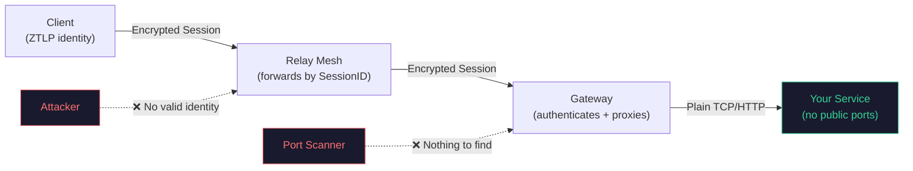
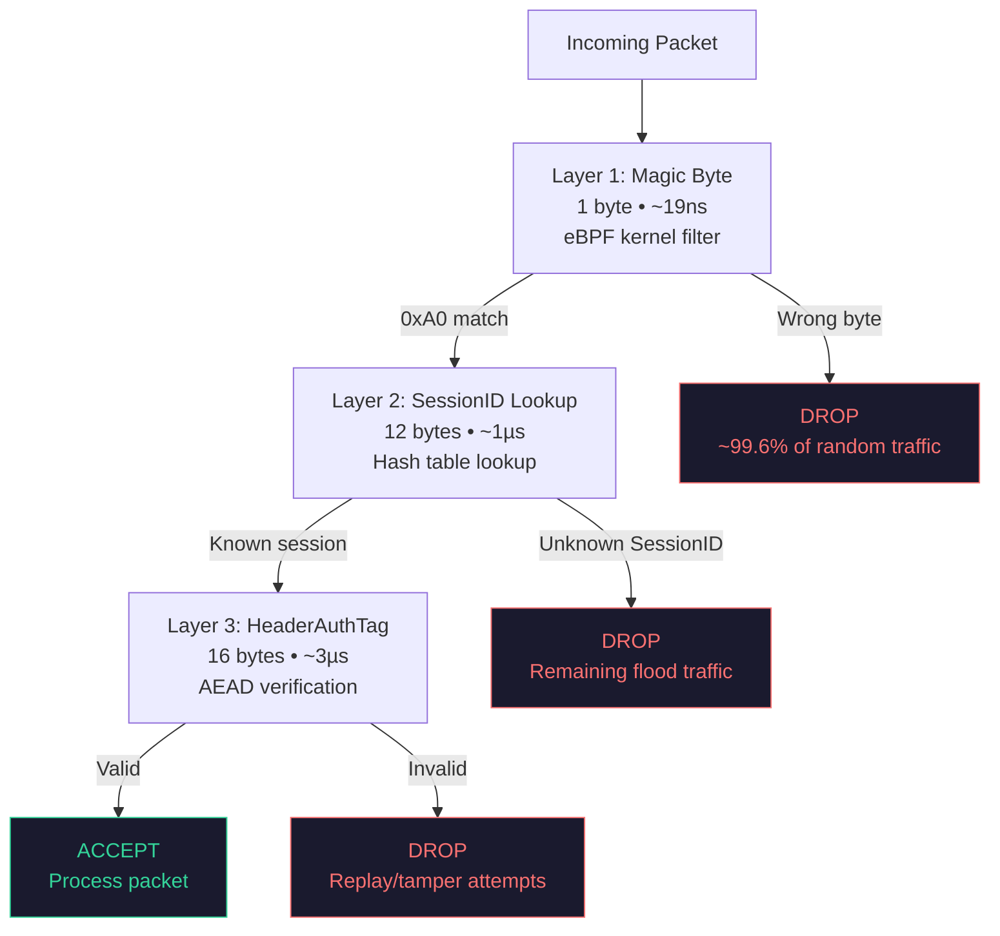
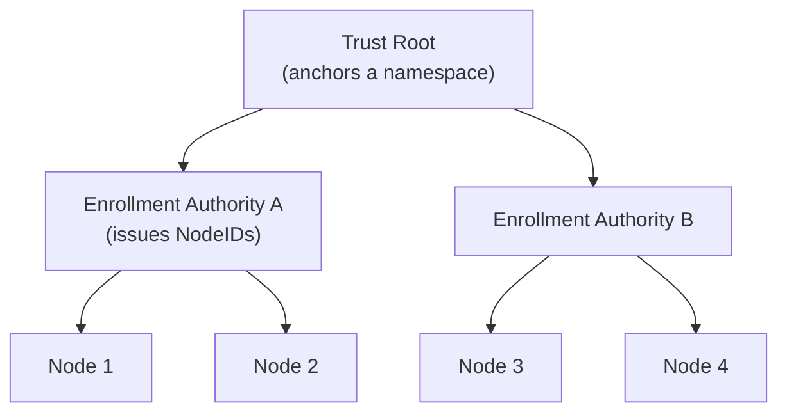
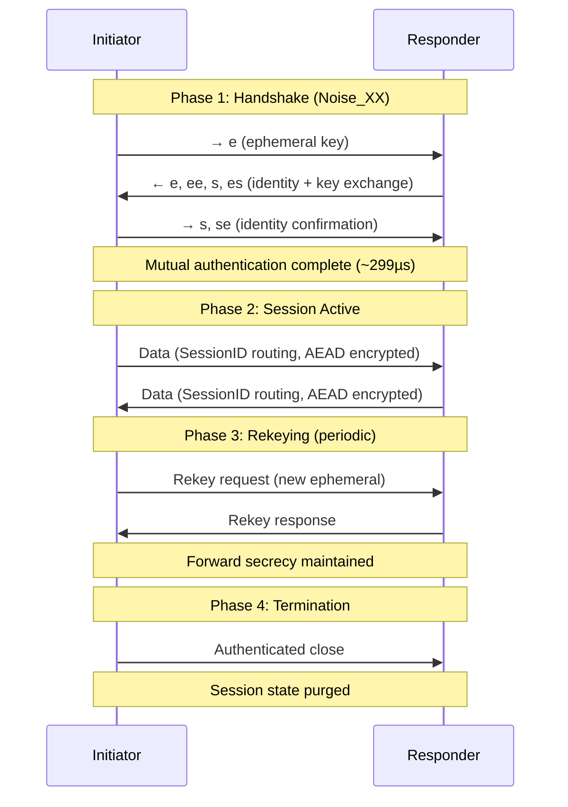
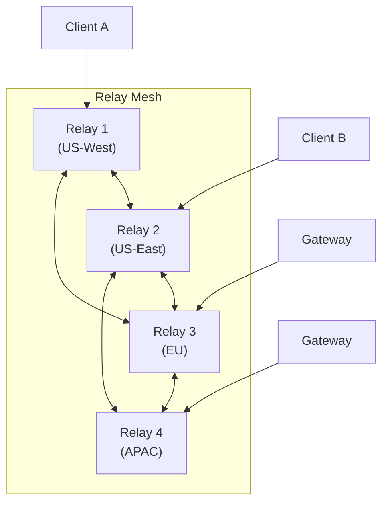
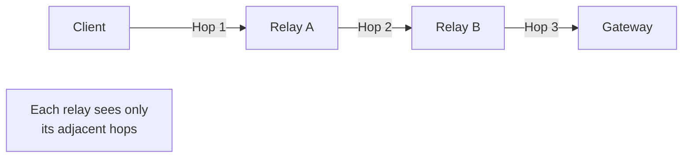
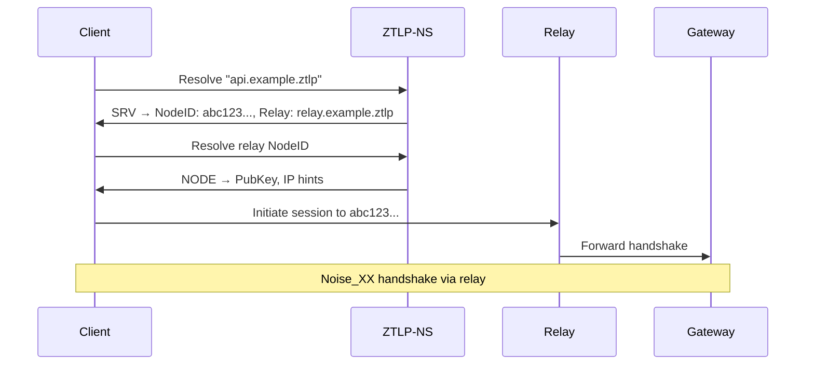
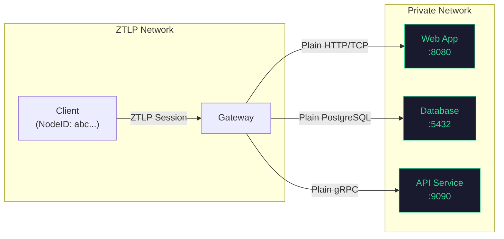
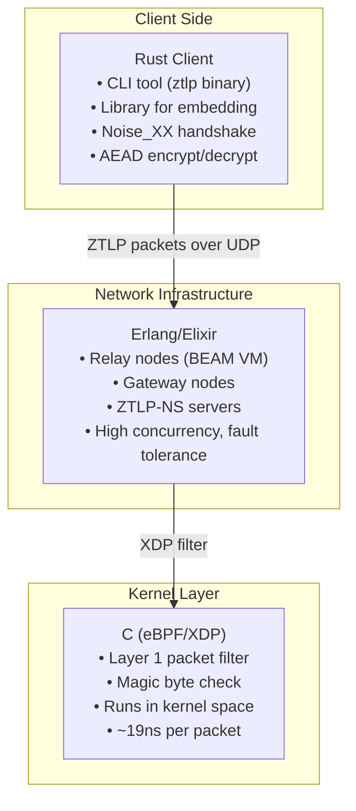

# Architecture Overview

This document explains how ZTLP works — the design decisions, the components, and how they fit together. It's written for developers and architects who want to understand the system without reading the full 4000-line specification.

## The Big Picture

ZTLP is an overlay network that runs on top of the existing Internet. It doesn't replace IP, TCP, or UDP — it rides over them, adding an identity and encryption layer that makes unauthorized access structurally impossible.

The key insight: **the service you're protecting has no public ports.** It sits behind a ZTLP gateway that only accepts authenticated, session-bearing traffic. There is no port to scan, no endpoint to probe, no attack surface to exploit.



A typical connection flows like this:

1. **Client** generates a ZTLP identity (Ed25519 key pair → NodeID)
2. **Client** initiates a Noise_XX handshake through the relay mesh
3. **Relay nodes** forward traffic based on SessionIDs (they can't decrypt it)
4. **Gateway** terminates the ZTLP session, verifies the client's identity, and proxies to the backend service
5. **Service** receives clean TCP/HTTP traffic — it doesn't know ZTLP exists

## The Three-Layer Pipeline

This is ZTLP's core innovation for DDoS defense. Every incoming packet passes through three validation layers, ordered from cheapest to most expensive:



### Why This Ordering Matters

The key principle: **cheap checks first, expensive checks last.** Each layer is progressively more expensive but handles a progressively smaller fraction of traffic:

| Layer | What It Checks | Cost | Rejects |
|---|---|---|---|
| **L1: Magic Byte** | Single byte at offset 0 = `0xA0` | ~19ns, eBPF in kernel | ~99.6% of random/flood traffic |
| **L2: SessionID** | 12-byte lookup in allowlist hash table | ~1µs, userspace | All traffic without valid sessions |
| **L3: HeaderAuthTag** | 16-byte AEAD tag verification (ChaCha20-Poly1305) | ~3µs, crypto | Replay attacks, tampered packets |

By the time a packet reaches Layer 3 (the expensive cryptographic check), it has already proven it knows the magic byte *and* carries a valid SessionID. The vast majority of attack traffic — random floods, amplification attacks, port scans — is eliminated at Layer 1 with zero state allocation and zero cryptographic work.

This is why volumetric DDoS attacks are structurally ineffective against ZTLP. Even if an attacker sends millions of packets per second, almost all of them are discarded in nanoseconds at the kernel level by an eBPF filter.

### Layer 1: The eBPF Fast Path

Layer 1 runs as an XDP (eXpress Data Path) program in the Linux kernel. It checks one byte before the packet even reaches userspace. The C implementation is approximately 50 lines:

```c
// Simplified L1 check
if (packet[0] != ZTLP_MAGIC) {
    return XDP_DROP;  // ~19ns, never reaches userspace
}
return XDP_PASS;      // Forward to L2
```

This alone eliminates the majority of unsolicited traffic, because random UDP/TCP floods will almost never have `0xA0` as their first byte.

## Identity Model

ZTLP's identity system is designed to be simple, decentralized, and hardware-friendly.

### NodeID

Every participant on a ZTLP network has a **NodeID** — a 128-bit identifier that is their permanent identity. NodeIDs have several important properties:

- **Not derived from the public key.** This allows key rotation without changing identity.
- **Not derived from network topology.** Your identity is the same whether you're on Wi-Fi, cellular, or behind NAT.
- **Bound to a public key** via a signed binding record in ZTLP-NS.
- **Supports hardware-backed keys** — TPM 2.0, Apple Secure Enclave, YubiKey, ARM TrustZone.

### Trust Model

ZTLP uses a hierarchical trust model with enrollment authorities:



- **Trust Roots** anchor a namespace and define who can issue NodeIDs
- **Enrollment Authorities** issue and vouch for node identities
- **Nodes** register their public keys against their NodeIDs in ZTLP-NS

The system supports multiple assurance levels (A0–A3), from software-only keys to hardware-attested identities with biometric binding. See Section 16 of the specification for the full assurance model.

## Session Lifecycle

Every ZTLP connection follows the same lifecycle: handshake, session, rekeying, and termination.



### Handshake: Noise_XX

ZTLP uses the **Noise_XX** handshake pattern from the [Noise Protocol Framework](https://noiseprotocol.org/). This provides:

- **Mutual authentication** — Both sides prove their identity
- **Forward secrecy** — Compromise of long-term keys doesn't expose past sessions
- **Identity hiding** — The initiator's identity is encrypted during the handshake
- **3 messages, 1 round trip** — Fast establishment (~299µs in benchmarks)

After the handshake, both sides derive a SessionID and symmetric keys for the session. All subsequent packets use the compact data header (SessionID + AEAD-encrypted payload) rather than the full handshake header.

### Rekeying

Sessions periodically rekey to maintain forward secrecy. Rekeying uses a new ephemeral Diffie-Hellman exchange within the existing session, so the SessionID doesn't change — ongoing traffic isn't disrupted.

## Relay Mesh

Relays are the backbone of the ZTLP network. They forward encrypted traffic between nodes without being able to read it.

### Why Relays?

- **NAT traversal** — Nodes behind NAT or firewalls can communicate without port forwarding
- **Topology hiding** — The relay mesh obscures the true location of services
- **Load distribution** — Multiple relays share traffic using consistent hashing
- **Resilience** — If one relay fails, traffic routes through others

### Mesh Architecture



### Consistent Hash Ring

Relays organize themselves into a **consistent hash ring** based on their NodeIDs. When a client needs to reach a service, it selects a relay based on hashing the destination NodeID. This provides:

- **Deterministic routing** — Both sides of a connection agree on which relay to use
- **Minimal disruption** — When a relay joins or leaves, only a fraction of sessions reroute
- **Even load distribution** — Virtual nodes on the hash ring prevent hotspots

### PathScore Selection

When multiple relay paths are available, ZTLP uses a **PathScore** algorithm to select the best one. PathScore considers:

- **Latency** — Measured round-trip time through the relay
- **Bandwidth** — Available throughput
- **Hop count** — Fewer hops preferred
- **Relay load** — Current utilization of each relay
- **Trust level** — Higher-assurance relays score better

### Admission Tokens

To prevent abuse, relays issue **admission tokens** to authorized nodes. A node must present a valid admission token to use a relay. This prevents unauthorized parties from consuming relay resources — even the relay infrastructure itself is identity-gated.

### Multi-Hop Forwarding

For additional privacy or to reach nodes across distant network segments, ZTLP supports multi-hop relay chains:



Each relay in the chain only sees its immediate neighbors — it doesn't know the original source or final destination. This provides topology hiding similar to onion routing, though ZTLP is optimized for performance rather than anonymity (see the [Threat Model](#threat-model) for what ZTLP doesn't protect against).

## ZTLP-NS: The Namespace System

ZTLP-NS replaces DNS for service discovery within the ZTLP network. It's a distributed, cryptographically signed namespace.

### How It Works

- **Records are Ed25519-signed** — Every namespace record is signed by the zone owner's key. You can't poison or spoof records without the private key.
- **Zone delegation** — Like DNS, ZTLP-NS supports hierarchical delegation. A trust root can delegate zones to sub-authorities.
- **Service discovery** — Nodes publish their services (with NodeID, relay preferences, and capabilities) in the namespace.
- **No central authority** — Multiple trust roots can coexist. Organizations run their own namespace zones.

### Record Types

| Record | Purpose |
|---|---|
| `NODE` | Maps a NodeID to its current public key and relay preferences |
| `SRV` | Service record — maps a service name to the NodeID(s) providing it |
| `ZONE` | Delegation record — points a sub-zone to its authority |
| `REVOKE` | Revocation of a NodeID or key binding |

### Example: Resolving a Service



## Gateway Model

Gateways are how you protect existing services with ZTLP without modifying them. A gateway is essentially a **reverse proxy with identity** — it terminates ZTLP sessions, verifies the client's NodeID and authorization, and forwards clean traffic to the backend.

### How It Works



Key properties:

- **The backend service needs zero modifications.** It receives plain TCP/HTTP/gRPC traffic from the gateway. It doesn't know ZTLP exists.
- **The gateway is the only entry point.** There are no other ports, no other paths. If you can't authenticate to the gateway, the service might as well not exist.
- **Identity-based access control.** The gateway can enforce policies like "only NodeIDs from Enrollment Authority X can access this service" or "only A2+ assurance level nodes."
- **Protocol translation.** The gateway handles the ZTLP-to-TCP translation, including connection multiplexing and back-pressure.

### Deployment Example

A typical deployment looks like:

1. **Your web app** runs on `localhost:8080` with no public exposure
2. **ZTLP Gateway** binds to the ZTLP network, listening for authenticated sessions
3. **Authorized clients** connect through the relay mesh → gateway → your app
4. **Everyone else** sees nothing — no ports, no service, no response

```bash
# Start the gateway
ztlp gateway \
  --key ~/.ztlp/private.key \
  --backend localhost:8080 \
  --allow-ea "ea.example.ztlp" \
  --min-assurance A1
```

## Performance

ZTLP is designed to be fast enough that security doesn't come at the cost of usability. Here are the reference benchmarks from the prototype implementation:

| Operation | Performance | Notes |
|---|---|---|
| **L1 reject (magic byte)** | **19ns** | eBPF/XDP in kernel, per packet |
| **L2 reject (SessionID)** | ~1µs | Hash table lookup, userspace |
| **L3 verify (AEAD)** | ~3µs | ChaCha20-Poly1305 |
| **Noise_XX handshake** | **299µs** | Full mutual auth + key exchange |
| **Gateway throughput** | **669K ops/sec** | End-to-end authenticated requests |
| **Relay forwarding** | **233K pkt/sec** | Per relay node |

These numbers come from the Rust client, Erlang/Elixir relay and gateway, and C eBPF dropper running on commodity hardware. See the `bench/` directory in the repository for reproduction instructions.

### Why These Numbers Matter

- **19ns L1 reject** means a single server can drop ~52 million malicious packets per second at the kernel level
- **299µs handshake** means new connections establish faster than a typical TLS handshake
- **669K ops/sec gateway** means the identity layer adds negligible overhead for most workloads
- **233K pkt/sec relay** means a single relay node can serve hundreds of concurrent sessions

## Language Architecture

ZTLP uses different languages for different components, chosen for their strengths:



### Why This Split?

- **Rust for clients** — Memory safety, zero-cost abstractions, and excellent cryptography libraries. The `ztlp` CLI and client library are Rust.
- **Erlang/Elixir for infrastructure** — The BEAM VM excels at massive concurrency and fault tolerance. A single relay node handles hundreds of thousands of connections with lightweight processes. Hot code upgrades mean zero-downtime deployments.
- **C for eBPF** — The Layer 1 magic byte check runs as an XDP program in the Linux kernel. C is the only practical language for eBPF programs, and it needs to be fast — 19ns fast.

This architecture means you can embed ZTLP in a Rust application, deploy relays and gateways as Erlang/OTP releases, and let the eBPF filter handle the bulk of malicious traffic before it ever reaches userspace.

For the complete protocol specification, including wire formats, cryptographic parameters, and deployment models, see the [full specification](#spec).
