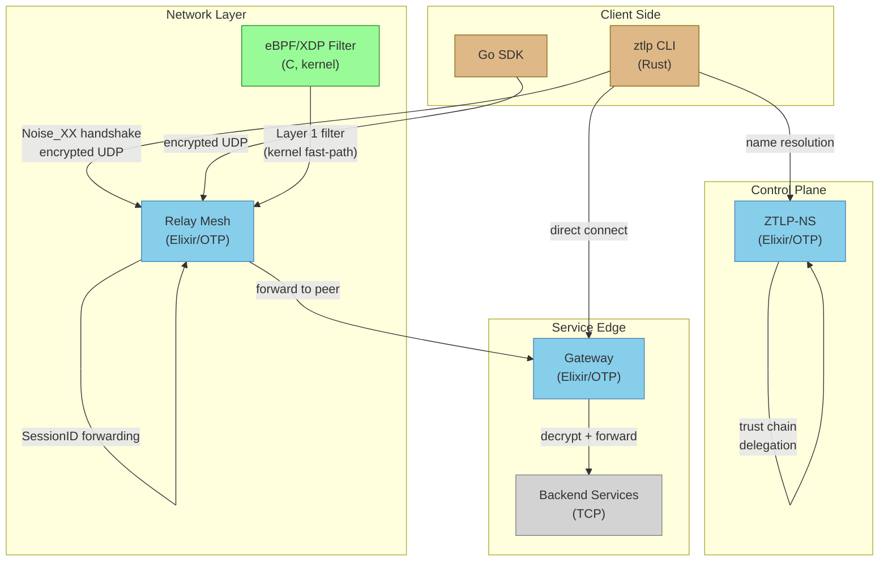

# Contributing to ZTLP

Welcome — and thank you for considering a contribution to the Zero Trust Layer Protocol.

ZTLP is an identity-first network overlay protocol with a three-layer DDoS-resistant
admission pipeline. It's built as a monorepo spanning Rust, Elixir/OTP, C (eBPF), and Go.
Whether you're fixing a typo, adding a test scenario, or implementing a new protocol
feature, this guide will help you get oriented and productive.

**Quick links:**
- [GitHub Issues](https://github.com/priceflex/ztlp/issues) — report bugs, request features
- [Good First Issues](https://github.com/priceflex/ztlp/labels/good%20first%20issue) — great starting points
- [Architecture Overview](docs/ARCHITECTURE.md) — deep dive into how the system works
- [Code of Conduct](CODE_OF_CONDUCT.md) — be kind, be constructive

---

## Table of Contents

1. [Architecture Overview](#architecture-overview)
2. [Development Setup](#development-setup)
3. [Development Workflow](#development-workflow)
4. [Code Style](#code-style)
5. [Testing](#testing)
6. [Project Areas](#project-areas)
7. [Good First Issues](#good-first-issues)
8. [Pull Request Process](#pull-request-process)
9. [Release Process](#release-process)
10. [Contributor License Agreement](#contributor-license-agreement)
11. [Trademark Notice](#trademark-notice)
12. [Code of Conduct](#code-of-conduct)

---

## Architecture Overview

ZTLP is organized as a monorepo with each component in its own directory.
Here's the high-level layout:

```
ztlp/
├── proto/          Rust client, CLI, and core protocol library
├── relay/          Elixir/OTP relay mesh (session forwarding, no decryption)
├── gateway/        Elixir/OTP TCP↔ZTLP bridge (terminates sessions, enforces policy)
├── ns/             Elixir/OTP distributed trust namespace (DNS-like, Ed25519-signed)
├── ebpf/           XDP packet filter (C, kernel-space admission pipeline)
├── sdk/go/         Go client SDK
├── interop/        Cross-language integration tests (Rust ↔ Elixir)
├── tests/network/  Docker-based end-to-end integration tests
├── bench/          Performance benchmarking scripts and results
├── ops/            Operational configs (systemd, Prometheus, Grafana, packaging)
├── tools/          Developer tools (netlab virtual network)
├── docs/           Documentation site and architecture docs
├── config/         Shared configuration examples
├── whitepaper/     Protocol whitepaper
└── demo/           Demo scripts
```

### Component Relationships



### How Data Flows

1. **Client** generates a cryptographic identity (X25519 + Ed25519 keypair)
2. **NS** resolves human-readable names to endpoint addresses (like DNS, but Ed25519-signed)
3. **Client** performs a Noise_XX handshake with the peer (mutual authentication)
4. All packets pass through a **three-layer admission pipeline**:
   - Layer 1: Magic byte check (`0x5A37`) — nanoseconds, kills non-ZTLP noise
   - Layer 2: SessionID lookup (ETS/HashMap) — microseconds, kills unknown sessions
   - Layer 3: HeaderAuthTag verification (ChaCha20-Poly1305) — real crypto, kills forgeries
5. **Relay** forwards encrypted packets by SessionID without decrypting (zero-trust relay)
6. **Gateway** terminates sessions, enforces per-service access policy, bridges to TCP backends
7. **eBPF/XDP** handles Layer 1 filtering in kernel space at line rate

For a deeper dive, see [docs/ARCHITECTURE.md](docs/ARCHITECTURE.md).

---

## Development Setup

### Prerequisites

| Tool | Version | Required For |
|------|---------|-------------|
| **Rust** | 1.70+ (1.94+ recommended) | `proto/` — client, CLI, protocol library |
| **Elixir** | 1.12.2+ | `relay/`, `ns/`, `gateway/` |
| **Erlang/OTP** | 24+ | `relay/`, `ns/`, `gateway/` |
| **Go** | 1.21+ | `sdk/go/` |
| **Docker + Compose** | 20.10+ | `tests/network/` integration tests |
| **Linux headers** | Kernel 5.4+ | `ebpf/` compilation (optional) |
| **clang/llvm** | 11+ | `ebpf/` compilation (optional) |

You don't need all of these — only install what's required for the component you're working on.

### Installing Dependencies

**Rust:**
```bash
curl --proto '=https' --tlsv1.2 -sSf https://sh.rustup.rs | sh
source "$HOME/.cargo/env"
rustc --version  # Should be 1.70+
```

**Elixir (Ubuntu/Debian):**
```bash
sudo apt-get update
sudo apt-get install -y erlang-base erlang-dev erlang-crypto elixir
elixir --version  # Should be 1.12+
erl -eval 'erlang:display(erlang:system_info(otp_release)), halt().' -noshell
# Should print "24" or higher
```

**Elixir (macOS):**
```bash
brew install erlang elixir
```

**Go:**
```bash
# Download from https://go.dev/dl/ or:
brew install go        # macOS
sudo snap install go   # Ubuntu
go version             # Should be 1.21+
```

**Docker (for integration tests):**
```bash
# Install Docker Engine: https://docs.docker.com/engine/install/
docker --version
docker compose version
```

### Quick Start — Building & Testing Each Component

```bash
# Clone the repo
git clone https://github.com/priceflex/ztlp.git
cd ztlp

# ── Rust client & CLI ──────────────────────────────
cd proto
cargo build              # Debug build
cargo test               # 91 tests
cd ..

# ── Elixir relay ───────────────────────────────────
cd relay
mix deps.get             # No external deps, initializes project
mix compile
mix test                 # 73+ tests
cd ..

# ── ZTLP-NS namespace ─────────────────────────────
cd ns
mix deps.get
mix compile
mix test                 # 105 tests
cd ..

# ── Gateway ────────────────────────────────────────
cd gateway
mix deps.get
mix compile
mix test                 # 97 tests
cd ..

# ── Go SDK ─────────────────────────────────────────
cd sdk/go
go test ./...
cd ../..

# ── eBPF filter (Linux only, optional) ─────────────
cd ebpf
make                     # Requires clang, llvm, linux-headers
cd ..

# ── Docker integration tests ──────────────────────
cd tests/network
./run-all.sh             # Requires Docker + Docker Compose
cd ../..
```

### Running Demos

The project includes several demos to see the protocol in action:

```bash
# Two Rust nodes, direct encrypted communication
cd proto && cargo run --bin ztlp-demo

# Two Rust nodes communicating through a simulated relay
cd proto && cargo run --bin ztlp-relay-demo

# Elixir relay interactive session
cd relay && iex -S mix

# Three-relay mesh formation demo
cd relay && mix run mesh_demo.exs
```

---

## Development Workflow

### Fork → Branch → Commit → PR

1. **Fork** the repository on GitHub
2. **Clone** your fork locally:
   ```bash
   git clone https://github.com/YOUR_USERNAME/ztlp.git
   cd ztlp
   ```
3. **Create a branch** with a descriptive name:
   ```bash
   git checkout -b feature/add-timeout-flag
   ```
4. **Make your changes** with tests
5. **Commit** with a clear message:
   ```bash
   git commit -m "proto: add --timeout flag to connect command

   Adds a configurable timeout for the Noise_XX handshake in the CLI.
   Defaults to 10 seconds. Closes #42."
   ```
6. **Push** and open a pull request:
   ```bash
   git push origin feature/add-timeout-flag
   ```

### Branch Naming

Use a prefix that describes the type of change:

| Prefix | Use For |
|--------|---------|
| `feature/` | New features or capabilities |
| `fix/` | Bug fixes |
| `docs/` | Documentation improvements |
| `bench/` | Performance benchmarks |
| `test/` | New tests or test improvements |
| `refactor/` | Code restructuring (no behavior change) |

### Commit Messages

- Use **imperative mood**: "Add timeout flag" not "Added timeout flag"
- Reference issue numbers: "Closes #42" or "Relates to #42"
- Prefix with the component when it's component-specific:
  - `proto: add --timeout flag to connect command`
  - `relay: fix session timeout race condition`
  - `ns: add zone delegation cache`
  - `docs: update CLI reference for ns register`

### Keeping Your Fork Updated

```bash
git remote add upstream https://github.com/priceflex/ztlp.git
git fetch upstream
git rebase upstream/main
```

---

## Code Style

### Elixir (relay/, ns/, gateway/)

The Elixir components follow a strict "pure OTP" philosophy:

- **`mix format` before committing** — the formatter config is in each component's `.formatter.exs`
- **Zero external dependencies** — all three Elixir components use only OTP and Erlang's
  `:crypto` module. Do not add hex dependencies.
- **All public functions need `@moduledoc` and `@doc`** — document the module's purpose and
  each public function's behavior
- **Pattern match on function heads** over `case`/`cond` when possible:
  ```elixir
  # Preferred
  def process(%{magic: 0x5A37} = packet), do: {:ok, packet}
  def process(_packet), do: {:error, :invalid_magic}

  # Avoid
  def process(packet) do
    case packet.magic do
      0x5A37 -> {:ok, packet}
      _ -> {:error, :invalid_magic}
    end
  end
  ```
- **ETS for hot-path state** (session lookups, rate limiting), **GenServer for lifecycle**
  (session timeout tracking, stats aggregation)
- **Supervision trees** — every long-running process should be supervised. Use
  `DynamicSupervisor` for per-session processes.
- **Binary pattern matching** for packet parsing — Elixir's binary syntax is excellent for
  protocol work. See `relay/lib/ztlp_relay/packet.ex` for examples.

### Rust (proto/)

- **`cargo fmt`** before committing
- **`cargo clippy`** must pass with no warnings:
  ```bash
  cargo clippy -- -D warnings
  ```
- **`#![deny(unsafe_code)]`** — no `unsafe` blocks. All crypto uses audited RustCrypto crates.
  The only exception is `ffi.rs` if/when FFI bindings are needed.
- **Prefer `Result<T, E>` over panics** — use the `?` operator for error propagation.
  The `error.rs` module defines typed errors for all failure modes.
- **Use `thiserror`** for error types in library code
- **Tokio** for async I/O — the transport layer uses `tokio::net::UdpSocket`

### C (ebpf/)

- **BPF verifier compliance is mandatory** — the kernel verifier must accept the program.
  Test with `sudo ip link set dev lo xdpgeneric obj ztlp_xdp.o sec xdp` before submitting.
- **Every pointer access needs a bounds check** against `data_end`:
  ```c
  if ((void *)(eth + 1) > data_end)
      return XDP_PASS;
  ```
- **Use `__always_inline`** for helper functions — the BPF verifier requires it for
  function calls in older kernels
- **No dynamic memory allocation** — BPF programs operate in a constrained environment
- **Comment the "why"** — eBPF code is hard to read. Explain why bounds checks are
  placed where they are and what each section of the pipeline does.

### Go (sdk/go/)

- **`go vet`** and **`go test -race`** must pass
- **Idiomatic error handling** — return errors, don't panic for expected conditions
- Follow [Effective Go](https://go.dev/doc/effective_go) guidelines
- **`gofmt`** before committing (most editors do this automatically)
- Keep the SDK minimal — it should be easy to import without pulling in a dependency tree

---

## Testing

ZTLP has **366+ tests** across all components. All tests must pass before a PR is merged.

### Running Tests by Component

| Component | Command | Test Count |
|-----------|---------|------------|
| Rust client | `cd proto && cargo test` | 91 |
| Elixir relay | `cd relay && mix test` | 73+ |
| ZTLP-NS | `cd ns && mix test` | 105 |
| Gateway | `cd gateway && mix test` | 97 |
| Go SDK | `cd sdk/go && go test ./...` | — |
| Integration | `cd tests/network && ./run-all.sh` | 7 scenarios |

### Running Specific Tests

```bash
# Rust: run tests matching a pattern
cargo test test_replay_window
cargo test --test integration_tests

# Elixir: run a specific test file
mix test test/ztlp_relay/pipeline_test.exs

# Elixir: run a specific test by line number
mix test test/ztlp_relay/pipeline_test.exs:42

# Docker: run a single scenario
cd tests/network && ./run-all.sh --scenario basic-connectivity
```

### Integration Test Architecture

The Docker test suite at `tests/network/` creates a realistic multi-network
environment with 7 containers across 3 isolated networks:

```
ztlp-frontend (172.28.1.0/24)    Clients, Relay, Gateway
ztlp-backend  (172.28.2.0/24)    Gateway, Echo Server
ztlp-infra    (172.28.3.0/24)    NS, Relay, Gateway, Clients
```

This separation ensures clients cannot bypass the Gateway to reach backend
services directly — the Gateway is the only container on both the frontend
and backend networks.

A **Chaos container** with `NET_ADMIN` capabilities is connected to all
networks and can inject latency, packet loss, and partitions using `tc` and
`iptables`.

**Adding a new test scenario:**

1. Create a new script in `tests/network/scenarios/`:
   ```bash
   # tests/network/scenarios/my-scenario.sh
   #!/usr/bin/env bash
   source "$(dirname "$0")/../lib/helpers.sh"
   
   scenario_name "My Scenario Description"
   # ... test logic using helper functions
   ```
2. Make it executable: `chmod +x tests/network/scenarios/my-scenario.sh`
3. The `run-all.sh` script auto-discovers scenarios in that directory

### Writing Tests

**Elixir test pattern:**

```elixir
defmodule ZtlpRelay.MyFeatureTest do
  use ExUnit.Case, async: true

  setup do
    # Create any test fixtures
    session_id = :crypto.strong_rand_bytes(12)
    {:ok, session_id: session_id}
  end

  test "descriptive name of what's being tested", %{session_id: sid} do
    # Arrange
    peer_a = {{127, 0, 0, 1}, 5000}

    # Act
    result = ZtlpRelay.SessionRegistry.register_session(sid, peer_a, peer_a)

    # Assert
    assert result == :ok
    assert ZtlpRelay.SessionRegistry.session_exists?(sid)
  end
end
```

**Rust test pattern:**

```rust
#[cfg(test)]
mod tests {
    use super::*;

    #[test]
    fn test_descriptive_name() {
        // Arrange
        let identity = Identity::generate();

        // Act
        let serialized = identity.to_bytes();
        let restored = Identity::from_bytes(&serialized).unwrap();

        // Assert
        assert_eq!(identity.node_id, restored.node_id);
    }

    #[tokio::test]
    async fn test_async_operation() {
        // For tests using the async transport layer
        let socket = UdpSocket::bind("127.0.0.1:0").await.unwrap();
        // ...
    }
}
```

**Docker integration test pattern:**

```bash
#!/usr/bin/env bash
source "$(dirname "$0")/../lib/helpers.sh"

scenario_name "Descriptive Scenario Name"

# Use helper functions to interact with containers
step "Register identity with NS"
docker exec ztlp-client-a /app/ztlp ns register \
    --name test.example.ztlp \
    --zone example.ztlp \
    --key /app/identity.json

step "Connect through relay"
# ... test logic

assert_exit_code 0 "Connection should succeed"
```

### Fuzz Testing

The Rust client includes fuzz targets in `proto/fuzz/`:

```bash
cd proto
cargo +nightly fuzz run fuzz_packet_parse
```

Contributions of new fuzz targets are welcome — see the existing targets for the pattern.

---

## Project Areas

Here's where contributions are needed, organized by component and difficulty.

### Protocol Core — Rust (Hard)

The `proto/` directory contains the core protocol library and CLI. Changes here
affect the wire format and cryptographic properties.

**What's welcome:**
- Wire format optimizations
- Noise handshake extensions (e.g., pre-shared key modes)
- Transport optimizations (GSO/GRO improvements)
- New CLI commands and flags
- Replay window improvements

**Key files:** `proto/src/packet.rs`, `proto/src/handshake.rs`, `proto/src/pipeline.rs`,
`proto/src/session.rs`, `proto/src/transport.rs`

### Relay Mesh — Elixir (Medium)

The relay mesh handles session forwarding across multiple relay nodes using
consistent hashing and PathScore-based routing.

**What's welcome:**
- PathScore algorithm improvements
- New mesh message types
- Session migration optimizations
- Rate limiter tuning
- Monitoring and observability improvements

**Key files:** `relay/lib/ztlp_relay/hash_ring.ex`, `relay/lib/ztlp_relay/path_score.ex`,
`relay/lib/ztlp_relay/inter_relay.ex`, `relay/lib/ztlp_relay/ingress.ex`

### NS Federation — Elixir (Medium)

ZTLP-NS is the identity and discovery layer — think DNS meets a certificate
authority, but with Ed25519 signatures.

**What's welcome:**
- Anti-entropy improvements for zone synchronization
- Zone delegation features
- Query optimizations and caching
- Bootstrap discovery enhancements (DNS-SD, mDNS)
- Record type extensions

**Key files:** `ns/lib/ztlp_ns/query.ex`, `ns/lib/ztlp_ns/store.ex`,
`ns/lib/ztlp_ns/zone_authority.ex`, `ns/lib/ztlp_ns/bootstrap.ex`

### Gateway — Elixir (Medium)

The gateway bridges ZTLP's encrypted overlay to legacy TCP services, with
per-service identity-based access control.

**What's welcome:**
- Graceful connection draining for shutdown
- Health check probes for backend services
- Session metrics and audit log improvements
- Policy engine extensions (time-based rules, rate limits)

**Key files:** `gateway/lib/ztlp_gateway/session.ex`, `gateway/lib/ztlp_gateway/backend.ex`,
`gateway/lib/ztlp_gateway/policy_engine.ex`, `gateway/lib/ztlp_gateway/audit_log.ex`

### eBPF/XDP Filter — C (Hard)

The XDP filter implements Layer 1 of the admission pipeline in kernel space
for line-rate packet filtering.

**What's welcome:**
- IPv6 support
- Performance optimization
- New packet type handling
- BPF map statistics improvements
- Kernel version compatibility testing

**Key files:** `ebpf/ztlp_xdp.c`, `ebpf/ztlp_xdp.h`, `ebpf/loader.c`

### SDK & Client Libraries (Medium)

The Go SDK is the first non-Rust client library. More language SDKs are planned.

**What's welcome:**
- Go SDK improvements (handshake, pipeline, transport)
- Python SDK (new — great first contribution)
- JavaScript/TypeScript SDK (new)
- Mobile platform support (iOS/Android)

**Key files:** `sdk/go/ztlp.go`, `sdk/go/identity.go`

### Documentation (Easy)

Documentation contributions are always welcome and are a great way to learn
the codebase.

**What's welcome:**
- Typo fixes and clarity improvements
- New usage examples
- Tutorials (Getting Started, deployment guides)
- Ops runbook improvements
- Translations (README, docs site)

**Key files:** `README.md`, `CLI.md`, `PROTOTYPE.md`, `docs/index.html`, `ops/`

### Testing (Easy → Medium)

More test coverage is always valuable.

**What's welcome:**
- New Docker integration test scenarios
- Fuzz test targets
- Performance benchmarks
- Edge case unit tests
- Cross-platform testing (macOS, ARM)

**Key files:** `tests/network/scenarios/`, `proto/fuzz/`, `bench/`

---

## Good First Issues

Look for issues labeled [`good first issue`](https://github.com/priceflex/ztlp/labels/good%20first%20issue)
on GitHub. These are specifically chosen to be:

- **Well-scoped** — clear boundaries on what needs to change
- **Self-contained** — doesn't require understanding the entire protocol
- **Documented** — the issue includes pointers to relevant files and acceptance criteria
- **Mentored** — a maintainer is available to help if you get stuck

If you're new to the project, start with a documentation or testing issue. They're a
great way to learn the codebase while making a real contribution.

See also [docs/GOOD-FIRST-ISSUES.md](docs/GOOD-FIRST-ISSUES.md) for detailed descriptions
of starter issues with file pointers and acceptance criteria.

---

## Pull Request Process

### Before You Submit

1. **Run the relevant tests** and make sure they pass:
   ```bash
   # For Rust changes
   cd proto && cargo test && cargo clippy -- -D warnings && cargo fmt --check

   # For Elixir changes
   cd relay && mix test && mix format --check-formatted
   cd ns && mix test && mix format --check-formatted
   cd gateway && mix test && mix format --check-formatted

   # For Go changes
   cd sdk/go && go test -race ./... && go vet ./...
   ```

2. **Add tests** for any new functionality

3. **Update documentation** if your change affects the public API, CLI, or configuration

4. **Check that you haven't introduced external dependencies** — the Elixir components
   are pure OTP. If you absolutely need a dependency, discuss it in the issue first.

### Submitting a PR

1. Push your branch to your fork
2. Open a pull request against `main`
3. Fill out the [PR template](.github/PULL_REQUEST_TEMPLATE.md):
   - Summary of the change
   - Link to the related issue
   - Which components are affected
   - How it was tested
4. Wait for CI to pass
5. A maintainer will review your PR — expect feedback within a few days

### Review Process

- All PRs require at least one maintainer approval
- CI must pass (tests, formatting, clippy/vet)
- Changes to the wire format or cryptographic protocol require extra scrutiny
- Documentation PRs are typically merged quickly
- If review takes more than a week, feel free to ping

### After Merge

- Your contribution will be included in the next release
- You'll be credited in the release notes
- If this was your first contribution, welcome to the team! 🎉

---

## Release Process

ZTLP follows [Semantic Versioning](https://semver.org/):

- **MAJOR** — breaking wire format or API changes
- **MINOR** — new features, backward-compatible
- **PATCH** — bug fixes, documentation, performance

### Versioning

- Each component has its own version in its manifest (`Cargo.toml`, `mix.exs`)
- The top-level repo version tracks the protocol version
- Release tags follow the format `v0.1.0`

### CI/CD

The GitHub Actions workflow (`.github/workflows/`) runs on every PR and push to `main`:

1. **Rust** — `cargo test`, `cargo clippy`, `cargo fmt --check`
2. **Elixir** — `mix test` and `mix format --check-formatted` for relay, ns, and gateway
3. **Go** — `go test -race ./...` and `go vet`
4. **Integration** — Docker network tests (on main branch)

---

## Contributor License Agreement

By submitting a pull request or other contribution to this project, you agree
to the following:

- You certify that your contribution is your original work, or that you have
  the right to submit it under the project's license.
- You agree that your contribution will be licensed under the
  [Apache License 2.0](https://www.apache.org/licenses/LICENSE-2.0) as part
  of this project.
- You understand that your contribution will be publicly available and that a
  record of it (including your name and email) may be maintained indefinitely.

## Trademark Notice

ZTLP and Zero Trust Layer Protocol are trademarks of Steven Price.
Use of the ZTLP name, logo, or branding must not imply endorsement by the
project or its author without prior written permission.

## Code of Conduct

We are committed to providing a friendly, safe, and welcoming environment for
all contributors. Please read and follow our [Code of Conduct](CODE_OF_CONDUCT.md).

In short: be respectful, be constructive, be kind. We're all here to build
something useful.

---

## License

All contributions are licensed under the [Apache License 2.0](LICENSE).

---

*Thank you for contributing to ZTLP. Every fix, test, doc improvement, and
feature makes the project better for everyone.*
