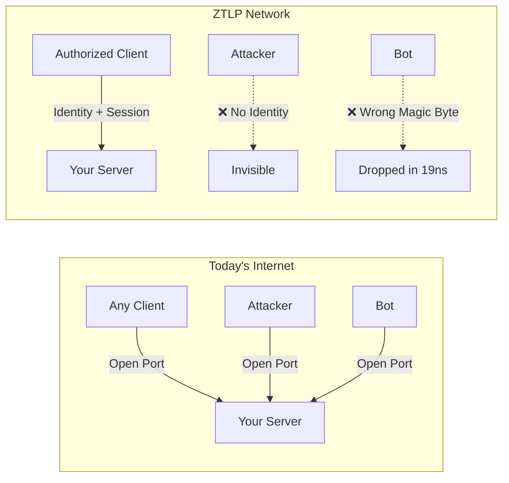
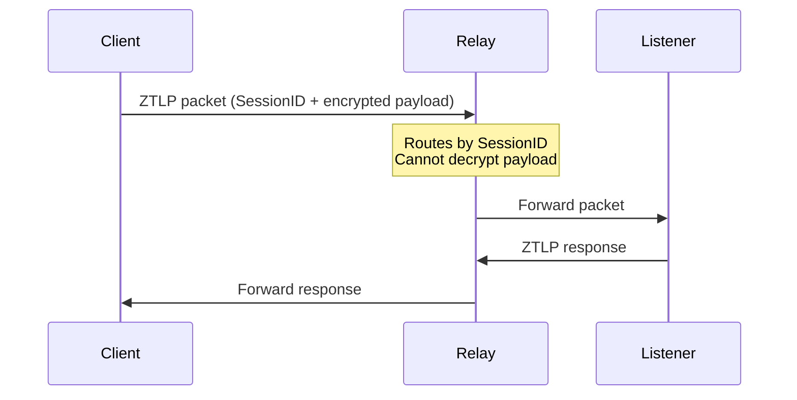

# Getting Started with ZTLP

## What is ZTLP?

ZTLP (Zero Trust Layer Protocol) is a network protocol that flips the fundamental assumption of the Internet. Today's Internet carries any packet from any source — security is bolted on afterward by firewalls, WAFs, VPNs, and application-layer authentication. ZTLP takes the opposite approach: **if you can't prove who you are, you don't exist on this network.**

Every packet on a ZTLP network carries a cryptographic identity. There are no open ports, no anonymous connections, and no way to even *discover* a service without holding the right credentials. Services behind ZTLP are invisible to anyone who isn't authorized to see them — not filtered, not firewalled, but genuinely invisible at the protocol level.

ZTLP is an overlay protocol that runs on top of the existing IPv4/IPv6 Internet. You don't need to replace your infrastructure. You deploy ZTLP alongside what you already have, and it creates an identity-first network layer where unauthorized traffic is rejected before it ever reaches your application — most of it within nanoseconds.

## Why ZTLP?

The Internet's fundamental security model is broken. Here's what that looks like today:

| Problem | How It Works Today | How ZTLP Fixes It |
|---|---|---|
| **Port scanning** | Any IP can probe any port on any server | Services have no public ports — they're invisible |
| **DDoS attacks** | Servers must process every incoming packet | Invalid packets rejected in nanoseconds, before any state is allocated |
| **Credential stuffing** | Anyone can reach your login page | Can't even connect without cryptographic identity |
| **Lateral movement** | Once inside a network, attackers move freely | Every connection requires per-session mutual authentication |
| **Open attack surface** | Every public service is a target | Zero attack surface by default — identity required first |

Traditional approaches (VPNs, firewalls, WAFs) try to solve these problems by adding security *around* the network. ZTLP solves them by building security *into* the network layer itself.

### What Changes vs. Today's Internet



## Core Concepts

Before diving into the demo, here are the five concepts you'll encounter repeatedly:

**NodeID** — A 128-bit identifier that uniquely identifies every participant on the network. Unlike IP addresses, NodeIDs are not derived from network topology — they're bound to cryptographic key pairs. Your NodeID is *who you are*, not *where you are*. Think of it as a passport, not an address.

**SessionID** — A 96-bit token that identifies an active, authenticated connection between two nodes. After a cryptographic handshake, both sides agree on a SessionID that's used for fast packet routing. Relays forward packets based on SessionID without needing to decrypt the payload — this is what makes ZTLP's relay mesh efficient.

**Relay** — A node that forwards encrypted traffic between other nodes. Relays can't read the traffic — they just route based on SessionIDs. They form a mesh network using a consistent hash ring for load distribution. Relays are how nodes behind NAT or firewalls communicate without exposing any ports.

**Gateway** — A reverse proxy that sits in front of existing services (web servers, databases, APIs) and protects them with ZTLP's identity layer. The service itself doesn't need to know ZTLP exists — the gateway handles authentication and only forwards traffic from authorized identities. Your service keeps zero public ports.

**ZTLP-NS** — The distributed namespace system for ZTLP. Instead of DNS, ZTLP uses a cryptographically signed namespace where records are authenticated with Ed25519 signatures. It handles service discovery, zone delegation, and trust root management. Think of it as "DNS, but you can't poison it."

## 5-Minute Demo

This walkthrough uses the `ztlp` CLI to set up a basic authenticated connection between two nodes.

### Prerequisites

- The `ztlp` binary installed and in your `$PATH`
- Two terminals (or two machines)

### Step 1: Generate Keys

Every ZTLP node needs a cryptographic identity. Generate a key pair:

```bash
ztlp keygen --output ~/.ztlp/
```

This creates:
- `~/.ztlp/private.key` — Your Ed25519 private key (keep this secret)
- `~/.ztlp/public.key` — Your public key (share this with peers)
- `~/.ztlp/node.id` — Your derived NodeID

### Step 2: Start a Listener

On the first terminal, start a ZTLP listener:

```bash
ztlp listen --bind 0.0.0.0:4433 --key ~/.ztlp/private.key
```

```
[ZTLP] Listening on 0.0.0.0:4433
[ZTLP] NodeID: a1b2c3d4e5f6...
[ZTLP] Waiting for authenticated connections...
```

This node is now listening — but unlike a traditional TCP listener, it will **reject any packet that doesn't carry valid ZTLP authentication**. Port scanners see nothing. Random traffic gets dropped at Layer 1 (the magic byte check) in under 20 nanoseconds.

### Step 3: Connect from Another Node

On the second terminal (with its own key pair), connect to the listener:

```bash
ztlp connect 192.168.1.10:4433 --key ~/.ztlp/private.key
```

```
[ZTLP] Initiating Noise_XX handshake...
[ZTLP] Handshake complete (299µs)
[ZTLP] SessionID: 0xf47ac10b58cc...
[ZTLP] Secure channel established ✓
```

Behind the scenes, a full Noise_XX handshake just happened — mutual authentication, key exchange, and session establishment. Both sides proved their identity before any application data was exchanged.

### Step 4: Connect Through a Relay

If your nodes are behind NAT or you want relay-based routing, start a relay:

```bash
# Terminal 3: Start a relay
ztlp relay --bind 0.0.0.0:4434
```

```
[ZTLP] Relay active on 0.0.0.0:4434
[ZTLP] Ready to forward authenticated sessions
```

Now connect through the relay:

```bash
ztlp connect 192.168.1.10:4433 --relay 10.0.0.5:4434
```

The relay forwards your encrypted traffic without being able to read it. It sees SessionIDs and routes accordingly — the payload remains end-to-end encrypted between you and the listener.



### Step 5: Inspect Packets

Want to see what ZTLP traffic looks like on the wire? Use the inspector:

```bash
ztlp inspect --interface eth0
```

```
[ZTLP] Sniffing on eth0...
PKT  src=10.0.0.2:51234 dst=10.0.0.5:4434 len=128
  Magic: 0xA0 ✓
  SessionID: 0xf47ac10b58cc...
  HeaderAuth: AEAD verified ✓
  Payload: 64 bytes (encrypted)
```

You can also check node status and ping:

```bash
# Check local node status
ztlp status

# Ping a ZTLP peer (authenticated ping, not ICMP)
ztlp ping a1b2c3d4e5f6...
```

## Identity Model

ZTLP v0.9.0 introduces first-class identity records for users, devices, and groups. This enables group-based policy, role-based access control, and device-user ownership binding.

```bash
# Create a user
ztlp admin create-user steve@office.ztlp --role admin --email steve@example.com

# Create a device and link it to the user
ztlp setup --type device --name laptop.office.ztlp
ztlp admin link-device laptop.office.ztlp --owner steve@office.ztlp

# Create a group and add members
ztlp admin create-group techs@office.ztlp
ztlp admin group add techs@office.ztlp steve@office.ztlp

# Use group-based policy
ztlp listen 0.0.0.0:23095 ... --policy 'allow = ["group:techs@office.ztlp"]'
```

Key concepts:
- **DEVICE** records (0x10) bind a NodeID to a named device, with an optional `owner` pointing to a USER
- **USER** records (0x11) represent humans with roles: user, tech, or admin
- **GROUP** records (0x12) are flat sets of users/devices used in policy rules
- **Revocation cascade** — revoking a user automatically blocks all their devices
- **Self-registration** — USER and DEVICE support self-registration; GROUP requires zone authority

See [IDENTITY.md](IDENTITY.md) for the full design document.

## What's Next?

You've seen the basics — identity generation, authenticated connections, relay forwarding, and packet inspection. Here's where to go from here:

- **[Architecture Overview](#architecture)** — Understand how the three-layer pipeline, relay mesh, and gateway model work under the hood
- **[Threat Model](#threat-model)** — See exactly what ZTLP protects against (and what it doesn't)
- **[Full Specification](#spec)** — The complete protocol spec with wire formats, cryptographic details, and deployment models
- **[GitHub Repository](https://github.com/priceflex/ztlp)** — Source code, issues, and discussions
- **[CLI Reference](https://github.com/priceflex/ztlp/blob/main/CLI.md)** — Full documentation of every `ztlp` subcommand
