# ZTLP — Zero Trust Layer Protocol

[](https://github.com/priceflex/ztlp/actions/workflows/ci.yml)
[](LICENSE)
[](https://ztlp.org)
[](proto/)
[](relay/)

**Version 0.9.13 | Experimental / Informational**

> 🌐 **[ztlp.org](https://ztlp.org)** — Live specification & documentation &nbsp;|&nbsp; **[LinkedIn](https://www.linkedin.com/in/steven-e-price)**

---

**Author:** Steven Price  
**Organization:** Tech Rockstar Academy / ZTLP.org  
**Location:** Monrovia, CA  
**Status:** Experimental / Informational — This document defines the complete ZTLP protocol specification. Distribution is unlimited.  
**Note:** This document is not an IETF RFC. It is a working concept specification.  
**Date:** 2026

---

## Abstract

Distributed Denial of Service (DDoS) attacks and unauthenticated network
access represent the two most persistent and costly structural failures
of the modern Internet. Both exist for the same reason: the Internet was
designed to carry any packet from any source, with security left as an
afterthought for endpoints and applications to solve individually. ZTLP
(Zero Trust Layer Protocol) is a direct response to this design flaw.

ZTLP defines a secure, identity-first network overlay that enforces
cryptographic authentication before any network state is allocated.
Invalid packets are rejected in a three-layer pipeline - Magic byte
check, SessionID allowlist lookup, and HeaderAuthTag AEAD verification 
with each layer progressively more expensive but handling a
progressively smaller fraction of attack traffic. The vast majority of
flood traffic is discarded at the first two layers with no cryptographic
work performed and no session state created. This makes volumetric DDoS
attacks structurally ineffective and eliminates the concept of an open
attack surface entirely. ZTLP rides over existing IPv4 and IPv6
infrastructure and is invisible and unusable to any node that does not
possess a valid, hardware-backed cryptographic identity.

The primary design goals of ZTLP are DDoS mitigation and Zero Trust
network access at the protocol layer - not at the application,
firewall, or middleware layer where such controls are currently
implemented. Bandwidth reservation across the public Internet backbone
is a future target capability of ZTLP, motivated by its application as a
structural DDoS defense mechanism. This document is submitted as an
Informational/Experimental specification. It does not propose changes to
IP addressing or BGP routing. It defines a protocol layer that can be
deployed today over the existing Internet.

## Documentation

View the full documentation — including quick start guides, architecture deep dive, component guides, deployment instructions, and API reference — by opening `docs/index.html` in your browser, or visit [docs.ztlp.org](https://docs.ztlp.org) (coming soon).

Additional documentation:
- **[DEPLOYMENT.md](DEPLOYMENT.md)** — Comprehensive deployment guide covering Docker, federation, monitoring, and production hardening.
- **[IDENTITY.md](IDENTITY.md)** — Detailed design document for the v0.9.0 identity model (DEVICE, USER, GROUP records and group-based policy).

## Table of Contents

| # | Section |
|--:|---------|
| 1 | Problem Statement |
| 2 | Introduction and Motivation |
| 3 | Terminology |
| 4 | Goals, Non-Goals, and Design Philosophy |
| 5 | Threat Model |
| 6 | Protocol Overview |
| 7 | ZTLP Addressing — Node Identity |
| 8 | **ZTLP Packet Format** |
|   | 8.1 Handshake / Control Header (96 bytes, fixed) |
|   | 8.2 Field Definitions |
|   | 8.3 Established Data Header (compact, post-handshake) |
|   | 8.4 Extension TLVs (Optional) |
|   | 8.5 Payload |
| 9 | ZTLP-NS — Distributed Trust Namespace |
|   | 9.6 Identity Model (DEVICE, USER, GROUP) |
|   | 9.7 Admin Wire Protocol (ADMIN\_QUERY) |
| 10 | Node Initialization and Bootstrap Procedure |
| 11 | Handshake and Session Establishment |
|   | 11.3.1 Group-Based Policy Evaluation |
| 12 | **Relay Node Architecture** |
|   | 12.4 Ingress Admission Domains and Relay Admission Tokens |
|   | 12.5 Authenticated Relay Federation and Capacity Classes |
|   | 12.6 Geographic Relay Hierarchy |
| 13 | Hardware Enforcement Profiles |
| 14 | Transport Fallback and NAT Traversal |
| 15 | Routing and Path Selection |
| 16 | **Key Management and Hardware Identity** |
|   | 16.3 Node Identity Assurance Model and Attestation |
| 17 | Deployment Model and Migration Strategy |
| 18 | Security Considerations |
| 19 | Privacy Considerations |
| 20 | Operational Tooling |
|   | 20.1 Identity and Zone Administration CLI |
|   | 20.2 Developer SDKs and Integration Libraries |
| 21 | Open Issues and Future Work |
| 22 | References |
| 23 | Trust and Authority Model |
| 24 | Public Internet Interoperability and Overlay Architecture |
| 25 | Commercial Adoption and Gateway Deployment Model |
| 26 | Policy-Constrained Adaptive Path Selection |
| 27 | Handshake Flood Resistance |
| 28 | Identity-Gated Connectivity: No-Open-Port Networking |
| 29 | SessionID as Primary Routing Primitive |
| 30 | Cloud Provider and CDN Integration |
| 31 | Historical Context: Identity Networking and Protocol Precedents |
| 32 | Practical Deployment Path and Reference Implementation |
| 33 | Protected Access Plane for Web, Email, and Account Services |
| 34 | Identity-Based Service Routing for Sensitive Web Paths |
| 35 | Session Lifecycle, Rekeying, and Relay State Management |
| 36 | Client Path Selection Summary |
| 37 | Relay Abuse Protection |
| 38 | Federated Identity Architecture |
| 39 | Admission Plane and Forwarding Plane Separation |
| 40 | ZTLP Relay Roles and Network Topology |
| 41 | ZTLP Threat Model |
| 42 | Operational Deployment Model |
| 43 | Gateway-First Interoperability Principle |

---

# 1. Problem Statement

The Internet was not designed to be secure. It was designed to be
resilient and reachable - to move packets from one place to another
regardless of who sent them or why. That was the right decision in 1974.
It is the source of most of our problems in 2026.

## 1.1 The Cost of the Status Quo

The structural insecurity of the Internet is not an abstract concern. It
has measurable, recurring costs that affect every organization connected
to it:

-   **DDoS attacks cost the global economy an estimated \$2.5 billion
    annually** in direct mitigation costs, downtime, and lost revenue.
    Volumetric attacks regularly exceed 1 Tbps. They work because the
    Internet accepts any packet from anyone.

-   **Ransomware attacks on critical infrastructure** - hospitals,
    water treatment facilities, school districts, manufacturers -
    succeed primarily because internal networks are flat and
    unauthenticated. Once an attacker is inside, lateral movement is
    trivial. The network has no concept of identity; if you can reach an
    IP, you can attempt to exploit it.

-   **BGP route hijacking** allows nation-state actors and misconfigured
    routers to silently redirect Internet traffic, intercept
    communications, or cause widespread outages. RPKI deployment has
    improved but remains incomplete, and BGP itself has no cryptographic
    path validation.

-   **IoT insecurity** is systemic and worsening. Billions of devices
    connect to the Internet with no meaningful authentication, becoming
    permanent botnet members and attack platforms. The network layer
    offers them no protection and demands nothing of them.

-   **Compliance frameworks are compensating controls, not solutions.**
    HIPAA, PCI-DSS, CMMC, and SOC 2 require organizations to build
    security on top of an insecure network layer using firewalls, VPNs,
    intrusion detection, and monitoring. These are necessary but they
    are expensive, operationally complex, and fundamentally reactive.
    They detect and respond to threats that a secure-by-design network
    layer would never allow to exist.

## 1.2 Why IPv6 Did Not Solve This

IPv6 solved the address exhaustion problem. It did not change the
fundamental model: any host can still send packets to any reachable
address. IPv6 nodes are still exposed by default. Services still require
firewalls. Authentication and encryption are still optional. DDoS
attacks work identically over IPv6. The attack surface is the same; the
addresses are just longer.

The root cause is philosophical, not technical. IPv4 and IPv6 both treat
the network as a neutral carrier of packets. Security is the
responsibility of endpoints. ZTLP inverts this: the network refuses to
carry packets that cannot prove their identity. Security becomes
structural rather than bolted on.

## 1.3 Why Now

The prerequisites for a protocol like ZTLP did not exist a decade ago.
They exist today:

-   **Hardware identity is mainstream.** YubiKeys, TPM 2.0 chips, and
    Secure Enclaves are now standard in consumer and enterprise
    hardware. Hardware-bound private keys that cannot be extracted or
    cloned are no longer exotic or expensive.

-   **QUIC provides a proven encrypted UDP transport substrate.** ZTLP
    does not need to solve NAT traversal, encrypted transport, or
    firewall compatibility from scratch. QUIC has already done that
    work, and it is now deployed at Internet scale.

-   **Zero Trust Architecture is now industry consensus.** NIST SP
    800-207, the US Executive Order on Improving the Nation's
    Cybersecurity (2021), and widespread enterprise adoption have
    established Zero Trust as the direction of travel. ZTLP embeds this
    model at the network layer rather than requiring it to be
    retrofitted at every application.

-   **The Noise Protocol Framework provides a proven handshake
    foundation.** WireGuard demonstrated that a simple, auditable,
    high-performance cryptographic protocol can achieve widespread
    real-world deployment. ZTLP builds on this foundation.

-   **The regulatory and threat environment demands action.** CMMC 2.0,
    HIPAA enforcement, critical infrastructure protection mandates, and
    escalating cyber insurance requirements are creating strong economic
    incentives for organizations to move beyond perimeter-based security
    models. ZTLP aligns with and accelerates that direction.

## 1.4 Who Benefits First

ZTLP does not require global deployment to deliver value. The following
sectors have acute pain points that ZTLP directly addresses, making them
natural early adopters:

-   **Healthcare.** Hospitals and clinics are the most targeted sector
    for ransomware. HIPAA mandates data protection but provides no
    network-layer enforcement mechanism. ZTLP makes lateral movement
    structurally impossible within a ZTLP-enrolled network: no open
    ports, no unauthenticated access, no attack surface for an attacker
    who gains a foothold on one device.

-   **Defense contractors and CMMC-regulated organizations.** CMMC Level
    2 and 3 requirements map directly to ZTLP capabilities: access
    control, identification and authentication, system and
    communications protection. ZTLP provides these at the network layer,
    reducing the compliance burden on individual applications.

-   **Managed Service Providers (MSPs).** MSPs manage networks across
    dozens or hundreds of client environments, often connected via VPNs
    and jump hosts that are themselves attack targets. ZTLP replaces the
    VPN mesh with identity-based direct sessions, eliminates jump hosts
    as an attack surface, and makes client network isolation structural
    rather than policy-dependent.

-   **Manufacturing and industrial control systems.** OT and ICS
    environments increasingly connect to IT networks and the Internet,
    creating attack paths into physical systems. ZTLP's zero-open-port
    model provides a network layer that industrial devices can
    participate in without exposing control interfaces to the public
    Internet.

-   **Internet of Things deployments.** IoT devices with hardware
    identity (TPM or Secure Enclave) can participate in ZTLP networks
    without any application-layer security configuration. The device
    either has a valid identity and is enrolled, or it cannot
    communicate with enrolled services. This eliminates entire
    categories of IoT attack.

## 1.5 The Vision

A network where ZTLP is widely deployed looks fundamentally different
from the Internet of today:

-   Port scanners return nothing. There are no open ports to find.
    Services do not exist to unenrolled nodes.

-   DDoS floods exhaust bandwidth at the physical link but cannot
    exhaust CPU or memory - the three-layer enforcement pipeline
    ensures that flood traffic is rejected before expensive session
    state is allocated, and before cryptographic verification is
    performed on packets that fail the cheaper checks first.

-   A stolen laptop or cloned VM cannot authenticate. The hardware token
    is the credential; without it the identity does not exist.

-   Ransomware that gains a foothold on one device cannot move
    laterally. Every other service on the network requires a separate
    authenticated identity to reach.

-   Network connectivity follows identity, not location. A device works
    identically whether it is in the office, at home, or on a cellular
    connection - because the network authenticates who you are, not
    where you are.

This is not a utopian vision. Every component described above already
exists in some form. What does not yet exist is a unified, open protocol
that assembles them into a coherent network layer. That is what ZTLP
proposes to be.

# 2. Introduction and Motivation

The Internet\'s current network layer (IPv4/IPv6) was designed with
reachability as the primary objective. Security was not a first-class
design principle. As a result, the global Internet suffers from
persistent structural problems that cannot be fully resolved within the
IPv4/IPv6 paradigm:

-   Any host can send packets to any reachable address, regardless of
    authorization.

-   Services are exposed by default; security is enforced reactively by
    firewalls and ACLs.

-   DDoS attacks exploit the fact that routers cannot distinguish
    authorized from unauthorized traffic.

-   BGP routing prioritizes policy over performance; path selection is
    opaque to endpoints.

-   Encryption and authentication are optional add-ons, not protocol
    requirements.

-   Identity is tied to IP addresses, which are location-based and
    easily spoofed.

ZTLP proposes a different model. Rather than replacing IPv6, ZTLP
defines a secure overlay that rides on existing Internet infrastructure
and enforces a single rule before any network state is allocated:

***\"If you cannot prove who you are, you do not exist on this
network.\"***

This produces a network layer where port scanning returns nothing, SYN
floods are rejected before session state is allocated, spoofed packets
fail authentication, and services have no externally visible attack
surface unless explicitly permitted. DDoS mitigation becomes structural
rather than reactive.

ZTLP is not a replacement for the Internet. It is a protected lane on
top of it.

# 3. Terminology

The key words MUST, MUST NOT, REQUIRED, SHALL, SHALL NOT, SHOULD, SHOULD
NOT, RECOMMENDED, MAY, and OPTIONAL in this document are to be
interpreted as described in RFC 2119.

| Term | Definition |
|------|------------|
| ZTLP Node | Any device running the ZTLP stack with a valid Node Identity. |
| Node ID | A stable 128-bit identifier assigned to a node at enrollment. Permanent — does not change when keys rotate or hardware is replaced. The associated public key is bound via a signed `ZTLP_KEY` record in ZTLP-NS. |
| Service ID | A 128-bit identifier for a named service, derived from hash(service-name + tenant). |
| ZTLP Relay | A ZTLP Node that forwards traffic between other nodes across the public Internet. |
| ZTLP Gateway | A ZTLP Node that bridges between ZTLP and legacy IPv4/IPv6 networks. |
| ZTLP-NS | The ZTLP Namespace — a distributed DNS-like trust namespace for identity and service discovery. |
| Trust Anchor | A hardcoded public key embedded in ZTLP implementations that bootstraps initial trust. |
| Session | An established, mutually authenticated, encrypted ZTLP communication channel. |
| HeaderAuthTag | A 128-bit authentication tag over the ZTLP header allowing fast pre-decryption packet rejection. |
| Hardware Identity | A private key bound to a physical hardware token (e.g., YubiKey, TPM, Secure Enclave). |
| Policy Tag | A 32-bit compact field encoding tenant, role, or zone for fast edge policy decisions. |
| CryptoSuite | A 16-bit identifier specifying the AEAD, hash, and handshake algorithms in use. |

# 4. Goals, Non-Goals, and Design Philosophy

## 4.1 Goals

-   Enforce cryptographic authentication before allocating any network
    state.

-   Eliminate the concept of \'open ports\' - services are invisible
    without authorization.

-   Support hardware-backed identity (YubiKey, TPM, Secure Enclave) as a
    first-class primitive.

-   Provide performance-aware, multipath relay routing across the public
    Internet.

-   Deploy incrementally over existing IPv4/IPv6 infrastructure without
    router changes.

-   Define a distributed, DNS-like trust namespace (ZTLP-NS) for
    identity and service discovery.

-   Support gradual migration from legacy networks (Phase 1 through
    Phase 4 model).

-   Provide structural DDoS resistance through cryptographic air-gapping
    of the packet surface.

## 4.2 Non-Goals

-   ZTLP does not propose a new IP version number or changes to
    IPv4/IPv6 headers.

-   ZTLP does not require Internet routers or BGP to be modified.

-   ZTLP v0.5.1 does not implement hard bandwidth reservations across
    the public Internet backbone. Bandwidth-aware path selection and
    soft admission control via the `BANDWIDTH_HINT` extension TLV are
    defined in Section 8.4. Hard per-session bandwidth reservation
    between participating relay operators is a target capability for a
    future revision - motivated primarily by its application to
    volumetric DDoS mitigation, where pre-allocated authenticated
    capacity lanes prevent attackers from consuming resources reserved
    for legitimate traffic.

-   ZTLP is not a VPN product, though it shares architectural concepts
    with secure overlays.

-   ZTLP does not provide anonymity - identity is a core requirement
    of the protocol.

## 4.3 Design Philosophy

Every design decision in ZTLP is evaluated against two governing
principles. These are not aspirational - they are the criteria by
which proposed changes to this specification MUST be judged.

**Principle 1 - DDoS Resistance Must Be Structural, Not Reactive**

The current Internet responds to DDoS after the fact: detect the attack,
classify the traffic, apply rate limits, absorb or block. This approach
is expensive, slow, and fundamentally asymmetric - the attacker spends
pennies per gigabit while the defender spends dollars. ZTLP inverts this
entirely.

In ZTLP, invalid packets are rejected through a three-layer pipeline
ordered by cost. The Magic byte check costs a single comparison -
nanoseconds, no crypto, no kernel involvement, handled at the NIC
driver. The SessionID allowlist lookup costs an O(1) BPF hash map read
- still no cryptographic work. Only packets that survive both cheaper
checks reach the HeaderAuthTag AEAD verification, which does involve
real cryptographic computation. By the time a packet reaches AEAD
verification, it has already proved it knows a valid SessionID -
meaning the attacker is not sending random flood traffic, they are
sending traffic that at minimum knows the structure of active sessions.
That is a dramatically harder attack to mount, and the volume of such
traffic is orders of magnitude lower than a raw flood. No session state
is allocated until all three checks pass. The cost asymmetry strongly
favors the defender across the entire pipeline.

Any feature added to ZTLP that increases the cost of processing
unauthenticated packets - or that creates exploitable state before
authentication - MUST be rejected. DDoS resistance is a hard
architectural constraint, not a feature that can be traded off for
convenience.

**Principle 2 - Identity Must Precede Communication**

The current Internet allows any host to send packets to any reachable
address. Security is the endpoint\'s problem. Firewalls, intrusion
detection systems, WAFs, VPNs, and Zero Trust access proxies all exist
to compensate for this single design choice. They are expensive,
complex, and they fail regularly.

ZTLP moves this check to the network layer and makes it mandatory. A
node without a cryptographically verified identity cannot initiate
communication. A service without an enrolled identity cannot receive
communication. There are no open ports. There is no visible attack
surface. There is no unauthenticated state. The Zero Trust model is not
enforced by policy on top of an insecure network - it is enforced by
the protocol itself, at the packet level, before anything else happens.

These two principles - structural DDoS resistance and mandatory
identity - are not independent. They are the same idea expressed at
different layers. An unauthenticated packet is both a potential DDoS
vector and a Zero Trust violation. ZTLP treats them as one problem with
one solution: if you cannot prove who you are, you do not exist on this
network.

# 5. Threat Model

ZTLP is designed to mitigate the following classes of threat:

| Threat | Description | ZTLP Mitigation |
|--------|-------------|-----------------|
| Volumetric DDoS | Flood of packets to exhaust CPU, memory, or bandwidth. | Three-layer pipeline: Magic check (no crypto), SessionID allowlist (no crypto), HeaderAuthTag AEAD verification. Session state is not allocated until all three pass. The majority of flood traffic is rejected at layers 1 and 2 before any cryptographic work is performed. |
| Packet Spoofing | Attacker forges source address. | Every packet carries a HeaderAuthTag tied to session keys; forgeries fail immediately. |
| Port Scanning | Attacker enumerates open services. | No services are visible; ZTLP nodes do not respond to unauthenticated probes. |
| Replay Attacks | Attacker replays captured valid packets. | PacketSeq (64-bit) and Timestamp fields enforce anti-replay windows. |
| Route Hijacking | BGP prefix hijack redirects traffic. | ZTLP traffic is encrypted and authenticated end-to-end; hijacked routes carry opaque ciphertext. |
| Man-in-the-Middle | Attacker intercepts and modifies traffic. | Mutual authentication during handshake; session keys are ephemeral and hardware-bound. |
| Credential Theft | Private key or certificate stolen. | Hardware-bound keys (YubiKey/TPM) cannot be extracted; short-lived session tokens limit exposure. |
| Lateral Movement | Compromised node attacks others internally. | Each service requires separate policy authorization; Node ID alone does not grant access. |
| Identity Cloning | VM clone or config copy impersonates a node. | Hardware-bound keys mean a cloned config without the physical hardware token cannot authenticate. |

ZTLP does NOT protect against:

-   Bandwidth saturation at the physical link layer before packets reach
    ZTLP edges.

-   Compromise of the hardware identity device itself.

-   Application-layer attacks from legitimately authenticated nodes.

# 6. Protocol Overview

ZTLP operates as a secure overlay. The public Internet (IPv4/IPv6) acts
as a dumb transport substrate. ZTLP does not require routers or ISPs to
understand the protocol.

A ZTLP packet is an encrypted, authenticated payload carried inside a
standard UDP or QUIC datagram. To the public Internet, ZTLP traffic
appears as ordinary encrypted UDP - indistinguishable from QUIC,
DNS-over-QUIC, or other encrypted UDP traffic.

**Figure 1. ZTLP High-Level Architecture**

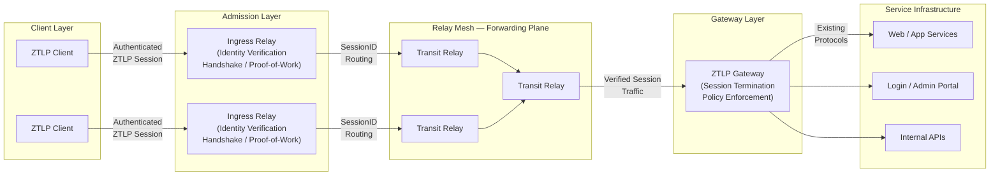

*ZTLP separates three operational planes: the Admission Plane (identity verification at ingress relays), the Forwarding Plane (high-speed SessionID-based routing through the relay mesh), and the Service Plane (policy enforcement at gateways, with unchanged backend services).*

## 6.1 Layering

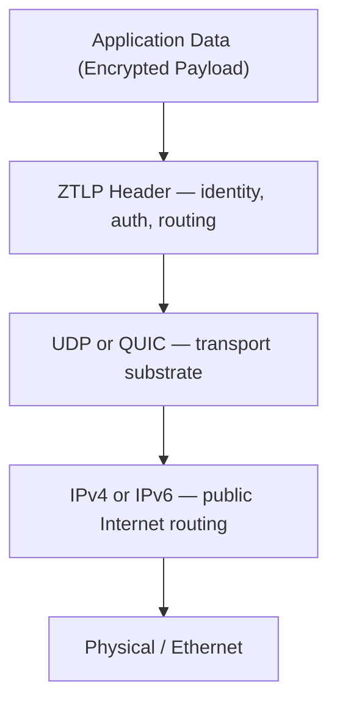
*ZTLP rides above the existing Internet transport stack. Routers and ISPs see ordinary UDP traffic.*

## 6.2 Connection Model

ZTLP uses a connection-oriented model with explicit session
establishment. The phases are:

1.  Node discovers relay via bootstrap procedure (Section 10).

2.  Node performs HELLO handshake with relay or peer (Section 11).

3.  Mutual identity verification and policy check.

4.  Session keys derived; short-lived session established.

5.  Data packets flow; keys rotate automatically per session policy.

6.  Session closes via explicit CLOSE message or timeout.

## 6.3 Identity vs. Location

In IPv4/IPv6, an address is a location. In ZTLP, identity is primary. A
Node ID is a stable identifier for the node - it is the same
regardless of what IPv6 address the node currently uses, which keys it
currently holds, or what hardware it runs on. This enables seamless
mobility, key rotation, hardware replacement, multihoming, and
relay-based routing without breaking sessions or invalidating policies.

## 6.4 Locator/Identifier Separation

ZTLP explicitly separates network identity from transport location. This
is a fundamental architectural principle, not an implementation detail.
The Internet has historically conflated these two concepts - an IPv4
or IPv6 address simultaneously identifies a host and describes where it
lives in the routing topology. This conflation causes mobility failures
(connections break when a device changes IP), multihoming complexity,
inefficient routing, and reactive DDoS mitigation. Research protocols
including HIP (Host Identity Protocol), LISP (Locator/Identifier
Separation Protocol), SCION, and ILNP have attempted to solve this
problem for decades. They struggled with deployment because all required
changes to Internet routing infrastructure. ZTLP solves it differently as an overlay.

ZTLP defines three distinct layers:

-   **Identifier layer -** NodeID and ServiceID. Stable, permanent,
    hardware-backed. These never change and are what policies, ACLs, and
    logs reference.

-   **Locator layer -** IPv4/IPv6 transport addresses. Transient.
    Change freely as nodes move networks, change ISPs, or fail over.
    Sessions are bound to identifiers, not locators, so locator changes
    do not break established sessions.

-   **Routing layer -** The relay mesh. Relay nodes dynamically select
    the best locator path for a given identifier, optimizing for
    latency, packet loss, congestion, and trust score. Path optimization
    is performed at the relay level without any changes to Internet
    routing or BGP.

This separation is what makes ZTLP\'s DDoS resistance structurally
stronger than IP-layer defenses. DDoS attacks target locators - IP
addresses. ZTLP\'s enforcement is identity-based. An attacker flooding a
locator accomplishes nothing if the packets cannot prove a valid
identifier. The attack surface is the identifier space, not the locator
space, and identifier space is cryptographically controlled.

# 7. ZTLP Addressing - Node Identity

## 7.1 Node ID

A ZTLP Node ID is a stable 128-bit random identifier assigned at node
enrollment. It is NOT derived from the node\'s public key.

```
NodeID = RAND_128()  // generated once at enrollment, never changes
```

The NodeID represents the node as an entity - the device, service, or
principal - independent of its current cryptographic key material. The
public key is a separate attribute, bound to the NodeID via a signed
`ZTLP_KEY` record in ZTLP-NS. This separation is a deliberate design
choice that enables key rotation, hardware replacement, and multi-key
configurations without changing the node\'s identity.

### 7.1.1 Why NodeID Is Not Derived From the Public Key

Early protocol designs (including HIP - Host Identity Protocol)
derived node identifiers directly from public keys. This is
cryptographically elegant but operationally painful. When NodeID =
HASH(public_key), any key change - routine rotation, compromise
response, hardware replacement, lost YubiKey - changes the node\'s
identity. Every policy, ACL, relay allowlist, security log, and service
binding that referenced the old NodeID must be updated. In practice this
means key rotation is avoided, which is the opposite of good security
hygiene.

ZTLP separates identity from key material. The NodeID identifies the
node permanently. The public key proves current possession of the
private key bound to that NodeID. These are two different concepts and
the protocol treats them as such. This is consistent with modern
identity systems: TLS certificates, SSH known hosts, OAuth identities,
and Kubernetes service accounts all separate stable identity from
rotating key material.

### 7.1.2 Key Binding and Rotation

A node\'s current public key is published as a `ZTLP_KEY` record in
ZTLP-NS, signed by the ZTLP-NS zone authority. During session handshake,
the initiator proves possession of the private key bound to its NodeID
by completing the `Noise_XX` exchange. Verifiers check the `ZTLP_KEY` record
to confirm the public key is currently bound to the presented NodeID.

Key rotation is performed by publishing a new `ZTLP_KEY` record with an
updated public key and invalidating the previous record. The NodeID does
not change. Existing sessions negotiate rekeying. Policies, ACLs, and
logs continue to reference the same NodeID without modification. A node
MAY have multiple active public keys simultaneously - useful for
hardware HSMs with backup keys, emergency recovery keys, or phased key
rotation with overlap periods.

Node IDs are NOT routable addresses. They are stable identity handles
used for authentication, policy decisions, and logging. They do not
change when a node moves networks, changes IP addresses, or replaces
hardware.

## 7.2 Service ID

Services are identified independently from the hosts that run them:

```
ServiceID = TRUNCATE_128(SHA3-256(service-name || tenant-id))
```

Example Service IDs resolve from human-readable names in ZTLP-NS:

```
rdp.clinic.acmedental.ztlp  →  ServiceID: 8f23:9c11:ae45:...
backup.server.example.ztlp  →  ServiceID: c341:0f8a:21bc:...
```

## 7.3 Human-Readable Names

The ZTLP-NS namespace (Section 9) maps human-readable names to Node IDs,
Service IDs, relay addresses, and policy records - functioning
similarly to DNS but with mandatory signing and delegated trust.

# 8. ZTLP Packet Format

## 8.1 Handshake / Control Header (96 bytes, fixed)

```packet
  0-15: "Magic (16)"
  16-19: "Ver (4)"
  20-31: "HdrLen (12)"
  32-47: "Flags (16)"
  48-55: "MsgType (8)"
  56-71: "CryptoSuite (16)"
  72-87: "KeyID/TokenID (16)"
  88-183: "SessionID (96)"
  184-247: "PacketSeq (64)"
  248-311: "Timestamp (64)"
  312-439: "SrcNodeID (128)"
  440-567: "DstSvcID (128)"
  568-599: "PolicyTag (32)"
  600-615: "ExtLen (16)"
  616-631: "PayloadLen (16)"
  632-759: "HeaderAuthTag (128)"
  760-767: "Reserved (8)"
```

*Note:* The fields above total 760 bits (95 bytes). A single byte of
reserved padding (bits 760–767) is appended to yield a 96-byte (768-bit)
header aligned to 4-byte word boundaries. The Reserved byte MUST be set
to zero on transmission and MUST be ignored on receipt.

## 8.2 Field Definitions

| Field | Size | Description |
|-------|------|-------------|
| Magic | 16 bits | Fixed 16-bit value `0x5A37` ('Z7'). Allows fast rejection of random UDP noise before any parsing. 16-bit width is required to hold the full `0x5A37` value. |
| Ver | 4 bits | Protocol version. Current: 1. |
| HdrLen | 12 bits | Header length in 4-byte words, including extensions. |
| Flags | 16 bits | Bitfield: HAS_EXT, ACK_REQ, REKEY, MIGRATE, MULTIPATH, RELAY_HOP. |
| MsgType | 8 bits | DATA, HELLO, `HELLO_ACK`, REKEY, CLOSE, ERROR, PING, PONG. |
| CryptoSuite | 16 bits | Identifies AEAD + hash + handshake family (e.g., ChaCha20-Poly1305 + `Noise_XX`). |
| KeyID/TokenID | 16 bits | Selects active credential slot; allows edge to pick correct verification key instantly. |
| SessionID | 96 bits | Stable per-flow identifier. Assigned during HELLO with cryptographically strong entropy. 96-bit width provides sufficient keyspace to make random guessing attacks computationally infeasible even under large-scale enumeration attempts. Rotates on REKEY. |
| PacketSeq | 64 bits | Monotonically increasing per-session counter. Anti-replay window enforced. For single-path sessions, the default anti-replay window size MUST be at least 256 packets. Implementations MAY use larger windows. In multipath sessions (MULTIPATH flag set), the anti-replay window MUST be sized to accommodate path-induced reordering — implementations SHOULD use a minimum window of 1024 packets. Per-path sequence tracking is RECOMMENDED for sessions with high reordering variance. |
| Timestamp | 64 bits | Unix epoch milliseconds. Used as a replay heuristic — packets with timestamps significantly outside the receiver's clock window SHOULD be treated as suspicious and deprioritized. Implementations MUST NOT hard-reject packets solely on timestamp deviation, as clock drift, NTP failure, or embedded device timekeeping limitations can produce legitimate out-of-window timestamps. The HeaderAuthTag provides the authoritative replay defense; the Timestamp field is supplementary. |
| SrcNodeID | 128 bits | Sender's Node ID (stable 128-bit enrollment identifier). Zero during initial HELLO. |
| DstSvcID | 128 bits | Destination Service ID. No port numbers; services are resolved by identity. |
| PolicyTag | 32 bits | Compact policy hint (tenant/role/zone). Edge uses for fast admission decisions. |
| ExtLen | 16 bits | Length in bytes of extension TLV area following the base header. |
| PayloadLen | 16 bits | Length in bytes of the encrypted payload following extensions. |
| HeaderAuthTag | 128 bits | AEAD tag over the base header. Verified BEFORE decrypting payload. Invalid = silent drop. |

### 8.2.1 PolicyTag Layout

The 32-bit PolicyTag field encodes three subfields for fast edge
admission decisions without requiring a full policy lookup:

```
  31          20 19         8 7            0
  ┌────────────┬────────────┬──────────────┐
  │ TenantID   │   RoleID   │   ZoneID     │
  │  (12 bits) │  (12 bits) │   (8 bits)   │
  └────────────┴────────────┴──────────────┘
```

| Subfield | Bits | Range | Description |
|----------|------|-------|-------------|
| TenantID | 31–20 (12 bits) | 0–4095 | Identifies the organization or tenant. Assigned during enrollment. Value 0 is reserved (unassigned). |
| RoleID | 19–8 (12 bits) | 0–4095 | Identifies the role or group within the tenant. Mapped from policy records. |
| ZoneID | 7–0 (8 bits) | 0–255 | Identifies the network zone or segment. Used for coarse geographic or security-domain routing. |

**Semantics:** The PolicyTag is a **hint** for fast-path decisions. It
enables relay and gateway nodes to make coarse admission/routing
decisions in O(1) time by matching against a compact bitmask rather than
performing a full ZTLP\_POLICY record lookup. The PolicyTag is
**not authoritative** — the full policy check (Section 11.3) is always
performed during session establishment. The PolicyTag accelerates
data-plane forwarding after the session is established.

**Assignment:** The PolicyTag is assigned by the Responder during
`SESSION_OPEN` (Section 8.5.6) based on the authenticated identity and
applicable ZTLP\_POLICY records. The Initiator copies it into all
subsequent handshake headers for this session.

**Reserved values:** PolicyTag `0x00000000` (all zeros) means "no policy
hint available" — edge nodes MUST fall through to full policy evaluation
when they encounter this value.

### 8.2.2 Version Handling

The `Ver` field is a 4-bit unsigned integer (range 0–15). The current
protocol version is **1**.

**Receiving a packet with a mismatched version:**

-   If the received version is **0** or **greater than the highest
    version the implementation supports**, the packet MUST be silently
    dropped. No ERROR response is sent because the receiver cannot
    reliably interpret the packet structure of an unknown version.

-   Implementations MUST NOT attempt to parse or process any fields
    beyond the Magic when the version is unsupported. This prevents
    parser exploits via crafted future-version packets.

**Version negotiation:** ZTLP does **not** perform in-band version
negotiation. The protocol version is determined by the software deployed,
not negotiated per-session. This is a deliberate design choice:

1.  Negotiation adds round-trips and complexity to the handshake.
2.  Version downgrade attacks are eliminated — there is nothing to
    downgrade to.
3.  Operators control which versions are deployed and can enforce minimum
    versions through policy.

If a deployment needs to support multiple protocol versions during a
migration, relay nodes MAY implement multi-version parsing (inspecting
the Ver field before selecting a parser). However, both endpoints of a
session MUST use the same protocol version — mixed-version sessions are
not supported.

**Reserved versions:** Version 0 is reserved and MUST NOT be used.
Versions 2–15 are reserved for future protocol revisions.

### 8.2.3 Flags Bit Layout

The 16-bit Flags field uses the following bit assignments (bit 15 is the
most significant bit):

```
  Bit 15 (MSB): HAS_EXT    — Extension TLVs follow the base header
  Bit 14:       ACK_REQ    — Sender requests acknowledgment
  Bit 13:       REKEY      — Rekeying in progress
  Bit 12:       MIGRATE    — Session migration (endpoint change)
  Bit 11:       MULTIPATH  — Multipath session mode
  Bit 10:       RELAY_HOP  — Packet has traversed at least one relay
  Bits 9–0:     Reserved (MUST be zero, MUST be ignored on receipt)
```

Implementations MUST set reserved bits to zero on transmission.
Receivers MUST ignore reserved bits to allow forward compatibility with
future flag assignments.

## 8.3 Established Data Header (compact, post-handshake)

The 96-byte header defined in Section 8.1 applies only to handshake and
control-plane messages (HELLO, `HELLO_ACK`, REKEY, CLOSE, ERROR, PING,
PONG). After session establishment, data-plane packets MUST use the
following compact fixed header. SrcNodeID and DstSvcID MUST NOT appear
in established data packets. Relays forward data packets using only the
SessionID as the routing key (see Section 29).

```
 0                   1                   2                   3
 0 1 2 3 4 5 6 7 8 9 0 1 2 3 4 5 6 7 8 9 0 1 2 3 4 5 6 7 8 9 0 1
+-+-+-+-+-+-+-+-+-+-+-+-+-+-+-+-+-+-+-+-+-+-+-+-+-+-+-+-+-+-+-+-+
|         Magic (0x5A37)        | Ver(4)|    HdrLen (12)        |
+-+-+-+-+-+-+-+-+-+-+-+-+-+-+-+-+-+-+-+-+-+-+-+-+-+-+-+-+-+-+-+-+
|            Flags (16)         |                               |
+-+-+-+-+-+-+-+-+-+-+-+-+-+-+-+-+                               +
|                       SessionID (96 bits)                     |
+                               +-+-+-+-+-+-+-+-+-+-+-+-+-+-+-+-+
|                               |                               |
+-+-+-+-+-+-+-+-+-+-+-+-+-+-+-+-+                               +
|                    PacketSequence (64 bits)                    |
+-+-+-+-+-+-+-+-+-+-+-+-+-+-+-+-+-+-+-+-+-+-+-+-+-+-+-+-+-+-+-+-+
|                                                               |
+                    HeaderAuthTag (128 bits)                    +
|                                                               |
+-+-+-+-+-+-+-+-+-+-+-+-+-+-+-+-+-+-+-+-+-+-+-+-+-+-+-+-+-+-+-+-+
|        ExtLen (16)            |       PayloadLen (16)         |
+-+-+-+-+-+-+-+-+-+-+-+-+-+-+-+-+-+-+-+-+-+-+-+-+-+-+-+-+-+-+-+-+
|                   Encrypted Payload (variable)                |
+-+-+-+-+-+-+-+-+-+-+-+-+-+-+-+-+-+-+-+-+-+-+-+-+-+-+-+-+-+-+-+-+
```
*The compact post-handshake data header omits NodeID, SrcNodeID, and DstSvcID. Only the SessionID is needed for relay forwarding — no identity lookup required on the fast path.*

Fields: Magic = 16 bits (`0x5A37`); Version = 4 bits; HdrLen = 12 bits;
Flags = 16 bits; SessionID = 96 bits; PacketSequence = 64 bits;
HeaderAuthTag = 128 bits; ExtLen = 16 bits; PayloadLen = 16 bits.
The compact data header contains no NodeID or
ServiceID fields. Relays perform a single SessionID table lookup and
forward immediately. This design enables MPLS-like hardware acceleration
of the data path (see Section 29 and Section 29.5).

ExtLen specifies the total length in bytes of any extension TLVs that follow the base compact header. PayloadLen specifies the length of the encrypted payload in bytes. When HAS_EXT is set, extension TLVs (of total length ExtLen) follow the base compact header before the payload. When HAS_EXT is not set, ExtLen MUST be zero. PayloadLen enables unambiguous parsing of the packet structure regardless of whether extensions are present.

## 8.4 Extension TLVs (Optional)

If HAS_EXT flag is set, a Type-Length-Value extension area follows the
base header:

| Type | Name | Description |
|------|------|-------------|
| 0x01 | PATH_HINT | Preferred relay node IDs for this flow. |
| 0x02 | `DEVICE_POSTURE` | Signed attestation blob from TPM/Secure Enclave. |
| 0x03 | ROUTE_SCOPE | Site or realm identifier for routing policy. |
| 0x04 | TRACE_CTX | Correlation ID for distributed tracing and diagnostics. |
| 0x05 | `BANDWIDTH_HINT` | Requested bandwidth profile (informational; not a hard reservation). |
| 0x06 | RELAY_PATH | Ordered list of relay Node IDs traversed (for diagnostics). |
| 0x07 | ADMISSION_PROOF | Challenge cookie proving successful proof-of-work admission (see Section 8.5.4). |
| 0x08 | FRAGMENT | Fragmentation metadata (Fragment ID, offset, total length, flags). See Section 15.3.1. |
| 0xFF | PADDING | Random padding bytes (MUST be ignored by the parser). Used to satisfy the amplification prevention requirement in Section 18.2. |

### 8.4.1 TLV Binary Layout

Each Extension TLV is encoded as follows:

```
  0       7 8      23
  +--------+--------+--------+
  |  Type  |     Length       |
  | (8 bit)|    (16 bit)      |
  +--------+--------+--------+
  |      Value (Length bytes) |
  +---------------------------+
```

| Field | Size | Description |
|-------|------|-------------|
| Type | 8 bits | Extension type identifier (see table above). |
| Length | 16 bits | Length of the Value field in bytes (big-endian). Does NOT include the 3-byte TLV header itself. |
| Value | variable | Extension-specific data. Exactly `Length` bytes. |

Multiple TLVs are concatenated sequentially. The parser MUST consume
TLVs until exactly `ExtLen` bytes (from the base header) have been read.
If a TLV type is not recognized, the implementation MUST skip it by
advancing `Length` bytes (forward compatibility). A TLV with Type `0xFF`
(PADDING) MUST be silently ignored — its Value bytes are meaningless
filler.

**Constraints:**

-   The sum of all TLV sizes (3 + Length per TLV) MUST equal `ExtLen`.
-   If `ExtLen` is non-zero, the HAS\_EXT flag MUST be set.
-   If `ExtLen` is zero, no TLV data follows and HAS\_EXT SHOULD be clear.
-   Implementations MUST NOT include TLVs with Length = 0 except for PADDING.

## 8.5 Control Message Payload Structures

The 96-byte handshake header (Section 8.1) carries the common fields for
all control messages. The payload area (following the header and any
Extension TLVs) contains message-specific data, structured as follows.
All multi-byte fields are big-endian unless noted otherwise.

### 8.5.1 MsgType Values

| Value | Name | Direction | Description |
|-------|------|-----------|-------------|
| 0 | DATA | bidirectional | Encrypted application data (uses compact header, Section 8.3). |
| 1 | HELLO | initiator → relay | Session initiation. Carries Noise\_XX Message 1 (ephemeral public key). |
| 2 | HELLO\_ACK | responder → initiator | Session response. Carries Noise\_XX Message 2 (ephemeral + static + signature). |
| 3 | REKEY | bidirectional | Key rotation request. New SessionID issued after completion. |
| 4 | CLOSE | bidirectional | Graceful session teardown. |
| 5 | ERROR | responder → initiator | Session rejection or protocol error. |
| 6 | PING | bidirectional | Liveness probe. |
| 7 | PONG | bidirectional | Liveness response. |
| 8 | MIGRATE | initiator → relay | Endpoint migration notification. Informs relays of a new transport address. |

### 8.5.2 HELLO Payload (MsgType = 1)

Sent by the Initiator to begin a Noise\_XX handshake through a relay.

```
  Offset  Size    Field
  ──────  ──────  ─────────────────────────────────
  0       32      Noise Message 1 (ephemeral pubkey `e`)
  32      var     (reserved for future use — MUST be zero-length
                   in protocol version 1)
```

The header fields are set as follows:

-   `SessionID`: zero (no session exists yet).
-   `SrcNodeID`: zero (identity is hidden until Message 3).
-   `DstSvcID`: target service identifier.
-   `MsgType`: 1 (HELLO).
-   `HeaderAuthTag`: zeroed (no shared key exists yet). The relay uses
    Magic and rate-limiting for admission; the responder verifies the
    Noise handshake cryptographically.

### 8.5.3 CHALLENGE Payload (Admission Plane)

A CHALLENGE is NOT a Noise protocol message. It is an admission-plane
response sent by the Ingress Relay when it requires proof-of-work before
forwarding the HELLO to the responder (see Section 18.3). The relay
responds to a HELLO with:

```
  Offset  Size    Field
  ──────  ──────  ─────────────────────────────────
  0       16      Challenge Cookie (opaque, relay-generated)
  16      4       Difficulty (uint32, number of leading zero bits required)
  20      8       Timestamp (uint64, relay's epoch-ms clock)
  28      var     PADDING (to satisfy response_bytes ≤ request_bytes)
```

The header `MsgType` is 5 (ERROR) with a specific error code of `0x10`
(CHALLENGE\_REQUIRED) in the first byte of the payload prefix. The full
payload is: `<<0x10, cookie::16-bytes, difficulty::32, timestamp::64, padding::binary>>`.

### 8.5.4 HELLO\_PROOF Payload (Admission Plane)

Sent by the Initiator after solving the proof-of-work puzzle:

```
  Offset  Size    Field
  ──────  ──────  ─────────────────────────────────
  0       16      Challenge Cookie (echoed from CHALLENGE)
  16      8       Nonce (uint64, the proof-of-work solution)
  24      32      Original HELLO Noise Message 1 (ephemeral pubkey)
```

The relay verifies: `BLAKE2s(cookie || nonce)` has at least `difficulty`
leading zero bits. If valid, the relay forwards the original HELLO to
the responder. The header `MsgType` is 1 (HELLO) with the CHALLENGE
cookie embedded as an Extension TLV (Type 0x07, ADMISSION\_PROOF).

### 8.5.5 HELLO\_ACK Payload (MsgType = 2)

Sent by the Responder, carrying Noise\_XX Message 2:

```
  Offset  Size    Field
  ──────  ──────  ─────────────────────────────────
  0       var     Noise Message 2 (ephemeral `e`, encrypted static `s`,
                  encrypted payload containing identity + certificate)
```

The Noise Message 2 payload is variable-length because it contains the
responder's encrypted static key (32 bytes + 16-byte AEAD tag) and an
encrypted payload (16-byte AEAD tag minimum, plus optional identity data).
Typical size: 96 bytes.

### 8.5.6 SESSION\_OPEN (Initiator Message 3 + Responder Confirmation)

The Initiator sends Noise\_XX Message 3 (MsgType = 1, HELLO, with
`message_index = 2` tracked internally):

```
  Offset  Size    Field
  ──────  ──────  ─────────────────────────────────
  0       var     Noise Message 3 (encrypted static `s`, encrypted
                  payload containing identity + certificate + policy request)
```

Upon successful verification, the Responder sends a SESSION\_OPEN
confirmation as a DATA message (MsgType = 0) encrypted with the newly
derived session keys:

```
  Offset  Size    Field
  ──────  ──────  ─────────────────────────────────
  0       12      Assigned SessionID (96 bits)
  12      4       PolicyTag (uint32)
  16      8       Session expiry (uint64, epoch-ms)
  24      2       Rekey interval (uint16, seconds)
```

The rekey interval is a uint16 field with a maximum value of 65,535 seconds (~18.2 hours). Since the maximum session lifetime is 24 hours (Section 35.1) and rekeying must occur at least once during a session's lifetime, this constraint is inherently satisfied. Implementations MUST reject SESSION_OPEN messages where the rekey interval exceeds the remaining session lifetime.

### 8.5.7 ERROR Payload (MsgType = 5)

```
  Offset  Size    Field
  ──────  ──────  ─────────────────────────────────
  0       1       Error Code (uint8)
  1       var     Error Detail (UTF-8 string, optional)
```

**Error Code Table:**

| Code | Name | Description |
|------|------|-------------|
| 0x01 | AUTH\_FAILED | Identity verification or certificate chain validation failed. |
| 0x02 | RATE\_LIMITED | Request rate exceeded. Retry after backoff. |
| 0x03 | QUOTA\_EXCEEDED | Session or resource quota exhausted. |
| 0x04 | POLICY\_DENIED | Access policy does not permit this connection. |
| 0x05 | REVOKED | Node ID or certificate has been revoked. |
| 0x06 | VERSION\_MISMATCH | Unsupported protocol version. |
| 0x07 | CRYPTO\_MISMATCH | Unsupported CryptoSuite. |
| 0x08 | SESSION\_EXPIRED | Session timed out or was forcibly closed. |
| 0x09 | INVALID\_PACKET | Malformed packet structure. |
| 0x0A | RELAY\_UNAVAILABLE | Relay cannot forward (capacity or policy). |
| 0x0B | RATE\_LIMITED | Per-identity or per-IP rate limit exceeded. Retry after backoff. |
| 0x0C | QUOTA\_EXCEEDED | Per-session bandwidth or packet quota exceeded. |
| 0x0D | RELAY\_BUSY | Relay at capacity. Client SHOULD try an alternative relay. |
| 0x10 | CHALLENGE\_REQUIRED | Proof-of-work challenge (see Section 8.5.3). |
| 0xFF | INTERNAL\_ERROR | Unspecified server-side error. |

Error codes `0x0E` through `0x0F` are reserved for future control-plane errors. Codes `0x11` through `0xFE` are reserved for future use. Implementations MUST treat unrecognized error codes as equivalent to `0xFF` (INTERNAL\_ERROR) for logging purposes but MUST NOT change protocol behavior based on unrecognized codes.

### 8.5.8 PING / PONG Payloads (MsgType = 6, 7)

```
  Offset  Size    Field
  ──────  ──────  ─────────────────────────────────
  0       8       Sequence number (uint64)
  8       8       Timestamp (uint64, sender's epoch-ms)
```

PONG echoes the PING's sequence number and includes the responder's own
timestamp. This enables RTT calculation and clock drift estimation.

### 8.5.9 MIGRATE Payload (MsgType = 8)

Sent by a node to inform its relay of a new transport endpoint (e.g.,
after a network change from Wi-Fi to cellular):

```
  Offset  Size    Field
  ──────  ──────  ─────────────────────────────────
  0       12      SessionID (96 bits, existing session)
  12      1       Address type (0x04 = IPv4, 0x06 = IPv6)
  13      4/16    New IP address (4 bytes for IPv4, 16 for IPv6)
  17/29   2       New port (uint16)
  19/31   8       Migration token (HMAC-BLAKE2s of SessionID || new endpoint,
                  keyed with the session's initiator-to-responder key)
```

The migration token prevents spoofed MIGRATE messages. The relay MUST
verify the token using the session's known keys before updating the
endpoint mapping. If verification fails, the MIGRATE MUST be silently
discarded.

## 8.6 Payload

The payload is AEAD-encrypted application data. The authentication tag
produced by the AEAD cipher is appended to the ciphertext. Decryption
MUST fail and the packet MUST be silently dropped if authentication
fails.

# 9. ZTLP-NS - Distributed Trust Namespace

ZTLP-NS is the control-plane identity and discovery layer. It is
inspired by DNS delegation and DNSSEC chain-of-trust principles, adapted
for ZTLP\'s identity-first model.

## 9.1 Design Principles

-   Hierarchical delegation - trust flows from root anchors through
    operator zones to individual nodes.

-   All records are signed - unsigned records MUST be rejected.

-   Federated roots - multiple trust roots are supported; no single
    global authority.

-   ZTLP-NS is a control-plane lookup layer - it is NOT used for
    per-packet routing decisions.

## 9.2 Namespace Structure

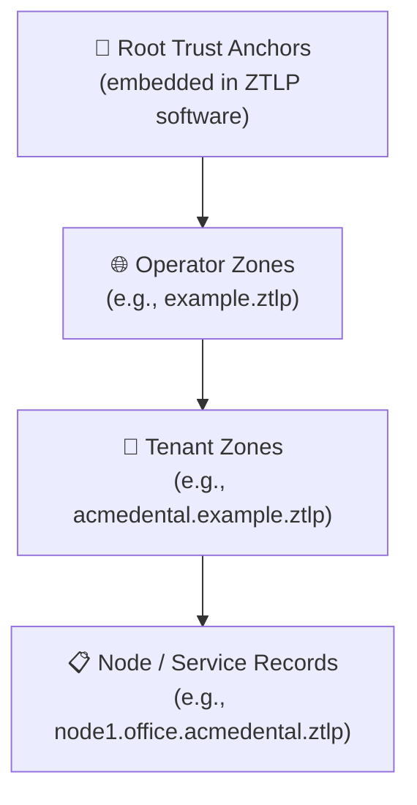

## 9.3 Record Types

| Record Type | Description | Example |
|-------------|-------------|---------|
| `ZTLP_KEY` | Node's public key and Node ID. | node1.office.acmedental.ztlp → NodeID + pubkey |
| `ZTLP_SVC` | Service definition: ServiceID, allowed Node IDs, policy. | rdp.acmedental.ztlp → ServiceID + policy |
| `ZTLP_RELAY` | Relay node: Node ID, IPv6 endpoints, capacity metrics. | relay1.apac.ztlp → NodeID + endpoints |
| `ZTLP_POLICY` | Access policy: which Node IDs can reach which Service IDs. | policy.acmedental.ztlp → ACL |
| `ZTLP_REVOKE` | Revocation notice for a Node ID or Token ID. | revoke.acmedental.ztlp → revoked IDs + timestamp |
| `ZTLP_BOOTSTRAP` | Signed list of relay nodes for initial discovery. | bootstrap.ztlp → signed relay list |
| `ZTLP_OPERATOR` | Relay operator identity and federation membership. Contains operator NodeID, organization name, federation membership proof, and capacity class. | operator.relay-corp.ztlp → OperatorID + org + federation |
| `ZTLP_DEVICE` | Device identity: NodeID, public key, and optional owner binding to a USER. | laptop.office.ztlp → NodeID + pubkey + owner |
| `ZTLP_USER` | Human identity: display name, email, and role (user/tech/admin). | steve@office.ztlp → display\_name + role |
| `ZTLP_GROUP` | Named set of users and/or devices for group-based policy. | techs@office.ztlp → member list |

## 9.4 Federated Trust Roots

ZTLP-NS supports multiple trust roots for different deployment contexts.
Implementations SHOULD include at least the following root categories:

-   Public ZTLP Root - maintained by the ZTLP protocol governance
    body.

-   Enterprise Root - self-hosted by organizations for private
    deployments.

-   Industry Roots - sector-specific (e.g., healthcare, government,
    finance).

A node MAY trust multiple roots simultaneously. Policy records specify
which trust roots are accepted for a given service. No single trust
anchor SHALL be required for ZTLP network participation. Implementations
MUST support multiple simultaneous trust roots and MUST NOT hardcode a
single global root as a prerequisite for joining any ZTLP network.
Bootstrap discovery URLs MUST span at least three independent operators
to prevent any single party from controlling network access. This
requirement exists because ZTLP\'s zero trust philosophy applies equally
to its own governance: the protocol does not trust any single authority,
including the one that published this specification.

## 9.5 ZTLP-NS Wire Protocol

ZTLP-NS uses a custom binary protocol over UDP. The default port is
**23097**. All messages are binary, big-endian. The first byte identifies
the message type.

### 9.5.1 Message Types

| Byte | Direction | Name | Description |
|------|-----------|------|-------------|
| 0x01 | client → server | QUERY | Look up a record by name and type. |
| 0x09 | client → server | REGISTER | Insert or update a signed record. |
| 0x02 | server → client | RESPONSE\_FOUND | Record found (overloaded byte; direction disambiguates). |
| 0x03 | server → client | RESPONSE\_NOT\_FOUND | No record exists for this name/type. |
| 0x04 | server → client | RESPONSE\_REVOKED | Record exists but has been revoked. |
| 0x05 | client → server | QUERY\_BY\_PUBKEY | Look up a KEY record by public key. |
| 0x06 | server → client | REGISTER\_ACK | Registration succeeded. |
| 0x07 | client → server | ENROLL | Device enrollment request (see Section 10). |
| 0x08 | server → client | ENROLL\_RESPONSE | Enrollment result. |
| 0x09 | client → server | RENEW | Certificate renewal request (see Section 16.2.1.2). |
| 0x0A | server → client | RENEW\_RESPONSE | Certificate renewal result. |
| 0x13 | client → server | ADMIN\_QUERY | Administrative query (list records, audit log). See Section 9.7. |
| 0x14 | server → client | ADMIN\_RESPONSE | Administrative query response. See Section 9.7. |
| 0xFF | server → client | INVALID | Malformed or unrecognized query. |

### 9.5.2 QUERY (0x01)

```
  Offset  Size        Field
  ──────  ──────────  ─────────────────────────────────
  0       1           Message type (0x01)
  1       2           Name length (uint16, big-endian)
  3       name_len    Name (UTF-8 encoded FQDN, e.g. "node1.office.acme.ztlp")
  3+N     1           Record type byte
```

**Record Type Bytes:**

| Byte | Record Type |
|------|-------------|
| 1 | ZTLP\_KEY |
| 2 | ZTLP\_SVC |
| 3 | ZTLP\_RELAY |
| 4 | ZTLP\_POLICY |
| 5 | ZTLP\_REVOKE |
| 6 | ZTLP\_BOOTSTRAP |
| 7 | ZTLP\_OPERATOR |
| 0x10 | ZTLP\_DEVICE |
| 0x11 | ZTLP\_USER |
| 0x12 | ZTLP\_GROUP |

### 9.5.3 RESPONSE\_FOUND (0x02)

```
  Offset  Size    Field
  ──────  ──────  ─────────────────────────────────
  0       1       Message type (0x02)
  1       var     Record wire format (canonical serialization
                  including name, type, data, TTL, serial,
                  signature, and signer public key)
```

The record wire format is the canonical binary encoding produced by
`Record.encode()`. Implementations MUST verify the Ed25519 signature
before trusting any record data.

### 9.5.4 RESPONSE\_NOT\_FOUND (0x03)

```
  Offset  Size        Field
  ──────  ──────────  ─────────────────────────────────
  0       1           Message type (0x03)
  1       2           Name length (uint16)
  3       name_len    Name (echoed from query)
  3+N     1           Record type byte (echoed)
```

### 9.5.5 RESPONSE\_REVOKED (0x04)

```
  Offset  Size        Field
  ──────  ──────────  ─────────────────────────────────
  0       1           Message type (0x04)
  1       2           Name length (uint16)
  3       name_len    Name (echoed from query)
```

### 9.5.6 QUERY\_BY\_PUBKEY (0x05)

Performs an O(n) scan for a KEY record matching the given public key.
Intended for reverse lookups (e.g., "which node owns this key?").

```
  Offset  Size        Field
  ──────  ──────────  ─────────────────────────────────
  0       1           Message type (0x05)
  1       2           Public key hex length (uint16)
  3       pk_len      Public key (lowercase hex-encoded Ed25519, 64 chars)
```

Response is 0x02 (found), 0x03 (not found), or 0x04 (revoked).

### 9.5.7 REGISTER (0x09, client → server)

```
  Offset  Size        Field
  ──────  ──────────  ─────────────────────────────────
  0       1           Message type (0x09)
  1       2           Name length (uint16)
  3       name_len    Name
  3+N     1           Record type byte
  4+N     2           Data length (uint16)
  6+N     data_len    Record data (binary-encoded)
  6+N+D   2           Signature length (uint16)
  8+N+D   sig_len     Ed25519 signature
```

The server verifies the signature, signs the record with its own zone
key, and stores it. Response is 0x06 (success) or 0xFF (error).

> **Note:** Message type 0x02 is used exclusively for RESPONSE\_FOUND (server→client). Earlier drafts overloaded 0x02 for REGISTER; implementations MUST use 0x09 for REGISTER requests.

### 9.5.8 ENROLL (0x07)

Device enrollment wire format (see Section 10 for the enrollment flow):

```
  Offset  Size        Field
  ──────  ──────────  ─────────────────────────────────
  0       1           Message type (0x07)
  1       var         Enrollment payload (token + device identity)
```

Response codes in 0x08 (ENROLL\_RESPONSE):

| Code | Meaning |
|------|---------|
| 0x00 | Success — device enrolled. |
| 0x01 | Token expired. |
| 0x02 | Token usage limit exhausted. |
| 0x03 | Invalid MAC (bad token). |
| 0x04 | Zone mismatch. |
| 0x05 | Name already taken. |
| 0x06 | Invalid enrollment request. |

### 9.5.9 Record Wire Encoding (Canonical Serialization)

ZTLP-NS records are serialized to a deterministic binary format for
both signing and wire transmission. This canonical form ensures that
the same record always produces identical bytes, which is essential for
signature verification across different implementations and platforms.

**Canonical form (signed content):**

```
  Offset  Size        Field
  ──────  ──────────  ─────────────────────────────────
  0       1           Record type byte (1=KEY, 2=SVC, ..., 6=BOOTSTRAP, 0x10=DEVICE, 0x11=USER, 0x12=GROUP)
  1       2           Name length (uint16, big-endian)
  3       name_len    Name (UTF-8 FQDN)
  3+N     4           Data length (uint32, big-endian)
  7+N     data_len    Record data (deterministic binary encoding, see below)
  7+N+D   8           Created-at (uint64, Unix epoch seconds, big-endian)
  15+N+D  4           TTL (uint32, seconds, big-endian; 0 = never expires)
  19+N+D  8           Serial (uint64, big-endian, monotonically increasing)
```

The canonical form is the input to the Ed25519 signing operation. It
does NOT include the signature or signer public key — those are metadata
about the signature, not part of the signed content.

**Wire format (for transmission, includes signature):**

```
  Offset      Size        Field
  ──────────  ──────────  ─────────────────────────────────
  0           var         Canonical form (as above)
  var         2           Signature length (uint16, always 64 for Ed25519)
  var+2       sig_len     Ed25519 signature
  var+2+sig   2           Public key length (uint16, always 32 for Ed25519)
  var+4+sig   pub_len     Signer's Ed25519 public key
```

**Record data encoding:** Record data MUST be encoded using deterministic
sorted-key CBOR (RFC 8949, Section 4.2) as the canonical wire encoding.
Map keys MUST be sorted in bytewise lexicographic order. This ensures
byte-identical output across all implementations regardless of
programming language. The ZTLP reference implementation (Elixir) uses a
CBOR library for canonical encoding; implementations in other languages
MUST produce byte-identical CBOR for the same logical data. Erlang
External Term Format (ETF) is NOT suitable for interoperable use and
MUST NOT be used for wire encoding.

**Record data schemas by type:**

| Type | Required Keys | Example |
|------|---------------|---------|
| KEY | `node_id` (hex), `public_key` (hex), `algorithm` ("Ed25519") | `%{node_id: "ab01...", public_key: "cd02...", algorithm: "Ed25519"}` |
| SVC | `service_id` (hex), `allowed_node_ids` (list of hex), `policy_ref` (string) | `%{service_id: "ef03...", allowed_node_ids: ["ab01...", "ab02..."], policy_ref: "policy.acme.ztlp"}` |
| RELAY | `node_id` (hex), `endpoints` (list of "ip:port"), `capacity` (uint), `region` (string) | `%{node_id: "ab01...", endpoints: ["10.0.1.10:23095"], capacity: 10000, region: "us-west"}` |
| POLICY | `allowed_node_ids` (list of hex), `allowed_services` (list of FQDN), `deny_node_ids` (list of hex) | `%{allowed_node_ids: [...], allowed_services: ["rdp.acme.ztlp"], deny_node_ids: []}` |
| REVOKE | `revoked_ids` (list of hex), `reason` (string), `effective_at` (ISO 8601 string) | `%{revoked_ids: ["ab01..."], reason: "key compromise", effective_at: "2026-03-01T00:00:00Z"}` |
| BOOTSTRAP | `relays` (list of relay objects) | `%{relays: [%{node_id: "...", endpoint: "..."}]}` |
| DEVICE | `node_id` (hex), `public_key` (hex), `owner` (FQDN, optional), `algorithm` ("Ed25519") | `%{node_id: "ab01...", public_key: "cd02...", owner: "steve@office.ztlp", algorithm: "Ed25519"}` |
| USER | `display_name` (text), `email` (text, optional), `role` (text: "user"/"tech"/"admin") | `%{display_name: "Steve", email: "steve@example.com", role: "admin"}` |
| GROUP | `members` (list of FQDN), `description` (text, optional) | `%{members: ["steve@office.ztlp", "laptop.office.ztlp"], description: "Tech team"}` |

Individual ZTLP-NS records MUST NOT exceed 4,096 bytes in total wire format size (including canonical form, signature, and public key). Implementations MUST reject records exceeding this limit to prevent amplification attacks and resource exhaustion. The 4 KB limit accommodates all standard record types with generous headroom.

### 9.5.10 Design Rationale

ZTLP-NS uses a native binary protocol rather than DNS or HTTPS because:

1.  **Minimal attack surface** — no DNS parsing stack, no TLS handshake
    for simple lookups.
2.  **Identity-native** — record types (KEY, SVC, POLICY) map directly
    to ZTLP concepts that have no DNS equivalent.
3.  **Signed records** — every response includes an Ed25519 signature
    chain, providing authentication without relying on transport-layer
    security.
4.  **Low overhead** — a typical query/response round-trip is under 200
    bytes, suitable for constrained devices and high-frequency lookups.

Implementations MAY additionally expose an HTTPS/JSON interface for
management and debugging, but the UDP binary protocol is the normative
query interface.

## 9.6 Identity Model

ZTLP v0.9.0 introduces a structured identity model that extends the
namespace with first-class representations of devices, human users, and
groups. These identity record types occupy the 0x10+ namespace range,
intentionally separated from the core protocol record types (0x01–0x07)
to distinguish identity-layer concerns from network-layer concerns.

### 9.6.1 Identity Record Types

Three new record types are defined for identity management:

| Record Type | Wire Byte | Description |
|-------------|-----------|-------------|
| `ZTLP_DEVICE` | 0x10 | Device identity. Like KEY but with optional owner binding to a USER record. |
| `ZTLP_USER` | 0x11 | Human identity. Not a network node — represents a person with a role. |
| `ZTLP_GROUP` | 0x12 | Named set of users and/or devices. Used for group-based policy. |

### 9.6.2 Device Records (ZTLP\_DEVICE)

A DEVICE record binds a NodeID and public key to a named device identity,
with an optional `owner` field pointing to a USER FQDN. The `owner`
field enables revocation cascade (Section 9.6.7) and group-based policy
resolution.

**Required fields:** `node_id` (hex), `public_key` (hex), `algorithm` ("Ed25519").

**Optional fields:** `owner` (FQDN of a USER record).

A DEVICE record without an `owner` field operates identically to a
legacy KEY record. Implementations MUST accept DEVICE records with or
without the `owner` field.

### 9.6.3 User Records (ZTLP\_USER)

A USER record represents a human identity within a ZTLP zone. Users are
not network nodes — they do not have NodeIDs or participate in the
handshake protocol directly. Instead, users own devices, belong to
groups, and carry roles that influence policy decisions.

**Required fields:** `display_name` (text), `role` (text: "user", "tech", or "admin").

**Optional fields:** `email` (text).

**Role system:** Roles are encoded as integer bytes in the wire format
and as text strings in the CBOR data encoding:

| Role | Wire Byte | Description |
|------|-----------|-------------|
| user | 0x00 | Standard user. Default role for self-registration. |
| tech | 0x01 | Technician. Elevated operational access. |
| admin | 0x02 | Administrator. Full zone management privileges. |

Role assignment during self-registration MUST default to "user" (0x00).
Elevation to "tech" or "admin" roles MUST require authorization from
a zone signing key.

### 9.6.4 Group Records (ZTLP\_GROUP)

A GROUP record defines a named set of members (users and/or devices)
for use in group-based policy evaluation. Groups are flat — nesting
(groups containing other groups) is NOT supported. This constraint
simplifies policy evaluation and prevents circular membership loops.

**Required fields:** `members` (list of FQDN strings).

**Optional fields:** `description` (text).

GROUP records MUST be signed by the zone authority. Self-registration
of GROUP records is NOT permitted — only entities possessing the zone
signing key MAY create or modify groups. Group membership changes
(adding or removing members) constitute a new record version and MUST
increment the serial number.

### 9.6.5 Identity Naming

Identity records use the standard ZTLP-NS FQDN format. The `@`
character is permitted in identity names to support human-readable user
identifiers:

```
  steve@office.ztlp          — USER record
  laptop.office.ztlp         — DEVICE record
  techs@office.ztlp          — GROUP record
  printer.lab.office.ztlp    — DEVICE record (nested zone)
```

Identity names MUST conform to the same validation rules as standard
ZTLP-NS names (Section 9.2), with the additional allowance of `@` in
the leftmost label. The `@` character MUST NOT appear in zone labels
(only in the identity label).

### 9.6.6 Registration Rules

USER and DEVICE records support self-registration via the standard
REGISTER message (0x09, Section 9.5.7). Self-registered USER records
MUST have the role set to "user" (0x00). GROUP records require zone
signing key authorization and MUST NOT be self-registered.

**Rate limiting:** To prevent registration abuse, implementations MUST
enforce a rate limit of one registration per identity name per hour.
Zone authorities (entities possessing the zone signing key) bypass
this rate limit. Implementations SHOULD return RATE\_LIMITED (0x02)
when the limit is exceeded.

### 9.6.7 Revocation Cascade

When a USER record is revoked (via a ZTLP\_REVOKE record targeting the
user's FQDN), all DEVICE records whose `owner` field references that
user MUST be treated as implicitly revoked. Implementations MUST check
the revocation status of a device's owner (if the `owner` field is
present) during policy evaluation and session establishment.

The revocation cascade is one level deep: revoking a user revokes their
devices. Revoking a group does NOT revoke its members — it only removes
the group from policy evaluation.

## 9.7 Admin Wire Protocol (ADMIN\_QUERY, 0x13)

The ADMIN\_QUERY message type (0x13) provides administrative query
capabilities for zone management and audit operations. This message
type is used by CLI tooling (`ztlp admin` commands) and is NOT
intended for general client use.

### 9.7.1 ADMIN\_QUERY Wire Format

```
  Offset  Size    Field
  ──────  ──────  ─────────────────────────────────
  0       1       Message type (0x13)
  1       1       Sub-type
  2       var     Sub-type-specific payload
```

**Sub-types:**

| Sub-type | Name | Description |
|----------|------|-------------|
| 0x01 | LIST\_RECORDS | List records by type, with optional name filter. |
| 0x02 | AUDIT\_SINCE | Retrieve audit log entries since a given timestamp. |
| 0x03 | AUDIT\_PATTERN | Retrieve audit log entries matching a name pattern. |

### 9.7.2 ADMIN\_RESPONSE Wire Format

```
  Offset  Size    Field
  ──────  ──────  ─────────────────────────────────
  0       1       Message type (0x14)
  1       4       Entry count (uint32, big-endian)
  5       var     CBOR-encoded list of result entries
```

### 9.7.3 Audit Log

Implementations MUST maintain a bounded audit log of identity and record
operations. The reference implementation uses an ETS ring buffer with a
maximum capacity of 10,000 entries. When the buffer is full, the oldest
entries are evicted. Each audit entry records the operation type, target
name, timestamp, and the identity of the actor who performed the
operation.

ADMIN\_QUERY requests MUST be authenticated. Only entities with the
"admin" role (0x02) or zone signing key holders MAY issue ADMIN\_QUERY
messages. Unauthorized requests MUST be rejected with POLICY\_DENIED
(0x04).

# 10. Node Initialization and Bootstrap Procedure

A ZTLP node that has no prior session state MUST follow the Node
Initialization Procedure (NIP) to discover its first relay connection.
This procedure is defined normatively.

## 10.1 Bootstrap Sequence

The following steps MUST be attempted in order. A node MUST proceed to
the next step only if the current step fails or returns no usable
result.

**Step 1 - HTTPS Discovery (REQUIRED)**

The node MUST attempt an HTTPS GET request to each URL in the hardcoded
discovery URL list. The response MUST be a signed JSON object
containing:

-   A list of relay node addresses (IPv6 and IPv4).

-   Each relay\'s Node ID and public key.

-   A validity timestamp and TTL.

-   A signature verifiable against the software trust anchor.

The node MUST validate the signature before using any relay address from
the response. The node MUST cache a valid response locally with its
stated TTL, minimum 24 hours.

HTTPS is chosen as the primary mechanism because it survives NAT, CGNAT,
and enterprise firewalls in nearly all deployment environments.

**Step 2 - DNS-SRV Discovery (RECOMMENDED)**

The node SHOULD query for SRV records at the well-known bootstrap
domain:

> \_ztlprelay.\_udp.bootstrap.ztlp

If DNSSEC validation is available, the node MUST validate the response
chain before use. If validation fails, the node MUST treat the response
as untrusted and proceed to Step 3.

**Step 3 - Hardcoded Trust Anchors (FALLBACK)**

If Steps 1 and 2 both fail, the node MUST attempt connection to the
hardcoded relay node list embedded in the software distribution. This
list:

-   MUST contain a minimum of 15 relay nodes.

-   MUST span a minimum of 5 distinct Autonomous Systems (ASNs).

-   MUST span a minimum of 3 geographic regions.

-   MUST include the pre-pinned public key for each relay.

The hardcoded list is a bootstrap-of-last-resort. Nodes that
successfully complete Step 1 SHOULD NOT rely on hardcoded anchors for
subsequent connections.

To update the bootstrap relay list without requiring software updates, implementations SHOULD support a DNS-based bootstrap fallback. Implementations MAY query a well-known DNS TXT record at `_ztlp-bootstrap.<zone>.ztlp` to retrieve a current list of bootstrap relay endpoints. The TXT record contains a comma-separated list of `ip:port` pairs. The DNS response MUST be validated using DNSSEC. If DNSSEC validation fails or DNS is unavailable, implementations MUST fall back to the hardcoded list. The hardcoded list serves as the ultimate fallback and MUST always be present in the implementation.

## 10.2 Post-Bootstrap Peer Exchange

Once a node establishes a session with any relay, it MUST request the
relay\'s routing table via a `PEER_EXCHANGE` message. The relay responds
with a signed list of known relay nodes. The node caches this list and
uses it for all future connections, independent of the bootstrap
anchors.

## 10.3 Discovery URL Resilience

Implementations MUST include discovery URLs hosted by at least 3
independent operators. This prevents a single-point-of-failure in HTTPS
discovery. Discovery URL operators MUST be geographically and
organizationally independent.

## 10.4 Device Enrollment

Device enrollment is the process by which a new device joins an existing
ZTLP network. An administrator generates a pre-authorized **Enrollment
Token** that encodes the target zone, NS address, relay endpoints, and
usage constraints. The device presents this token to the ZTLP-NS server
via the ENROLL wire message (0x07, Section 9.5.8).

### 10.4.1 Enrollment Token Wire Format

Enrollment tokens are variable-length binary structures (typically
120–200 bytes) secured with HMAC-BLAKE2s:

```
  Offset  Size          Field
  ──────  ────────────  ─────────────────────────────────
  0       1             Version (uint8, current: 0x01)
  1       1             Flags (uint8, bit 0: has gateway address)
  2       2             Zone name length (uint16, big-endian)
  4       zone_len      Zone name (UTF-8, e.g. "office.acme.ztlp")
  4+Z     2             NS address length (uint16)
  6+Z     ns_len        NS address (UTF-8, e.g. "10.0.0.5:23097")
  6+Z+N   1             Relay count (uint8)
  7+Z+N   var           Relay addresses (for each: uint16 length + UTF-8 address)
  var     2             Gateway address length (uint16, only if flag bit 0 set)
  var     gw_len        Gateway address (UTF-8, only if flag bit 0 set)
  var     2             Max uses (uint16, 0 = unlimited)
  var     8             Expires at (uint64, Unix epoch seconds, big-endian)
  var     16            Nonce (128 bits, random, prevents replay)
  var     32            MAC (HMAC-BLAKE2s-256 over all preceding bytes)
```

**MAC computation:** The MAC is computed using HMAC (RFC 2104) with
BLAKE2s-256 as the hash function. The key is the 32-byte zone enrollment
secret. The MAC covers all bytes from offset 0 through the end of the
nonce field (everything except the MAC itself).

The total enrollment token size MUST NOT exceed 512 bytes. Implementations MUST reject tokens exceeding this limit during parsing. This prevents parsing-based denial-of-service attacks.

### 10.4.2 Enrollment URI Scheme

Enrollment tokens MAY be encoded as URIs for convenient distribution
(e.g., QR codes, links):

```
ztlp://enroll/<base64url-encoded-token>
```

The token is encoded using base64url (RFC 4648, Section 5) without
padding. Implementations MUST decode the URI, extract the binary token,
and validate it before proceeding with enrollment.

### 10.4.3 Enrollment Flow

1.  Administrator generates a token using the zone enrollment secret
    (via CLI: `ztlp admin enroll --zone office.acme.ztlp`).
2.  Token is delivered to the device operator (QR code, secure message,
    or `ztlp://enroll/` URI).
3.  Device presents the token to the NS server specified in the token
    via a 0x07 ENROLL message.
4.  NS server validates the MAC, checks expiry and usage count, verifies
    the zone matches, and generates a Node ID + ZTLP\_KEY record.
5.  NS server responds with 0x08 containing the assigned Node ID and
    initial configuration, or an error code (Section 9.5.8).
6.  Device stores its Node ID, keys, and NS/relay addresses, then
    proceeds to the bootstrap sequence (Section 10.1).

### 10.4.4 Token Security Properties

-   **Pre-authorized:** Tokens are generated offline using the zone
    secret. No online ceremony is required.
-   **Usage-limited:** Each token tracks a usage counter. The NS server
    rejects tokens that have exceeded their `max_uses` limit.
-   **Time-limited:** Tokens have an absolute expiry timestamp.
-   **Zone-bound:** The MAC binds the token to a specific zone. A token
    for `office.acme.ztlp` cannot enroll a device into `prod.acme.ztlp`.
-   **Replay-resistant:** The 128-bit random nonce prevents replay.
    The NS server SHOULD additionally track consumed nonces for tokens
    with `max_uses > 1`.

# 11. Handshake and Session Establishment

## 11.1 Handshake Overview

ZTLP uses a Noise Protocol Framework pattern (`Noise_XX`) for session
establishment. This provides:

-   Mutual authentication - both parties prove identity.

-   Perfect forward secrecy - compromise of long-term keys does not
    expose past sessions.

-   Identity hiding - identities are encrypted after the first
    message.

### 11.1.1 Noise Protocol Parameters

The normative Noise protocol name string is:

```
Noise_XX_25519_ChaChaPoly_BLAKE2s
```

This specifies:

| Component | Choice | Rationale |
|-----------|--------|-----------|
| Pattern | XX | Mutual authentication with identity hiding. Both parties transmit static keys encrypted. |
| DH | 25519 | Curve25519 (X25519). Widely implemented, constant-time, 128-bit security level. |
| Cipher | ChaChaPoly | ChaCha20-Poly1305. Software-friendly AEAD, constant-time on all platforms (no AES-NI dependency). |
| Hash | BLAKE2s | 256-bit output, faster than SHA-256 in software, used for both handshake hashing and key derivation. |

**Prologue:** The Noise prologue is empty (zero-length byte string) in
protocol version 1. Implementations MUST call `MixHash(prologue)` per
Noise Framework Section 5.3, but with an empty prologue this is
equivalent to `MixHash("")`. Future protocol versions MAY define a
non-empty prologue (e.g., incorporating the ZTLP Magic bytes and version
number) to provide cross-protocol binding.

**Nonce format:** The ChaCha20-Poly1305 nonce is 12 bytes: 4 zero bytes
followed by an 8-byte little-endian counter, as specified by the Noise
Framework.

**Key derivation for directional transport keys:** After the three-message
Noise\_XX handshake completes, the resulting `CipherState` pair provides
two symmetric keys (one per direction). Implementations MUST additionally
derive per-direction session keys using BLAKE2s-256:

```
initiator_to_responder_key = BLAKE2s(handshake_hash || "ztlp-i2r")
responder_to_initiator_key = BLAKE2s(handshake_hash || "ztlp-r2i")
```

where `handshake_hash` is the `h` value from the completed Noise
handshake state.

This key derivation uses BLAKE2s-256 in **unkeyed mode** with a 32-byte output. The construction `BLAKE2s(handshake_hash || label)` is equivalent to computing `BLAKE2s-256` over the concatenation of the 32-byte handshake hash and the ASCII label string. This provides domain separation between the two directional keys. The construction is deliberately simple and avoids HKDF dependency, following the Noise Framework's preference for BLAKE2-based key derivation.

**AEAD nonce construction for data packets:** After the handshake
completes, data-plane packets are encrypted using ChaCha20-Poly1305 with
the directional session keys derived above. The 12-byte AEAD nonce for
each packet is constructed as follows:

```
  Bytes 0–3:   0x00 0x00 0x00 0x00  (four zero bytes)
  Bytes 4–11:  PacketSeq (64-bit little-endian)
```

This matches the Noise Framework nonce format used during the handshake.
The PacketSeq field from the ZTLP header provides the counter. Each
direction maintains an independent sequence counter starting at zero.
Implementations MUST NOT reuse a nonce with the same key — if the
PacketSeq approaches 2^64, the session MUST be rekeyed or terminated.

**AEAD additional data (AAD):** The HeaderAuthTag in the base header
authenticates the header fields. For data-plane AEAD encryption, the
additional authenticated data (AAD) is the complete ZTLP header
(excluding the HeaderAuthTag field itself and any extension TLVs). This
binds the ciphertext to the header fields, preventing header
manipulation without detection.

## 11.2 Message Flow

*See Figure 2 for the full session establishment sequence diagram.*

**Figure 2. ZTLP Session Establishment Flow**

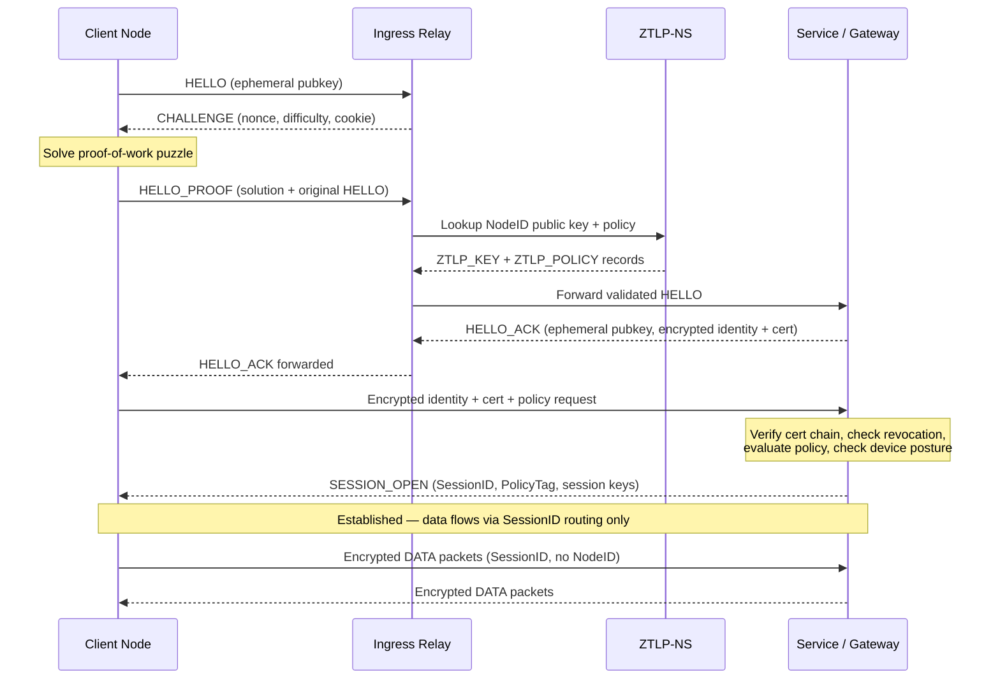

*Session establishment occurs entirely through the Admission Plane. Once SESSION\_OPEN is issued, all data packets are routed by SessionID through the Forwarding Plane without repeating identity verification.*

## 11.3 Policy Enforcement

The Responder MUST perform the following checks before issuing
`SESSION_OPEN`:

1.  Verify the Initiator\'s certificate chain against a trusted ZTLP-NS
    root.

2.  Verify the certificate has not been revoked (`ZTLP_REVOKE` record
    check).

3.  Evaluate policy: is SrcNodeID authorized to reach DstSvcID?

4.  Check device posture if `DEVICE_POSTURE` extension is present and
    required by policy.

5.  Reject with ERROR if any check fails. No state is allocated on
    failure.

### 11.3.1 Group-Based Policy Evaluation

When identity records (Section 9.6) are available, policy evaluation
MUST follow this resolution order:

1.  **Device NodeID check** — Match the Initiator's NodeID against
    explicit `allowed_node_ids` in the ZTLP\_POLICY record.

2.  **Owner resolution** — If the Initiator's DEVICE record contains an
    `owner` field, resolve the referenced USER record. If the owner USER
    is revoked, REJECT with REVOKED (0x05). This implements revocation
    cascade (Section 9.6.7).

3.  **Group membership check** — Resolve all GROUP records that include
    the Initiator's device FQDN or the owner's user FQDN in their
    `members` list.

4.  **Policy rule matching** — Match resolved identities against policy
    rules. Policy rules support the following patterns:

    | Pattern | Example | Semantics |
    |---------|---------|-----------|
    | `group:<fqdn>` | `group:techs@office.ztlp` | Allow members of the specified group. |
    | `role:<role>` | `role:admin` | Allow any user with the specified role. |
    | Exact FQDN | `admin.office.ztlp` | Allow a specific identity (existing behavior). |
    | Wildcard | `*.office.ztlp` | Allow any identity in the zone (existing behavior). |
    | `:all` | — | Allow any authenticated identity (existing behavior). |

5.  If no policy rule matches, REJECT with POLICY\_DENIED (0x04).

Implementations SHOULD cache group membership lookups for the duration
of a session to avoid repeated NS queries during rekeying. Group
membership changes take effect on the next session establishment, not
during an active session.

## 11.4 Key Rotation

Session keys MUST be rotated at intervals defined by the CryptoSuite
policy, or upon explicit REKEY message. A new SessionID is issued on
each rotation. Applications MUST NOT experience connection interruption
during key rotation.

# 12. Relay Node Architecture

## 12.1 Role of Relay Nodes

ZTLP Relay nodes form the backbone of the overlay network. They perform
three functions:

-   Forward authenticated ZTLP traffic between nodes that cannot
    communicate directly.

-   Participate in peer exchange, distributing routing table
    information.

-   Publish capacity metrics (latency, packet loss, bandwidth) to the
    ZTLP-NS.

## 12.2 Relay Selection Criteria

Nodes MUST select relays using a path score computed from:

```
PathScore = w1*Latency + w2*PacketLoss + w3*Congestion + w4*TrustScore
```

Lower PathScore is preferred. Weights (w1--w4) are configurable per
deployment. Nodes MUST maintain at least 2 active relay paths
simultaneously for failover.

PathScore-based selection alone is insufficient at large scale. If every
client independently selects the relay with the globally lowest score,
popular relays attract disproportionate load, causing hotspots and score
oscillation as congestion changes. To prevent this, ZTLP relay selection
SHOULD use a two-step model combining consistent hashing with PathScore
optimization:

-   **Step 1 - Candidate set via consistent hash:** Map the
    destination ServiceID to the nearest N relay nodes on a consistent
    hash ring of relay NodeIDs. CandidateSet = Hash(ServiceID) → nearest
    3 relays. This provides stable, load-distributed assignment. Most
    sessions remain on the same relays even as the mesh grows or
    individual nodes leave and rejoin.

-   **Step 2 - Optimize within the candidate set:** Select the relay
    with the lowest PathScore from the candidate set. This provides
    latency and performance optimization within the bounded set without
    creating global convergence on a single best relay.

Consistent hashing is the same mechanism used in large-scale distributed
systems including Cassandra, DynamoDB, and CDN routing. Applied to ZTLP,
it ensures that traffic to popular services is automatically distributed
across multiple relays, relay churn causes minimal session migration
(only sessions assigned to the departed relay are affected), and the
relay mesh scales to thousands of nodes without central coordination.
The consistent hash ring is derived from ZTLP-NS relay records and
updated as relays join and leave the mesh.

## 12.3 Relay Operator Requirements

Relay nodes MUST:

-   Maintain a valid ZTLP_RELAY record in at least one ZTLP-NS zone.

-   Publish latency and capacity metrics no less than once per 60
    seconds.

-   Support all four transport modes defined in Section 14 (Transport Fallback and NAT Traversal).

-   Honor CLOSE messages and release session state within 30 seconds.

-   Not log plaintext payload content (relays see only encrypted data).

## 12.4 Ingress Admission Domains and Relay Admission Tokens

Large-scale relay networks face a structural risk: if all relay nodes
accept first-contact session establishment attempts from any initiator,
the entire relay mesh becomes a global handshake surface. Under high
load or during coordinated attacks, this can cause excessive handshake
processing, uneven relay utilization, and relay state concentration on a
small subset of nodes.

ZTLP mitigates this risk by separating relay roles and limiting where
first-contact admission occurs. ZTLP relay deployments SHOULD organize
relays into Ingress Admission Domains, within which a subset of relays
handle initial session establishment and Stateless Admission Challenge
(Section 18.3). Other relays in the network primarily forward
authenticated traffic and SHOULD NOT accept unauthenticated
first-contact handshakes except from trusted ingress relays.

### 12.4.1 Relay Role Separation

Relay nodes MAY operate in one or more of the following roles:

-   **Ingress Relay -** Handles first-contact traffic from initiating
    nodes. Responsible for processing HELLO messages, performing
    Stateless Admission Challenge when required, verifying identity and
    policy, and issuing Relay Admission Tokens upon successful
    authentication. Ingress relays act as the initial admission gate to
    the ZTLP overlay.

-   **Transit Relay -** Forwards authenticated ZTLP sessions between
    ingress and service relays. Transit relays SHOULD only accept
    traffic associated with already-authenticated sessions or carrying
    valid Relay Admission Tokens. Transit relays SHOULD NOT process new
    HELLO messages from arbitrary initiators unless explicitly
    configured as ingress nodes.

-   **Service Relay -** Located near destination services or gateway
    clusters. Handles final-hop forwarding, service-specific policy
    enforcement, and session monitoring. Service relays SHOULD
    prioritize authenticated traffic and SHOULD reject first-contact
    HELLO messages that do not originate from a trusted ingress relay.

### 12.4.2 Deterministic Ingress Assignment

To prevent load concentration and relay hotspots, initiators SHOULD be
deterministically mapped to a small set of ingress relays using
consistent hashing over relay NodeIDs:

> IngressSet = Hash(NodeID \|\| bootstrap_salt) → nearest N relays on
> ring N = ingress redundancy factor (RECOMMENDED: 3)

The bootstrap_salt is a periodically rotated value published by ZTLP-NS,
preventing long-term fingerprinting of ingress assignments. The
initiator attempts connections to relays in its assigned ingress set,
selecting the relay with the lowest PathScore (Section 12.2). This
distributes admission load evenly across the relay mesh while providing
stable relay assignment and preventing popular services from
concentrating handshake pressure on a small subset of relays.

### 12.4.3 Relay Admission Tokens

After successful session establishment, the ingress relay SHOULD issue a
Relay Admission Token (RAT) to the initiating node. The token serves as
proof that the node has recently passed authentication and admission
checks, allowing it to contact transit and service relays without
repeating the full handshake process.

A Relay Admission Token MUST contain at minimum: NodeID of the
authenticated node, issuing relay NodeID, issuance timestamp, expiration
timestamp, and a cryptographic signature or MAC. Tokens SHOULD have
short lifetimes (RECOMMENDED: 5--30 minutes). Transit and service relays
MAY accept new session establishment attempts accompanied by a valid
Relay Admission Token issued by a trusted ingress relay.

**RAT Binary Encoding:**

```
  Offset  Size        Field
  ──────  ──────────  ─────────────────────────────────
  0       16          Issuing Relay NodeID (128 bits)
  16      16          Authorized NodeID (128 bits, or all-zeros for bearer tokens)
  32      8           Issued-at (uint64, epoch-ms, big-endian)
  40      8           Expires-at (uint64, epoch-ms, big-endian)
  48      4           Scope flags (uint32, bitfield: bit 31 = allow-transit,
                      bit 30 = allow-egress, bits 29–0 reserved)
  52      2           Max sessions (uint16, 0 = unlimited)
  54      2           Reserved (must be zero)
  56      32          HMAC-BLAKE2s MAC (keyed with issuing relay's RAT secret)
```

Total RAT size: 88 bytes. The MAC covers bytes 0–55. Relays MUST
verify the MAC before accepting any RAT. Expired tokens (current time >
expires-at) MUST be rejected.

### 12.4.4 Token Verification

Relay Admission Tokens MUST be verifiable without requiring global
per-client state. Verification MAY use relay-issued MAC cookies, signed
tokens using relay public keys published in ZTLP-NS, or short-lived
relay federation keys shared among trusted relay operators. Relays MUST
reject expired or invalid tokens. Token verification MUST be cheaper
than full `Noise_XX` handshake processing - the purpose of the token is
to avoid repeating expensive admission work on relays that have not yet
seen the client.

### 12.4.5 Attack Containment

Ingress Admission Domains limit the blast radius of admission floods.
Under attack conditions: ingress relays apply rate limits and Stateless
Admission Challenge; transit relays continue forwarding authenticated
traffic unimpeded; service relays remain insulated from handshake
floods. Because ingress assignment is deterministic and distributed
across multiple relays, attack pressure is partitioned across the mesh
rather than concentrated on a single relay or geographic region. This
design ensures that large-scale handshake floods cannot easily degrade
the entire relay infrastructure - only the ingress domain under attack
is affected, and the consistent hash assignment naturally distributes
that pressure across multiple relays.

## 12.5 Authenticated Relay Federation and Capacity Classes

ZTLP is designed to operate over the public Internet without requiring
modifications to existing routing infrastructure. However, relay
operators MAY optionally form authenticated relay federations to enable
enhanced transport guarantees, operational stability, and differentiated
traffic handling between participating networks. In such deployments,
relay-to-relay communication constitutes a verifiable,
admission-controlled traffic class distinct from unauthenticated public
Internet traffic. This allows participating operators to provide
improved service characteristics without requiring changes to the global
Internet routing model.

### 12.5.1 Relay Operator Identity

Relay nodes MAY be operated by organizations that participate in a relay
federation. Each participating relay operator MUST possess an Operator
Identity, represented by a cryptographic key pair and associated
identity record published in ZTLP-NS as a `ZTLP_OPERATOR` record. This
record contains: OperatorID (unique identifier for the relay operator),
PublicKey (operator verification key), OrganizationName (human-readable
operator name), Contact (administrative contact), FederationClass
(optional classification of participation level), and a Signature by the
operator authority. Relay nodes operated by the organization reference
this OperatorID in their relay advertisement records.

### 12.5.2 Relay Federation Membership

Relay operators MAY establish trust relationships with other operators
to form a relay federation. Federation membership indicates that
participating operators agree to: operate admission-controlled relays,
enforce ZTLP protocol compliance, enforce relay authentication policies,
prevent unauthorized traffic injection, and participate in relay
discovery and metrics sharing. Membership MAY be bilateral or
multilateral. Federation policies are outside the scope of this protocol
but may include contractual or policy agreements between operators.

### 12.5.3 Authenticated Relay Traffic

Traffic exchanged between relays within a federation is considered
authenticated relay traffic. Such traffic has the following properties:
the sending relay has a verified OperatorID; the session originates from
a previously authenticated endpoint or relay; Relay Admission Tokens
(Section 12.4.3) have been validated where required; and packets conform
to the ZTLP header authentication pipeline. Because this traffic
originates from authenticated relay infrastructure rather than arbitrary
endpoints, participating networks may treat it as a trusted overlay
traffic class.

### 12.5.4 Capacity Classes

Relay federations MAY define capacity classes describing the level of
transport guarantees available between participating operators. C0 (Best
Effort): ZTLP traffic carried over public Internet with no special
treatment. C1 (Authenticated Relay Class): relay-to-relay traffic
authenticated by federation membership. C2 (Soft Reserved Capacity):
operators reserve a portion of link capacity for relay traffic during
congestion. C3 (Hard Reserved Capacity): dedicated bandwidth allocation
between relay domains. Operators MAY implement these guarantees using
existing mechanisms such as traffic engineering policies, MPLS or
segment routing, private interconnects, QoS queue allocation, or carrier
interconnect agreements.

### 12.5.5 Operational Benefits

Authenticated relay federation provides several benefits for
participating networks. Improved abuse isolation: relay traffic
originates from authenticated infrastructure rather than arbitrary
endpoints, reducing the attack surface for spoofed or reflection-based
attacks. Predictable traffic engineering: because relay infrastructure
publishes relay metrics and operator identities, traffic flows can be
engineered more predictably than arbitrary endpoint traffic. Reduced
mitigation costs: during DDoS events, operators may prioritize
authenticated relay traffic while applying stricter filtering to
unauthenticated traffic. Premium transport services: relay federation
enables operators to offer enhanced transport characteristics for ZTLP
sessions without modifying the underlying Internet architecture. This
gives ISPs and backbone operators a concrete business case for ZTLP
participation: authenticated relay traffic is cheaper to handle, less
likely to carry abuse, and can support premium service agreements.

### 12.5.6 Incremental Deployment

Relay federation is optional and does not affect baseline ZTLP
functionality. ZTLP nodes and relays MUST continue to operate correctly
over standard Internet routing infrastructure even when federation
mechanisms are unavailable. This design allows ZTLP to deploy
incrementally while enabling enhanced capabilities for operators who
choose to participate in relay federation agreements.

## 12.6 Geographic Relay Hierarchy

To support global-scale deployments, ZTLP relay infrastructure SHOULD be
organized using a three-tier geographic hierarchy modeled after the
Internet\'s own routing structure. This hierarchy prevents relay
hotspots, ensures predictable latency, and distributes load across the
network organically as usage grows.

### 12.6.1 Tier Definitions

**Edge Relays**

Edge Relays are deployed closest to end users, typically in ISP
datacenters, cloud edge points of presence, and enterprise network
perimeters. Their primary responsibilities are: authenticating
initiating nodes, processing first-contact HELLO messages and Stateless
Admission Challenges, issuing Relay Admission Tokens upon successful
authentication, and providing low-latency entry points into the ZTLP
overlay. Edge Relays SHOULD be geographically distributed to minimize
user-to-relay round-trip time.

**Regional Relays**

Regional Relays aggregate traffic from Edge Relays within a geographic
region (for example: US-West, US-East, Europe-West, Asia-Pacific). Their
primary responsibilities are: routing sessions between Edge Relays
across a region, performing intra-region path optimization based on
PathScore metrics, and distributing relay load within the region.
Regional Relays SHOULD be operated with higher capacity and reliability
guarantees than Edge Relays.

**Backbone Relays**

Backbone Relays form the high-capacity core of the ZTLP overlay network,
analogous to Tier 1 Internet backbone providers. Their primary
responsibilities are: providing long-distance cross-region transit
between Regional Relays, handling high-bandwidth inter-continental
paths, and maintaining the relay mesh\'s global connectivity. Backbone
Relays SHOULD be interconnected at major Internet exchange points to
minimize additional latency introduced by the ZTLP overlay.

### 12.6.2 Example Global Path

A client in Shanghai connecting to a service in Los Angeles would
traverse the hierarchy as follows:

-   Client (Shanghai) connects to Shanghai Edge Relay

-   Shanghai Edge Relay forwards to Asia-Pacific Regional Relay

-   Asia-Pacific Regional Relay forwards to Singapore Backbone Relay

-   Singapore Backbone Relay forwards to US-West Backbone Relay

-   US-West Backbone Relay forwards to California Regional Relay

-   California Regional Relay forwards to Los Angeles Edge Relay

-   Los Angeles Edge Relay delivers to Service Gateway

Each tier is selected using PathScore optimization within the
consistent-hash candidate set defined in Section 12.2. The result is a
predictable, latency-aware path without requiring centralized path
computation.

### 12.6.3 Deployment Flexibility

The three-tier model is a recommended architectural pattern, not a hard
protocol requirement. Small private deployments MAY operate with only
Edge Relays. Operators adding capacity organically migrate toward the
full hierarchy. The relay discovery and PathScore mechanisms in Sections
12.2 and 15 operate correctly at any tier depth. Operators SHOULD
publish their relay tier in the ZTLP_RELAY namespace record to assist
clients in making optimal selection decisions.

## 12.7 Inter-Relay Mesh Wire Protocol

Relay nodes in a mesh communicate over a dedicated UDP port (default:
**23096**, separate from the client-facing port 23095). All inter-relay
messages share a common header prefix:

```
  Offset  Size    Field
  ──────  ──────  ─────────────────────────────────
  0       1       Message type (uint8)
  1       16      Sender NodeID (128 bits)
  17      8       Timestamp (uint64, epoch-ms, big-endian)
  25      64      Ed25519 Signature (over bytes 0–24 + type-specific payload)
  89      var     Type-specific payload
```

All inter-relay messages MUST be signed by the sender's Ed25519 identity
key. The signature covers bytes 0 through 24 (message type, NodeID, and
timestamp) concatenated with the type-specific payload. Receiving relays
MUST verify the signature against the sender's known public key (resolved
via ZTLP-NS or local peer table) and MUST silently discard messages with
invalid signatures. This prevents topology poisoning attacks from
unauthorized parties.

### 12.7.1 Mesh Message Types

| Byte | Name | Description |
|------|------|-------------|
| 0x01 | RELAY\_HELLO | Introduce self to a new peer. |
| 0x02 | RELAY\_HELLO\_ACK | Acknowledge a peer introduction. |
| 0x03 | RELAY\_PING | Health probe with sequence number. |
| 0x04 | RELAY\_PONG | Health response with metrics. |
| 0x05 | RELAY\_FORWARD | Forward a wrapped ZTLP client packet through the mesh. |
| 0x06 | RELAY\_SESSION\_SYNC | Synchronize session state to a peer. |
| 0x07 | RELAY\_LEAVE | Graceful departure from the mesh. |
| 0x08 | RELAY\_DRAIN | Signal that this relay is draining (no new sessions). |
| 0x09 | RELAY\_DRAIN\_CANCEL | Cancel a previous drain signal. |
| 0x0A | RELAY\_PEER\_EXCHANGE | Gossip topology update with relay metrics. |

### 12.7.2 RELAY\_HELLO / RELAY\_HELLO\_ACK (0x01, 0x02)

```
  Offset   Size    Field
  ───────  ──────  ─────────────────────────────────
  89       1       Address type (0x04 = IPv4, 0x06 = IPv6)
  90       4/16    IP address (4 bytes for IPv4, 16 bytes for IPv6)
  94/106   2       Port (uint16)
  96/108   1       Role byte (see below)
  97/109   4       Capabilities (uint32, bitfield)
```

**Role bytes:** 0x00 = all, 0x01 = ingress, 0x02 = transit, 0x03 = egress.

### 12.7.3 RELAY\_PING (0x03)

```
  Offset  Size    Field
  ──────  ──────  ─────────────────────────────────
  89      4       Sequence number (uint32)
```

### 12.7.4 RELAY\_PONG (0x04)

```
  Offset  Size    Field
  ──────  ──────  ─────────────────────────────────
  89      4       Active sessions (uint32)
  93      4       Max sessions (uint32)
  97      4       Uptime seconds (uint32)
  101     4       Echo sequence number (uint32, from PING)
```

### 12.7.5 RELAY\_FORWARD (0x05)

Multi-hop forwarding with TTL and loop detection:

```
  Offset  Size            Field
  ──────  ──────────────  ─────────────────────────────────
  89      1               TTL (uint8, decremented at each hop, max 4)
  90      1               Path length (uint8, number of NodeIDs traversed)
  91      path_len × 16   Path (list of 128-bit NodeIDs already traversed)
  91+P    4               Inner packet length (uint32)
  95+P    inner_len       Inner ZTLP packet (unmodified client packet)
```

A relay MUST drop a FORWARD if: TTL reaches 0, its own NodeID appears
in the path (loop), or the inner packet fails Magic validation.

### 12.7.6 RELAY\_SESSION\_SYNC (0x06)

```
  Offset       Size    Field
  ───────────  ──────  ─────────────────────────────────
  89           12      SessionID (96 bits)
  101          1       Peer A address type (0x04 = IPv4, 0x06 = IPv6)
  102          4/16    Peer A IP address (4 bytes for IPv4, 16 bytes for IPv6)
  106/118      2       Peer A port (uint16)
  108/120      1       Peer B address type (0x04 = IPv4, 0x06 = IPv6)
  109/121      4/16    Peer B IP address (4 bytes for IPv4, 16 bytes for IPv6)
  113/137      2       Peer B port (uint16)
```

### 12.7.7 RELAY\_LEAVE (0x07)

No additional payload beyond the common header. Receipt of LEAVE causes
the peer to remove the sender from its routing table and hash ring.

### 12.7.8 RELAY\_DRAIN / RELAY\_DRAIN\_CANCEL (0x08, 0x09)

**DRAIN:**

```
  Offset  Size    Field
  ──────  ──────  ─────────────────────────────────
  89      4       Drain timeout (uint32, milliseconds until full shutdown)
```

**DRAIN\_CANCEL:** No additional payload beyond the common header.

A relay receiving DRAIN MUST stop routing new sessions to the draining
peer but MUST continue forwarding packets for existing sessions until
the timeout expires or a LEAVE is received.

### 12.7.9 RELAY\_PEER\_EXCHANGE (0x0A)

Carries relay topology gossip updates (see Section 15.1.2). Each message
contains the sender's current metric measurements for dissemination:

```
  Offset  Size        Field
  ──────  ──────────  ─────────────────────────────────
  89      4           Peer count (uint32)
  93      var         Peer entries (repeated, see below)
```

Each peer entry:

```
  Offset  Size        Field
  ──────  ──────────  ─────────────────────────────────
  0       16          Peer NodeID (128 bits)
  16      4           Latency (uint32, microseconds)
  20      2           Packet loss (uint16, basis points, 0–10000 = 0%–100%)
  22      1           Congestion level (uint8, 0=none, 255=severe)
  23      4           Available bandwidth (uint32, Kbps)
```

Relays MUST discard RELAY\_PEER\_EXCHANGE messages with invalid signatures
(per the common header authentication requirement in Section 12.7).
Relays SHOULD send topology updates at least once per 30 seconds and
no more than once per 5 seconds under stable conditions.

# 13. Hardware Enforcement Profiles

The ZTLP base specification assumes packet enforcement occurs at
ZTLP-aware endpoint software. This is sufficient for most deployments
but leaves a gap at Layer 1 and Layer 2: volumetric attack traffic still
reaches the ZTLP edge node and saturates the physical uplink before the
HeaderAuthTag check can discard it.

This section defines four Hardware Enforcement Profiles that push ZTLP
enforcement progressively closer to the wire. Each profile is
independently implementable. Profiles are additive - a deployment MAY
implement multiple profiles simultaneously. All profiles feed
enforcement decisions from the ZTLP control plane; no profile requires
the switch or NIC to independently validate full cryptographic identity.

## 13.1 Profile 1 - Software Enforcement (eBPF/XDP)

The software profile is the baseline enforcement model and is
implementable today on any Linux host using eBPF and XDP (eXpress Data
Path). XDP programs attach directly to the NIC driver and execute before
the Linux kernel network stack, allowing packet decisions at near
line-rate in software.

### 13.1.1 Enforcement Logic

An XDP program on a ZTLP node MUST implement the following decision
pipeline for every inbound UDP packet on the ZTLP port:

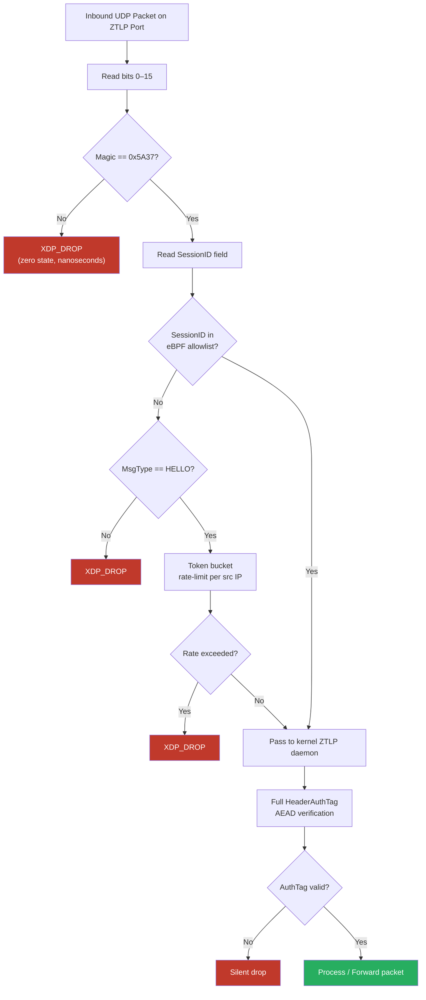
*XDP/eBPF enforcement pipeline for Profile 1 (Software Enforcement). Steps 1–3 execute entirely in the kernel fast path with no cryptographic cost.*

The SessionID allowlist is a BPF hash map maintained by the ZTLP daemon.
When a session is established, the daemon writes the SessionID to the
map. When a session closes or expires, it is removed. The XDP program
reads this map without kernel involvement - lookup time is O(1) at
nanosecond scale.

### 13.1.2 BPF Map Definitions

The XDP program relies on five BPF maps shared between the kernel-space
XDP program and the user-space ZTLP daemon. All maps MUST conform to
the following definitions to ensure interoperability between different
daemon implementations and a standardized XDP program.

**Map 1: `session_map`** — SessionID allowlist.

```c
struct session_id {
    __u8 id[12];       /* 96-bit SessionID */
};

struct {
    __uint(type, BPF_MAP_TYPE_HASH);
    __type(key,   struct session_id);   /* 12 bytes */
    __type(value, __u8);                /* 1 byte (always 1; presence is the check) */
    __uint(max_entries, 65536);         /* tune per deployment */
} session_map SEC("maps");
```

The daemon inserts an entry when a session is established and deletes
it on session close or expiry. The XDP program performs a lookup — if
the key is present, the packet passes Layer 2.

When `session_map` reaches capacity, the ZTLP daemon MUST reject new session establishment with ERROR code `0x0D` (RELAY_BUSY) until entries are freed. Implementations MUST NOT silently evict existing sessions to make room for new ones — this would cause active sessions to fail Layer 2 validation. Operators SHOULD monitor map utilization and scale `max_entries` based on expected concurrent session counts.

**Map 2: `hello_rate_map`** — Per-source-IP HELLO rate limiter.

```c
struct hello_bucket {
    __u64 tokens;           /* current token count (0 = drop) */
    __u64 last_refill_ns;   /* ktime_ns of last refill */
};

struct {
    __uint(type, BPF_MAP_TYPE_HASH);
    __type(key,   __be32);              /* IPv4 source address */
    __type(value, struct hello_bucket); /* 16 bytes */
    __uint(max_entries, 131072);
} hello_rate_map SEC("maps");
```

Token bucket parameters (tokens per refill, refill interval) are
compile-time constants in the XDP program. Recommended defaults: 10
tokens per second, burst capacity of 20.

**Map 3: `stats_map`** — Per-CPU drop/pass counters.

```c
struct {
    __uint(type, BPF_MAP_TYPE_PERCPU_ARRAY);
    __type(key,   __u32);   /* stat index */
    __type(value, __u64);   /* counter */
    __uint(max_entries, 16);
} stats_map SEC("maps");
```

Stat indices: 0 = total packets, 1 = magic drops, 2 = session drops,
3 = rate limit drops, 4 = HELLO passed, 5 = data passed, 6 = mesh
port packets, 7 = mesh passed, 8 = mesh peer drops.

**Map 4: `mesh_peer_map`** — Authorized relay NodeID allowlist (mesh port only).

```c
struct mesh_peer_id {
    __u8 id[16];       /* 128-bit NodeID */
};

struct {
    __uint(type, BPF_MAP_TYPE_HASH);
    __type(key,   struct mesh_peer_id); /* 16 bytes */
    __type(value, __u8);                /* 1 byte (presence check) */
    __uint(max_entries, 1024);
} mesh_peer_map SEC("maps");
```

Used on the mesh port (default 23096) to restrict inter-relay traffic
to known peers. Managed by the relay daemon.

**Map 5: `rat_bypass_map`** — Relay Admission Token bypass flag.

```c
struct {
    __uint(type, BPF_MAP_TYPE_ARRAY);
    __type(key,   __u32);   /* index (only 0 used) */
    __type(value, __u8);    /* 0 = normal, 1 = bypass rate-limit for RAT HELLOs */
    __uint(max_entries, 1);
} rat_bypass_map SEC("maps");
```

When set to 1, HELLO packets that contain a valid Relay Admission Token
prefix bypass the per-IP rate limiter. The XDP program checks a fixed
byte offset in the packet for the RAT magic marker.

### 13.1.3 What This Achieves

-   Random UDP noise and Magic mismatches are dropped at the NIC driver
    before consuming any kernel CPU.

-   Unknown SessionIDs (spoofed or replayed packets) are dropped before
    reaching the ZTLP daemon.

-   HELLO flood attacks (handshake exhaustion) are rate-limited per
    source IP before any cryptographic work is performed.

-   Sustained attack traffic of tens of millions of packets per second
    can be absorbed on a single modern host without service degradation.

### 13.1.4 Deployment Requirements

-   Linux kernel 5.4 or later (XDP support required).

-   NIC with XDP native driver support (Intel i40e, Mellanox mlx5, or
    equivalent).

-   ZTLP daemon responsible for maintaining the SessionID BPF map in
    real time.

## 13.2 Profile 2 - SmartNIC Offload (DPU)

Data Processing Units (DPUs) - also called SmartNICs - are network
interface cards with dedicated ARM or RISC-V processors capable of
running arbitrary packet processing logic independently of the host CPU.
Representative hardware includes the Nvidia BlueField-3 DPU and the AMD
Pensando DSP. This profile moves full ZTLP HeaderAuthTag verification
off the host CPU and onto the DPU, so invalid packets are rejected in
hardware before consuming any host resources.

### 13.2.1 Enforcement Architecture

The ZTLP daemon on the host synchronizes session state to the DPU via a
shared control channel. The DPU runs a ZTLP Offload Agent that
maintains:

-   **Session key table:** SessionID mapped to the AEAD session key,
    loaded from host daemon on session establishment.

-   **Anti-replay window:** Per-session PacketSeq bitmap maintained on
    the DPU for replay rejection.

-   **HELLO rate limiter:** Per-source-IP token bucket enforced before
    any handshake packet reaches the host.

For every inbound packet, the DPU Offload Agent performs the full ZTLP
verification pipeline - Magic check, SessionID lookup, HeaderAuthTag
AEAD verification, PacketSeq anti-replay - entirely on the DPU. Only
packets that pass all checks are forwarded to the host PCIe bus. Attack
traffic never reaches host memory.

### 13.2.2 Security Properties

-   Full cryptographic HeaderAuthTag verification occurs at line rate
    without host CPU involvement.

-   A compromised host OS cannot bypass DPU enforcement - the DPU is a
    separate trust boundary.

-   The DPU can store session keys in its own secure memory, isolated
    from host RAM - preventing key extraction even under a host kernel
    compromise.

-   This profile is RECOMMENDED for ZTLP relay nodes and gateway nodes
    handling high-volume traffic.

## 13.3 Profile 3 - Programmable Switch Enforcement (P4)

P4 is a domain-specific language for programming the forwarding behavior
of network device ASICs - including switches, routers, and FPGAs.
P4-capable switch hardware (Intel Tofino, Nvidia Spectrum-3 with P4,
Barefoot Networks) can be programmed to inspect arbitrary packet fields
and make forwarding decisions at full line rate - hundreds of millions
of packets per second - with deterministic nanosecond latency.

This profile defines a ZTLP P4 program that enforces packet admission at
the switch ASIC, before traffic reaches any server. This is the closest
currently achievable approximation to making a network switch natively
enforce ZTLP.

### 13.3.1 What P4 Can Enforce at Line Rate

Switch ASICs cannot perform AEAD cryptographic operations at line rate
- this is a hardware constraint that applies to all current
programmable switch silicon. The P4 profile therefore splits enforcement
into two tiers:

-   **Tier 1 - Switch ASIC (P4, line rate):** Magic byte check,
    SessionID allowlist lookup, source IP rate limiting, HELLO packet
    metering. Packets failing Tier 1 are dropped at the switch with no
    server involvement whatsoever.

-   **Tier 2 - Server (eBPF or DPU):** Full HeaderAuthTag AEAD
    verification, anti-replay window enforcement, policy check. Only
    packets that survived Tier 1 reach this layer, so the server
    processes a dramatically reduced volume of packets under attack
    conditions.

### 13.3.2 ZTLP Control Plane to Switch Integration

The ZTLP control plane populates the switch's P4 match-action tables via
a southbound API (P4Runtime over gRPC). Session lifecycle events trigger
table updates:

> `SESSION_OPEN` → write SessionID to P4 allowlist table
>
> SESSION_CLOSE → remove SessionID from P4 allowlist table
>
> REKEY → update SessionID entry with new session identifier
>
> REVOKE → immediately flush all entries for revoked NodeID

This integration means the switch's allowlist is always consistent with
the ZTLP control plane. A revoked identity is removed from the switch
table within one control plane propagation cycle - typically under one
second - after which the switch drops all traffic from that identity
at the ASIC level, with no server involvement.

### 13.3.3 Deployment Requirements

-   P4-capable switch hardware with P4Runtime API support.

-   ZTLP control plane with P4Runtime southbound interface to the
    switch.

-   Profile 1 or Profile 2 enforcement at the server for Tier 2
    cryptographic verification.

## 13.4 Profile 4 - Native Switch ASIC (Future)

This profile describes the long-term target state: switch ASICs that
natively understand ZTLP packet structure and enforce admission
decisions in hardware without programming via P4. This is analogous to
how modern switches natively implement MACsec (IEEE 802.1AE) - a Layer
2 encryption and authentication standard that switch silicon enforces
transparently without external programming.

### 13.4.1 ZTLP-Switch Minimum Feature Set

A switch claiming ZTLP-Native compliance MUST implement the following in
ASIC hardware:

-   ZTLP Magic byte recognition and hard drop on mismatch.

-   Hardware SessionID allowlist table with control plane API for
    population and revocation.

-   Per-source-IP rate limiting for MsgType HELLO at configurable
    thresholds.

-   ZTLP control plane southbound interface (ZTLP-CP API) for session
    table management.

-   Drop counters per enforcement rule, exportable via standard
    telemetry (gNMI/OpenConfig).

Full on-chip HeaderAuthTag AEAD verification is listed as an OPTIONAL
capability for Profile 4 hardware, recognizing that AES-GCM and
ChaCha20-Poly1305 acceleration in switch silicon is an emerging
capability. Switches implementing on-chip AEAD MAY bypass server-side
Tier 2 verification for established sessions.

### 13.4.2 Relationship to MACsec (IEEE 802.1AE)

MACsec provides hop-by-hop Layer 2 encryption and authentication between
directly connected devices. It is widely implemented in enterprise
switch ASICs and is the best existing precedent for hardware-enforced
cryptographic authentication at the network layer. ZTLP Profile 4 is
conceptually similar to MACsec but operates at Layer 3/4 across
arbitrary network paths rather than between adjacent Layer 2 peers.
Switch vendors familiar with MACsec implementation will find the
ZTLP-Native hardware requirements structurally similar in scope.

## 13.5 Profile Comparison Summary

| Profile | Enforcement Point | Full AuthTag? | Available Today? | Host CPU Used? | HW Cost |
|---------|-------------------|---------------|------------------|----------------|---------|
| 1 — eBPF/XDP | NIC driver (software) | Daemon only | Yes | Minimal (XDP) | Low ($0 extra) |
| 2 — SmartNIC/DPU | DPU (hardware) | Yes (on DPU) | Yes | None (DPU handles) | Medium (DPU card) |
| 3 — P4 Switch | Switch ASIC | Tier 1 only (SessionID) | Yes (P4 hardware) | Tier 2 only | High (P4 switch) |
| 4 — Native ASIC | Switch silicon | Full (optional AEAD) | Future (vendor req.) | None | Standard switch |

# 14. Transport Fallback and NAT Traversal

ZTLP MUST function in environments where ISPs, enterprise firewalls, or
carrier-grade NAT devices block or reshape UDP traffic on non-standard
ports. Implementations MUST support the following transport fallback
ladder in order:

| Priority | Transport | Condition | Notes |
|----------|-----------|-----------|-------|
| 1 | UDP / ZTLP Port | Preferred | Native ZTLP transport. Best performance. |
| 2 | UDP / 443 | If port blocked | Harder for ISPs to block without disrupting QUIC. |
| 3 | TCP / 443 (TLS framed) | If UDP blocked | ZTLP framed inside TLS record layer. |
| 4 | WebSocket over HTTPS | Last resort | Maximum firewall compatibility. Higher overhead. |

Relay nodes MUST support all four transport modes defined in this section. Initiating nodes MUST
attempt them in order and use the first that succeeds. The selected
transport SHOULD be remembered and used for subsequent connections to
the same relay.

### 14.1 TCP/TLS Framing Format

When ZTLP packets are carried over a TCP stream (Priority 3 or 4),
individual packets MUST be framed using a length-prefix to preserve
message boundaries. The framing format is:

```
  Offset  Size    Field
  ──────  ──────  ─────────────────────────────────
  0       4       Packet length (uint32, big-endian, in bytes)
  4       N       ZTLP packet (unchanged — identical to the UDP payload)
```

The 4-byte length prefix contains the size of the ZTLP packet only; it
does NOT include the length prefix itself. Maximum packet size is
65535 bytes (matching the UDP PayloadLen field width). Receivers MUST
reject frames with length exceeding 65535 bytes.

**TLS wrapping (Priority 3):** The length-prefixed ZTLP stream is
carried inside a standard TLS 1.3 connection on port 443. The TLS
connection uses ALPN protocol identifier `"ztlp/1"` to distinguish ZTLP
traffic from HTTPS on the same port. Relay nodes listening on port 443
MUST inspect the ALPN extension and route `"ztlp/1"` connections to the
ZTLP handler.

**WebSocket wrapping (Priority 4):** Each ZTLP packet is sent as a
single WebSocket binary message (opcode `0x02`). No additional length
prefix is needed because WebSocket frames already include length. The
WebSocket connection MUST use the subprotocol `"ztlp.v1"` in the
`Sec-WebSocket-Protocol` header. The WebSocket endpoint path SHOULD be
`/ztlp`.

### 14.2 Transport Detection and Fallback Timing

Implementations MUST attempt each transport level in order with the
following timeouts before falling back:

| Level | Timeout | Fallback condition |
|-------|---------|-------------------|
| UDP / ZTLP Port | 3 seconds (no HELLO\_ACK) | Fall back to UDP/443. |
| UDP / 443 | 3 seconds | Fall back to TCP/443 + TLS. |
| TCP / 443 (TLS) | 5 seconds (TLS handshake) | Fall back to WebSocket. |
| WebSocket / HTTPS | 10 seconds | Report connection failure. |

Implementations SHOULD cache the last successful transport per relay
endpoint and skip failed levels on reconnection for a configurable
duration (recommended: 10 minutes).

## 14.3 NAT Traversal

For direct peer-to-peer connections (without relay), ZTLP nodes SHOULD
attempt UDP hole-punching coordinated via a relay node. If hole-punching
fails within 5 seconds, the relay MUST continue to forward the session.

# 15. Routing and Path Selection

ZTLP does not modify BGP or Internet routing. Path selection occurs
within the ZTLP overlay, using relay-published metrics.

## 15.1 Graph-Based Path Selection: Link-State Routing Model

ZTLP relay networks are modeled as weighted directed graphs for path
optimization purposes. Each relay node is a vertex; each inter-relay
connection is a directed edge with an associated cost computed from the
PathScore formula in Section 12.2. This graph model enables optimal path
selection using well-established algorithms from distributed routing
theory.

### 15.1.1 Shortest-Path Computation

ZTLP relay implementations SHOULD use Dijkstra\'s shortest-path
algorithm or an equivalent link-state routing algorithm to compute
optimal relay paths from a source to a destination. The algorithm
operates over the relay cost graph, selecting the sequence of relay hops
with minimum total PathScore. This approach is analogous to link-state
routing used in OSPF and IS-IS within autonomous systems, applied here
to the ZTLP overlay rather than IP forwarding tables.

Basic operation: (1) Model the known relay network as a graph where edge
weights represent PathScore costs. (2) Apply Dijkstra\'s algorithm from
the session\'s current relay to the destination relay. (3) Cache the
resulting path for the session duration. (4) Recompute when metrics
change beyond the hysteresis threshold (Section 15.1.3).

### 15.1.2 Gossip Protocol for Relay Topology Distribution

Relay nodes MUST distribute topology updates using a gossip-based
dissemination protocol. Each relay periodically broadcasts its current
metric measurements (latency, packet loss, congestion level, available
bandwidth) to a subset of peer relays. Those peers propagate the update
to their peers. The result is eventual consistency across the relay mesh
without requiring a central topology server.

Gossip message format: RelayID (128-bit NodeID), Timestamp, Latency
measurements to each peer, PacketLoss percentage, CongestionLevel,
BandwidthAvailable, Signature (signed by relay private key). Relays MUST
discard unsigned or unverifiable gossip messages to prevent topology
poisoning attacks.

The `PEER_EXCHANGE` message type defined in this specification serves as
the transport for gossip updates. Relay implementations SHOULD send
topology updates no less frequently than once per 30 seconds and no more
frequently than once per 5 seconds under stable conditions. Under rapid
metric change, relays MAY send triggered updates immediately.

### 15.1.3 Route Stability and Hysteresis

To prevent route instability (route flapping), ZTLP relay
implementations MUST NOT switch relay paths unless the improvement in
PathScore exceeds a configurable hysteresis threshold. The recommended
default is: switch paths only if the new path reduces total PathScore by
at least 15% compared to the current path. This prevents oscillation
when two paths have similar costs that fluctuate around a common value.
Sessions SHOULD remain on their current path unless the current path
fails or the hysteresis threshold is crossed.

### 15.1.4 Relationship to Consistent Hash Assignment

Link-state path optimization (Section 15.1.1) operates within the
candidate relay set produced by consistent hashing (Section 12.2).
Consistent hashing determines which relays are eligible for a session.
Dijkstra\'s algorithm selects the optimal path among those eligible
relays. This two-layer design provides both load distribution and
performance optimization without global convergence on a single best
relay.

## 15.2 Congestion Control

ZTLP sessions MUST implement a congestion control algorithm. A ZTLP
implementation without congestion control risks starving competing TCP
flows, creating network unfairness, and contributing to congestion
collapse on shared links - the same problems that plagued early
UDP-based protocols. This is a normative requirement with no exception.

Implementations SHOULD use BBR (Bottleneck Bandwidth and Round-trip
propagation time) or CUBIC as the default congestion control algorithm.
Both are well-characterized, widely deployed, and appropriate for the
relay-routed paths ZTLP uses. A ZTLP-native congestion control algorithm
optimized for multi-relay paths with heterogeneous latency profiles is a
target for a future revision of this specification and is listed as an
open issue in Section 21.

Congestion control in ZTLP operates **end-to-end** between the initiator and responder. Relay nodes do not perform congestion control — they forward packets without rate adjustment. The initiator MUST measure round-trip time through the full relay path and adjust its sending rate accordingly. When multiple relay paths are in use (MULTIPATH), each path SHOULD maintain an independent congestion control state.

## 15.3 Path MTU Discovery and Fragmentation

The ZTLP base header is 96 bytes. Combined with a UDP header (8 bytes)
and an IPv6 header (40 bytes), the minimum overhead before payload is
144 bytes. On paths with a 1280-byte IPv6 minimum MTU, this leaves 1136
bytes for ZTLP extension headers and payload. On paths with conventional
1500-byte Ethernet MTU and IPv4, overhead is lower but fragmentation
must still be considered when extension headers are present.

ZTLP implementations MUST perform path MTU discovery (PMTUD) using the
standard ICMP/ICMPv6 \"Packet Too Big\" mechanism before sending large
payloads. Implementations MUST support ZTLP-layer fragmentation and
reassembly for payloads that exceed the discovered path MTU after header
overhead is accounted for. The default maximum payload size SHOULD be
calculated as: PathMTU - 144 - ExtensionHeaderBytes. Implementations
MUST NOT rely on IP fragmentation as a substitute for ZTLP-layer
fragmentation, as IP fragments bypass the ZTLP header authentication
check at the receiver.

ZTLP nodes MAY split flows across multiple relay paths. This provides:

-   Resilience against relay outages.

-   Aggregate bandwidth across paths.

-   Geographic traffic distribution.

The MULTIPATH flag in the header signals that a session uses multipath
mode. Receivers MUST reassemble using PacketSeq. Because multipath
routing can deliver packets significantly out of order across paths with
different latency profiles, the anti-replay window for MULTIPATH
sessions MUST be at least 1024 packets. Implementations SHOULD track
sequence state per path where path identifiers are available, falling
back to per-session tracking with an expanded window when path identity
is ambiguous.

### 15.3.1 Fragmentation Header

When a ZTLP payload exceeds the path MTU after header overhead,
the sender MUST fragment at the ZTLP layer using the following
extension TLV:

| Type | Name | Description |
|------|------|-------------|
| 0x08 | FRAGMENT | Fragmentation metadata for reassembly. |

The FRAGMENT TLV (Type 0x08) Value field is encoded as:

```
  Offset  Size    Field
  ──────  ──────  ─────────────────────────────────
  0       4       Fragment ID (uint32, random per original packet)
  4       2       Fragment offset (uint16, in 8-byte units)
  6       2       Total length (uint16, original payload length in bytes)
  8       1       Flags (bit 7: More Fragments; bits 6–0: reserved)
```

All fragments of a single packet share the same Fragment ID, SessionID,
and base PacketSeq. The receiver reassembles fragments by Fragment ID
and MUST discard incomplete fragment sets after a timeout of 5 seconds.
Implementations MUST NOT accept more than 64 fragments per Fragment ID
to prevent resource exhaustion. The HAS\_EXT flag MUST be set on all
fragmented packets.

## 15.4 Mobility

Because Node IDs are identity-based and not location-based, a node that
changes its underlying IPv6 address (e.g., Wi-Fi to cellular) MUST issue
a MIGRATE message containing its new transport endpoint. The existing
session continues without interruption. Applications MUST NOT observe a
connection break during migration.

# 16. Key Management and Hardware Identity

## 16.1 Hardware-Backed Keys

ZTLP nodes SHOULD store long-term private keys in
hardware security devices. Supported hardware includes:

-   FIDO2 / YubiKey (USB, NFC)

-   Trusted Platform Module (TPM 2.0)

-   Secure Enclave (Apple Silicon, ARM TrustZone)

-   Hardware Security Module (HSM) for relay and gateway nodes

When hardware identity is in use, the private key MUST NOT be
exportable. Signing operations MUST occur on-device. A cloned VM or
stolen configuration file WITHOUT the physical hardware token MUST NOT
be able to authenticate as the original node.

## 16.2 Certificate Lifecycle

Every ZTLP node MUST have a certificate issued by a ZTLP-NS trust root.
The certificate lifecycle is:

| Phase | Action |
|-------|--------|
| Enrollment | Node generates key pair on hardware; submits public key to ZTLP-NS operator. |
| Issuance | Operator validates identity; issues signed certificate with TTL. |
| Renewal | Certificate renewed before expiry; hardware must sign the renewal request. |
| Revocation | Operator publishes `ZTLP_REVOKE` record; nodes MUST check revocation. |

Certificate TTL SHOULD NOT exceed 90 days. Short-lived session tokens
(issued per-session) SHOULD NOT exceed 24 hours.

### 16.2.1 Automated Certificate Renewal

ZTLP defines a renewal protocol that allows nodes to obtain fresh
certificates before expiry without operator intervention. Renewal is
distinct from re-enrollment: the node's identity (NodeID) is preserved
and no enrollment token is required. The renewal protocol relies on
proof-of-possession of the existing private key.

#### 16.2.1.1 Renewal Eligibility

A node is eligible for renewal when ALL of the following conditions are met:

1.  The node holds a valid (non-revoked, non-expired) certificate.
2.  The node can prove possession of the private key corresponding
    to the `pubkey_ed25519` in the current certificate.
3.  The certificate's remaining validity is within the **renewal window**:
    at least 1/3 of the certificate's total lifetime has elapsed.
    For example, a 90-day certificate becomes eligible for renewal
    after day 30.
4.  The node's NodeID has not been revoked in ZTLP-NS.

Implementations SHOULD begin renewal attempts when 2/3 of the
certificate's lifetime has elapsed (the "renewal threshold"). For a
90-day certificate, this is day 60. For a 24-hour certificate, this
is hour 16.

#### 16.2.1.2 RENEW Wire Message (MsgType = 0x09)

Certificate renewal uses a new wire message type exchanged with the
ZTLP-NS server over UDP, following the same transport as ENROLL (0x07).

**RENEW Request (node → NS):**

```
  Offset  Size          Field
  ──────  ────────────  ─────────────────────────────────
  0       1             MsgType (0x09)
  1       1             Version (uint8, current: 0x01)
  2       16            NodeID (128-bit, big-endian)
  18      2             Zone name length (uint16, big-endian)
  20      zone_len      Zone name (UTF-8)
  20+Z    2             Current certificate serial (uint16, big-endian)
  22+Z    32            New X25519 public key (optional key rotation;
                        if unchanged, copy current key)
  54+Z    8             Timestamp (uint64, Unix epoch seconds)
  62+Z    64            Ed25519 signature over bytes [0..62+Z)
                        using the node's current private key
```

The signature proves the requesting node possesses the private key
bound to the current certificate. The timestamp prevents replay — the
NS server MUST reject requests with timestamps more than 300 seconds
from the server's clock.

**RENEW Response (NS → node):**

```
  Offset  Size          Field
  ──────  ────────────  ─────────────────────────────────
  0       1             MsgType (0x0A)
  1       1             Result code (uint8)
  2       var           Payload (depends on result code)
```

**Result Codes:**

| Code | Name | Payload |
|------|------|---------|
| 0x00 | SUCCESS | New signed certificate (Section 16.2.2 wire format) |
| 0x01 | NOT\_ELIGIBLE | Empty — certificate not yet in renewal window |
| 0x02 | REVOKED | Empty — NodeID has been revoked |
| 0x03 | EXPIRED | Empty — current certificate already expired; must re-enroll |
| 0x04 | BAD\_SIGNATURE | Empty — proof-of-possession failed |
| 0x05 | CLOCK\_SKEW | 8 bytes: server timestamp (helps node correct clock) |
| 0x06 | RATE\_LIMITED | 4 bytes: retry-after seconds (uint32) |

On SUCCESS, the NS server:

1.  Verifies the node's signature against its currently registered public key.
2.  Verifies the NodeID is not revoked.
3.  Verifies the current certificate is within the renewal window.
4.  Issues a new certificate with an incremented serial number,
    fresh `issued_at` / `not_before` / `not_after` timestamps,
    and the same (or new) X25519 public key.
5.  Updates the ZTLP\_KEY record in the NS store with the new certificate.
6.  Returns the signed certificate in the response.

The new certificate's TTL SHOULD match the original certificate's TTL
unless the Enrollment Authority has configured a different policy. The
NS server MAY adjust TTLs based on the node's assurance level
(Section 16.3.2): higher assurance levels MAY receive longer TTLs.

#### 16.2.1.3 Renewal Daemon Behavior

Nodes SHOULD implement an automated renewal daemon that:

1.  Computes the renewal threshold: `not_before + (2/3 × (not_after − not_before))`.
2.  Schedules a renewal attempt at the threshold time.
3.  On failure, retries with exponential backoff: 1 minute, 5 minutes,
    15 minutes, 1 hour, then hourly until expiry or success.
4.  On SUCCESS, persists the new certificate to disk and updates
    in-memory state without interrupting active sessions.
5.  Logs all renewal attempts (success or failure) for audit.

Active sessions are NOT affected by certificate renewal. Sessions use
ephemeral keys derived during the Noise\_XX handshake. The certificate
is only verified during session establishment, not during data transfer.
Renewing a certificate mid-session has no effect on existing sessions.

New sessions established after renewal will use the new certificate
automatically.

#### 16.2.1.4 NS Record Auto-Refresh

Independent of certificate renewal, nodes MUST refresh their NS records
(ZTLP\_KEY, ZTLP\_SVC) before the record TTL expires. The recommended
refresh interval is 75% of the record TTL:

| Record Type | Default TTL | Refresh Interval |
|-------------|-------------|------------------|
| ZTLP\_KEY | 86,400s (24h) | Every 18 hours |
| ZTLP\_SVC | 86,400s (24h) | Every 18 hours |
| ZTLP\_RELAY | 3,600s (1h) | Every 45 minutes |
| ZTLP\_BOOTSTRAP | 86,400s (24h) | Every 18 hours |

Implementations SHOULD add jitter (±10% of the refresh interval) to
prevent thundering herd problems when many nodes refresh simultaneously.

If a refresh fails, the node MUST retry with exponential backoff.
If a KEY record expires before refresh, the node MUST re-register
(not re-enroll — the difference is that re-registration reuses the
existing identity and does not require a token).

#### 16.2.1.5 Key Rotation During Renewal

A node MAY rotate its X25519 static key during certificate renewal by
including a new public key in the RENEW request. The Ed25519 identity
key (which defines the NodeID binding) MUST NOT change during renewal.
To rotate the Ed25519 key, the node must perform a full identity
rotation (Section 2.4 of KEY-MANAGEMENT.md), which changes the NodeID
and breaks all trust relationships.

Key rotation during renewal is RECOMMENDED for high-security deployments
where X25519 keys should have bounded lifetimes. The NS server updates
the KEY record's X25519 public key upon successful renewal with a new key.

#### 16.2.1.6 Renewal vs. Re-enrollment vs. Re-registration

| Operation | Preserves NodeID | Requires Token | Requires Operator | Use Case |
|-----------|-----------------|----------------|-------------------|----------|
| **Renewal** | ✅ Yes | ❌ No | ❌ No | Routine cert refresh before expiry |
| **Re-registration** | ✅ Yes | ❌ No | ❌ No | NS record expired; re-publish KEY/SVC |
| **Re-enrollment** | ❌ No (new NodeID) | ✅ Yes | ✅ Yes | New device, lost keys, identity rotation |

### 16.2.2 Certificate Wire Format

ZTLP node certificates are encoded as signed CBOR (RFC 8949) structures.
The certificate contains the following fields in a CBOR map with
sorted keys:

| Key | CBOR Type | Description |
|-----|-----------|-------------|
| `algorithm` | text | Signing algorithm ("Ed25519"). |
| `issued_at` | uint | Unix epoch seconds of issuance. |
| `issuer_pubkey` | bytes | Ed25519 public key of the issuing authority (32 bytes). |
| `node_id` | bytes | 128-bit NodeID of the certified node (16 bytes). |
| `not_after` | uint | Unix epoch seconds of expiry. Certificate TTL SHOULD NOT exceed 90 days. |
| `not_before` | uint | Unix epoch seconds of validity start. |
| `pubkey_ed25519` | bytes | Node's Ed25519 signing public key (32 bytes). |
| `pubkey_x25519` | bytes | Node's X25519 static public key (32 bytes). |
| `serial` | uint | Monotonically increasing serial number. |
| `zone` | text | ZTLP-NS zone (e.g., "office.acme.ztlp"). |

The certificate is signed by the issuing Enrollment Authority using
Ed25519. The signature covers the deterministic CBOR encoding of the
map above (sorted keys, no signature field). The signed certificate
wire format is:

```
  Offset  Size        Field
  ──────  ──────────  ─────────────────────────────────
  0       2           Certificate length (uint16, big-endian)
  2       cert_len    CBOR-encoded certificate map
  2+C     2           Signature length (uint16, always 64)
  4+C     64          Ed25519 signature
```

Implementations MUST verify the signature against the issuer's public
key before trusting any certificate fields. Certificate chains are
supported: the issuer_pubkey may itself be certified by a higher
authority, up to the trust root.

## 16.3 Node Identity Assurance Model and Attestation

ZTLP treats the NodeID as the canonical identity of a node.
Cryptographic keys prove possession of that identity, but keys alone do
not describe the security properties of the device holding them. In many
deployments, policy decisions depend not only on identity but also on
the assurance level of the device presenting that identity. For example,
a service may require that connecting nodes possess hardware-backed
keys, verified device posture, or enrollment within a managed
infrastructure domain. ZTLP therefore defines an optional Node Identity
Assurance Model, which allows policy decisions to incorporate verifiable
security attributes associated with a NodeID. This model does not change
packet-level behavior. Assurance attributes are evaluated during session
establishment and policy enforcement.

### 16.3.1 Identity vs. Proof vs. Assurance

ZTLP distinguishes three separate concepts. Identity is the NodeID - a
stable 128-bit identifier assigned at enrollment. Proof is cryptographic
evidence that the node currently controls the private key bound to the
NodeID. Assurance is composed of verified properties of the device or
environment hosting the identity. Identity answers "Who is this node?"
Proof answers "Can this node demonstrate control of the key bound to its
identity?" Assurance answers "How trustworthy is the environment in
which this identity is operating?" These are intentionally separate
layers. Keys may rotate, devices may be replaced, and security posture
may change over time while the NodeID remains stable.

### 16.3.2 Assurance Levels

ZTLP defines four recommended assurance levels for Node identities.
Implementations MAY define additional levels or domain-specific
extensions. A0 (Software Identity): private key stored in software;
suitable for development or low-risk services. A1 (Hardware-Backed
Identity): private key stored in a hardware security device such as a
TPM, Secure Enclave, or FIDO2 token; key extraction is not possible. A2
(Attested Managed Device): hardware-backed key plus device posture
verification, for example TPM attestation, Secure Enclave attestation,
or enterprise device management enrollment. A3 (Infrastructure
Identity): high-assurance identity for relay nodes, gateways, and
infrastructure services; keys stored in an HSM or equivalent hardware.
Policies MAY require a minimum assurance level before granting access to
sensitive services. Example: a service requiring A2 ensures that only
verified managed devices with hardware-backed identities may connect.

### 16.3.3 Attestation Records

Assurance attributes are published in ZTLP-NS using an optional
`ZTLP_ATTEST` record. This record contains: NodeID (identity to which the
attestation applies), AssuranceLevel (A0--A3 classification),
AttestationType (TPM, Secure Enclave, FIDO2, or HSM), IssuingAuthority
(the organization that verified the attestation), ValidFrom and
ValidUntil timestamps, and a Signature by the attestation authority.
These records MUST be signed and verifiable using the ZTLP-NS trust
chain. Nodes without attestation records are treated as Assurance Level
A0. The ZTLP_ATTEST record data is encoded in sorted-key CBOR with the following fields: `node_id` (bytes, 16-byte NodeID), `assurance_level` (uint, 1–4 per Section 16.3.2), `attestation_type` (text, one of `"tpm2"`, `"fido2"`, `"secure_enclave"`, `"software"`), `attested_at` (uint, epoch seconds), `attester_pubkey` (bytes, public key of the attestation authority), and `evidence_hash` (bytes, BLAKE2s hash of the raw attestation evidence). The record is signed by the attestation authority.

### 16.3.4 Device Posture Evidence

ZTLP supports a `DEVICE_POSTURE` extension TLV (Section 8.4). When
present, this extension MAY contain TPM attestation quotes, Secure
Enclave attestation blobs, enterprise device posture tokens, or managed
device certificates. If a service policy requires device posture
verification, the responder MUST validate the attestation evidence
during session establishment before issuing `SESSION_OPEN`. If posture
verification fails, the responder MUST terminate the handshake with an
ERROR message.

### 16.3.5 Policy Integration

ZTLP policy records MAY evaluate any combination of the following
attributes: NodeID, ServiceID, tenant or zone, assurance level,
attestation authority, and device posture requirements. This enables
policies such as: allow nodes in tenant acmedental with AssuranceLevel ≥
A2 and DeviceClass managed-workstation to reach
rdp.clinic.acmedental.ztlp. This model ensures that access control
evaluates not only who a node is but how trustworthy its security
environment is, which is the correct model for regulated and
high-assurance deployments.

### 16.3.6 Privacy Considerations for Attestation

Attestation records and assurance attributes may reveal device class or
organizational membership. Implementations SHOULD minimize exposure of
detailed posture information and SHOULD only transmit attestation data
when required by policy. Services that do not require posture
verification SHOULD omit the `DEVICE_POSTURE` extension entirely.

# 17. Deployment Model and Migration Strategy

ZTLP is designed for incremental deployment. Organizations can adopt
ZTLP in phases without disrupting existing infrastructure.

| Phase | Description | Legacy Compatibility |
|-------|-------------|---------------------|
| Phase 1 — Overlay | ZTLP nodes communicate with each other over the overlay. Legacy IPv4/IPv6 traffic is unchanged. | Full — ZTLP is additive. |
| Phase 2 — Gateway | ZTLP Gateways bridge between ZTLP overlay and legacy systems. Legacy clients can reach ZTLP services via gateway. | High — legacy clients need no changes. |
| Phase 3 — Preferred | ZTLP paths are preferred for sensitive services. Critical systems require ZTLP authentication. | Medium — legacy clients use gateway. |
| Phase 4 — Native | ZTLP is the default for all inter-node communication. Legacy fallback is restricted or deprecated. | Low — legacy clients require gateway or upgrade. |

## 17.1 Gateway Operation

A ZTLP Gateway translates between ZTLP-authenticated sessions and legacy
TCP/UDP connections. The gateway:

-   Terminates the ZTLP session on behalf of the legacy service.

-   Enforces ZTLP policy at the boundary.

-   Hides the legacy service\'s real IP address from the public
    Internet.

-   Logs session metadata (Node IDs, Service IDs, timestamps) for audit.

## 17.2 Decentralization and Federation Principles

### 17.2.1 Design Goal

ZTLP is designed as a decentralized networking protocol. The protocol
architecture intentionally avoids reliance on any single authority,
service provider, or relay network for operation. A conforming ZTLP
deployment MUST be capable of operating in a fully self-hosted mode,
including identity management, relay infrastructure, service gateways,
and namespace resolution. ZTLP is intended to function similarly to
other federated Internet systems such as DNS and email, where
independent operators participate in a shared protocol ecosystem.

### 17.2.2 Independence of Trust Roots

ZTLP identity systems MUST support multiple independent trust roots.
Examples of trust root operators may include enterprise organizations,
service providers, industry consortia, community networks, and private
deployments. Nodes MAY trust multiple roots simultaneously. No global
root authority is required for ZTLP participation. Trust relationships
between operators SHOULD be established through signed delegation and
explicit policy configuration.

### 17.2.3 Self-Hosted Deployments

ZTLP MUST support fully private deployments. A private deployment may
include a local identity authority, local enrollment services, locally
operated relays, private namespace management, and private service
gateways. Such deployments MUST be able to operate without connectivity
to any external ZTLP operator. This allows organizations to deploy ZTLP
in environments including enterprise networks, air-gapped environments,
private clouds, and regulated infrastructure.

### 17.2.4 Federated Interoperation

Independent ZTLP operators MAY choose to interoperate through
federation. Federation allows cross-organization identity recognition,
relay path sharing, service access between administrative domains, and
shared namespace resolution. Federation SHOULD be based on signed
identity assertions, explicit trust policies, and authenticated relay
advertisements. Federation MUST remain optional and MUST NOT be required
for basic ZTLP operation.

### 17.2.5 Relay Operator Diversity

ZTLP relay infrastructure SHOULD support operation by multiple
independent entities, including enterprise relay operators, cloud
providers, managed service providers, regional relay operators, and
community relay networks. Clients SHOULD be able to select relays from
multiple operators. The protocol MUST NOT require the use of any single
relay operator. This design ensures that relay infrastructure remains
resilient and avoids centralization of network control.

### 17.2.6 Namespace Delegation

ZTLP namespace systems SHOULD support hierarchical delegation similar to
the Domain Name System (DNS). Namespace authorities MAY delegate control
of sub-namespaces to other entities using signed delegation records.
This model enables distributed namespace management while maintaining
verifiable trust chains.

### 17.2.7 Bootstrap and Discovery

ZTLP client software MUST support multiple bootstrap discovery methods,
including DNS-based discovery, configuration-based seed nodes,
operator-provided discovery endpoints, and local deployment
configuration. Clients SHOULD be capable of discovering relays from
multiple operators. Bootstrap mechanisms MUST NOT depend on a single
centralized discovery service. No single operator, root, relay network,
or namespace authority SHALL be required for ZTLP participation.

### 17.2.8 Economic Neutrality

ZTLP is designed to allow multiple economic participation models,
including privately operated enterprise relays, public relay
infrastructure, commercial relay providers, and federated relay
exchanges. The protocol MUST remain economically neutral and MUST NOT
assume a single service provider model.

### 17.2.9 Resilience Through Distribution

Decentralization provides resilience against infrastructure failures,
political control, service provider outages, and targeted attacks
against centralized systems. ZTLP networks SHOULD encourage distributed
operation of infrastructure components to improve global reliability and
security.

# 18. Security Considerations

## 18.1 DDoS Resistance

**Figure 3. ZTLP Three-Layer Packet Admission Pipeline**

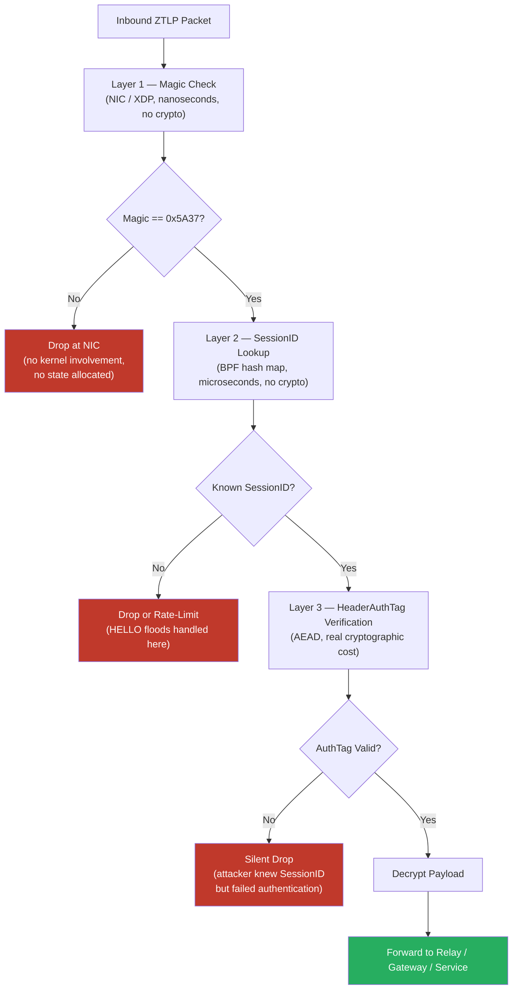

*Figure 3. ZTLP three-layer packet admission pipeline. Packets are rejected in ascending order of processing cost. The vast majority of flood traffic is discarded at Layer 1 or Layer 2 before any cryptographic work or session-state allocation occurs.*

ZTLP\'s primary DDoS defense is structural: packets are rejected through
a three-layer pipeline before session state is allocated. Each layer is
ordered by computational cost, ensuring that the cheapest checks run
first and eliminate the largest fraction of attack traffic before more
expensive operations are invoked.

-   **Layer 1 - Magic byte check (nanoseconds, no crypto):** A single
    16-bit comparison at the NIC driver via XDP. Any packet not
    beginning with the ZTLP Magic value `0x5A37` is dropped before the
    kernel sees it. No cryptographic work, no memory allocation, no
    state. This eliminates all random UDP flood traffic immediately.

-   **Layer 2 - SessionID allowlist lookup (microseconds, no
    crypto):** An O(1) BPF hash map lookup against the set of currently
    active SessionIDs maintained by the ZTLP daemon. Packets with
    unknown SessionIDs (including HELLO floods) are rate-limited and
    dropped before any cryptographic work is performed. This eliminates
    attackers who know the ZTLP packet format but do not know active
    session identifiers.

-   **Layer 3 - HeaderAuthTag AEAD verification (real cryptographic
    cost):** ChaCha20-Poly1305 or AES-GCM tag verification is performed
    only on packets that passed both Layer 1 and Layer 2. This involves
    real CPU cost - implementations MUST NOT claim this verification
    is free. However, a packet that reaches Layer 3 has already
    demonstrated it knows a valid active SessionID, meaning the attacker
    must have compromised session state rather than simply generating
    flood traffic. The volume of packets reaching Layer 3 is therefore
    orders of magnitude lower than the raw attack volume. Session state
    is not allocated until Layer 3 passes.

This pipeline does not prevent link-layer saturation - an attacker
with sufficient bandwidth can still fill the physical uplink before
packets reach ZTLP enforcement. That problem is addressed by the
distributed relay architecture (Section 12) and, in future revisions, by
bandwidth reservation between relay operators. Within the packet
processing budget available after physical delivery, the three-layer
pipeline ensures that DDoS traffic consumes the minimum possible
defender resources at each stage.

## 18.2 Amplification Prevention

A protocol that defends against DDoS MUST NOT itself be usable as a DDoS
amplifier. ZTLP nodes MUST NOT generate responses whose byte size
exceeds the initiating packet before authentication is complete. This is
a normative requirement.

Specifically: HELLO responses and CHALLENGE messages MUST be padded or
truncated such that `response_bytes ≤ request_bytes`. Relay nodes that
forward unauthenticated traffic MUST apply the same constraint. This
prevents an attacker from sending small spoofed HELLO packets and
causing ZTLP nodes to send large responses to a victim IP - the
classic UDP amplification pattern used in DNS, NTP, and SSDP reflection
attacks.

### 18.2.1 Padding Mechanism

When a response to an unauthenticated request would be smaller than the
request, no padding is required (the constraint is already satisfied).
When a response would exceed the request size, the sender MUST append a
PADDING Extension TLV (Type `0xFF`, defined in Section 8.4) to the
**request** to ensure the request is at least as large as the expected
response. Alternatively, the responder MAY truncate optional fields from
its response.

For CHALLENGE responses specifically (Section 8.5.3), the responder MUST
append PADDING bytes (Type `0xFF` TLV) to fill the response to exactly
`request_bytes`. The PADDING TLV Value field MUST contain
cryptographically random bytes (not zeros) to prevent compression-based
attacks on encrypted channels. Parsers MUST silently ignore the PADDING
TLV and MUST NOT interpret its contents.

**Implementation guidance:**

1.  The Initiator SHOULD send HELLO packets of at least 128 bytes
    (padding with a PADDING TLV if needed) to allow adequate room for
    the CHALLENGE response.
2.  If the Initiator's HELLO is too small for a complete CHALLENGE
    response, the relay MUST truncate the CHALLENGE — omitting the
    timestamp field first, then reducing difficulty precision — rather
    than exceeding the request size.
3.  HELLO\_ACK messages are sent only after the Noise handshake has
    progressed past Message 1, at which point the conversation is no
    longer unauthenticated. The amplification constraint therefore does
    NOT apply to HELLO\_ACK.

## 18.3 Stateless Admission Challenge

The three-layer pipeline eliminates random flood traffic and
unknown-SessionID floods. One attack surface remains: handshake
exhaustion. An attacker controlling a large botnet can flood ZTLP nodes
with syntactically valid HELLO messages from many source IPs, each
triggering the expensive `Noise_XX` handshake path. IP-based rate limiting
is insufficient against widely distributed botnets or attacks from IPv6
space where address space is vast.

To defend against handshake exhaustion, ZTLP relays and services MAY
require unknown initiators to complete a Stateless Admission Challenge
(SAC) prior to full session establishment. When SAC is active, the
handshake flow becomes:

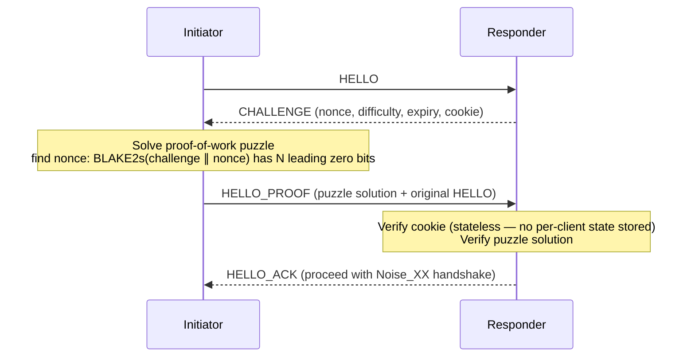
*The CHALLENGE cookie is a MAC over (source\_ip, timestamp, responder\_secret), verifiable without storing per-client state — analogous to TCP SYN cookies and QUIC retry tokens.*

The CHALLENGE MUST be stateless on the responder side. The cookie field
is a MAC computed over (source_ip, timestamp, responder_secret),
verifiable when `HELLO_PROOF` arrives without any per-client state being
stored. This is directly analogous to TCP SYN cookies and QUIC retry
tokens - a proven technique for stateless flood defense.

The puzzle SHOULD require the initiator to find a nonce such that
BLAKE2s(challenge \|\| nonce) has N leading zero bits. Difficulty N SHOULD
be adaptive - zero or disabled under normal load, increasing
automatically as HELLO rate exceeds configurable thresholds. The proof-of-work hash function is BLAKE2s-256 (RFC 7693). This is consistent with the hash function used throughout the ZTLP protocol. This
preserves low-friction operation for legitimate users while dramatically
increasing the cost of botnet-scale handshake floods.

**SAC MUST NOT be applied to:** established sessions, rekeying
operations, trusted relay-to-relay handshakes, or nodes presenting valid
short-lived trust tokens from a prior successful session. SAC is a gate
for unknown first contact only - not an ongoing tax on legitimate
network participants. Implementations MUST provide a mechanism for
low-power and IoT devices to negotiate reduced puzzle difficulty via
their enrollment profile.

## 18.4 Clock Synchronization

The Timestamp field is used as a replay heuristic, not as a hard
rejection criterion. Implementations MUST NOT reject packets solely
based on timestamp deviation from local clock, as NTP failure, clock
drift, or embedded device timekeeping limitations can produce legitimate
out-of-window timestamps. The PacketSeq counter and HeaderAuthTag
provide the primary replay defenses. Implementations SHOULD use NTP or
PTP for clock synchronization where available, and SHOULD flag packets
with timestamps more than ±5 minutes from local time for additional
scrutiny, but MUST NOT drop them on that basis alone.

For certificate validation, implementations MUST allow a clock skew tolerance of 5 minutes (300 seconds) when checking `not_before` and `not_after` fields. Certificates that expire during an active session do NOT cause immediate session termination — the session remains valid until its own lifetime expires or rekeying occurs. However, expired certificates MUST NOT be used for NEW session establishment.

## 18.5 Cryptographic Agility

The CryptoSuite field allows future algorithm upgrades without protocol
version changes. Implementations MUST NOT negotiate CryptoSuites with
known weaknesses.

### 18.5.1 CryptoSuite Registry

The following table defines the initial CryptoSuite identifiers. All
compliant implementations MUST support CryptoSuite `0x0001`. Additional
suites MAY be added in future protocol revisions.

| ID | Name | Noise Pattern | DH | AEAD | Hash | Status |
|----|------|---------------|----|------|------|--------|
| `0x0000` | — | — | — | — | — | Reserved (MUST NOT be used). |
| `0x0001` | `ZTLP_XX_25519_CHACHA_BLAKE2S` | `Noise_XX` | X25519 | ChaCha20-Poly1305 | BLAKE2s | **Mandatory**. MUST be supported by all implementations. |
| `0x0002` | `ZTLP_XX_25519_AES_SHA256` | `Noise_XX` | X25519 | AES-256-GCM | SHA-256 | Optional. For hardware with AES-NI acceleration. |
| `0x0003` | `ZTLP_XX_448_CHACHA_BLAKE2B` | `Noise_XX` | X448 | ChaCha20-Poly1305 | BLAKE2b | Optional. 224-bit security level for high-assurance deployments. |
| `0x0100`–`0x01FF` | — | — | — | — | — | Reserved for experimental / private use. |
| `0xFFFF` | — | — | — | — | — | Reserved (MUST NOT be used). |

CryptoSuite values `0x0004` through `0x00FF` are reserved for future standardized suites. Values `0x0100` through `0xFFFE` are available for experimental or private use. Value `0x0000` is reserved and MUST NOT be used. Value `0xFFFF` is reserved as a sentinel.

**Suite negotiation:** CryptoSuite negotiation is implicit in ZTLP. The
Initiator sets the `CryptoSuite` field in the HELLO header to its
preferred suite. If the Responder does not support that suite, it MUST
respond with an ERROR (code `0x07`, CRYPTO\_MISMATCH) containing the
Responder's preferred CryptoSuite ID in the first two bytes of the
Error Detail field. The Initiator MAY retry with the suggested suite.
Implementations MUST NOT downgrade to a suite with known weaknesses
even if suggested by a peer.

Each CryptoSuite specifies a recommended rekeying interval. For CryptoSuite 0x0001: 3,600 seconds (1 hour). For CryptoSuites 0x0002 and 0x0003: 3,600 seconds (1 hour). Implementations MAY override the rekeying interval via policy but MUST NOT exceed the maximum session lifetime (Section 35.1).

In protocol version 1, CryptoSuite `0x0001` (ChaCha20-Poly1305 + BLAKE2s + Noise\_XX) is the ONLY permitted suite. Initiators MUST propose `0x0001`. Responders MUST reject any other suite with ERROR code `0x07` (CRYPTO\_MISMATCH). CryptoSuites `0x0002` and `0x0003` are registered for future protocol versions and MUST NOT be used in version 1. This eliminates downgrade attacks while preserving the registry for future algorithm agility.

## 18.6 Revocation Latency

`ZTLP_REVOKE` records propagate through ZTLP-NS with TTL-governed latency.
Implementations MUST check revocation status during session
establishment. For high-security deployments, short certificate TTLs
(hours rather than days) are preferred over reliance on revocation
propagation.

# 19. Privacy Considerations

ZTLP's identity-first model introduces privacy tradeoffs relative to the
anonymous packet model of IPv4/IPv6. This section describes the privacy
risks introduced by ZTLP's design and the normative mitigations that
implementations MUST apply.

## 19.1 Packet-Level Identity Privacy

NodeID values represent long-lived identities and MUST NOT appear in
established data packets. Although ZTLP payloads are encrypted, packet
headers are not. A passive observer — an ISP, backbone router, hostile
network operator, or nation-state monitor — observing ZTLP traffic
could correlate long-lived NodeIDs across sessions to track device
behavior, infer organizational relationships, map communication
patterns, and fingerprint device mobility. This is directly analogous to
the TLS SNI leakage problem prior to Encrypted Client Hello (ECH), and
must be addressed at the design level.

ZTLP addresses this through the canonical data-plane model: after
`SESSION_OPEN`, the compact post-handshake header contains only the
96-bit `SessionID` — no `SrcNodeID`, no `DstSvcID`. This is the same model
used by QUIC (Connection ID), WireGuard (Session Index), and MPLS
(Label): identity is verified once at handshake time, then routing
proceeds by a compact, opaque session token.

The `SessionID` provides per-session unlinkability because it is assigned
with cryptographically strong entropy during the `Noise_XX` handshake and
rotated on every `REKEY`. A passive observer sees only a random-looking
96-bit value that changes every session — no stable handle exists for
cross-session correlation. `NodeID` values are transmitted only during
the authenticated handshake phase, which already provides identity
hiding via the `Noise_XX` pattern (identities are encrypted after the
first message).

Implementations MUST NOT include `SrcNodeID` or `DstSvcID` in established
data packets. Such packets are non-conforming with respect to this
section and expose long-lived identifiers to passive observers. The
canonical SessionID model defined in Section 29.5.6 is authoritative;
this section describes the privacy properties that model achieves.

## 19.2 Remaining Privacy Risks

Even with packet-level identity privacy enforced, the following residual
risks remain. First, ZTLP-NS lookups for a node's services may reveal
organizational relationships to operators of ZTLP-NS infrastructure.
Implementations SHOULD use oblivious or privacy-preserving lookup
mechanisms where available. Second, traffic volume and timing patterns
can enable inference attacks even when identifiers are pseudonymous.
ZTLP does not address traffic analysis attacks. Third, the handshake
phase necessarily reveals that ZTLP is in use, though not the specific
identities involved after the first message. Fourth, relay operators can
observe which SessionIDs are active, even if they cannot identify the
underlying NodeIDs.

## 19.3 Operational Guidance

ZTLP-NS operators SHOULD NOT log individual lookup queries beyond what
is required for operational purposes. Relay operators MUST NOT log
plaintext payload content. Ephemeral SessionIDs are rotated on REKEY,
limiting per-session correlation windows. This document acknowledges
that ZTLP is not an anonymity protocol. Applications requiring strong
anonymity SHOULD use additional layers such as onion routing above ZTLP.

# 20. Operational Tooling

Network operators MUST have access to diagnostic tools. The following
tools are defined as part of the ZTLP operational suite:

| Tool | Function | Equivalent |
|------|----------|------------|
| ztlp-ping | Test reachability to a Node ID or Service ID. | ping |
| ztlp-trace | Display relay path taken to a destination. | traceroute |
| ztlp-status | Show local node state, active sessions, current relay. | netstat |
| ztlp-relay-info | Query a relay node's metrics and peer table. | BGP show route |
| ztlp-ns-lookup | Resolve ZTLP-NS records for a name. | dig / nslookup |
| ztlp-revoke-check | Verify revocation status of a Node ID. | OCSP check |

## 20.1 Identity and Zone Administration CLI

The `ztlp admin` subcommand provides identity management and zone
administration capabilities. All admin commands require authentication
as an entity with the "admin" role or possession of the zone signing key.
All commands support `--json` for machine-readable output.

| Command | Description |
|---------|-------------|
| `ztlp admin create-user <name> --role <role> --email <email>` | Create a USER identity record. Role MUST be "user", "tech", or "admin". |
| `ztlp admin create-group <name> --members <list>` | Create a GROUP record with initial members (comma-separated FQDNs). |
| `ztlp admin link-device <device> --owner <user>` | Set the `owner` field of an existing DEVICE record to a USER FQDN. |
| `ztlp admin devices [--owner <user>]` | List DEVICE records, optionally filtered by owner. |
| `ztlp admin ls [--type device\|user\|group]` | List identity records, optionally filtered by type. |
| `ztlp admin revoke <name> --reason <reason>` | Revoke an identity. For USER records, triggers revocation cascade to owned devices. |
| `ztlp admin audit --since <timestamp> [--name <pattern>]` | Query the audit log for operations since a timestamp, with optional name pattern filter. |
| `ztlp admin group add <group> <member>` | Add a member to an existing group. |
| `ztlp admin group remove <group> <member>` | Remove a member from a group. |
| `ztlp admin group members <group>` | List members of a group. |
| `ztlp admin group check <group> <identity>` | Check whether an identity is a member of a group. |
| `ztlp admin rotate-zone-key` | Generate a new zone signing key and re-sign all zone records. |
| `ztlp admin export-zone-key` | Export the current zone public key for trust anchor distribution. |

## 20.2 Developer SDKs and Integration Libraries

Protocol adoption depends not only on operational tooling but on the
availability of developer-facing integration libraries. ZTLP SHOULD
provide official SDK implementations in major programming languages to
enable application developers to integrate ZTLP-secured transport
without requiring deep protocol knowledge.

### 20.2.1 SDK Design Goals

ZTLP SDKs SHOULD expose a minimal, high-level API surface that abstracts
session establishment, identity management, and relay selection. Target
API patterns include:

-   ztlp.Listen(serviceID, policyConfig) \-- open an authenticated
    service endpoint

-   ztlp.Connect(targetServiceID) \-- establish an authenticated session
    to a service

-   ztlp.Send(session, payload) \-- transmit encrypted data over an
    established session

-   ztlp.Close(session) \-- cleanly terminate a session

This surface is deliberately analogous to standard TCP socket APIs,
minimizing the learning curve for developers familiar with conventional
network programming.

### 20.2.2 Priority Language Targets

Initial SDK development SHOULD prioritize: Go (primary systems and
infrastructure tooling language), Rust (high-performance and
safety-critical implementations), and Python (scripting, automation, and
rapid integration). Subsequent targets SHOULD include TypeScript/Node.js
for server-side JavaScript environments and C/C++ for embedded and
constrained device use.

### 20.2.3 Installation and Deployment Experience

ZTLP client and relay software SHOULD be deployable with minimal
friction. Deployment tooling SHOULD support single-command installation
patterns (for example, a shell bootstrap script or package manager
installation) and automated node enrollment that guides the operator
through hardware identity setup, trust root selection, and initial relay
discovery without requiring manual protocol configuration. The goal is
that a developer or operator with no prior ZTLP experience can reach a
working, authenticated session within minutes of initial installation.

### 20.2.4 Relationship to Tailscale and Teleport Deployment Models

Systems such as Tailscale and Teleport demonstrated that deployment
simplicity is a primary adoption driver for secure networking
infrastructure. Tailscale achieved rapid enterprise adoption through a
one-command enrollment model. Teleport similarly reduced friction for
securing SSH, database, and Kubernetes access through a unified
identity-first proxy. ZTLP SHOULD apply these lessons: the complexity of
the protocol layer MUST NOT be exposed to the operator during normal
deployment. SDK design and installation tooling are first-class protocol
concerns, not afterthoughts.

# 21. Open Issues and Future Work

The following issues remain open or are identified as future work areas:

| Issue | Status | Description |
|-------|--------|-------------|
| Bandwidth reservation model | Open | Formal definition of `BANDWIDTH_HINT` TLV semantics and interaction with relay QoS policies. |
| Congestion control | Open | Specification of a ZTLP-native congestion control algorithm for long-haul relay paths. |
| ZTLP-NS governance | Open | Formal governance structure for the public ZTLP-NS root. |
| Relay operator incentives | Open | Economic models for relay node operation at scale. See also: production relay operator economics and SLA framework (below). |
| Lawful intercept considerations | Open | Engagement with regulatory frameworks. |
| Hardware identity enrollment UX | Open | Simplifying the YubiKey/TPM enrollment flow for non-technical users. |
| ZTLP for IoT | Open | Lightweight profile for constrained devices. |
| Formal security proof | Open | Cryptographic analysis of the `Noise_XX` handshake under ZTLP's threat model. |
| Relay discovery mechanism | Addressed | Implemented via Phase 8b NS-based relay discovery. Relay records are published and resolved through ZTLP-NS with authenticated advertisement verification (see Section 36.2). |
| Path selection algorithm | Addressed | Implemented via PathScore-based selection in Phase 8/8b. Client relay selection logic covers direct, single-relay, and multi-relay decision criteria (see Section 36.1). |
| Session expiration and relay state cleanup | Addressed | Specified normatively in Section 35: session lifetime limits, mandatory rekeying intervals, and relay session table garbage collection procedures. |
| Relay abuse protection parameters | Addressed | Specified normatively in Section 37: per-identity rate limits, per-session quotas, and relay admission control thresholds with standardized default values. |
| Post-quantum cryptographic migration | Open | Migration path to post-quantum primitives (e.g., ML-KEM for key exchange, ML-DSA or SLH-DSA for signatures) to replace X25519 and Ed25519. See Section 41 threat model discussion. |
| Production relay operator economics | Open | SLA framework, compensation models, and operational requirements for production relay operators serving public ZTLP networks. |
| Mobile platform SDK | Open | Native iOS and Android SDKs for ZTLP client integration, including hardware key support (Secure Enclave, Android Keystore). |
| Browser integration | Open | ZTLP-aware `fetch()` and WebSocket support for browser-native zero trust connectivity without VPN or proxy intermediaries. |

# 22. References

## 22.1 Normative References

| Reference | Description |
|---|---|
| RFC 2119 | Key words for use in RFCs to indicate requirement levels. |
| RFC 7693 | The BLAKE2 Cryptographic Hash and Message Authentication Code (MAC). |
| RFC 7748 | Elliptic Curves for Diffie-Hellman Key Agreement (X25519, X448). |
| RFC 8032 | Edwards-Curve Digital Signature Algorithm (EdDSA) — Ed25519 and Ed448. |
| RFC 8439 | ChaCha20 and Poly1305 for IETF Protocols. |
| RFC 8446 | TLS 1.3. |
| RFC 8949 | Concise Binary Object Representation (CBOR). |
| RFC 9000 | QUIC: A UDP-Based Multiplexed and Secure Transport. |
| Noise Protocol Framework | Trevor Perrin, 2018. https://noiseprotocol.org/noise.html |

## 22.2 Informative References

| Reference | Description |
|---|---|
| RFC 7401 | Host Identity Protocol Version 2 (HIPv2). |
| RFC 6698 | The DANE Transport Layer Security (TLS) Protocol. |
| SCION: A Secure Internet Architecture | Barrera et al., ETH Zurich. |
| BeyondCorp: A New Approach to Enterprise Security | Ward & Beyer, Google. |
| RFC 4960 | Stream Control Transmission Protocol (SCTP). |
| RFC 8555 | Automatic Certificate Management Environment (ACME). |
| Nebula | A scalable overlay networking tool. Slack Technologies / Defined Networking, 2019. https://github.com/slackhq/nebula. \[Informative: ZTLP's relay architecture extends the Nebula lighthouse/relay model to public Internet deployment with identity-first security and structural DDoS resistance as primary design constraints.\] |
| WireGuard: Next Generation Kernel Network Tunnel | Donenfeld, J., NDSS 2017. \[Informative: demonstrates that a minimal, auditable, high-performance cryptographic protocol can achieve widespread deployment. ZTLP builds on this precedent.\] |
| RFC 6830 | The Locator/ID Separation Protocol (LISP). \[Informative: prior work on identifier/locator separation; ZTLP achieves the same architectural separation as an overlay without requiring router changes.\] |
| RFC 9000 Section 8 | QUIC Address Validation and Retry Tokens. \[Informative: the stateless cookie model used by ZTLP's Stateless Admission Challenge (Section 18.3) is directly analogous to QUIC retry token design.\] |


---

# 23. Trust and Authority Model

ZTLP separates the functions of trust anchoring, identity enrollment,
policy issuance, and revocation into distinct logical authorities. While
a deployment MAY implement these roles using a single operational
entity, the protocol treats them as separate roles for purposes of
delegation, auditing, and security analysis. This separation allows
organizations to delegate identity management and service control
without granting excessive authority to any single entity.

ZTLP defines four primary authority roles: Trust Roots, Enrollment
Authorities, Policy Authorities, and Revocation Authorities.

## 23.1 Trust Roots

Trust Roots serve as the top-level anchors of trust for ZTLP identity
verification. A Trust Root is responsible for: defining the root
certificate or public key used to validate signed namespace records;
delegating authority to Enrollment Authorities and Operator Authorities;
and defining trust boundaries across federated deployments. Nodes
participating in a ZTLP network maintain a configured list of trusted
roots.

Trust Roots MAY represent public ZTLP networks, enterprise deployments,
industry consortium networks, or government and regulatory environments.
ZTLP does not require a single global root authority. Multiple
independent trust roots may coexist, allowing federated identity
ecosystems.

## 23.2 Enrollment Authorities

Enrollment Authorities are responsible for binding cryptographic
identities to NodeIDs. An Enrollment Authority performs identity
validation for a node or operator and issues signed records that bind:
NodeID ↔ Public Key ↔ Organizational Identity. These bindings are
published in ZTLP-NS using `ZTLP_KEY` records.

Enrollment Authorities MAY validate identity through enterprise
directory integration, hardware device enrollment, operator identity
verification, or attestation of relay infrastructure. Enrollment
Authorities MUST sign issued records using keys that chain to a
recognized Trust Root.

For clarity, signed records carry explicit authority markers: `ZTLP_KEY`
records are signed by an Enrollment Authority; `ZTLP_POLICY` records are
signed by a Policy Authority for the service namespace; `ZTLP_REVOKE`
records are signed by either the Enrollment Authority or a delegated
Revocation Authority; and `ZTLP_OPERATOR` records are signed by an
Operator Authority recognized by a trusted root.

## 23.3 Policy Authorities

Policy Authorities define the access control rules governing service
communication. Policy Authorities publish signed `ZTLP_POLICY` records
that specify which identities or identity classes are permitted to
establish sessions with a given service. Policy rules may include:
allowed NodeID sets, identity class permissions, organizational trust
boundaries, and session requirements such as attestation or
hardware-backed identity. Policy Authorities are typically operated by
the service owner or tenant responsible for the protected service.

## 23.4 Revocation Authorities

Revocation Authorities invalidate previously issued identity bindings,
session permissions, or operator privileges. Revocation events are
published using `ZTLP_REVOKE` records. Revocation may apply to NodeIDs,
public key bindings, operator identities, relay authorization, or
delegated authority certificates. Revocation Authorities MUST be
authorized by either the Enrollment Authority that issued the original
binding, or a delegated authority recognized by a Trust Root.

ZTLP nodes MUST periodically synchronize revocation records from ZTLP-NS
to ensure compromised identities are promptly invalidated.

## 23.5 Delegation Model

Trust Roots may delegate authority to subordinate entities through
signed delegation records. Delegation may include enrollment authority
delegation, operator authority delegation, and tenant policy authority
delegation. Delegation records allow large organizations or federated
networks to manage identities locally while maintaining a verifiable
chain of trust. A delegation record is a standard ZTLP-NS record of type ZTLP_POLICY with the following data fields encoded in sorted-key CBOR: `delegate_zone` (text, the delegated zone name), `delegate_pubkey` (bytes, Ed25519 public key of the delegate authority), `permissions` (array of text, e.g., `["enroll", "sign_key", "sign_svc"]`), and `max_depth` (uint, maximum further delegation depth, 0 = no sub-delegation). The delegation record MUST be signed by the parent zone's authority key.

## 23.6 Conflict Resolution Across Multiple Roots

Nodes MAY trust multiple roots simultaneously. When conflicting records
are encountered, the following precedence rules apply: Revocation
records override all other record types. Records issued by explicitly
configured enterprise roots take precedence over public roots. Records
signed by the issuing authority responsible for the namespace take
precedence over third-party delegations. Implementations MAY allow
administrators to configure additional precedence policies.

## 23.7 Authority Separation Rationale

Separating trust anchoring, identity enrollment, policy control, and
revocation enables flexible deployment models. For example: an
enterprise root may delegate identity enrollment to a device
provisioning system; a service owner may independently define access
policies; and a security operations team may control revocation
authority. This separation reduces systemic risk by preventing any
single authority from unilaterally controlling all aspects of identity
and access within the network.

# 24. Public Internet Interoperability and Overlay Architecture

ZTLP operates as a secure identity overlay above the public Internet.
The public Internet continues to perform packet transport, routing, and
physical connectivity. ZTLP provides identity verification, session
establishment, access policy enforcement, and encrypted transport. This
layering model enables incremental deployment without requiring changes
to routers, ISPs, or Internet infrastructure.

## 24.1 Layering Model

ZTLP sits above IP but below applications. Internet routers do not need to understand ZTLP — packets are encapsulated inside normal UDP or TCP traffic and forwarded without modification.

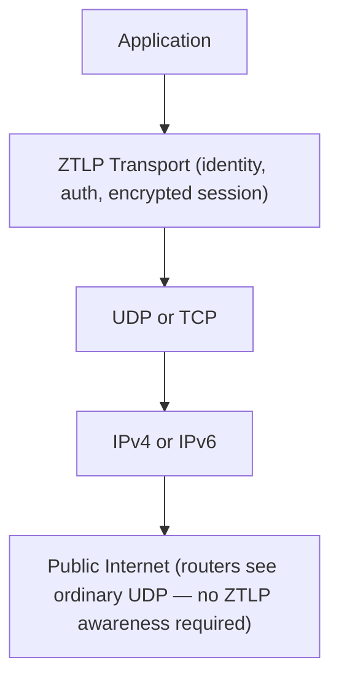

This overlay model follows the same deployment precedent as WireGuard
(over UDP), QUIC (over UDP), Tailscale (Internet overlay), Cloudflare
Warp, and Tor. Overlay protocols succeed because they can deploy
immediately on existing infrastructure, whereas replacing Internet
routing layers would require changes to global routers, new ISP
protocols, and operating system updates - a process that has
historically taken decades even for widely-supported technologies such
as IPv6.

## 24.2 Legacy Compatibility and Incremental Adoption

A key advantage of the overlay model is that ZTLP can coexist with
legacy networking. A service may simultaneously support standard
Internet access and ZTLP-secured access, allowing gradual adoption.
Legacy systems continue to operate normally while ZTLP-aware clients
gain additional identity and security guarantees.

ZTLP nodes may operate in four roles: client nodes, service nodes, relay
nodes, and gateway nodes. Gateways allow existing internal networks to
participate in ZTLP without modifying every host. The Internet provides
packet transport; ZTLP provides the identity and authorization layer.

# 25. Commercial Adoption and Gateway Deployment Model

For large-scale commercial adoption by cloud providers, financial
institutions, healthcare organizations, and Internet platforms, ZTLP
MUST support gateway-based deployment for existing services. Large
organizations will not rewrite their infrastructure to adopt a new
protocol. ZTLP achieves adoption by sitting in front of existing systems
via an edge gateway, leaving internal infrastructure unchanged.

## 25.1 Gateway Architecture

A ZTLP Edge Gateway is deployed at the network edge, analogous to a load
balancer, API gateway, or reverse proxy. The gateway performs ZTLP
handshake, identity validation, policy enforcement, session creation,
and traffic forwarding to internal services. Internally, existing
infrastructure may continue using HTTP, TLS, gRPC, database protocols,
and microservices without modification.

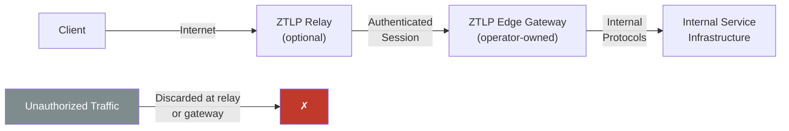
*Only authenticated ZTLP sessions reach internal services. Unauthorized traffic is discarded at the relay or gateway before reaching the service.*

## 25.2 Node Identity Types for Commercial Services

For commercial adoption, ZTLP MUST support service identities in
addition to device and user identities. NodeID types include: user
nodes, device nodes, service nodes, relay nodes, and gateway nodes.
Service-to-service authentication is a primary requirement for cloud
providers operating microservice architectures, B2B APIs, and partner
integrations.

## 25.3 Commercial Value Proposition

ZTLP offers commercial operators the following measurable benefits.
First, fraud and abuse reduction: identity-first admission control
prevents bot scraping, credential stuffing, automated fraud, and abusive
API usage. Second, structural DDoS cost reduction: admission control
drops unauthorized packets before they reach service infrastructure,
reducing reliance on expensive third-party DDoS mitigation. Third,
trusted device and service access: ZTLP identities represent devices,
users, organizations, or services, enabling secure B2B APIs and partner
integrations. Fourth, regulatory compliance: the identity binding model
supports audit trails and access logging required in financial,
healthcare, and government environments.

## 25.4 DNS-Based Service Discovery for Commercial Clients

Commercial deployment requires simple service discovery. A DNS record of
the form \_ztlp.api.service.example.com returns the service NodeID,
relay endpoint, and policy requirements. The `_ztlp` discovery record is a DNS TXT record with the following semicolon-delimited fields: `v=ztlp1;nid=<hex NodeID>;relay=<ip:port>;policy=<FQDN>`. Example: `_ztlp.api.example.com TXT "v=ztlp1;nid=ab01cd02...;relay=203.0.113.10:23095;policy=api-policy.example.ztlp"`. Implementations MUST validate the NodeID by querying ZTLP-NS before establishing a session. ZTLP-aware clients
automatically connect using identity-first session establishment. Legacy
clients that do not support ZTLP fall back to standard HTTPS, preserving
backward compatibility.

## 25.5 Phased Adoption Model

Organizations may adopt ZTLP incrementally. Phase 1: protect sensitive
and high-value APIs. Phase 2: protect administrative interfaces and
privileged access paths. Phase 3: protect customer authentication
endpoints. Phase 4: extend identity-first networking to additional
services and internal east-west traffic. This phased model allows
organizations to gain early operational experience without committing to
full infrastructure replacement.

## 25.6 Market-Based Ecosystem Adoption Path

In addition to the technical migration phases above, ZTLP adoption is
expected to follow a four-stage market trajectory. These stages reflect
real-world deployment dynamics rather than technical readiness levels.

**Stage 1 \-- Private Network Tool**

Initial deployments use ZTLP to solve specific, high-value security
problems within a single organization. Representative use cases: secure
administrative access to servers and infrastructure (replacing legacy
SSH bastion hosts and VPNs), protected internal service endpoints for
databases and management consoles, and private relay deployments within
enterprise networks. This stage proves operational viability without
public infrastructure dependencies.

**Stage 2 \-- Enterprise Adoption**

Organizations deploy ZTLP at scale to address compliance, access
control, and remote workforce requirements. Enterprises run their own
trust roots, enrollment authorities, and relay infrastructure. Managed
service providers and integrators develop ZTLP deployment expertise.
This stage generates operational feedback that informs protocol
refinement and produces reference architectures for regulated
industries.

**Stage 3 \-- Service Provider Integration**

Cloud providers, CDN operators, and security vendors integrate ZTLP
gateway and relay functionality into their platforms. Examples: cloud
provider-managed ZTLP gateways deployed as edge services, security
vendors offering ZTLP relay networks as a managed service, and SaaS
platforms accepting ZTLP identity assertions for API authentication.
This stage dramatically lowers deployment friction, as organizations can
adopt ZTLP-secured access without operating relay infrastructure
themselves.

**Stage 4 \-- Public Ecosystem**

ZTLP becomes a generally available Internet security layer used across a
broad range of services and devices. Public services offer
ZTLP-authenticated access alongside legacy Internet access. Independent
relay operators establish commercial relay networks. Developer SDKs
enable integration across application frameworks. At this stage, ZTLP
functions as a new transport security primitive analogous to how TLS
functions today \-- ubiquitous, multi-vendor, and
infrastructure-independent.

The four stages are not strictly sequential. Enterprise adoption (Stage
2) and service provider interest (Stage 3) may occur in parallel once
early deployments establish operational credibility. The transition from
Stage 3 to Stage 4 depends significantly on governance decisions, SDK
availability, and the existence of multiple independent relay operator
networks.

# 26. Policy-Constrained Adaptive Path Selection

ZTLP implementations SHOULD evaluate direct, gateway-mediated, and
relay-assisted paths as candidate transport paths for a session. Path
selection MUST be based on measured and policy-constrained path quality,
including latency, packet loss, congestion, trust score, and
reachability. Direct transport is not inherently preferred over
relay-assisted transport; a relayed path MAY be selected when it
provides lower effective cost or better stability than a direct path.

## 26.1 Path Candidates

At session setup, the ZTLP implementation evaluates the following
candidate paths: direct endpoint-to-endpoint transport;
endpoint-to-service-adjacent-gateway transport; single-relay-assisted
path; multi-relay-assisted path; and federated operator interconnect
path. All candidates are evaluated as peers. The path with the best
effective score subject to policy constraints is selected.

## 26.2 Path Scoring

Path selection uses a composite scoring function: PathScore = w1 \*
Latency + w2 \* PacketLoss + w3 \* Congestion + w4 \* TrustScore. Relay
nodes publish path metrics that implementations use as inputs to path
evaluation. Weights MAY be configured by policy to prioritize latency,
reliability, or trust depending on the application requirements.

## 26.3 Relay-Optimized Routing Example

A direct Internet path may be topologically shorter but operationally
worse due to poor intercontinental peering, congestion, packet loss, or
asymmetric routing. For example, a direct path from China to the United
States may have substantially higher round-trip latency and packet loss
compared to a relay-assisted path routing through Singapore. The
relay-assisted path adds one logical hop but delivers lower effective
round-trip time, reduced jitter, and higher throughput.

ZTLP path selection accounts for this by treating relay-assisted paths
as first-class candidates evaluated on measured network conditions, not
as fallback mechanisms activated only when direct connectivity fails.

## 26.4 Continuous Path Monitoring and Session Migration

Implementations SHOULD continuously monitor active and standby paths and
MAY migrate established sessions to a better path when path quality
materially improves or when the current path degrades. Path monitoring
SHOULD include both active probing of standby candidates and passive
monitoring of the current active path. Session migration MUST preserve
session identity and cryptographic state. Automatic path switchover is
transparent to applications.

## 26.5 Relay Role in Path Optimization

ZTLP relays serve dual roles: they are the primary control plane for
bootstrap, admission control, identity verification, and path
coordination, and they are also active participants in the data plane
path selection fabric. The key architectural principle is that relays
are not merely fallback infrastructure. They are part of the
optimization layer that makes ZTLP a path-optimizing identity overlay
rather than a simple encrypted tunnel.

This design allows ZTLP to scale globally without requiring a single
operator to maintain a universal relay backbone, while still preserving
secure admission, policy enforcement, and fallback reachability.
Enterprises run their own gateways. Organizations keep most data on
their own network paths. ZTLP provides the identity and admission
fabric. No party is dependent on a single operator's relays for every
packet.


---

# 27. Handshake Flood Resistance

ZTLP assumes that session establishment mechanisms may be targeted by
adversaries attempting to exhaust relay resources. Because every
connection requires identity verification, session creation, policy
lookup, and cryptographic validation, an attacker who cannot reach a
protected service directly may instead attempt to flood the handshake
system. Implementations therefore employ a layered admission pipeline
that ensures malicious clients must expend significantly more
computational effort than relays before resources are allocated.

## 27.1 Layered Admission Defense

ZTLP's defense against handshake floods consists of four mechanisms
applied in sequence. First, admission domains: relays only accept
handshake attempts assigned to them via consistent hashing on the
SessionID or NodeID space, distributing handshake load across the relay
mesh so that no single relay can be overwhelmed by a targeted flood.
Second, cheap early rejection: the three-stage validation pipeline
(magic byte check, session lookup, HeaderAuthTag verification) rejects
unauthenticated traffic with minimal CPU cost before any relay state is
allocated. Third, proof-of-work puzzles: during session establishment,
relays MAY issue computational puzzles that clients must solve before
the relay commits resources to the session. This forces attackers to
expend CPU before relays spend resources, mirroring the SYN cookie
defense model. Fourth, stateless early rejection: relays do not allocate
session state until the client has demonstrated proof of work and passed
initial validation, ensuring that incomplete or fraudulent handshakes
consume no persistent resources.

## 27.2 Asymmetric Defense Advantage

ZTLP's admission model is structurally more resistant to volumetric
abuse than the current Internet because: packets require an established
session; sessions require proof of work; load is distributed across
relay admission domains; and state is allocated only after proof.
Ironically, ZTLP ends up more resistant to DDoS than the current
Internet model, because today anyone may send unlimited packets to any
public IP, whereas ZTLP requires demonstrated computational effort
before any session resource is committed.

# 28. Identity-Gated Connectivity: No-Open-Port Networking

ZTLP enables a network model in which services operate with no publicly
exposed ports. A service protected by ZTLP does not listen on any
publicly reachable socket. It accepts traffic exclusively through
authenticated ZTLP sessions. To an unauthenticated observer, the service
is invisible: it does not respond to port scans, does not acknowledge
connection attempts, and generates no observable surface for probing or
exploitation.

In summary: ZTLP makes services unreachable until identity is proven.

## 28.1 Contrast with Current Internet Model

Today, even services protected by TLS, firewalls, WAFs, and DDoS
mitigation must expose a public port. That port is visible and reachable
by tools like Shodan, nmap, and masscan. Attackers can scan it, flood
it, probe it for vulnerabilities, and exploit it. Security is layered on
top of anonymous connectivity that is already established. ZTLP changes
the model: no session means no connectivity, and no identity means no
session. The service security model shifts from "secure the service from
reaching attackers" to "make the service unreachable to unauthenticated
parties."

## 28.2 What No-Open-Port Networking Eliminates

Identity-gated connectivity eliminates or substantially reduces the
following threat classes: port scanning and Shodan-style discovery,
because the service does not respond to unauthenticated probes; botnet
probing, because attackers cannot send packets directly to services;
many DDoS vectors, because the service never sees anonymous traffic; and
exploit scanning, because tools that search for vulnerabilities on open
ports find no surface to target.

## 28.3 Example: ZTLP-Protected SSH

Today, an SSH server listens on TCP port 22, which is open to the
Internet and visible to any scanner. With ZTLP, the SSH server has no
public port. A client connects using:

```
ztlp connect ssh.example
```

The server has no publicly listening port. Only authenticated ZTLP
sessions can reach it. The server is invisible to the Internet until
identity is proven.

## 28.4 Comparison with Existing Systems

Existing systems implement partial versions of this idea. Tailscale
requires a central control plane and exposes device addresses within the
overlay. ZeroTier still exposes node addresses to the overlay network.
Tor hidden services are specialized and introduce significant latency.
Cloudflare Access is HTTP-only and depends on a single provider. VPNs
still expose gateways to the public Internet. Teleport provides
identity-first access to SSH, databases, and Kubernetes infrastructure,
and most closely resembles the ZTLP gateway model for privileged
infrastructure access; however, Teleport is an application-layer proxy
rather than a transport protocol and does not provide general-purpose
encrypted session routing or DDoS-resistant packet admission. ZTLP
provides a general-purpose transport-level solution where identity, not
IP address, determines reachability and where the protocol itself -
not a centralized proxy service - enforces admission. The key shift
is: IP address equals reachable becomes identity equals reachable.

# 29. SessionID as Primary Routing Primitive

ZTLP authenticates identities during session establishment. Once
authenticated, traffic is routed using a compact SessionID that allows
relays and gateways to forward packets without repeating identity
verification on every packet. This separation between identity
validation and packet forwarding enables high-performance routing while
preserving strong authentication guarantees.

The architecture separates into three distinct layers. This separation follows the same pattern used by QUIC (Connection ID), WireGuard (Session Index), MPLS (Label), VXLAN (VNI), and IPsec (SPI).

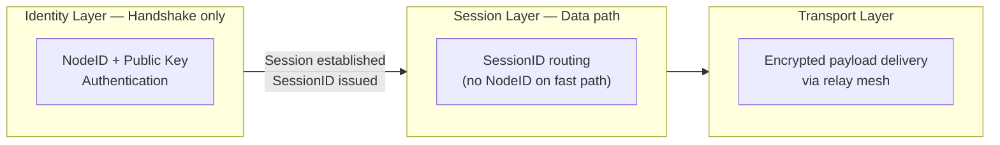

## 29.1 Three-Phase Operation

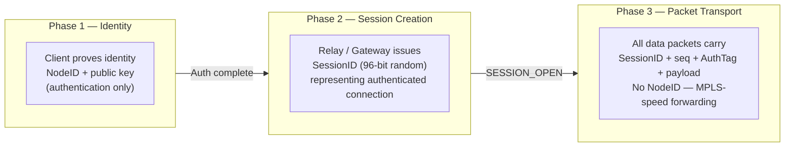

## 29.2 Packet Header Layout

The following ASCII diagram shows the base ZTLP data packet header
layout after session establishment:

```
 0                   1                   2                   3
 0 1 2 3 4 5 6 7 8 9 0 1 2 3 4 5 6 7 8 9 0 1 2 3 4 5 6 7 8 9 0 1
+-+-+-+-+-+-+-+-+-+-+-+-+-+-+-+-+-+-+-+-+-+-+-+-+-+-+-+-+-+-+-+-+
|         Magic (0x5A37)        | Ver(4)|    HdrLen (12)        |
+-+-+-+-+-+-+-+-+-+-+-+-+-+-+-+-+-+-+-+-+-+-+-+-+-+-+-+-+-+-+-+-+
|            Flags (16)         |                               |
+-+-+-+-+-+-+-+-+-+-+-+-+-+-+-+-+                               +
|                       SessionID (96 bits)                     |
+                               +-+-+-+-+-+-+-+-+-+-+-+-+-+-+-+-+
|                               |                               |
+-+-+-+-+-+-+-+-+-+-+-+-+-+-+-+-+                               +
|                    PacketSequence (64 bits)                    |
+-+-+-+-+-+-+-+-+-+-+-+-+-+-+-+-+-+-+-+-+-+-+-+-+-+-+-+-+-+-+-+-+
|                                                               |
+                    HeaderAuthTag (128 bits)                    +
|                                                               |
+-+-+-+-+-+-+-+-+-+-+-+-+-+-+-+-+-+-+-+-+-+-+-+-+-+-+-+-+-+-+-+-+
|        ExtLen (16)            |       PayloadLen (16)         |
+-+-+-+-+-+-+-+-+-+-+-+-+-+-+-+-+-+-+-+-+-+-+-+-+-+-+-+-+-+-+-+-+
|                   Encrypted Payload (variable)                |
+-+-+-+-+-+-+-+-+-+-+-+-+-+-+-+-+-+-+-+-+-+-+-+-+-+-+-+-+-+-+-+-+
```

NodeID values do not appear in data packet headers after session
establishment. This maintains privacy (passive observers see only
random-looking SessionIDs that change per session) and enables
hardware-accelerated forwarding without identity lookups on the data
path.

## 29.3 Session Migration Using SessionID Stability

Because the SessionID is the sole routing key for data packets, path
switching does not require session teardown. When a better relay path is
available, the SessionID remains constant while the underlying transport
path changes. Clients do not need to reconnect. Applications do not
observe the migration. Session state, cryptographic keys, and sequence
numbers are preserved across path changes. This enables seamless
mobility, path optimization, and failover without application-layer
disruption.

## 29.4 Layered Cryptographic Protection Model

### 29.4.1 Overview

ZTLP employs a layered cryptographic protection model in which different
stages of communication apply distinct cryptographic mechanisms
appropriate to their function. This model separates session
establishment, session data transport, and optional relay-to-relay
transport protection. By separating these functions, ZTLP achieves both
strong end-to-end confidentiality and high-performance packet forwarding
through relay infrastructure. The layered approach allows relays to
forward packets efficiently while maintaining strong identity-based
security guarantees.

### 29.4.2 Cryptographic Layers

ZTLP defines three primary cryptographic protection layers: the
Handshake Layer, the Session Payload Layer, and an optional Relay
Transport Layer. Each layer serves a distinct purpose within the
protocol.

### 29.4.3 Handshake Layer

The handshake layer is used during session establishment. Handshake
messages include HELLO (MsgType 1, carrying Noise\_XX Messages 1 and 3), CHALLENGE (MsgType 2), and SESSION\_OPEN (MsgType 0, the responder's session confirmation). The handshake
layer provides mutual authentication, identity verification, session key
derivation, replay protection, and forward secrecy. Handshake encryption
SHOULD use a modern authenticated key exchange protocol such as the
Noise Protocol Framework or equivalent secure handshake constructions.
The handshake process derives symmetric session keys used for subsequent
data transmission. After session establishment completes, handshake
identities SHOULD NOT be included in normal data-plane packets. This
design prevents unnecessary exposure of identity information within the
relay infrastructure.

### 29.4.4 Session Payload Layer

After session establishment, ZTLP traffic transitions to the session
payload layer. At this stage, packets are forwarded using
SessionID-based routing, payload data is encrypted and authenticated,
and relays do not require access to plaintext payload data. The session
payload layer provides end-to-end confidentiality between communicating
nodes, integrity protection of transmitted payloads, and replay
protection through packet sequencing. Relays forward packets based
solely on SessionID and do not need to inspect encrypted payload
contents. This design enables high-performance forwarding while
preserving end-to-end security.

### 29.4.5 Relay Transport Layer (Optional)

ZTLP deployments MAY optionally apply an additional relay transport
protection layer between relay nodes or between relays and gateways.
This layer provides protection for inter-operator relay federation,
backbone relay transport, premium relay infrastructure, and sensitive
relay segments. Relay transport encryption operates independently from
the session payload layer and SHOULD NOT replace end-to-end session
payload encryption. Possible uses include protecting relay-to-relay
communication across untrusted networks, enforcing operator trust
boundaries, and providing additional confidentiality for relay backbone
infrastructure.

### 29.4.6 End-to-End Confidentiality

ZTLP is designed to preserve end-to-end payload confidentiality between
communicating nodes. Relays SHOULD forward encrypted packets without
decrypting application payload data. Relays are responsible for packet
forwarding, congestion handling, and session routing. Relays are NOT
required to inspect or decrypt application-layer payloads. This model
reduces trust requirements placed on relay operators.

### 29.4.7 Cryptographic Agility

ZTLP implementations SHOULD support cryptographic agility. Algorithms
for handshake protocols, encryption primitives, and authentication
mechanisms SHOULD be versioned and negotiable to allow future upgrades
without full protocol revision. The algorithm suite is indicated during
the handshake phase.

### 29.4.8 Security Properties Summary

The layered cryptographic design of ZTLP provides the following
properties: authenticated session establishment, forward secrecy,
end-to-end payload confidentiality, relay infrastructure isolation,
replay resistance, and flexible deployment security models. This model
allows ZTLP to support both decentralized and federated relay
environments while maintaining strong security guarantees.

## 29.5 Relay Fast Path and Endpoint Verification

ZTLP separates transit forwarding from endpoint cryptographic
verification in order to preserve relay scalability while maintaining
end-to-end security guarantees. After session establishment, established
data packets are routed by SessionID as defined in the compact data
header. Relay nodes are responsible for fast-path forwarding and MUST
NOT perform full end-to-end payload decryption on transit packets. Full
payload authentication and decryption MUST occur only at the destination
gateway or endpoint. This preserves the design goal that relay
forwarding remain efficient and hardware-accelerable while payload
confidentiality remains end-to-end.

### 29.5.1 Relay Fast Path

For established data packets, a relay SHOULD process packets using the
following sequence:

-   Validate Magic byte and protocol version.

-   Perform SessionID table lookup.

-   Apply replay-window and sequence sanity checks as configured for the
    session.

-   Validate a lightweight forwarding authenticator, if present.

-   Forward the packet to the next hop associated with the SessionID.

Relays SHOULD treat the SessionID as the primary routing primitive for
established sessions. Relay forwarding MUST be implementable without
access to plaintext application payload. This allows relays to behave
more like label-switching elements than full application proxies,
enabling hardware-accelerated forwarding at Internet scale.

### 29.5.2 Endpoint Verification

The destination gateway or endpoint MUST perform full cryptographic
verification of the session payload before delivering data to the
protected service. This verification includes:

-   Session key selection based on SessionID.

-   Anti-replay validation using PacketSequence.

-   Full AEAD authentication check (ChaCha20-Poly1305 or AES-GCM).

-   Payload decryption.

-   Delivery to the local protected service only if all verification
    steps succeed.

Packets that fail endpoint verification MUST be silently discarded.

### 29.5.3 Forwarding Authenticator

ZTLP defines a lightweight forwarding authenticator for relay-to-relay packet validation. The forwarding authenticator is a truncated HMAC-BLAKE2s computed as: `FA = HMAC-BLAKE2s(relay_shared_key, SessionID || PacketSeq)[0:8]` (first 8 bytes of the HMAC output). The `relay_shared_key` is established during relay mesh peering (Section 12.7). The FA is carried in the RELAY_PATH extension TLV (Section 8.4) and verified at each relay hop. This provides per-hop authentication without full AEAD overhead on the forwarding fast path.

The forwarding authenticator MUST satisfy the following properties:

-   Bound to the active SessionID.

-   Inexpensive to validate relative to full AEAD payload verification.

-   Usable without exposing plaintext payload content.

-   Sufficient to detect trivial forgery and corrupted transit packets.

The forwarding authenticator is additive and MUST NOT replace end-to-end
payload authentication.

### 29.5.4 Security Rationale

This split prevents the relay network from becoming a per-hop
cryptographic bottleneck. If every relay were required to perform full
payload decryption and authentication for every packet, relay CPU cost
would scale linearly with path length and materially reduce the
viability of multi-relay forwarding at Internet scale. By contrast,
SessionID-based forwarding with lightweight transit validation preserves
the architectural goals of scalable relay forwarding, compatibility with
hardware offload paths, end-to-end confidentiality, and reduced trust
requirements on relay operators.

### 29.5.5 Normative Requirements

For established data packets, relays MUST NOT be required to perform
full end-to-end payload decryption as a condition of forwarding.
Destination gateways or endpoints MUST perform full payload
authentication and decryption before protected service delivery. ZTLP
relays forward established data packets primarily by SessionID. To
preserve forwarding performance, relays SHOULD validate only a
lightweight forwarding authenticator sufficient to reject spoofed or
malformed packets.

### 29.5.6 SessionID Canonical Model

ZTLP uses a single 96-bit SessionID as the canonical routing key for
established data-plane sessions. This SessionID is generated by the
relay or gateway during session establishment and is the sole routing
primitive for transit forwarding. The data path does not use separate
SrcSessionID and DstSessionID fields in the compact post-handshake
header. NodeID values are present only during the authenticated
handshake phase. This canonical model aligns with Sections 29.1 through
29.3 and with the MPLS-like forwarding design goal stated throughout
this specification.

# 30. Cloud Provider and CDN Integration

ZTLP does not require cloud providers or CDN operators to adopt the
protocol natively. The protocol is designed to terminate at gateways and
edge services that existing infrastructure already understands. From the
perspective of AWS, Cloudflare, or a major SaaS provider, a ZTLP gateway
looks like a familiar deployment pattern: reverse proxy, secure edge,
identity-aware ingress, or private access layer.

## 30.1 AWS Deployment Model

For AWS, ZTLP operates as EC2-based ZTLP edge gateways, EKS sidecars
protecting individual services, VPC ingress points replacing VPN access,
and private service gateways fronting internal workloads. The connection
flow is: Client / ZTLP relay or direct path / AWS-hosted ZTLP Gateway /
ALB or NLB or API Gateway / Internal Service. Internally, services
continue to use HTTP, TLS, gRPC, databases, and microservice protocols
without modification. No AWS infrastructure change is required.

## 30.2 Cloudflare Coexistence Model

ZTLP and Cloudflare serve complementary roles rather than competing
ones. Cloudflare continues to handle CDN caching, public website
acceleration, and L3/L4/L7 DDoS mitigation for anonymous public traffic.
ZTLP handles identity-first admission, private and admin API access,
service-to-service authenticated transport, and no-open-port internal
access for privileged paths. Public website traffic flows through
Cloudflare normally. Privileged, administrative, and API traffic flows
through ZTLP-aware clients via ZTLP relay or gateway to the origin
service.

## 30.3 Initial Commercial Deployment Targets

Initial commercial adoption does not require protecting all traffic. The
most realistic early targets are: administrative consoles and privileged
access management; partner and B2B APIs; high-value payment and
financial endpoints; internal service-to-service communication; private
back-office applications; and remote access replacing legacy VPN
deployments. These use cases provide measurable value in fraud
reduction, DDoS cost reduction, and attack surface elimination with no
requirement for Internet-wide infrastructure changes.

## 30.4 Commercial Message to Providers

For AWS, Cloudflare, and major SaaS platforms, the operational message
is: ZTLP can sit in front of existing services and remove anonymous
connectivity from high-value paths without requiring service rewrites or
Internet infrastructure changes. This is substantially easier to
evaluate and pilot than adopting a new Internet stack, and aligns with
existing zero-trust and identity-aware access control investments these
providers have already made.

# 31. Historical Context: Identity Networking and Protocol Precedents

The concept of identity-structured networking is not new. Novell's
IPX/SPX, widely deployed in enterprise environments during the 1980s and
1990s, attempted a partially identity-like addressing model.
Understanding why it failed at global Internet scale clarifies why ZTLP
is designed differently and why the present technological environment
makes identity-first transport viable now when it was not before.

## 31.1 IPX/SPX: What It Did and Why It Failed

Novell IPX addresses had a structure of NetworkID:NodeID:Socket, where
NodeID was bound to the device MAC address, providing a form of
device-anchored identity. Within corporate LANs, the system offered
automatic service discovery, trusted addressing, and fast routing with
minimal configuration. It worked well in controlled environments where
devices were known and trusted.

IPX failed at Internet scale for three reasons. First, addresses could
be spoofed: there was no cryptographic binding between an address and a
device, so the trust model collapsed when networks became hostile.
Second, service discovery relied on broadcast, which is impractical
globally. Third, TCP/IP won standardization, and the open ecosystem
advantage of IP outweighed IPX's technical merits in trusted
environments.

## 31.2 How ZTLP Solves What IPX Could Not

ZTLP addresses each of IPX's failure modes. For address spoofing, ZTLP
uses cryptographic NodeIDs with public key binding, making identity
forgery computationally infeasible. For broadcast discovery, ZTLP uses
the ZTLP-NS namespace and relay-based discovery, which scales globally
without broadcast. For deployment, ZTLP operates as an overlay over
existing TCP/IP infrastructure, requiring no router changes and no
standardization of the transport layer.

## 31.3 The Broader Historical Pattern

Networking ideas often fail once and succeed decades later when
cryptographic primitives, global infrastructure, and deployment models
catch up. Frame Relay evolved into SD-WAN. ATM influenced MPLS. Telnet
became SSH. Circuit switching concepts inform QUIC connection
establishment. ZTLP represents the convergence of identity-structured
networking (IPX), relay routing (Tor), cryptographic sessions
(WireGuard), and session-based transport (QUIC) into a unified overlay
architecture. The difference between ZTLP and IPX is that ZTLP has the
cryptographic foundations and global relay infrastructure that IPX
lacked.

# 32. Practical Deployment Path and Reference Implementation

ZTLP can be deployed immediately on today's Internet without waiting for
operating system or router support. The protocol runs over UDP on
standard Internet infrastructure, following the same deployment model as
QUIC, WireGuard, Tailscale, and ZeroTier. No ISP support, no router
upgrades, and no kernel changes are required for initial deployment.

## 32.1 User-Space Deployment Stack

The initial deployment stack is: Application / ZTLP (user-space) / UDP / IPv4 or IPv6 / Internet.

The four reference implementation components are:

| Component | Description |
|---|---|
| ztlp-client | Runs on Linux, Windows, macOS, and eventually mobile |
| ztlp-relay | Accepts handshake requests, validates sessions, forwards packets by SessionID |
| ztlp-gateway | Deploys in front of existing services, handles identity and session validation, forwards internally |
| ztlp-service | A protected endpoint with no public ports |

Together these four components are sufficient to demonstrate a complete ZTLP network.

## 32.2 Handshake Flow Diagram

The following diagram shows the ZTLP session establishment handshake:

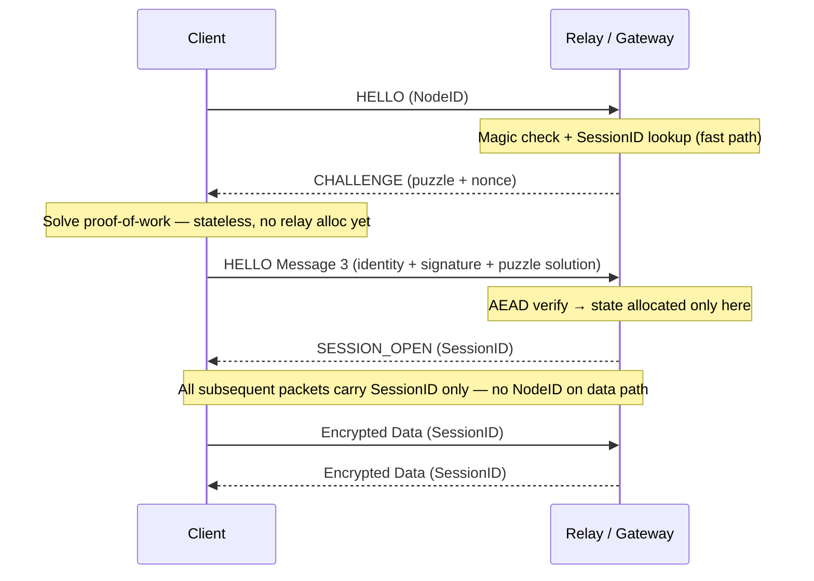

After `SESSION_OPEN`, all packets carry only the SessionID. NodeID values do
not appear in the data path. Session state is allocated only after the
client has passed magic byte validation, challenge-response, and AEAD
verification.

## 32.3 NAT Traversal

ZTLP supports UDP hole punching for direct peer-to-peer connectivity
behind NAT, using the same technique employed by WebRTC, WireGuard, and
Tailscale. When direct NAT traversal fails, the relay provides fallback
transport. This ensures connectivity in environments where direct paths
are not possible without sacrificing the security model.

## 32.4 Path to Kernel and Hardware Acceleration

Kernel integration, eBPF acceleration, and SmartNIC support are optional
enhancements that may follow once the protocol proves useful in
user-space deployments. QUIC operated in user-space for years before
receiving operating system-level support. ZTLP follows the same
trajectory: user-space first, kernel acceleration later. The fixed base
header structure defined in Section 29.2 is intentionally designed to
allow hardware acceleration of the SessionID lookup and HeaderAuthTag
verification paths when SmartNIC or kernel bypass support is available.


---

# 33. Protected Access Plane for Web, Email, and Account Services

ZTLP MAY be used as a protected access plane for high-value
authenticated web, email, and account-management services. In such
deployments, public content MAY remain reachable over the ordinary
Internet, while login, mailbox access, administrative interfaces, and
other sensitive authenticated operations require session establishment
over ZTLP. This reduces anonymous attack traffic against the most
security-sensitive service paths and allows conditional access policies
to be enforced at the network admission layer rather than solely at the
application layer.

This model does not require public Internet access to be replaced. It
defines two coexisting access lanes for any service deployment.

## 33.1 Dual-Lane Service Architecture

A ZTLP-enabled service deployment defines two access lanes with distinct
admission requirements:

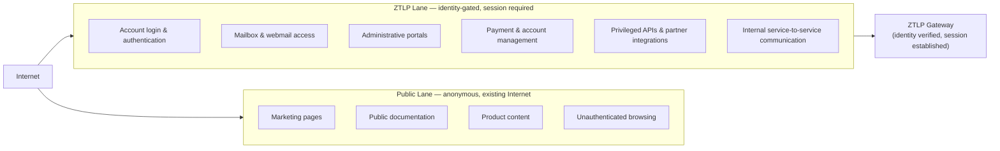

Service discovery for the ZTLP lane MAY be published as a ZTLP-NS record
or a well-known DNS subdomain convention (e.g.,
\_ztlp.service.example.com). The specific naming convention is outside
the scope of this specification; what is normative is that the ZTLP lane
MUST require session establishment and MUST NOT accept unauthenticated
connections.

## 33.2 DDoS and Abuse Reduction on High-Value Paths

Login, email, and account endpoints are among the most abused surfaces
on the Internet. They are always reachable, high-value, and
systematically targeted by credential stuffing, bot-driven account
takeover, and volumetric authentication floods. These attacks work
because sensitive endpoints today accept anonymous connectivity before
any identity is established.

A ZTLP-gated lane inverts this: identity and session establishment are
required before the protected endpoint is reachable. The result is:

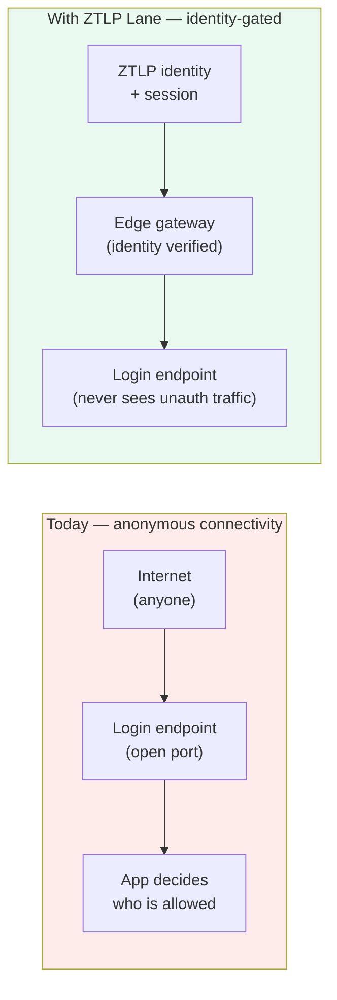

Bot floods, credential stuffing, and unauthenticated scanning never
reach the login application logic. The gateway enforces the ZTLP
three-layer admission pipeline (Section 18.1) before any authenticated path
is exposed. This does not eliminate application-layer security
requirements, but it substantially reduces the volume and diversity of
attack traffic that the application must handle.

## 33.3 Integration with Enterprise Conditional Access

Enterprise identity platforms such as Microsoft 365 Conditional Access
MAY treat successful ZTLP session establishment as an additional
assurance signal - including device enrollment, hardware-backed
identity, and approved network admission path - before permitting
access to protected resources.

Today, conditional access systems evaluate signals such as user
identity, MFA completion, device compliance status, location, and risk
score. A ZTLP network-admission gate adds a transport-layer precondition
before any of those application-layer checks occur:

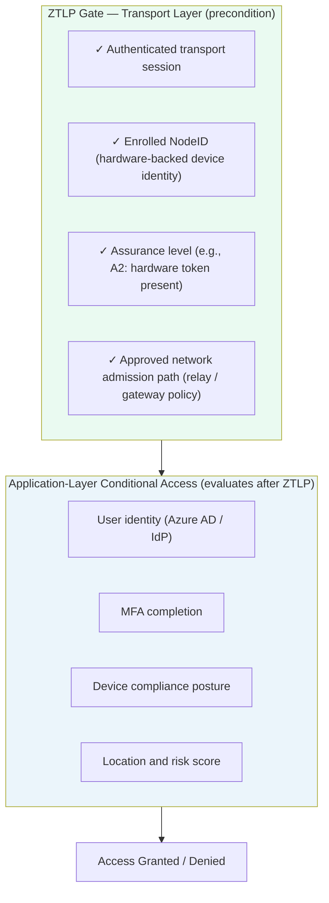

The ZTLP condition - \"allow account access only if the request
arrives through an approved ZTLP session from a compliant, enrolled
device\" - is stronger than application-layer conditional access alone
because the request path itself is identity-gated. A stolen credential
from an unenrolled device cannot traverse the ZTLP lane regardless of
what the credential contains.

## 33.4 Email Service Application

Email infrastructure presents multiple distinct surfaces where ZTLP
protection can be applied incrementally, without requiring changes to
SMTP transport for general mail delivery:

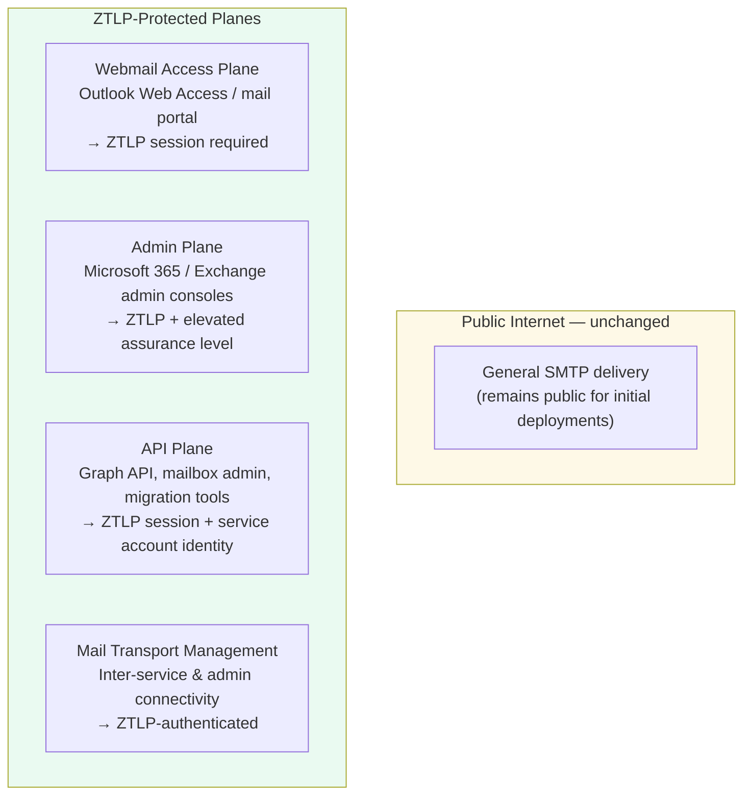

This layered adoption model allows organizations to protect the
highest-risk access paths - account login, admin interfaces, and API
access - without waiting for email transport-layer changes that would
require broader ecosystem coordination.

## 33.5 Example Policy Model

A representative policy model for a dual-lane enterprise web and email
deployment:

| Service Path | Access Requirement |
|---|---|
| Public website | Anonymous — ZTLP not required |
| Account login | ZTLP session required |
| Webmail / mailbox access | ZTLP + managed device |
| Admin portal | ZTLP + A2 assurance + elevated role |
| Partner API | ZTLP + enrolled partner NodeID |
| Payment / account settings | ZTLP + hardware-backed identity (A1+) |

Each policy tier maps directly to a ZTLP assurance level and NodeID
enrollment state, making policy expression and audit both precise and
machine-verifiable. No part of this model requires changes to the
public-facing website, CDN configuration, or general SMTP routing.


---

# 34. Identity-Based Service Routing for Sensitive Web Paths

ZTLP defines a protected access plane for high-value authenticated
actions while allowing ordinary public content to remain reachable over
the traditional Internet. This dual-lane model preserves full web
compatibility while moving login, account access, administration, and
other sensitive operations behind identity-gated transport. ZTLP does
not try to make the entire Internet private. Its value is in making the
important actions identity-gated.

## 34.1 The Core Problem

Most abuse on the modern web does not target homepages or public
content. It targets login endpoints, password reset flows, API
endpoints, checkout and payment flows, mailbox access, and admin panels.
These attacks work because sensitive endpoints today accept anonymous
connectivity before any identity is established. A credential stuffing
tool, a botnet, or a DDoS flood can reach the login endpoint of any
service with zero prior authentication. The endpoint must then spend
resources distinguishing legitimate users from attackers at the
application layer \-- after the connection is already accepted.

ZTLP inverts this model at the transport layer. Identity and session
establishment are required before the protected endpoint is reachable.
Bot floods, credential stuffing, and unauthenticated scanning never
reach the application logic.

## 34.2 Dual-Lane Architecture

A ZTLP-enabled service defines two coexisting access lanes:

### 34.2.1 Public Lane

The public lane remains on the traditional Internet, accessible to any
browser or client without ZTLP enrollment. It is appropriate for:
marketing pages, public documentation, product content, unauthenticated
browsing, and any resource the service intends to be publicly reachable.
No changes to CDN configuration, DNS, or existing web infrastructure are
required for the public lane.

### 34.2.2 ZTLP Lane

The ZTLP lane requires session establishment before the protected
service endpoint is reachable. It is appropriate for: account login and
authentication flows, mailbox and webmail access, administrative portals
and dashboards, payment and account-management interfaces, privileged
APIs and partner integrations, and internal service-to-service
communication. The ZTLP lane is published via a ZTLP-NS record or DNS
convention such as \_ztlp.service.example.com. ZTLP-aware clients
discover relay endpoints, service identity, and policy requirements
automatically.

## 34.3 Technical Architecture

A company runs a ZTLP gateway in front of the sensitive portion of its
service. The flow is:

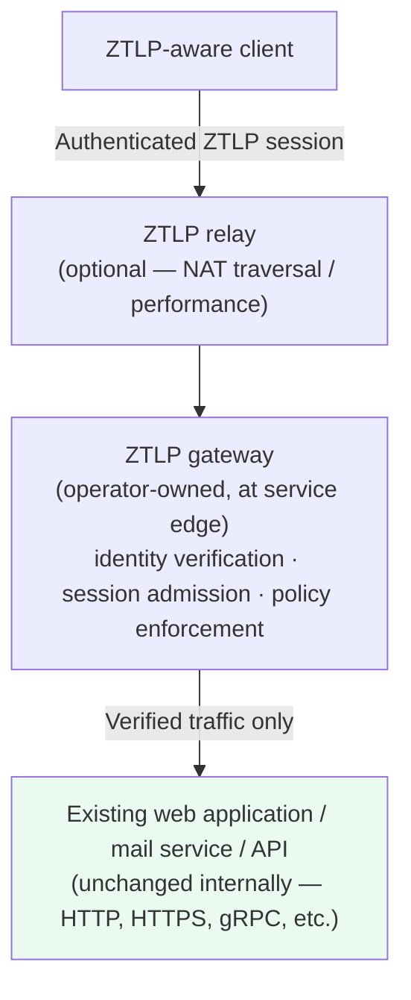

The application behind the gateway requires no modification. It
continues operating over HTTP, HTTPS, gRPC, or any internal protocol.
The ZTLP gateway handles identity verification, session admission, and
policy enforcement at the network edge before traffic reaches the
application.

## 34.4 Why This Drives Adoption

Organizations do not need to replace their entire web stack to deploy
ZTLP. They can start with a single high-value path \-- a login endpoint,
an admin panel, a billing API \-- and leave everything else unchanged.
Early deployments can prove abuse reduction, DDoS resistance, and
audit-trail quality on a small surface before expanding to additional
paths. This incremental deployment model is the correct strategy for any
new network security layer.

The first targets with the strongest ROI story are: Microsoft 365 and
SaaS admin consoles, healthcare patient portals and EHR systems, banking
and finance account management, webmail and enterprise email access
planes, partner and B2B API endpoints, and internal dashboards for
regulated industries.

## 34.5 Identity-Gated Routing as a Protocol Primitive

ZTLP makes identity-gated routing a transport-layer primitive rather
than an application-layer policy. This distinction is significant.
Application-layer access controls (OAuth tokens, session cookies, API
keys) operate after the connection is accepted. They require the
endpoint to process the request before determining whether the requester
is authorized. ZTLP enforces the authorization condition at connection
admission \-- no session state is allocated, no application logic runs,
and no server resources are consumed for unauthenticated traffic.

This model is described throughout this specification as identity before
connectivity. Section 34 applies that principle specifically to the web
access plane, giving service operators a concrete deployment model that
does not require protocol-level changes to their existing application
infrastructure.

## 34.6 Relationship to Section 32

Section 33 of this specification defines the Protected Access Plane
model for web, email, and account services, including the dual-lane
architecture, DDoS abuse reduction rationale, enterprise conditional
access integration, and example policy model. Section 33 extends that
model by formalizing identity-based service routing as a general ZTLP
capability \-- applicable beyond email and web to any sensitive service
endpoint \-- and by articulating the deployment and adoption rationale
for organizations evaluating ZTLP for the first time.

# 35. Session Lifecycle, Rekeying, and Relay State Management

ZTLP sessions are not permanent. Each session has a defined lifetime,
rekeying policy, and termination procedure. Without explicit lifecycle
management, relay session tables would grow unboundedly, old session
state would consume memory indefinitely, and stale SessionIDs could
become a target for replay or enumeration attacks.

## 35.1 Session Lifetime

Every ZTLP session MUST have a maximum lifetime defined at session
establishment. The session lifetime is negotiated during the handshake
and included in the `SESSION_OPEN` message. The maximum allowed session
lifetime for any single session is 24 hours. Sessions MUST NOT be
renewed beyond this limit without full re-authentication. Short-lived
sessions SHOULD be preferred for sensitive service access. The
recommended default session lifetime for interactive user sessions is 8
hours. Service-to-service and API sessions MAY use shorter lifetimes
appropriate to the application.

## 35.2 Rekeying

Session keys MUST be rotated before the session lifetime expires and
MUST be rotated upon any of the following conditions:

-   Elapsed time since last keying exceeds the CryptoSuite-defined
    rekeying interval (default: 1 hour).

-   Packet sequence number approaches the maximum window. Sessions MUST initiate rekeying when PacketSeq reaches 2^48 (281,474,976,710,656). This threshold provides a safety margin below the 2^64 nonce space to account for implementation variance and ensures no single key encrypts an excessive volume of data. The 2^48 threshold is consistent with the AEAD safety limits recommended for ChaCha20-Poly1305.

-   Explicit REKEY message received from either endpoint.

-   Policy change requiring key freshness (for example, assurance level
    re-validation).

Rekeying MUST NOT interrupt active data transfer. Applications MUST NOT
observe a connection interruption during key rotation. A new SessionID
is issued on each rekeying event. Relay forwarding tables MUST be
updated atomically to avoid dropped packets during the transition. The
old SessionID MUST remain valid for a short overlap window (recommended:
5 seconds) to allow in-flight packets to drain before the old entry is
removed.

### 35.2.1 REKEY Wire Format (MsgType = 3)

A REKEY initiates an in-session Noise\_XX handshake to derive fresh
session keys and a new SessionID. The REKEY message uses the full
96-byte handshake header (Section 8.1) with the **current** session's
encryption. The payload contains:

```
  Offset  Size    Field
  ──────  ──────  ─────────────────────────────────
  0       32      Noise Message 1 (new ephemeral pubkey `e`)
  32      12      Proposed SessionID (new, generated by initiator)
  44      2       Proposed CryptoSuite (uint16, may differ from current)
  46      2       Proposed rekey interval (uint16, seconds)
```

The REKEY flag (bit 2) MUST be set in the header Flags field. The
`SessionID` in the header is the **current** (old) session — the new
SessionID takes effect only after the full three-message Noise exchange
completes.

**REKEY response flow:**

1.  Endpoint A sends REKEY (Noise Message 1 + proposed SessionID).
2.  Endpoint B responds with MsgType = 2 (HELLO\_ACK) carrying Noise
    Message 2, with the REKEY flag set and the current SessionID.
3.  Endpoint A sends MsgType = 0 (DATA) carrying Noise Message 3,
    encrypted under the **old** session keys.
4.  Both endpoints derive new keys. Endpoint B installs the new
    SessionID in the relay forwarding table.
5.  The old SessionID remains valid for the overlap window (5 seconds).

If Endpoint B rejects the proposed CryptoSuite, it MUST respond with
ERROR (code `0x07`) instead of HELLO\_ACK.

## 35.3 Session Termination

Sessions are terminated through one of three mechanisms: explicit CLOSE
message, session lifetime expiry, or relay-detected inactivity timeout.
Upon receiving a CLOSE message, the relay MUST remove the SessionID from
its forwarding table within 30 seconds and MAY do so immediately. Upon
session lifetime expiry, both endpoints MUST treat the session as
terminated. Relays SHOULD expire sessions whose last packet was seen
more than the configured inactivity timeout ago (recommended default: 5
minutes for interactive sessions, 30 minutes for background service
sessions).

### 35.3.1 CLOSE Wire Format (MsgType = 4)

A CLOSE message is sent by either endpoint to gracefully terminate a
session. It uses the full 96-byte handshake header, encrypted under the
current session keys. The payload contains:

```
  Offset  Size    Field
  ──────  ──────  ─────────────────────────────────
  0       1       Reason code (uint8)
  1       8       Final packet sequence (uint64, highest seq sent)
  9       var     Reason detail (UTF-8 string, optional)
```

**Reason Code Table:**

| Code | Name | Description |
|------|------|-------------|
| 0x00 | NORMAL | Graceful close initiated by application. |
| 0x01 | IDLE\_TIMEOUT | Session idle timeout exceeded. |
| 0x02 | LIFETIME\_EXPIRED | Session maximum lifetime reached. |
| 0x03 | POLICY\_CHANGE | Policy no longer permits this session. |
| 0x04 | KEY\_COMPROMISE | Key compromise suspected; immediate teardown. |
| 0x05 | ADMIN\_CLOSE | Administrative forced closure. |
| 0xFF | UNSPECIFIED | No specific reason provided. |

Upon receiving CLOSE, the peer MUST:

1.  Stop sending new DATA packets on this session.
2.  Send its own CLOSE (with its final packet sequence) as acknowledgment
    if it has not already sent one.
3.  Retain the session state for a drain period (recommended: 5 seconds)
    to process any in-flight packets.
4.  Remove the session from its local table after the drain period.

Relays that observe a CLOSE in either direction SHOULD begin their
cleanup timer (Section 35.4) immediately rather than waiting for the
inactivity timeout.

## 35.4 Relay State Cleanup

Relay nodes MUST implement session table garbage collection. The relay
session table MUST remove entries in the following cases:

-   A CLOSE message is received for the SessionID.

-   The session lifetime recorded at `SESSION_OPEN` has elapsed.

-   No packet has been seen for the SessionID within the inactivity
    timeout.

-   The gateway or endpoint signals session termination via relay
    control channel.

Relay implementations MUST bound their session table size. When the
table approaches capacity, relays SHOULD refuse new session admissions
rather than evict active sessions arbitrarily. Relay operators MUST
provision sufficient table capacity for their expected concurrent
session load plus a margin for burst conditions. Relay session table
state is not replicated to other relays by default; session failover
requires re-establishment via the handshake process.

# 36. Client Path Selection Summary

ZTLP clients select relay paths using a combination of relay discovery,
PathScore computation, and adaptive monitoring. This section summarizes
the client-side path selection rules that implementers MUST follow for
prototype and production compatibility.

## 36.1 Path Selection Rules

A ZTLP client MUST apply the following path selection logic when
establishing or maintaining a session:

### 36.1.1 Direct Path Preference

If the destination node is directly reachable (same network segment, or
successful NAT traversal without relay assistance), the client SHOULD
prefer a direct path over a relayed path. Direct paths MUST still
complete the full ZTLP handshake and session establishment. Relay paths
are used when direct connectivity is unavailable, when policy requires
relay transit for logging or enforcement, or when relay-mediated path
has materially lower latency than the direct path.

### 36.1.2 Relay Path Selection

When a relay is required, the client MUST select the relay with the
lowest PathScore from the candidate set produced by consistent hashing
(Section 12.2). PathScore is computed as: PathScore = w1 \* Latency + w2
\* PacketLoss + w3 \* CongestionLevel + w4 \* TrustScore. Lower
PathScore is preferred. The client MUST maintain at least two active
relay paths simultaneously for failover.

### 36.1.3 Multi-Relay Path

When no single relay provides adequate connectivity, the client MAY use
a multi-relay path through the geographic relay hierarchy (Section
12.6). Multi-relay paths SHOULD be selected using the Dijkstra-based
path computation defined in Section 15.1.1. The client SHOULD prefer the
path with minimum total PathScore across all hops. Multi-relay paths
increase latency and SHOULD only be used when single-relay paths are
unavailable or inadequate.

## 36.2 Relay Discovery

Before selecting a relay path, the client MUST discover available relays
using one or more of the following mechanisms, in order of preference:

-   DNS-based discovery: query \_ztlp-relay.\<domain\> SRV or TXT
    records to retrieve relay endpoints published by the service
    operator.

-   ZTLP-NS lookup: query the ZTLP_RELAY record for the target service
    in the distributed namespace.

-   Bootstrap seed list: use the operator-provided seed relay list
    embedded in client configuration or obtained during enrollment.

-   Local configuration: use administratively configured relay addresses
    for private or enterprise deployments.

Clients MUST NOT rely on a single relay discovery mechanism.
Implementations SHOULD attempt multiple discovery methods and aggregate
results. Discovered relay lists MUST be authenticated (signed by the
relay operator\'s key published in ZTLP-NS) before use. Unauthenticated
relay advertisements MUST be rejected to prevent relay spoofing attacks.

## 36.3 Path Monitoring and Failover

Clients MUST continuously monitor active relay path quality. If
PathScore for the current path exceeds the hysteresis threshold (Section
15.1.3) compared to an available alternative, the client SHOULD migrate
to the better path. If the current relay path fails (no packets received
within the keepalive timeout), the client MUST failover to the secondary
relay path immediately, without application-layer session interruption.
The SessionID remains stable across path changes, as defined in Section
29.3.

# 37. Relay Abuse Protection

ZTLP relay nodes are high-value infrastructure that must be protected
against both volumetric attacks and protocol-level abuse. Section 27
defines handshake flood resistance. This section defines additional
relay-level protections for established session traffic and per-identity
usage limits.

## 37.1 Per-Identity Rate Limits

Relay nodes SHOULD enforce per-NodeID rate limits on session
establishment. A single NodeID MUST NOT be permitted to establish
sessions faster than the relay\'s configured admission rate. Recommended
defaults:

-   Maximum new sessions per NodeID per minute: 10 (configurable per
    deployment).

-   Maximum concurrent sessions per NodeID: 50 (configurable per
    deployment).

-   Maximum data throughput per session: operator-defined, enforced via
    the `BANDWIDTH_HINT` TLV.

NodeIDs that exceed rate limits SHOULD receive a RATE_LIMIT error
response rather than being silently dropped, to allow legitimate clients
to back off. NodeIDs appearing on relay blacklists (signed revocation
records in ZTLP-NS) MUST be rejected immediately at the Stateless
Admission Challenge stage, before any session state is created.

## 37.2 Per-Session Quotas

Relay nodes MAY enforce per-session data quotas to prevent individual
sessions from consuming disproportionate relay capacity. Sessions
exceeding their data quota SHOULD receive a QUOTA_EXCEEDED error and be
terminated gracefully. Quota parameters MAY be specified by the gateway
or service operator via relay policy records in ZTLP-NS. Relay operators
SHOULD publish their quota policies in relay advertisements so clients
can perform relay selection accordingly.

## 37.3 Relay Admission Control

In addition to the Ingress Admission Domain model defined in Section
12.4, relay nodes SHOULD implement dynamic admission control based on
current load:

-   When session table occupancy exceeds 80% of capacity, the relay
    SHOULD begin refusing new session requests with a RELAY_BUSY error,
    directing clients to alternative relays.

-   When processing load exceeds defined thresholds, the relay MAY apply
    graduated Stateless Admission Challenge difficulty increases
    (Section 18.3) to rate-limit new handshake attempts.

-   Relay nodes MUST NOT drop established authenticated sessions to
    accommodate new admission requests; load shedding MUST only affect
    new session establishment.

The maximum session table size is deployment-specific and SHOULD be configured based on available memory and CPU resources. Implementations MUST expose the maximum session count as a configuration parameter with a default of 65,536 (matching the eBPF session_map default). The '80% of capacity' threshold for admission control is computed as `0.8 × max_sessions`.

## 37.4 Authenticated Session Priority

During high load or attack conditions, relay nodes SHOULD prioritize
forwarding of established authenticated sessions over processing new
handshake requests. This ensures that existing legitimate sessions are
not disrupted by handshake floods or resource exhaustion attacks
targeting the relay admission path. Relay nodes SHOULD use separate
processing queues for established data-plane traffic and control-plane
handshake traffic, with data-plane forwarding receiving priority
resource allocation.

# 38. Federated Identity Architecture

ZTLP identity is federated by default: trust is rooted in one or more
configured authorities, names are delegated hierarchically, and proof of
identity is established through cryptographic possession of keys bound
to a stable NodeID. This section provides a consolidated summary of the
identity architecture that underlies all ZTLP protocol operations.

## 38.1 Three-Layer Identity Model

ZTLP identity is organized into three distinct layers, each answering a
different trust question.

**Layer 1 - Root Trust.** Answers: "Who is allowed to vouch for
identities?" Multiple trust roots MAY coexist: public roots, enterprise
roots, industry-sector roots, and private roots. No single root SHALL be
required. This applies equally to ZTLP governance itself - the
protocol does not require trust in any single authority, including the
body that published this specification.

**Layer 2 - Namespace and Delegation.** Answers: "Who controls names
and service identity records?" ZTLP-NS (Section 9) provides hierarchical
delegation analogous to DNS, with signed records and local control over
sub-namespaces. Cross-organization trust is established only when
explicitly delegated. Unsigned records MUST be rejected.

**Layer 3 - Node Credential.** Answers: "How does a device or service
prove it is really that identity?" The NodeID is stable; the key rotates
independently. Private keys SHOULD be hardware-bound where available
(TPM 2.0, Secure Enclave, ARM TrustZone). Attestation and assurance
levels are optional but policy-aware, as defined in Section 16.3.

## 38.2 Supported Identity Classes

ZTLP explicitly supports the following identity classes, each
represented by a NodeID and associated credential in ZTLP-NS:

| Identity Class | Description |
|---|---|
| **User identities** | Human principals using browsers, native clients, or administrative tools. |
| **Device identities** | Laptops, mobile devices, servers, and network appliances. |
| **Service identities** | APIs, applications, and microservices published via ZTLP_SVC records. |
| **Relay identities** | Relay nodes and operator infrastructure, published via ZTLP_RELAY records. |
| **Gateway identities** | Service edges and policy enforcement points that terminate ZTLP sessions on behalf of protected services. |

## 38.3 Granular Trust Evaluation

A client or gateway MUST NOT ask "Do I trust the entire ZTLP network?"
Trust decisions are per-interaction and MUST evaluate the following
independently:

| Trust Question |
|---|
| Do I trust this root authority? |
| Do I trust this namespace delegation chain? |
| Do I trust this service's policy and assurance requirements? |
| Do I trust this relay operator enough to route this session? |

This model enables fine-grained deployment policies. An organization MAY
state: "We trust our own enterprise root only" for internal services,
"We trust these two partner roots for B2B API access," and "Admin access
requires Assurance Level A2." These policies are expressible entirely
within existing ZTLP-NS `ZTLP_POLICY` records.

## 38.4 Canonical Identity Flow

The following flow summarizes how ZTLP identity operates end-to-end for
a typical session:

> **1. Enrollment.** The node generates a key pair on hardware where
> available, submits its public key to an enrollment authority, and
> receives a stable NodeID with a signed binding record published to
> ZTLP-NS.
>
> **2. Discovery.** The client resolves the target service identity,
> relay options, policy requirements, and acceptable trust roots from
> ZTLP-NS.
>
> **3. Handshake.** The node proves possession of its current private
> key and, optionally, device posture or assurance level, as defined in
> Section 11.
>
> **4. Policy Decision.** The service gateway evaluates the NodeID
> against the trust chain, assurance level, and `ZTLP_POLICY` record.
> Access is granted or denied before any session state is allocated.
>
> **5. Session.** The gateway issues a SessionID and traffic transitions
> to the relay fast-path as defined in Section 29.5. Identity verification
> does not re-occur per packet; the SessionID binding established at
> handshake carries the trust context for the session lifetime.

## 38.5 Design Rationale

The federated model was chosen over fully centralized and fully
decentralized alternatives. A centralized identity model is
operationally simple but creates a single point of control, a single
point of failure, and a political and economic bottleneck. A fully
decentralized model with no authority structure is difficult to trust,
difficult to revoke, and difficult for normal organizations to onboard
into. The federated model - hierarchical delegation with multiple
independent roots - provides local autonomy, interoperability across
organizations, clear revocation paths, and enterprise readiness, while
preserving decentralization at the governance layer. ZTLP's identity
architecture is intentionally analogous to the combination of DNS and
DNSSEC (for naming and delegation), TLS PKI (for signed trust chains),
and WireGuard or SSH (for hardware-bound key proof), unified within a
single protocol ecosystem.

# 39. Admission Plane and Forwarding Plane Separation

## 39.1 Architectural Overview

ZTLP separates session admission from established-session forwarding in
order to maintain scalability and resilience under hostile network
conditions.

Session admission operations involve expensive cryptographic
verification, policy evaluation, and identity validation. These
operations are intentionally confined to a bounded set of relays known
as ingress relays.

Once a session is successfully established, forwarding responsibilities
shift to the transit relay fabric, where packets are forwarded using the
SessionID as the primary routing primitive.

This separation allows ZTLP to maintain strong identity verification
without imposing excessive computational cost on the entire relay
network.

## 39.2 Admission Plane

The Admission Plane is responsible for evaluating and establishing new
ZTLP sessions. Admission operations include node identity verification,
cryptographic handshake processing, namespace resolution, policy
enforcement, device assurance validation, relay authorization checks,
and SessionID allocation.

Admission requests MUST be handled only by a deterministically assigned
ingress relay set. This prevents attackers from forcing every relay in
the network to process expensive handshake operations. Ingress relays
MAY implement rate limiting, computational puzzles, proof-of-work
challenges, device posture verification, and relay admission tokens to
ensure that session creation remains resistant to large-scale handshake
flood attacks.

## 39.3 Deterministic Ingress Assignment

ZTLP clients MUST determine an ingress relay set using a deterministic
mapping derived from one or more of the following identifiers: NodeID,
ServiceID, Namespace identifier, or geographic relay domain. A
consistent hashing algorithm SHOULD be used to assign nodes or services
to a bounded set of ingress relays.

This mechanism distributes admission load across the relay
infrastructure and prevents adversaries from concentrating admission
traffic on a single relay. By limiting admission to a predictable relay
subset, the network ensures that attack traffic cannot simultaneously
pressure the entire relay mesh.

## 39.4 Forwarding Plane

Once a session is established, ZTLP relays transition packet processing
to the Forwarding Plane. Forwarding-plane relays validate the packet
magic identifier, perform a SessionID lookup, verify the lightweight
forwarding authenticator, and forward the packet to the next-hop relay.

Relays MUST NOT perform full identity verification for
established-session packets. Instead, SessionID acts as a session label
that determines packet forwarding behavior. This enables relay
forwarding to operate as a constant-time lookup operation, similar to
label switching systems used in high-performance carrier networks.

## 39.5 SessionID as Forwarding Label

The SessionID assigned during session establishment functions as the
primary routing label within the ZTLP relay fabric. Relays maintain a
local mapping table of SessionID to Next Hop Relay, and packets
belonging to established sessions are forwarded exclusively using this
mapping.

ZTLP relays function as session-label switching nodes. Once a session is
established, forwarding decisions are performed using the SessionID as a
constant-time label lookup rather than traditional routing decisions.
SessionID-based forwarding provides constant-time packet routing,
minimal per-packet computation, relay scalability across large networks,
and compatibility with hardware acceleration. Because SessionIDs
represent authenticated and policy-approved sessions, relays are not
required to repeat expensive admission logic for every packet.

## 39.6 Attack Containment

Separating admission and forwarding planes provides strong resistance to
distributed denial-of-service attacks. Under attack conditions,
handshake floods are confined to ingress relays, transit relays continue
forwarding established sessions, service gateways remain insulated from
handshake pressure, and relay CPU resources remain available for
legitimate sessions. This design ensures that large-scale handshake
floods cannot easily degrade the entire relay infrastructure.

## 39.7 Design Rationale

ZTLP explicitly separates identity verification from packet forwarding
to maintain performance at Internet scale. Without this separation,
relay nodes would be forced to perform expensive cryptographic and
policy operations for every packet or connection attempt. By isolating
these operations to the admission plane and allowing the forwarding
plane to operate using SessionID label switching, ZTLP achieves both
strong identity-based security and scalable high-performance packet
transport.

# 40. ZTLP Relay Roles and Network Topology

ZTLP uses a distributed relay infrastructure to provide scalable, secure
transport across the public Internet. Relay nodes participate in the
ZTLP network by forwarding authenticated session traffic and assisting
with session establishment. To support scalability and operational
flexibility, ZTLP defines several logical relay roles. A single relay
implementation MAY perform multiple roles simultaneously depending on
deployment requirements. The primary relay roles are Ingress Relays,
Transit Relays, Gateway Relays, and Service Relays.

## 40.1 Ingress Relays

Ingress relays serve as the entry point for new sessions into the ZTLP
network. They participate in the Admission Plane and are responsible for
processing session establishment requests, including verifying node
identities, performing namespace resolution, validating policy and
device assurance requirements, allocating SessionIDs, and assigning
initial relay paths.

Ingress relays MAY enforce protective mechanisms including rate
limiting, admission token validation, proof-of-work challenges, and
client reputation filtering. By restricting admission processing to
ingress relays, ZTLP prevents attackers from forcing the entire relay
infrastructure to perform expensive handshake operations. Ingress relays
SHOULD be deterministically selected using consistent hashing to
distribute admission load across the relay network.

## 40.2 Transit Relays

Transit relays form the core transport fabric of the ZTLP network. They
operate exclusively within the Forwarding Plane and are responsible for
forwarding packets belonging to established sessions. Transit relays
perform only lightweight processing: validating the packet magic
identifier, performing a SessionID lookup, verifying the forwarding
authenticator, and forwarding the packet to the next-hop relay.

Transit relays MUST NOT perform identity verification for established
sessions. This allows transit relays to function as high-speed SessionID
switching nodes, enabling scalable packet forwarding across the relay
network. Transit relays SHOULD maintain minimal session state limited to
SessionID forwarding tables.

## 40.3 Gateway Relays

Gateway relays provide connectivity between the ZTLP network and
external services or legacy networks. They terminate ZTLP sessions and
forward authenticated traffic to protected services, including
decrypting session payloads, enforcing service-level policy, translating
between ZTLP transport and local service protocols, and validating user
or device authorization.

Gateway relays commonly protect web applications, APIs, administrative
systems, and private enterprise infrastructure. They MAY enforce
additional security controls including multi-factor authentication,
device posture verification, service access restrictions, and
namespace-based access policies.

## 40.4 Service Relays

Service relays advertise service availability within the ZTLP namespace
and facilitate discovery of protected services. They provide metadata
including service identity, available gateway relays, required assurance
levels, and supported relay paths, enabling ZTLP clients to locate
appropriate gateway nodes when initiating sessions to protected
services. In many deployments, service relay functionality MAY be
integrated directly into gateway relays.

## 40.5 Relay Role Composition and Network Topology

ZTLP does not require relays to operate in a single exclusive role. A
relay implementation MAY perform multiple functions simultaneously, such
as combined ingress and transit, or transit and gateway roles. Large
relay operators MAY deploy specialized nodes optimized for specific
roles, while smaller deployments MAY run combined relay roles on the
same infrastructure.

ZTLP relay nodes form a distributed mesh network spanning multiple
geographic and administrative domains. Once a session is established,
relay path selection algorithms determine the optimal sequence of
transit relays based on latency, packet loss, congestion, relay trust
score, and geographic proximity. Because session forwarding relies on
SessionID label switching, relay paths may consist of multiple hops
without significantly increasing packet processing cost.

# 41. ZTLP Threat Model

ZTLP is designed to provide secure, identity-first connectivity across
untrusted public networks. The protocol assumes that the underlying
Internet infrastructure may be hostile, unreliable, or subject to active
attack. ZTLP therefore incorporates architectural mechanisms to mitigate
common threats including large-scale denial-of-service attacks,
unauthorized service access, identity spoofing, and network
reconnaissance.

This section defines ZTLP's attacker models, enumerates specific threat
classes and their mitigations, describes what ZTLP explicitly does NOT
defend against, states the protocol's trust assumptions, and summarizes
the cryptographic security properties provided by the protocol.

## 41.1 Attacker Models

ZTLP's security analysis considers seven distinct attacker classes,
ranging from passive observation to full endpoint compromise. Each class
is defined by the attacker's capabilities, position in the network, and
the protocol mechanisms that constrain the attacker's impact.

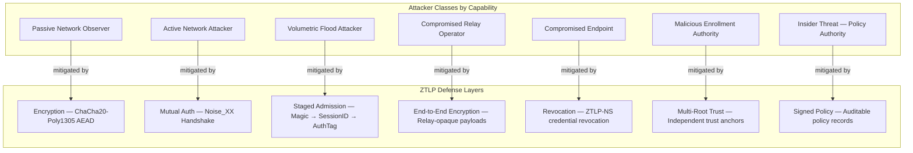

### 41.1.1 Passive Network Observer

A passive network observer can monitor network traffic without modifying
it. This attacker class includes ISPs, backbone tap operators,
intelligence agencies performing lawful intercept at network
interconnection points, and any entity with read access to traffic
transiting a link.

**What the attacker can observe:**

- Encrypted ZTLP packet payloads (ciphertext only)
- SessionIDs visible in packet headers (rotate per session; see Section 35)
- Relay IP addresses (source and destination at each hop)
- Traffic volume, timing patterns, and session duration
- Packet sizes and inter-packet timing

**What the attacker CANNOT observe:**

- NodeIDs — NodeIDs are not carried on the data-path wire format;
  they are established during the Noise_XX handshake and are not
  visible to network observers
- Payload content — all session data is encrypted under
  ChaCha20-Poly1305 AEAD with keys derived from the Noise_XX handshake
- Service identity — the identity of the protected service behind a
  gateway relay is not exposed in any packet header or metadata
  observable on the wire
- Session keys — ephemeral keys are never transmitted; they are
  derived via X25519 Diffie-Hellman key agreement

**Mitigation summary:** ZTLP's encryption ensures that a passive
observer gains no information about payload content, communicating
identities, or protected service identity. The observer can perform
traffic analysis (see Section 41.3 for explicit limitations).

### 41.1.2 Active Network Attacker

An active network attacker can inject, modify, reorder, replay, and
drop packets. This attacker class includes entities in a man-in-the-middle
(MITM) position such as compromised routers, malicious Wi-Fi access
points, and BGP hijack operators.

**Capabilities:**

- Inject forged packets into active sessions
- Modify packet contents in transit
- Replay previously captured packets
- Drop or delay legitimate packets
- Redirect traffic via routing manipulation

**Mitigations:**

- **Mutual authentication:** The Noise_XX handshake provides mutual
  authentication of both communicating parties. An active attacker
  cannot complete a handshake without possessing a valid private key
  bound to a recognized NodeID.
- **AEAD on every packet:** Every ZTLP data packet is protected by
  ChaCha20-Poly1305 AEAD. Modified or forged packets fail
  authentication and are silently discarded.
- **HeaderAuthTag validation:** The forwarding authenticator
  (HeaderAuthTag) in each packet header is validated by relay nodes.
  Packets with invalid HeaderAuthTags are rejected before any
  forwarding state is consulted.
- **Anti-replay protection:** 64-bit packet sequence numbers with a
  sliding anti-replay window (see Section 35) ensure that replayed
  packets are detected and discarded.

**Residual risk:** An active attacker can perform denial of service by
dropping packets. ZTLP mitigates this through multi-path relay selection
(see Section 36) — clients MAY detect path degradation and failover to
alternative relay paths.

### 41.1.3 Volumetric Flood Attacker

A volumetric flood attacker generates large volumes of traffic to
exhaust relay resources (bandwidth, CPU, memory, session table
capacity). This attacker class includes botnets, amplification attacks,
and state-sponsored DDoS campaigns.

**ZTLP's three-layer admission pipeline** provides staged defense
against volumetric attacks, with each layer progressively more expensive
but handling a progressively smaller fraction of attack traffic:

| Layer | Check | Cost | Effect |
|-------|-------|------|--------|
| L1 — Magic byte | Two-byte comparison against `0x5A37` | ~19 ns (Rust) / ~89 ns (Elixir) | Rejects all non-ZTLP traffic with zero state allocation |
| L2 — SessionID lookup | Hash table membership test | O(1) lookup | Rejects traffic with unknown SessionIDs; no cryptographic work |
| L3 — HeaderAuthTag | AEAD verification (ChaCha20-Poly1305) | ~200–500 ns | Rejects forged packets targeting valid SessionIDs |

The vast majority of volumetric flood traffic is random garbage that
fails L1, consuming negligible CPU. Traffic crafted with the correct
magic byte but a random SessionID fails L2. Only traffic that guesses
both the correct magic byte AND a valid SessionID (a 2^-96 probability
for a random guess against a sparse session table) reaches L3.

**Additional architectural mitigations:**

- **Admission plane separation:** Session establishment (handshake
  processing) is handled only by ingress relays assigned to the
  requesting client's admission domain. Flood traffic targeting session
  creation is confined to specific ingress relays and cannot propagate
  to the transit or gateway relay tiers (see Section 39).
- **Ingress relay distribution:** Clients are deterministically assigned
  to bounded ingress relay sets. An attacker targeting a specific
  service's admission domain MUST first discover which ingress relays
  serve that domain — information that is not publicly enumerable.
- **Proof-of-work puzzles:** Ingress relays MAY require clients to
  solve computational puzzles during session establishment under load
  (see Section 27), increasing the cost of session-creation floods.
- **Stateless admission challenge:** The stateless cookie mechanism
  (Section 18.3) prevents source-address-spoofed handshake floods from
  allocating relay state.

### 41.1.4 Compromised Relay Operator

A compromised relay operator has full administrative control over one or
more relay nodes, including access to the relay's operating system,
memory, storage, and network interfaces.

**What a compromised relay operator CANNOT do:**

- **Decrypt session payloads.** Session encryption is end-to-end between
  the communicating nodes. Relay nodes forward opaque ciphertext and
  never possess session keys. Even with full memory access, the relay
  does not hold the Noise_XX session keys — these exist only at the
  endpoints.
- **Forge sessions.** Session establishment requires a Noise_XX
  handshake between the communicating nodes. The relay does not
  participate in key agreement and cannot generate valid session keys or
  SessionIDs for sessions it is not authorized to relay.
- **Impersonate nodes.** Node identity is bound to Ed25519 signing keys
  and X25519 static keys held by the communicating endpoints. A relay
  operator does not possess these keys and cannot complete a Noise_XX
  handshake (which requires the X25519 static key) as a different node.

**What a compromised relay operator CAN do:**

- **Observe metadata:** source and destination relay IP addresses,
  session timing and duration, traffic volume per session, and the set
  of SessionIDs transiting the relay.
- **Selectively drop or delay packets.** Mitigated by multi-path relay
  selection (Section 36): clients that detect path degradation MAY
  failover to alternative relay paths. Multi-path redundancy limits the
  impact of a single compromised relay.
- **Attempt traffic analysis.** The relay can correlate traffic patterns
  across sessions to infer communication relationships. ZTLP does not
  claim protection against traffic analysis (see Section 41.3).

**Architectural containment:** The relay role composition model (Section
40.5) allows deployments to distribute trust across multiple independent
relay operators. No single relay operator needs to see both the ingress
and egress sides of a session when multi-hop relay paths are used.

### 41.1.5 Compromised Endpoint

A compromised endpoint is one where the attacker has obtained the
node's long-term private keys (Ed25519 signing key and/or X25519 static
key), either through malware, physical access, or key extraction from
software storage.

**ZTLP cannot protect against this attacker class.** If the attacker
possesses a node's private key, the attacker IS that node from the
protocol's perspective. ZTLP's security boundary is the cryptographic
identity: any entity that can prove possession of a valid private key is
treated as the corresponding NodeID.

**External mitigations (outside ZTLP's protocol boundary):**

- **Hardware-backed keys (TPM, Secure Enclave, YubiKey):** Private keys
  stored in hardware security modules cannot be extracted, even by
  malware with root access. ZTLP SHOULD be deployed with hardware key
  storage in high-assurance environments (see Section 16).
- **Device posture checks:** Admission policies MAY require device
  attestation (OS version, patch level, security configuration) before
  granting session access.
- **Rapid revocation via ZTLP-NS:** Compromised node credentials can be
  revoked through ZTLP-NS namespace authorities. Revocation propagates
  to relays, which MUST reject sessions from revoked NodeIDs.
- **Session rate limiting:** Anomalous session creation patterns from a
  compromised node are detectable and rate-limitable at ingress relays.

### 41.1.6 Malicious Enrollment Authority

An Enrollment Authority (Section 23.2) issues identity bindings that
associate NodeIDs with cryptographic keys. A compromised or malicious
Enrollment Authority could issue fraudulent identity bindings, granting
attacker-controlled keys the ability to authenticate as legitimate
nodes.

**Mitigations:**

- **Multiple independent trust roots:** ZTLP deployments MAY configure
  multiple independent trust roots (Section 23.1). Cross-root
  verification allows relying parties to require identity attestation
  from more than one trust root before granting access.
- **Transparency and audit logs:** Enrollment operations SHOULD be
  logged to append-only audit logs, enabling detection of unauthorized
  identity issuance.
- **Delegation scope limits:** The delegation model (Section 23)
  constrains each Enrollment Authority to a defined namespace scope.
  A compromised authority can only issue identities within its
  delegated namespace, not across the entire ZTLP network.

**Acknowledged limitation:** If a relying party trusts a single trust
root and that root's Enrollment Authority is compromised, all identities
issued under that root are suspect. Deployments with high assurance
requirements SHOULD configure multiple independent trust roots and
require cross-root verification for sensitive operations.

### 41.1.7 Insider Threat (Policy Authority)

A Policy Authority (Section 23) issues signed policy records that
define access control rules — which NodeIDs may communicate with which
services under what conditions. A malicious or compromised Policy
Authority could grant unauthorized access by issuing permissive policy
records.

**Mitigations:**

- **Signed policy records:** All policy records are cryptographically
  signed by the issuing Policy Authority. Policy changes are auditable
  and attributable.
- **Separation of authorities:** ZTLP separates Enrollment Authorities,
  Policy Authorities, and Revocation Authorities into distinct roles
  (Section 23). Compromising the Policy Authority does not grant the
  ability to create new identities or suppress revocation.
- **Delegation model scope limits:** Policy Authorities operate within
  delegated scopes. A compromised Policy Authority can only affect
  policy within its delegated namespace.
- **Policy record expiration:** Policy records SHOULD include validity
  periods. Expired policy records MUST be rejected, limiting the
  duration of impact from compromised policy issuance.

## 41.2 Threat Mitigations by Attack Class

This section enumerates specific threat classes and the ZTLP mechanisms
that address them.

### 41.2.1 Network Scanning and Reconnaissance

Traditional Internet services are typically reachable via open IP
addresses and ports, allowing attackers to perform large-scale automated
scanning to discover and exploit exposed services. ZTLP removes direct
service exposure from the public Internet. Protected services are
accessible only through authenticated ZTLP sessions and do not respond
to unauthenticated network probes. As a result, protected services
cannot be discovered through port scanning, automated reconnaissance
tools cannot enumerate ZTLP-protected services, and attackers cannot
directly target protected infrastructure. Because identity verification
occurs prior to service reachability, services effectively remain
invisible until authorization succeeds.

### 41.2.2 Distributed Denial-of-Service (DDoS)

Attackers may attempt to overwhelm network infrastructure by generating
large volumes of traffic. ZTLP incorporates several architectural
mechanisms designed to mitigate DDoS attacks. Relays perform staged
packet validation: magic identifier verification, SessionID table
lookup, and forwarding authenticator validation. Packets failing early
validation are discarded before expensive cryptographic operations are
performed. Session admission operations are handled only by ingress
relays, preventing attackers from forcing the entire relay network to
perform expensive handshake operations. Clients are deterministically
assigned to a bounded ingress relay set, confining attack traffic
against session creation to specific admission domains. Established
sessions are forwarded using SessionID label switching, allowing relay
nodes to perform constant-time packet forwarding without repeated
identity verification. See Section 41.1.3 for quantitative analysis of
the three-layer admission pipeline.

### 41.2.3 Identity Spoofing

Attackers may attempt to impersonate legitimate users, devices, or
services using forged credentials, replayed authentication messages, or
stolen cryptographic keys. ZTLP enforces identity verification during
session establishment, requiring nodes to prove possession of valid
cryptographic credentials associated with their NodeID. ZTLP sessions
are established using mutually authenticated Noise_XX cryptographic
handshakes providing identity verification, forward secrecy, and replay
protection. Optional hardware-backed keys such as TPM or hardware
security tokens MAY be used to strengthen device identity assurance.

### 41.2.4 Credential Abuse

ZTLP can protect sensitive service endpoints by requiring ZTLP
authentication prior to service access, allowing service operators to
place login portals, administrative interfaces, and sensitive APIs
behind the ZTLP network. Because these services are not reachable
without successful ZTLP authentication, credential brute-force attacks
are significantly reduced, credential stuffing attempts cannot reach
protected endpoints, and login infrastructure becomes resistant to
automated abuse.

### 41.2.5 Relay Compromise

ZTLP protects session confidentiality using end-to-end encryption
between communicating nodes. Relay nodes forward encrypted session
payloads and do not have access to plaintext application data. Even if a
relay is compromised, the attacker cannot decrypt session payloads
without the corresponding session keys. Additionally, relay paths may
include multiple hops, clients may dynamically select alternative relay
paths, and relay operators are authenticated using cryptographic
identities. These properties reduce the impact of relay compromise. See
Section 41.1.4 for detailed analysis of compromised relay operator
capabilities.

### 41.2.6 Malware on Trusted Devices

ZTLP assumes that endpoint compromise is possible and incorporates
mechanisms to limit the resulting damage. Possible mitigations include
device posture validation during admission, session rate limiting,
policy-based access controls, device revocation through namespace
authorities, and relay-based traffic anomaly detection. Because ZTLP
requires authenticated sessions for communication, compromised devices
can be rapidly isolated by revoking their credentials. See Section
41.1.5 for the explicit scope boundary of endpoint compromise.

## 41.3 What ZTLP Does NOT Defend Against

A complete threat model MUST clearly state what is out of scope.
The following threats are explicitly beyond ZTLP's defense boundary.
Deployments MUST NOT rely on ZTLP to mitigate these threats and SHOULD
implement complementary controls where these risks are relevant.

### 41.3.1 Endpoint Compromise with Key Extraction

If an attacker possesses a node's long-term private keys (the Ed25519
signing key and the X25519 static key), the attacker is indistinguishable
from the legitimate node at the protocol level. ZTLP's security boundary
is the cryptographic identity. The protocol cannot differentiate between
a legitimate key holder and an attacker who has obtained the keys through
malware, physical access, or side-channel attacks. Note: the X25519
static key is required for Noise_XX session establishment, while the
Ed25519 signing key is required for ZTLP-NS record updates and relay
mesh authentication.

**Complementary controls:** Hardware-backed key storage (TPM, Secure
Enclave, YubiKey), device posture attestation, behavioral anomaly
detection, rapid credential revocation via ZTLP-NS.

### 41.3.2 Traffic Analysis by a Global Passive Adversary

ZTLP is not an anonymity network. ZTLP does not claim to provide
anonymity, unlinkability, or resistance to traffic analysis.

A global passive adversary observing all network links can determine:

- Which relay IP addresses communicate with each other
- Session timing, duration, and volume patterns
- Correlation of session establishment and termination across relay hops

ZTLP relays do not add cover traffic, introduce artificial delays, or
use mix-network techniques. Relay IP addresses are visible to network
observers. Deployments requiring anonymity SHOULD layer ZTLP over an
anonymity network (e.g., Tor) or accept the traffic analysis risk.

### 41.3.3 Application-Layer Vulnerabilities

ZTLP protects the transport path between communicating nodes. It does
not inspect, validate, or sanitize application-layer payloads. SQL
injection, cross-site scripting (XSS), business logic vulnerabilities,
and other application-layer attacks are entirely outside ZTLP's scope.
ZTLP ensures that only authenticated, authorized nodes can reach
protected services — what those nodes do with application-layer access
is an application-layer concern.

### 41.3.4 Denial of Service Against Relay Infrastructure

ZTLP is structurally resistant to DDoS attacks against protected
services because those services are not directly reachable from the
public Internet. However, the relay infrastructure itself consists of
publicly addressable nodes that can be targeted by volumetric attacks.

A sufficiently large volumetric attack against relay nodes can degrade
or disrupt relay availability. ZTLP's three-layer admission pipeline
(Section 41.1.3) reduces the amplification factor of such attacks, but
does not eliminate them.

**Operational mitigations (outside the protocol specification):**

- Geographic distribution of relay nodes across diverse networks
- Admission domain isolation to contain attack blast radius
- Capacity planning and elastic scaling of relay infrastructure
- Upstream DDoS protection for relay node IP addresses

These mitigations are operational, not absolute. A sufficiently
resourced attacker targeting the relay infrastructure itself can cause
disruption.

### 41.3.5 Compromise of All Trust Roots

If every configured trust root is compromised, the identity model
collapses entirely. An attacker controlling all trust roots can issue
arbitrary identity bindings and policy records, effectively
impersonating any node and granting any access.

This is structurally equivalent to PKI root compromise in the TLS
ecosystem. ZTLP mitigates this risk through support for multiple
independent trust roots and cross-root verification (Section 23.1), but
cannot defend against simultaneous compromise of all configured roots.

Deployments SHOULD configure trust roots operated by independent
organizations with diverse operational and jurisdictional boundaries.

### 41.3.6 Quantum Computing

ZTLP's current cryptographic suite — X25519 (key exchange), Ed25519
(signatures), ChaCha20-Poly1305 (AEAD), and BLAKE2s (hashing/KDF) —
is not resistant to quantum computation. Specifically:

- **X25519 and Ed25519** are vulnerable to Shor's algorithm on a
  sufficiently large, fault-tolerant quantum computer.
- **ChaCha20-Poly1305** retains 128-bit security against Grover's
  algorithm (reduced from 256-bit), which is considered sufficient.
- **BLAKE2s** retains adequate collision resistance under quantum models.

ZTLP's forward secrecy property (Section 41.5.1) provides partial
mitigation: an attacker who records encrypted sessions today and later
obtains a quantum computer can break long-term identity keys but cannot
derive past session keys, because the ephemeral X25519 key exchange
values are not stored.

**Planned evolution:** Future ZTLP versions SHOULD migrate to
post-quantum key exchange (e.g., ML-KEM / Kyber) and post-quantum
signatures (e.g., ML-DSA / Dilithium or SLH-DSA / SPHINCS+). This is
tracked as an open issue in Section 21.

### 41.3.7 Physical Coercion and Legal Compulsion

ZTLP cannot prevent key disclosure under physical duress or legal
compulsion (e.g., court orders, national security letters). If a node
operator is compelled to disclose their private key, the attacker gains
the endpoint compromise capabilities described in Section 41.1.5.

Hardware security modules (TPM, YubiKey) provide some resistance to
compelled key disclosure — the key cannot be extracted from hardware,
only used in-place — but do not prevent compelled use of the device
itself.

## 41.4 Trust Assumptions

ZTLP's security properties depend on the following assumptions. If any
assumption is violated, the corresponding security properties are
weakened or lost.

| Assumption | Consequence if Violated |
|------------|------------------------|
| Cryptographic primitives (X25519, ChaCha20-Poly1305, BLAKE2s, Ed25519) remain computationally secure | All confidentiality, integrity, and authentication guarantees are void |
| Hardware security modules (TPM, Secure Enclave, YubiKey) correctly protect private keys when used | Endpoint compromise becomes possible through key extraction |
| At least one configured trust root is honest and operationally secure | If all trust roots are compromised, the identity model collapses (Section 41.3.5) |
| Relay operators correctly implement the protocol (but are NOT trusted with payload confidentiality) | Faulty relay implementations may drop, corrupt, or misroute packets; cannot affect confidentiality |
| ZTLP-NS records are signed and verifiable — unsigned records MUST be rejected | Unsigned or unverifiable records could enable identity spoofing or policy bypass |
| The Noise Protocol Framework provides the security properties claimed in its specification | Session key agreement, mutual authentication, and forward secrecy depend on Noise_XX correctness |
| System clocks are approximately synchronized (within allowable skew) | Session lifetime enforcement and certificate validity checking may fail |
| Random number generators produce cryptographically secure output | Weak randomness compromises ephemeral key generation and nonce uniqueness |

## 41.5 Cryptographic Security Properties

ZTLP's protocol design provides the following cryptographic security
properties. These properties are inherited from the Noise Protocol
Framework, the AEAD construction, and ZTLP's session lifecycle design.

### 41.5.1 Forward Secrecy

Every ZTLP session is established using a Noise_XX handshake that
includes ephemeral X25519 Diffie-Hellman key exchange. Session keys are
derived from both ephemeral and static key material. Compromise of a
node's long-term X25519 static key does NOT reveal the session keys
of previously established sessions, because the ephemeral key exchange
values are generated per-session and are not stored after key derivation.

**Dual-key identity model:** Each ZTLP node maintains two long-term key
pairs:

1. **Ed25519 signing key** — Used for ZTLP-NS record signatures, relay
   mesh authentication, enrollment token signing, and any operation
   requiring a digital signature. This is the node's *identity signing
   key*.

2. **X25519 static key** — Used as the static key (`s`) in the Noise_XX
   handshake for session establishment. This is the node's *session key
   agreement key*.

Both keys are bound to the same NodeID via a signed ZTLP\_KEY record in
ZTLP-NS. Hardware-backed storage (Section 16.1) applies to both keys.
The Ed25519 key signs the binding between the NodeID and the X25519
public key, creating a verifiable chain from identity to session.
Implementations MUST NOT use the Ed25519 key for X25519 key agreement or
vice versa — the key types are cryptographically distinct (Edwards curve
vs Montgomery curve).

### 41.5.2 Mutual Authentication

The Noise_XX handshake pattern provides mutual authentication: both the
initiator and responder prove possession of their long-term private
keys. ZTLP does not support anonymous or unauthenticated sessions. Every
session is cryptographically bound to two specific NodeIDs.

### 41.5.3 Replay Protection

Every ZTLP data packet carries a 64-bit sequence number. Receiving
nodes maintain an anti-replay window and MUST reject packets with
sequence numbers that fall outside the window or that duplicate a
previously received sequence number. This prevents network-level replay
attacks against established sessions.

### 41.5.4 Key Freshness and Rekeying

ZTLP enforces mandatory session rekeying (see Section 35). The default
rekeying interval is 1 hour, and the maximum session lifetime is 24
hours. Sessions that exceed the maximum lifetime MUST be terminated and
re-established. Rekeying ensures that session key compromise is
time-bounded and limits the volume of data encrypted under any single
key.

### 41.5.5 Algorithm Suite

ZTLP specifies the following cryptographic algorithm suite:

| Function | Algorithm | Security Level |
|----------|-----------|---------------|
| Key exchange | X25519 (RFC 7748) | ~128-bit classical |
| Authenticated encryption | ChaCha20-Poly1305 (RFC 8439) | 256-bit key, 128-bit auth tag |
| Hashing / KDF | BLAKE2s (RFC 7693) | 256-bit output |
| Signatures | Ed25519 (RFC 8032) | ~128-bit classical |
| Handshake framework | Noise_XX (Noise Protocol Framework) | Mutual auth, forward secrecy |

The algorithm suite is fixed in this version of the specification.
Algorithm agility is deferred to future versions to avoid downgrade
attacks and reduce implementation complexity. See Section 41.3.6 for
post-quantum migration considerations.

## 41.6 Security Goals Summary

The primary security goals of ZTLP are:

1. **Prevent unauthorized service discovery.** Protected services MUST
   NOT be reachable or discoverable by unauthenticated nodes.
2. **Enforce identity-first access control.** Cryptographic identity
   verification MUST occur before any network state is allocated or any
   service is reachable.
3. **Reduce attack surface for protected services.** Services behind
   ZTLP gateways MUST have no public IP exposure and no open ports
   reachable from the public Internet.
4. **Provide scalable resistance to denial-of-service attacks.** The
   three-layer admission pipeline MUST reject invalid traffic with
   minimal resource expenditure, scaling defense cost sublinearly with
   attack volume.
5. **Maintain confidentiality and integrity of session data.** All
   session payloads MUST be encrypted and authenticated end-to-end. Relay
   nodes MUST NOT have access to plaintext session data.
6. **Provide forward secrecy.** Compromise of long-term keys MUST NOT
   reveal previously established session data.
7. **Support rapid credential revocation.** Compromised node credentials
   MUST be revocable through ZTLP-NS, with revocation propagating to all
   relays within the configured revocation interval.

# 42. Operational Deployment Model

ZTLP is designed to operate as a decentralized overlay network deployed
across the existing Internet infrastructure. The protocol does not
require modifications to IPv4, IPv6, or underlying routing protocols.
ZTLP nodes communicate over standard IP transport such as UDP and
establish secure sessions through the ZTLP relay infrastructure.
Deployments may be operated by enterprises, service providers, relay
network operators, independent infrastructure operators, or community
relay networks. Multiple independent ZTLP networks may interoperate
through federated identity and namespace delegation.

## 42.1 Enterprise Private Overlay

Organizations may deploy ZTLP internally to provide secure access to
private infrastructure. This model allows organizations to implement
identity-first networking without exposing services to the public
Internet, protecting internal applications, administrative interfaces,
development infrastructure, internal APIs, and remote access
environments. This is the foundational deployment pattern for enterprise
Zero Trust network access.

## 42.2 Protected Service Access

Public-facing services may use ZTLP to protect sensitive endpoints such
as authentication portals, account management systems, administrative
dashboards, API endpoints, and financial transaction systems. Public
content may remain accessible through traditional web infrastructure
while sensitive operations are protected by ZTLP. This dual-lane model
enables incremental adoption without disrupting existing public access
patterns.

## 42.3 Multi-Organization Federation

ZTLP supports federated identity models that allow multiple
organizations to interoperate for partner network access,
cross-organization collaboration, secure B2B communication, and
controlled service exposure. Each organization retains control over its
own identity authority and namespace delegation. Cross-organization
trust is established only when explicitly delegated, consistent with the
layered identity model defined in Section 38.

## 42.4 Relay Provider Networks

Independent relay operators may deploy infrastructure to provide relay
services to ZTLP users, offering geographic relay coverage,
high-performance relay infrastructure, low-latency routing optimization,
and relay trust scoring. Clients may dynamically select relay paths
based on performance metrics including latency, packet loss, congestion,
trust score, and geographic proximity. This enables ZTLP to function as
a globally distributed relay network operated across multiple
independent providers.

## 42.5 Compatibility and Incremental Adoption

ZTLP does not replace existing Internet protocols. It operates as a
secure overlay network that coexists with traditional IP connectivity
and benefits from existing global network infrastructure. Organizations
may initially deploy ZTLP to protect a small number of services while
maintaining traditional Internet access for other systems, with
additional services transitioning to ZTLP-based access as operational
experience grows. ZTLP relay infrastructure is designed to scale
organically through enterprise-operated relays, commercial relay
providers, community-operated relay nodes, and regional relay clusters.
Because ZTLP separates admission processing from forwarding operations,
relay infrastructure can scale horizontally across multiple operators
and geographic regions without coordination overhead.

# 43. Gateway-First Interoperability Principle

## 43.1 Design Philosophy

ZTLP is designed to enable incremental deployment across existing
Internet infrastructure without requiring modification of protected
applications or underlying routing protocols.

Rather than replacing IPv4 or IPv6 networking, ZTLP operates as a secure
overlay transport layer that introduces identity-based admission control
and encrypted session routing while remaining compatible with
conventional services.

To support practical adoption, ZTLP follows a Gateway-First
Interoperability Principle. This principle ensures that organizations
can deploy ZTLP in front of existing services without requiring
application redesign or protocol changes.

## 43.2 Gateway-First Deployment Model

ZTLP gateways act as identity-aware transport termination points
positioned at the boundary between the ZTLP relay fabric and
conventional application infrastructure. A gateway performs the
following functions: terminates ZTLP encrypted sessions; verifies
session identity and authorization; enforces access policies; and
forwards authorized traffic to internal services using standard
protocols.

Once traffic reaches the gateway, communication continues using existing
application protocols such as HTTP/HTTPS, gRPC, SMTP/IMAP, database
protocols, internal RPC systems, and administrative management
interfaces. This design allows existing services to operate unchanged,
while ZTLP enforces identity verification and transport protection at
the network edge.

## 43.3 Compatibility With Existing Infrastructure

ZTLP is intentionally designed to coexist with current Internet
infrastructure. Public services may continue to operate using
traditional Internet connectivity while protected services are made
available through ZTLP. A common deployment model therefore separates
services into two operational lanes.

**Public Access Plane.** The public access plane supports anonymous or
general public traffic using conventional Internet protocols. Examples
include marketing websites, documentation portals, public APIs, and
public content delivery.

**Protected Access Plane.** The protected access plane is reachable only
through authenticated ZTLP sessions. Examples include login portals,
administrative consoles, internal APIs, management systems, partner
integrations, and financial or account services.

In this model, the public Internet remains available for general access
while sensitive operations are restricted to authenticated ZTLP
transport paths.

## 43.4 Incremental Adoption

ZTLP is designed to support progressive deployment across organizations.
Initial deployments may begin by protecting a small number of critical
services while leaving the remainder of the infrastructure unchanged.
Typical adoption stages include: protecting administrative or management
interfaces; protecting login and authentication endpoints; protecting
partner or internal APIs; expanding ZTLP access across additional
services; and introducing ZTLP-native applications and services.

Because ZTLP gateways translate between the ZTLP transport layer and
existing service protocols, organizations can deploy the system without
requiring widespread application modification. Incremental adoption is a
design goal, not merely an operational convenience.

## 43.5 Benefits of Gateway-First Deployment

The gateway-first architecture provides several advantages: minimal
disruption to existing infrastructure; compatibility with legacy
services; simplified deployment within enterprise networks; improved
protection for high-value services; and incremental adoption across
large environments. By allowing ZTLP to operate as a protective layer in
front of existing systems, organizations can deploy identity-based
networking controls without requiring changes to internal application
architectures.

## 43.6 Design Goal

ZTLP does not require replacement of the existing Internet. Instead, it
introduces a secure identity-based transport layer that organizations
can deploy alongside existing infrastructure to protect sensitive
services and reduce exposure to network-level attacks.

This approach allows ZTLP to provide strong identity verification,
session admission control, and encrypted routing while preserving
compatibility with the vast ecosystem of existing Internet applications.


---

## Tech Rockstar Academy

Tech Rockstar Academy is a research and development initiative focused on advancing the next generation of infrastructure, networking, and security technologies. ZTLP is the first project released through the academy.

## Contributors / Research Team

- **Steven Price** — Architecture
- **Contributors** — Implementation, research, testing

## Acknowledgments

> ZTLP is being developed as part of the Tech Rockstar Academy research initiative. This project represents ongoing work in protocol-level security and zero trust networking. We welcome contributions from researchers, engineers, and security professionals interested in advancing these goals.

---

*End of ZTLP Specification — Version 0.9.13*

**ZTLP.org — 2026**
