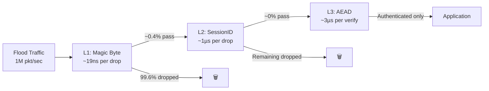
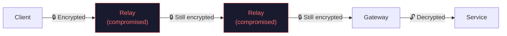

# Threat Model

This document describes what ZTLP protects against, what it doesn't, and the assumptions you're making when you deploy it. It's written for security professionals and technical decision-makers — not as a copy of the specification, but as a practical guide to understanding ZTLP's security posture.

For the formal threat model with cryptographic proofs and protocol-level details, see Section 5 of the [full specification](#spec).

## What ZTLP Protects Against

### Port Scanning → Invisible Services

**The problem:** Every public-facing service today is discoverable. Attackers use tools like nmap, masscan, and Shodan to find open ports, fingerprint services, and identify vulnerabilities — all before launching a single exploit.

**How ZTLP solves it:** Services behind a ZTLP gateway have **no public ports**. There is nothing to scan. A port scanner sending probes to a ZTLP-protected address receives no response — not a RST, not a timeout, nothing. The packets are dropped at Layer 1 (magic byte check) in ~19 nanoseconds, before any TCP/UDP stack processing occurs.

> A service that can't be found can't be attacked.

### DDoS Attacks → Three-Layer Pipeline

**The problem:** Volumetric DDoS attacks work because servers must allocate resources (CPU, memory, bandwidth) to process every incoming packet, even malicious ones. Traditional defenses (rate limiting, scrubbing centers) are expensive, reactive, and have capacity limits.

**How ZTLP solves it:** The three-layer validation pipeline rejects attack traffic at the cheapest possible layer:

The math: if an attacker sends 1 million random UDP packets per second, approximately 996,000 are dropped at L1 (wrong magic byte) in nanoseconds. Of the ~4,000 that happen to have the right first byte, all are dropped at L2 (invalid SessionID) in microseconds. **Zero packets reach your application.** No state is allocated. No cryptographic work is performed. The server barely notices.

### Credential Stuffing → Identity-Gated Endpoints

**The problem:** Attackers take stolen username/password lists and automate login attempts against web applications. Even with rate limiting and CAPTCHAs, credential stuffing is a persistent, high-volume threat.

**How ZTLP solves it:** With ZTLP, the attacker can't even reach the login page. Access requires a valid ZTLP identity (cryptographic key pair + NodeID), and the connection must complete a Noise_XX mutual authentication handshake. Without the right identity, the gateway never proxies the request. The application's authentication layer becomes a *second* factor, not the only one.

### Relay Compromise → End-to-End Encryption

**The problem:** In many network architectures, intermediate nodes (load balancers, proxies, CDNs) can inspect traffic. A compromised intermediary exposes all traffic flowing through it.

**How ZTLP solves it:** Relays forward traffic based on SessionIDs — they **cannot decrypt the payload**. The encryption is end-to-end between the client and the gateway (or peer). Even if every relay in the mesh is compromised, the attacker sees:

- **SessionIDs** — 96-bit tokens (can observe traffic patterns, not content)
- **Packet sizes and timing** — Metadata, not payload
- **Source/destination IPs** — Of the relay hops, not necessarily the true endpoints

### Man-in-the-Middle → Mutual Authentication

**The problem:** Without mutual authentication, a client might connect to an impostor server, or a server might accept connections from unauthorized clients.

**How ZTLP solves it:** Every ZTLP connection uses **Noise_XX mutual authentication**. Both sides prove their identity during the handshake using their Ed25519 keys. If the server's identity doesn't match what the client expects (via ZTLP-NS resolution), the handshake fails. There is no downgrade path, no fallback to unauthenticated mode.

### Key Compromise → Forward Secrecy

**The problem:** If an attacker steals a server's private key, they can retroactively decrypt all previously captured traffic (in systems without forward secrecy).

**How ZTLP solves it:** Every session uses ephemeral Diffie-Hellman key exchange during the Noise_XX handshake. Compromise of a node's long-term Ed25519 key does not expose past sessions. Additionally, sessions periodically rekey with new ephemeral exchanges, limiting the window of exposure even for active sessions.

## What ZTLP Does NOT Protect Against

Honest security requires honest limitations. Here's what ZTLP cannot help with:

### Endpoint Compromise

If an attacker has root access to a ZTLP node — client, relay, or gateway — ZTLP cannot protect traffic on that node. The attacker can read decrypted traffic, steal private keys, and impersonate the node. ZTLP secures the *network layer*, not the *endpoint*. Use endpoint hardening (patching, EDR, access controls) alongside ZTLP.

### Traffic Analysis

While ZTLP encrypts payloads and relays hide direct connections, a sufficiently resourced adversary observing network traffic can still perform **traffic analysis**:

- **Timing correlation** — Matching packet timing between a client's ISP and a relay
- **Volume analysis** — Identifying communication patterns from traffic volume
- **Session duration** — Inferring activity types from session lengths

ZTLP is not designed for anonymity (that's Tor's domain). Multi-hop relaying provides some topology hiding, but a global passive adversary can still correlate flows. See Section 5 of the specification for a detailed analysis.

### Application-Layer Vulnerabilities

ZTLP authenticates and encrypts the transport. It does not inspect or sanitize application data. SQL injection, XSS, business logic flaws, and other application-layer bugs are **not mitigated** by ZTLP. The gateway forwards authenticated traffic to your backend — if your backend has a vulnerability, an authorized user can still exploit it.

### Quantum Computing (Future Work)

ZTLP currently uses X25519 for key exchange and Ed25519 for signatures. These algorithms are secure against classical computers but vulnerable to large-scale quantum computers running Shor's algorithm. Post-quantum migration (to ML-KEM / ML-DSA or similar) is planned but not yet specified. See Section 18 of the specification.

### Social Engineering / Physical Coercion

If an authorized user is tricked or coerced into granting access, ZTLP cannot distinguish between legitimate and coerced use of valid credentials. The cryptographic identity is valid — the human intent behind it is outside ZTLP's scope.

### Denial of Service at Layer 0

While ZTLP makes application-layer DDoS structurally ineffective, it cannot prevent:

- **Bandwidth saturation** at the network link level (filling the pipe before packets reach the eBPF filter)
- **BGP hijacking** or routing-level attacks
- **Physical infrastructure attacks** (cutting cables, disabling hardware)

These require network-level and physical-level defenses outside ZTLP's scope.

## Attacker Models

ZTLP's threat model considers attackers at different positions in the network:

```mermaid
graph TD
    subgraph "Network Positions"
        EXT["External Attacker<br/>No ZTLP identity"]
        NET["Network Observer<br/>Passive monitoring"]
        REL["Compromised Relay<br/>Active MITM position"]
        AUTH["Authorized Insider<br/>Valid ZTLP identity"]
        END["Endpoint Compromise<br/>Root on a node"]
    end
    
    EXT -->|"Can do"| EXT_CAN["• Send random packets (dropped at L1)<br/>• Attempt volumetric flood<br/>• Port scan (sees nothing)"]
    EXT -->|"Cannot do"| EXT_CANT["• Discover services<br/>• Complete handshake<br/>• Send valid ZTLP packets"]
    
    NET -->|"Can do"| NET_CAN["• Observe packet timing/size<br/>• See relay-to-relay IP traffic<br/>• Perform traffic analysis"]
    NET -->|"Cannot do"| NET_CANT["• Read payload content<br/>• Identify communicating NodeIDs<br/>• Inject valid packets"]
    
    REL -->|"Can do"| REL_CAN["• Observe SessionIDs in transit<br/>• Drop/delay specific sessions<br/>• Correlate timing of forwarded traffic"]
    REL -->|"Cannot do"| REL_CANT["• Decrypt payload content<br/>• Forge packets for existing sessions<br/>• Impersonate endpoints"]
    
    AUTH -->|"Can do"| AUTH_CAN["• Access authorized services<br/>• Observe own decrypted traffic<br/>• Attempt app-layer attacks on authorized services"]
    AUTH -->|"Cannot do"| AUTH_CANT["• Access unauthorized services<br/>• Impersonate other NodeIDs<br/>• Escalate to other identities"]
    
    END -->|"Can do"| END_CAN["• Read all traffic on that node<br/>• Steal private keys<br/>• Impersonate the compromised node"]
    END -->|"Cannot do"| END_CANT["• Compromise other nodes remotely<br/>• Decrypt traffic between other nodes<br/>• Access services not authorized for that NodeID"]
    
    style EXT fill:#1a1a2e,stroke:#34d399,color:#34d399
    style NET fill:#1a1a2e,stroke:#fbbf24,color:#fbbf24
    style REL fill:#1a1a2e,stroke:#f87171,color:#f87171
    style AUTH fill:#1a1a2e,stroke:#a78bfa,color:#a78bfa
    style END fill:#1a1a2e,stroke:#f87171,color:#f87171
```

### Summary Table

| Attacker Position | Payload Visibility | Can Impersonate | Can Disrupt Service | Can Discover Services |
|---|---|---|---|---|
| External (no identity) | ❌ None | ❌ No | ⚠️ Bandwidth only | ❌ No |
| Network Observer | ❌ None | ❌ No | ❌ No | ❌ No |
| Compromised Relay | ❌ None | ❌ No | ⚠️ Selective drop | ❌ Limited |
| Authorized Insider | ✅ Own sessions | ❌ Others only | ⚠️ App-layer | ✅ Authorized only |
| Endpoint Compromise | ✅ That node's traffic | ✅ That node only | ✅ That node | ✅ That node's access |

## Trust Assumptions

When you deploy ZTLP, you are trusting:

### 1. The Cryptographic Primitives
ZTLP relies on Ed25519, X25519, ChaCha20-Poly1305, and BLAKE2b. If any of these are broken (by mathematical advances or quantum computing), ZTLP's security is compromised. These are well-studied, widely deployed algorithms — but no cryptographic system is future-proof.

### 2. Your Enrollment Authority
The Enrollment Authority (EA) issues NodeIDs. If your EA is compromised, the attacker can mint valid identities. This is analogous to a compromised Certificate Authority in TLS. Mitigation: run your own EA, use hardware-backed EA keys, implement certificate transparency-style logging.

### 3. Your Trust Root
The trust root anchors your namespace. Compromise of the trust root key means an attacker can delegate arbitrary zones and override identity bindings. Mitigation: keep trust root keys offline, use multi-party signing, rotate regularly.

### 4. Endpoint Integrity
ZTLP assumes nodes are not already compromised. If a client or gateway has malware with root access, ZTLP's network-layer protections are bypassed on that node. Pair ZTLP with standard endpoint security practices.

### 5. The Noise Protocol Framework
ZTLP's handshake security depends on the correctness of the Noise_XX pattern. Noise has been formally verified and is used by Signal, WireGuard, and Lightning. This is a well-understood foundation.

### 6. Your Relay Operators (Partially)
You trust relays for **availability** (they can drop your traffic) but not for **confidentiality** (they can't read it) or **integrity** (they can't modify it without detection). This is a meaningful distinction — a malicious relay can deny service but cannot compromise data.

## Comparison with Other Solutions

How does ZTLP compare to other approaches for securing network access?

| Capability | ZTLP | Traditional VPN | Tailscale / WireGuard | Cloudflare Access | Tor |
|---|---|---|---|---|---|
| **Identity-first networking** | ✅ Cryptographic NodeID | ❌ IP-based trust | ⚠️ Key-based, centralized | ⚠️ IdP-dependent | ❌ Anonymous by design |
| **DDoS mitigation** | ✅ 3-layer pipeline (19ns reject) | ❌ None | ❌ None | ⚠️ Proxy-based scrubbing | ❌ None |
| **Zero attack surface** | ✅ No public ports | ❌ VPN endpoint exposed | ⚠️ WireGuard port exposed | ❌ Proxy port exposed | ❌ Entry nodes exposed |
| **End-to-end encryption** | ✅ Client to gateway | ✅ Client to VPN server | ✅ Peer to peer | ⚠️ Client to proxy edge | ✅ Onion encrypted |
| **No trusted intermediary** | ✅ Relays can't decrypt | ❌ VPN server sees all | ✅ No intermediary | ❌ Cloudflare sees all | ✅ No single node sees all |
| **Mutual authentication** | ✅ Noise_XX both sides | ⚠️ Usually server-only | ✅ Both sides | ⚠️ Client via IdP | ❌ Not applicable |
| **Hardware-backed identity** | ✅ TPM, Secure Enclave | ❌ Certificate-based | ❌ Software keys | ❌ Browser-based | ❌ Software keys |
| **Anonymity** | ❌ Not a goal | ❌ No | ❌ No | ❌ No | ✅ Primary goal |
| **Performance overhead** | Low (299µs handshake) | Medium | Low (1-RTT handshake) | Medium (proxy hop) | High (multi-hop) |
| **Works with existing services** | ✅ Via gateway | ✅ Via tunnel | ✅ Via tunnel | ✅ Via proxy | ⚠️ Via hidden services |
| **Decentralized trust** | ✅ Multiple trust roots | ❌ Central VPN provider | ❌ Central coordination server | ❌ Cloudflare | ✅ Volunteer consensus |

### When to Use What

- **Use ZTLP** when you need identity-first networking with DDoS resilience and zero attack surface — especially for protecting services that shouldn't be publicly discoverable.
- **Use a VPN** when you need to extend a private network to remote users and DDoS/zero-trust isn't a primary concern.
- **Use Tailscale/WireGuard** when you need easy peer-to-peer connectivity with minimal configuration and trust a central coordination server.
- **Use Cloudflare Access** when you need quick zero-trust for web applications and are comfortable with a third party terminating your TLS.
- **Use Tor** when anonymity is the primary requirement and you're willing to trade performance for it.

---

For the formal threat model with detailed attack trees, cryptographic analysis, and mitigation strategies, see Section 5 of the [full specification](#spec).
