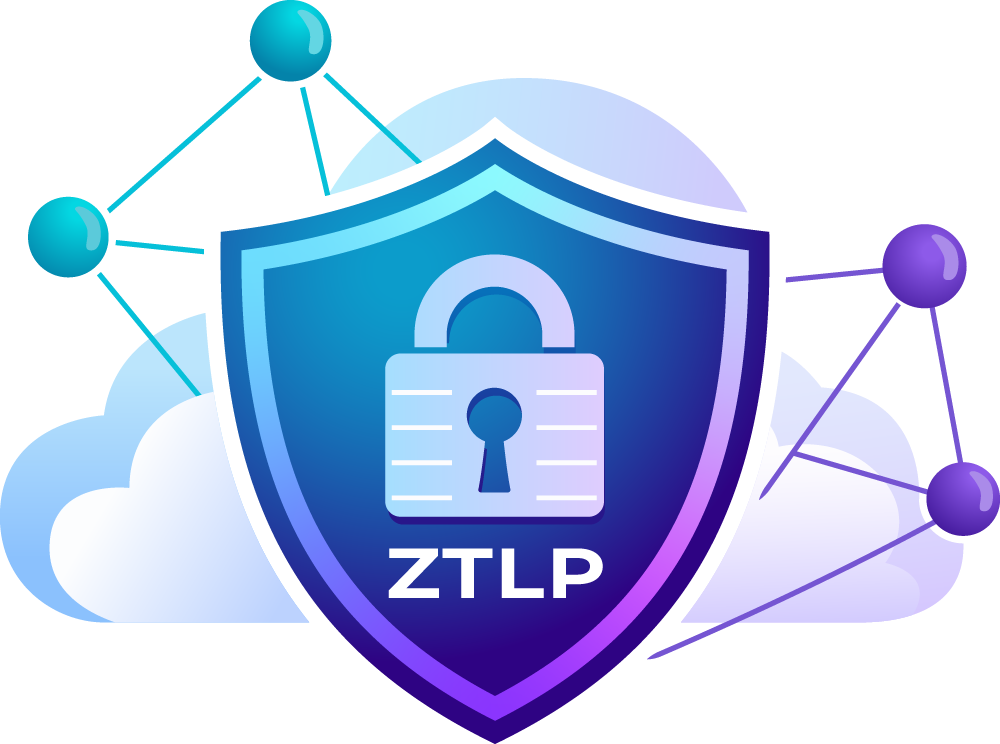

<p align="center">
  
</p>

<h1 align="center">ZTLP Admin Panel</h1>
<p align="center"><strong>Build Specification</strong></p>

<p align="center">
  Directory, enrollment, gateway registry and central policy for a ZTLP fleet
</p>

---

| | |
|---|---|
| **Document status** | Specification. Build in progress (Phase 1, slice 1: skeleton + claim; see §11). |
| **Version** | 1.1 |
| **Date** | 2026-10-06 |
| **Reference commit** | `9a42ae5` — every citation to existing code refers to this revision |
| **Supersedes** | `docs/ADMIN-PANEL-PLAN.md` (initial sketch; corrections listed in §13) |
| **Audience** | The engineer (human or agent) who builds Phase 1 in a fresh session from this document alone |
| **Companion documents** | `docs/DIRECT-FIRST-DIAL-PLAN.md`, `docs/ACL-ARCHITECTURE.md`, `docs/plans/2026-09-19-relay-auth-v3-identity-signed.md` |

This specification was produced after a code-level review of the name server (NS), relay, gateway, CLI, enrollment path and the existing `bootstrap/` Rails application. Every statement about existing behaviour cites a file and line range in this repository. Where the design departs from the earlier sketch, the departure is explicit and justified.

---

## Contents

1. [Purpose and scope](#1-purpose-and-scope)
2. [Verified facts that drive the design](#2-verified-facts-that-drive-the-design)
3. [Architecture](#3-architecture)
4. [First run and administrator authentication](#4-first-run-and-administrator-authentication)
5. [Data model](#5-data-model)
6. [Name server client](#6-name-server-client)
7. [Enrollment strings with identity](#7-enrollment-strings-with-identity)
8. [Gateways and policy](#8-gateways-and-policy)
9. [Security](#9-security)
10. [Repository layout, containers, CI and release](#10-repository-layout-containers-ci-and-release)
11. [Delivery phases](#11-delivery-phases)
12. [Reuse from the `bootstrap/` application](#12-reuse-from-the-bootstrap-application)
13. [Corrections to the initial sketch](#13-corrections-to-the-initial-sketch)
14. [Open decisions for the build session](#14-open-decisions-for-the-build-session)
15. [Acceptance criteria (Phase 1)](#15-acceptance-criteria-phase-1)
- [Appendix A. Glossary](#appendix-a-glossary)
- [Appendix B. Research sources](#appendix-b-research-sources)

---

## 1. Purpose and scope

The ZTLP Admin Panel is a single Docker Compose stack (Rails 7.1 + MariaDB) that acts as the management server for a ZTLP fleet. It provides:

| Capability | Description |
|---|---|
| **Directory** | Users (AD-style profile), groups and devices, with drill-in pages to edit each. |
| **Enrollment** | Mints `ztlp://enroll/...` strings that carry the person's identity (username, full name, first and last name, email, free-form attributes) and, as an interim measure, the relay secret. A user pastes one string and is fully configured. |
| **Gateway registry** | Registers application gateways, shows their live state, and hands each one its policy. |
| **Central policy** | Group- and role-based rules enforced by gateways. Groups live in the NS; gateways already evaluate `group:` and `role:` rules by querying the NS. |
| **First-administrator claim** | Start the container, claim it with your own ZTLP key plus a one-time code from the container log, and become the first administrator. No passwords. |
| **Fleet management** (later phases) | Device check-in and policy pull to agents. |

### 1.1 Technology choices

**Rails.** `has_secure_password`, CSRF protection, strong parameters, Active Record Encryption, Hotwire and a mature test harness. A working Rails container pattern already exists in this repository and in other TRS applications.

**MariaDB.** Requested by the project owner. Multi-process safe (Puma workers and a background job runner share one database) and consistent with the rest of the TRS fleet.

---

## 2. Verified facts that drive the design

Each row below was verified in code. The final column states the design consequence.

| # | Fact | Source | Design consequence |
|---|---|---|---|
| F1 | The NS stores USER (0x11), DEVICE (0x10) and GROUP (0x12) records. USER data is `public_key, devices[], email, role (user\|tech\|admin)`. Additional keys are stored as supplied. | `ns/lib/ztlp_ns/record.ex:396-514` | Full name, first/last name, department and similar profile fields live in the panel database, not the NS. Role remains in the NS. |
| F2 | Writes to an auth-enabled NS must be **signed v2 registrations (opcode 0x09)**: `<<0x09, name_len::16, name, type::8, data_len::16, cbor, sig_len::16, sig(64), pk_len::16, pubkey(32)>>`, where `sig = Ed25519(<<type::8, name_len::16, name, cbor>>)`. CBOR map keys are sorted by `(byte_size, bytes)`. | `ns/lib/ztlp_ns/server.ex:390-412`, `registration_auth.ex:154-159`, `cbor.ex:44-54` | The panel implements this packet natively in Ruby (approximately 40 lines). |
| F3 | **GROUP records can only be written by a zone authority.** USER and DEVICE records may also be self-written by the key in `data.public_key`. | `registration_auth.ex:333-385` | The panel must hold a zone-authority Ed25519 seed. |
| F4 | A zone authority is a KEY record at a parent zone name with `data.delegation == true` whose `public_key` equals the signer. The parent chain is computed by splitting on the **first dot**, so `steve@trs.ztlp` has the parent chain `["ztlp"]` only; `trs.ztlp` is *not* its parent. The NS test suite confirms this. | `registration_auth.ex:248-266`, `zone.ex:61-66`, `ns/test/ztlp_ns/group_test.exs:650,687,742` | **User and group names must use dotted form, not `@` form**: `steve.users.trs.ztlp`, `admins.groups.trs.ztlp`. A `trs.ztlp` authority then covers them. (Production currently has `admin@trs.ztlp`; that record was self-registered, which is why it worked. The panel will not use `@` names.) |
| F5 | The NS ignores client-supplied TTLs. USER, DEVICE, GROUP and KEY records default to 86 400 s, so **identity records expire after 24 hours** unless re-registered. Zone-authority writes bypass the per-`{name,type}` 60 s rate limit. | `record_defaults.ex:24-33`, `server.ex:604-606`, `registration_auth.ex:68-75` | The panel runs a re-publish job every 6 hours for every record it owns. Observed in production: the `aicomputer.trs.ztlp` KEY, enrolled 2026-10-04, was gone by 2026-10-05. |
| F6 | Record listing exists only over HTTP: `GET /admin/records?type=&zone=` on the NS metrics port (9103), authenticated with HMAC-SHA256 headers `x-ns-timestamp` and `x-ns-signature` over `"GET\n<path?query>\n<ts>\n<sha256hex(body)>"` using the secret `ZTLP_NS_ADMIN_API_SECRET`. Default rate limit is 12 requests per 60 s per IP. The UDP list opcode 0x13 was removed in v0.35.1. | `ns/lib/ztlp_ns/admin_api.ex`, `metrics_server.ex:269-271`, `config.ex:375-403` | The panel database is the source of truth; `/admin/records` is used only for reconciliation. The TRS production NS has no `ZTLP_NS_ADMIN_API_SECRET` configured as of 2026-10-05; setting one is a deployment step. |
| F7 | **The Rust CLI identity commands do not function against an auth-enabled NS.** `create-user`, `link-device`, `create-group`, `group add/remove` and `revoke` send unsigned v1 packets (rejected with `0xFF 0x02 missing_pubkey`); `devices`, `ls`, `groups` and `audit` use the removed 0x13 opcode. Only `ztlp ns register` and the `ztlp listen` heartbeat (`ns_publish_self`) sign correctly. | `proto/src/bin/ztlp-cli.rs:7023-7040, 10328-11461`; research report §3 (Appendix B) | The panel does not shell out to the CLI for identity writes. It speaks UDP to the NS directly. |
| F8 | An enrollment token is v1 binary: `[ver=1][flags][zone][ns][relay_count][relays][gw if 0x01][callback if 0x02][max_uses::16][expires::64][nonce 16][mac 32]`. The MAC is HMAC-BLAKE2s-256 over everything preceding it, keyed with the 32-byte zone **enrollment secret** (`ZTLP_ENROLLMENT_SECRET` on the NS, `zone.key` on the CLI). Unknown flag bits are silently ignored by both the Rust and Elixir parsers. | `proto/src/enrollment.rs:37-79, 451-499`, `ns/lib/ztlp_ns/enrollment.ex:241-269` | New fields are added as new flag bits **between the callback and `max_uses`**, in both parsers, together with an unknown-flags check in both. |
| F9 | Enrollment (opcode 0x07) creates only a **KEY** record (plus an SVC record if an address is supplied). It never creates a DEVICE or USER record and never records an owner. `ztlp setup --owner` and `--type` are parsed but unused. | `enrollment.ex:336-408`, `ztlp-cli.rs:8908-8912` | The panel creates the DEVICE record (with owner) when the enrollment callback arrives. |
| F10 | The callback is a `POST <callback_url>` with form body `token_id=&node_id=&name=&pubkey_hex=`, sent via curl, **unauthenticated and unsigned**. It fires only when the token came from the query-parameter URI form (binary tokens carry no `token_id`). The query-parameter form forces `max_uses = 1` and, when signed, has a known Launch/Rust MAC mismatch if `callback` is present. | `ztlp-cli.rs:9429-9605`, `enrollment.rs:290-385` | The panel's new token flag carries `token_id` inside the signed binary, so binary tokens also fire the callback. The callback is authenticated by having the device sign the body with its new Ed25519 key (§7.4). |
| F11 | The client-side relay secret is `agent.toml [tunnel] relay_secret` (inline) or `relay_secret_file` (path). `ztlp setup --relay-secret` writes it inline. No `relay.secret` file exists in the code. `setup` never modifies an existing `agent.toml`. | `proto/src/agent/config.rs:250-280`, `ztlp-cli.rs:9950-10023` | A token-carried secret is written to `<ztlp_dir>/relay.secret` (mode 0600) and referenced as `relay_secret_file`. |
| F12 | The relay secret is a per-zone shared password: `ZTLP_HMAC_SECRET_<ZONE_SLUG>` on the relay (slug = upper-case, non-alphanumerics replaced with `_`), with the same value on every gateway and device. Relay v3 (identity-signed, per-device) is designed but not started. | `relay/lib/ztlp_relay/hmac_secrets.ex`, `docs/plans/2026-09-19-relay-auth-v3-identity-signed.md` | Carrying the secret in the token is an interim measure with guardrails (§7.3). |
| F13 | **Both gateways already implement centralised policy evaluation.** Rules are per service: `allow = ["name", "*.suffix", "group:<group name>", "role:<role>", "*"]`. `group:` and `role:` are resolved **at decision time by querying the NS** (GROUP 0x12 / USER 0x11, via DEVICE 0x10 → owner). Rust reads `~/.ztlp/policy.toml` (`--policy`); Elixir reads `:policies` config, `ZTLP_GATEWAY_POLICIES` or YAML. | `proto/src/policy.rs:1-35`, `ztlp-cli.rs:5125-5135`, `gateway/lib/ztlp_gateway/policy_engine.ex:8-40`, `ns_client.ex:150,321,368` | Phase 1 central policy consists of the panel managing GROUP membership in the NS and emitting each gateway's static policy file with `group:` rules. No new gateway code is required. |
| F14 | Neither gateway hot-reloads policy. The Elixir `ConfigWatcher` exists but is not in the supervision tree; the Rust gateway loads `policy.toml` once at start-up. | `gateway/lib/ztlp_gateway/application.ex` (no ConfigWatcher child), `ztlp-cli.rs:5237` | Changes that add or remove a *rule* require a gateway restart; changes to *group membership* take effect immediately via the NS. Groups are designed so that rules rarely change. Hot reload is a later gateway change (§11). |
| F15 | The agent exposes a loopback IPC (`127.100.255.1:4433`, JSON lines: status, tunnels, dns_cache, flush_dns, shutdown, setup_status, enroll) and has no outbound control channel, poll or heartbeat. The `renewal` module (config hot reload) is not wired in. | `proto/src/agent/control.rs`, `daemon.rs` | Device check-in and policy pull are new agent work (Phase 3). |
| F16 | Agent boot configuration (`agent.toml`): `[identity] path`, `[dns] enabled, listen, zones`, `[ns] servers`, `[tunnel] relays, relay_secret, relay_secret_file, prefer_relay`, `[renewal]`, `[log]`, `[tls] enabled, cert_dir, auto_issue`, `[gateway]` pins, `[ipc] listen`. | `proto/src/agent/config.rs:16-60` | These are the remotely settable parameters for Phase 3. |
| F17 | The existing `bootstrap/` Rails application has a sound `AdminUser` (lockout, roles), `AuditLog`, `EnrollmentToken` lifecycle, QR generation via `rqrcode`, identity tab views, HMAC API authentication and an AR Encryption pattern. However it uses SQLite and password login, its token minting is **unsigned** (legacy URI, no MAC, no Ruby BLAKE2s), `ZtlpAdmin` shells over SSH to CLI verbs that do not exist (`admin user create`), Tailwind is loaded from a CDN, and the Dockerfile copies `bin/ztlp` from an untracked file. | Research report, Part A (Appendix B) | A new application is built under `admin/`. The models and views listed in §12 are copied; the NS and token layers are not reused. |
| F18 | Ruby 3.2 with OpenSSL 3.0.13 on the build host provides `OpenSSL::Digest.new("BLAKE2s256")` and `OpenSSL::PKey.generate_key("ED25519")`. | Verified 2026-10-05 | HMAC-BLAKE2s (manual ipad/opad construction) and Ed25519 signing require no additional gems. |
| F19 | The `ztlp` CLI image is `stevenprice/ztlp-proto:<tag>` (`/usr/local/bin/ztlp`, no entrypoint, Debian bookworm). CI does not build it; it is pushed manually. Release images are `stevenprice/ztlp-{ns,relay,gateway,dashboard}:<git tag>` from `release.yml`; versions are gated by `scripts/verify-image-version.sh` and `image-version-gate.yml`, which are hard-coded to the three Elixir components. | `proto/Dockerfile`, `.github/workflows/release.yml`, `scripts/verify-image-version.sh` | §10 adds `admin` to both the release matrix and the version gate. The CLI binary is optional inside the panel image (diagnostics only). |
| F20 | **Relay and Rust gateway disagree on zone-secret encoding.** The relay (`HmacSecrets.decode_secret`) hex-decodes a 64-character hex `ZTLP_HMAC_SECRET_<SLUG>` to 32 raw bytes; the Rust `ztlp listen` uses the ASCII bytes verbatim. A 64-hex secret therefore never verifies (`rejected: invalid HMAC` on every V2 frame). Confirmed 2026-10-06 by recomputing the HMAC over a captured 0x0E frame. The Rust V1 frame (0x0A) always carries a zero MAC and is rejected in prod HMAC mode by design. | `relay/lib/ztlp_relay/hmac_secrets.ex:299-306`, `proto/src/bin/ztlp-cli.rs` `resolve_zone_hmac_secret` | Until the Rust side is fixed, the panel generates zone relay secrets as **non-hex** strings (48 alphanumeric characters) so both sides derive the same key. Gateway bundles (§8.1) carry the same value. |

---

## 3. Architecture

```
                         +----------------------------------------------+
  browser (admin)  --->  |  ztlp-admin (Rails 7.1, Puma)                 |
  ztlp admin claim/login |   - web UI (Hotwire, Tailwind compiled in)    |
                         |   - /api/v1 (device callback, check-in)       |
                         |   - jobs: republish (6h), reconcile, gc       |
                         |   - NsClient (UDP 0x09 signed writes, 0x01    |
                         |     reads; HTTP /admin/records for lists)     |
                         |   - TokenMinter (binary token + MAC, Ruby)    |
                         +------------------+---------------------------+
                                            |                 |
                              MariaDB 11.x  |                 | UDP 23096 / HTTP 9103
                              (one DB)      v                 v
                         +--------------+        +-----------------------+
                         | admin_db     |        | ZTLP NS (Elixir)      |
                         | users,groups,|        | KEY/USER/DEVICE/GROUP |
                         | devices,     |        | records, 24h TTL      |
                         | enrollments, |        +-----------------------+
                         | gateways,    |
                         | policies,    |        relay    <- HMAC_SECRET_<ZONE>
                         | admins,audit |        gateways <- policy file (§8)
                         +--------------+        agents   <- token (§7)
```

### 3.1 Source of truth

| Store | Holds | Durability |
|---|---|---|
| **Panel database** | The directory (profile fields, status, provenance), enrollments, gateways, policies, administrators, audit trail. | Durable. Authoritative. |
| **Name server** | The signed authorisation facts that the rest of ZTLP reads at runtime: USER (role, public key), DEVICE (owner), GROUP (members), KEY, SVC. | Ephemeral (24 h TTL, F5). Fully re-derivable from the panel database and re-published on a schedule, so an NS wipe is recoverable from the panel alone. |

### 3.2 Secrets held by the panel

All are encrypted at rest with Active Record Encryption (§9).

| Secret | Purpose | Reference |
|---|---|---|
| Zone-authority Ed25519 seed | Signs NS writes | F3 |
| Zone enrollment secret (32 bytes) | MACs enrollment tokens; must equal the NS `ZTLP_ENROLLMENT_SECRET` | F8 |
| Zone relay secret | Embedded in tokens | F12 |
| NS admin API HMAC secret | Authenticates `/admin/records` | F6 |
| Per-gateway relay HMAC value | Same value as the zone relay secret; rendered into gateway bundles | §8.1 |

---

## 4. First run and administrator authentication

### 4.1 Claim (first boot only)

1. `docker compose up -d`. The entrypoint runs `db:prepare`, then boots the application.
2. If the `admins` table is empty, the application generates a `claim_code` (32 random bytes, base32, grouped), stores `sha256(claim_code)` and `expires_at = now + 24h` in `system_settings`, and prints to the container log:
   `ZTLP ADMIN: no administrator yet. Claim code: XXXX-XXXX-... (valid 24h)`
3. Every route except `/claim`, `/up` and `/api/v1/*` redirects to `/claim`.
4. The operator creates an identity on their own machine with the existing `ztlp keygen` (`identity.json` holds the Ed25519 seed; `proto/src/identity.rs:109-122`) and runs the new CLI command:
   ```
   ztlp admin claim https://admin.example --code XXXX-... --username steve \
     --full-name "Steven Price" --email steve@example.com
   ```
   This POSTs `{claim_code, username, full_name, first_name, last_name, email, pubkey_hex, timestamp, signature}` where `signature = Ed25519(sha256(canonical body))`. An equivalent browser form accepts a pasted public key, code and profile; the signature is optional in that case because the code alone proves log access. The CLI path is preferred and is what the documentation shows.
5. Server: constant-time comparison of `sha256(code)`; not expired; no administrator exists (database transaction plus a unique index guard on `admins.role = 'super_admin'`). On success: create the administrator (`super_admin`), create the matching directory user, write its USER record to the NS (role `admin`), delete the claim code, and write the audit entry `system.claimed`. The claim window is closed permanently.
6. Lost-administrator recovery: `bin/rails admin:reset_claim` executed inside the container generates a new claim code. This is a container-local command and is never exposed as a web route.

**Rationale.** With "paste a public key" alone, whoever reaches the port first owns the system. The claim code proves the operator can read the container log, following the pattern used by Vault and Gitea initialisation.

### 4.2 Login (every session, no passwords)

Challenge-response with the administrator's Ed25519 key:

1. `ztlp admin login https://admin.example` → `POST /auth/challenge {pubkey_hex}` → `{nonce, expires_in: 120}`. The nonce is stored in `login_challenges` and is single-use.
2. The CLI signs `"ztlp-admin-login\n<host>\n<nonce>"` and sends `POST /auth/verify {pubkey_hex, nonce, signature}` → `{login_url: "https://admin.example/auth/session/<one-time-token>"}`.
3. The CLI opens the browser at `login_url`. The server exchanges the one-time token (60 s, single use) for a session cookie and redirects to `/`.
4. The browser never handles the key. Session: cookie store, `same_site: :lax`, `secure: true`, 8 h idle timeout, 24 h absolute limit.

A browser-only variant with client-side signing is deliberately **not** offered, as it would require the key in the browser. Instead, an administrator may **enable a passkey (WebAuthn)** after first login; this is Phase 2 (§11) using the `webauthn-ruby` gem. Until then, login requires the CLI.

### 4.3 Administrator roles

| Role | Permissions |
|---|---|
| `super_admin` | Manage administrators, settings and secrets; everything below |
| `admin` | All operational functions |
| `helpdesk` | Enrollments, device reset, read-only directory |
| `read_only` | Read-only access |

Every mutating controller action carries `before_action :require_write_access` (blocks `read_only`); settings and administrator management require `super_admin`. The pattern follows `bootstrap` `PoliciesController`.

---

## 5. Data model

**Conventions.** Character set `utf8mb4`, collation `utf8mb4_unicode_ci` (not `utf8mb4_0900_ai_ci`, which is MySQL 8 only and rejected by MariaDB). Explicit short index names (64-character limit). `bigint` primary keys. Timestamps on every table. All secret columns use `encrypts` (Active Record Encryption, non-deterministic unless a lookup requires otherwise).

```
zones            id, name (unique, e.g. trs.ztlp), ns_addr (host:port), ns_admin_base_url,
                 relay_addrs (json), gateway_addr,
                 authority_seed_ct (encrypts; 32B Ed25519 seed), authority_pubkey_hex,
                 enrollment_secret_ct (encrypts; 32B), relay_secret_ct (encrypts),
                 ns_admin_api_secret_ct (encrypts), last_reconciled_at
                 -- Phase 1 supports exactly one zone row; the schema allows more.

admins           id, username (unique), display_name, email, role, pubkey_hex (unique),
                 user_id (fk users, nullable), last_login_at, last_login_ip, disabled_at

login_challenges id, admin_id, nonce (unique), expires_at, used_at
session_tokens   id, admin_id, token_digest (unique), expires_at, used_at

users            id, zone_id, username (unique per zone; label-safe, lowercase),
                 ns_name (unique; "<username>.users.<zone>"),
                 full_name, first_name, last_name, email, title, department, phone,
                 role (user|tech|admin; mirrors NS), status (invited|active|suspended|revoked),
                 pubkey_hex (nullable until first device enrolls or CLI create),
                 attributes (json: free-form extras), notes,
                 ns_published_at, revoked_at, revocation_reason, created_by_admin_id

groups           id, zone_id, name (unique per zone), ns_name ("<name>.groups.<zone>"),
                 description, ns_published_at
group_memberships id, group_id, user_id (unique pair), added_by_admin_id

devices          id, zone_id, name (device label), ns_name ("<name>.<zone>"),
                 user_id (owner, nullable), node_id_hex (unique), pubkey_hex (X25519 Noise static),
                 signing_pubkey_hex (Ed25519, nullable), hardware_id, platform, agent_version,
                 status (pending|enrolled|revoked|orphaned), enrolled_at, last_seen_at,
                 enrollment_id (fk), ns_published_at, revoked_at, revocation_reason

enrollments      id, zone_id, token_id (unique, 16B hex), kind (user_device|device_only),
                 user_id (nullable), device_name (nullable; null = hostname at setup),
                 embed_relay_secret (bool), identity_snapshot (json; what was put in the token),
                 max_uses, uses, expires_at, status (pending|redeemed|expired|revoked),
                 token_uri_ct (encrypts; shown once, kept for re-display by super_admin only),
                 redeemed_at, redeemed_device_id, created_by_admin_id, revoked_at, notes

gateways         id, zone_id, name (service label, e.g. www), ns_name ("<name>.<zone>" or
                 sub-zone), kind (rust_listen|elixir), host_note, backend (host:port),
                 node_id_hex, signing_pubkey_hex, status (planned|registered|online|stale),
                 last_svc_seen_at, addresses (json, from SVC), policy_rendered_at

policies         id, gateway_id, service (e.g. www), allow_rules (json array of strings:
                 "group:<ns group name>", "role:admin", "*.<zone>", "*"), position
                 -- rendered into the gateway's policy file (§8)

audit_logs       id, admin_id (nullable), action, target_type, target_id, status, details (json),
                 ip, created_at   -- indexes: (action), (created_at), (target_type, target_id)

system_settings  key (pk), value_ct (encrypts), updated_at   -- claim_code_digest, etc.
```

### 5.1 Naming rules

From `name_validator.ex`: labels match `[a-z0-9@]([a-z0-9-@]*[a-z0-9@])?`, each at most 63 characters, total at most 253, lower-case. The panel validates `username`, group `name` and device `name` as single labels and rejects `@`, `.` and upper-case characters (input is normalised to lower-case and the normalised value is displayed).

The `<username>.users.<zone>` and `<group>.groups.<zone>` conventions follow from F4 and additionally prevent collisions between user, group and device names.

---

## 6. Name server client

Implemented in `app/services/ztlp/ns_client.rb`.

### 6.1 Canonical CBOR

A minimal deterministic encoder (RFC 8949 §4.2.1): maps with text keys sorted by `(byte_size, bytes)`, text strings (major type 3), byte strings (major type 2), arrays, booleans and unsigned integers. This covers everything NS record data requires, in roughly 60 lines. It is golden-vector tested against output from the Elixir encoder (`ns/lib/ztlp_ns/cbor.ex`), captured once with `mix run`.

### 6.2 Signed registration (write)

```ruby
def register(name:, type_byte:, data:, seed:)   # seed = 32-byte zone-authority seed
  cbor  = Cbor.encode(data)
  canon = [type_byte].pack("C") + [name.bytesize].pack("n") + name + cbor
  key   = OpenSSL::PKey.new_raw_private_key("ED25519", seed)
  sig   = key.sign(nil, canon)                      # 64 bytes
  pub   = key.raw_public_key                        # 32 bytes
  pkt   = "\x09".b + [name.bytesize].pack("n") + name + [type_byte].pack("C") +
          [cbor.bytesize].pack("n") + cbor + [sig.bytesize].pack("n") + sig +
          [pub.bytesize].pack("n") + pub
  reply = udp_roundtrip(pkt, timeout: 5)            # expect "\x06"
  raise NsError.decode(reply) if reply.getbyte(0) == 0xFF
end
```

**Error codes** (`registration_error.ex:63-74`):

| Code | Meaning | Code | Meaning |
|---|---|---|---|
| `0x00` | unspecified | `0x06` | key_overwrite |
| `0x01` | unknown_type | `0x07` | revoked_pubkey |
| `0x02` | missing_pubkey | `0x08` | revoked_name |
| `0x03` | invalid_name | `0x09` | rate_limited |
| `0x04` | invalid_signature | `0x0A` | invalid_data |
| `0x05` | unauthorized | `0x0B` | storage_error |

Validator failures such as a missing `public_key` or an invalid `role` are returned as `0x00`.

**Serial collisions.** The NS uses Unix seconds as the record serial; two writes of the same `{name, type}` within one second collide (`stale_serial`, one NS-side retry). The re-publish job therefore spaces writes at least 1.1 s apart per name.

### 6.3 Records written by the panel

| Record | Name | Type | Data |
|---|---|---|---|
| Zone authority | `<zone>` | 0x01 KEY | `{algorithm:"Ed25519", node_id:"zone:<zone>", public_key:<authority hex>, delegation:true, role:"zone-authority"}`. Self-registration of a KEY whose `public_key == signer` is permitted (`registration_auth.ex:290-298`). Re-published every 6 h (TTL 24 h). If a KEY already exists at `<zone>` with a different key (production `trs.ztlp` today: `28b688…`, the `admin@trs.ztlp` key), see the migration in §10.3. |
| User | `<u>.users.<zone>` | 0x11 USER | `{public_key:<user Ed25519 hex, or the authority hex until known>, email, role, devices:[ns names], display_name, username}`. Extra keys are stored (F1) and ignored by gateways. |
| Group | `<g>.groups.<zone>` | 0x12 GROUP | `{members:[user ns names], description}` (at most 255 members) |
| Device | `<d>.<zone>` | 0x10 DEVICE | `{node_id, public_key, owner:<user ns name>, hardware_id}` |
| Revocation | `revoke.<name>` | 0x05 REVOKE | `{revoked_ids:[name], reason, effective_at:"now"}` (TTL 0, never expires; purges device and group indexes) |

The KEY record for a device is created by the device itself at enrollment (F9) and refreshed by the agent. The panel does not write device KEY records.

### 6.4 Reads

- **Single record.** UDP `0x01` query `<<0x01, name_len::16, name, type::8>>`, padded to approximately 600 bytes (amplification cap). Reply is `0x02 + Record.encode`. Parser: canonical `type(1) name_len(2) name data_len(4) data created(8) ttl(4) serial(8)` followed by signature and public key.
- **Lists.** `GET /admin/records?type=user|device|group|key|svc&zone=<zone>` with HMAC headers (F6). Used by the reconcile job (§6.6) and the Gateways page (SVC records represent live gateways and their `addresses`).

### 6.5 Re-publish job (every 6 hours, and on demand)

For the zone: the authority KEY, then every active user, group and device-with-owner, spaced at least 1.1 s per write. Records with `status = revoked` are not re-published; their REVOKE record is (idempotently). Sets `ns_published_at`. Failures are written to the audit log and surfaced on the dashboard "NS sync" tile.

### 6.6 Reconcile job (every 30 minutes)

Pulls `/admin/records` for user, device, group and svc. Reports drift (present in NS but not in the database, or present in the database but missing from the NS) on the dashboard. Never auto-deletes panel rows. New SVC names not present in `gateways` appear as "unregistered gateway" suggestions.

---

## 7. Enrollment strings with identity

### 7.1 Token format change (Rust and Elixir, single PR)

Two flag bits are added, both MAC-covered, inserted after `callback_url` and before `max_uses` (F8):

```
FLAG_HAS_IDENTITY     = 0x04
FLAG_HAS_RELAY_SECRET = 0x08

identity (if 0x04):
  u16 len + token_id (16 raw bytes)        -- so the callback fires for binary tokens (F10)
  u16 len + username
  u16 len + full_name
  u16 len + first_name
  u16 len + last_name
  u16 len + email
  u16 len + owner_ns_name                  -- "<u>.users.<zone>"
  u8 extra_count, then (u16 len key, u16 len value) x count   -- free-form attributes

relay_secret (if 0x08):
  u16 len + secret bytes (32)
```

Both parsers add: `if flags & !KNOWN_FLAGS != 0 → Malformed("unknown flags")`. Today unknown bits are ignored, which would cause an older client to misparse the remainder of a new-format token. Failing closed with "update your ZTLP client" is the correct behaviour.

**Tests** (following `proto/src/enrollment.rs` tests 768-1357 and `ns/test/ztlp_ns/enrollment_test.exs::create_token`): round-trip with and without each flag; flipping any byte inside identity or secret yields `InvalidMac`; `flags = 0x00` output is byte-identical to today; a golden vector shared by Rust, Elixir and Ruby; unknown flag yields `Malformed`; NS `process_enroll` accepts a `0x0C` token and still creates the KEY record.

### 7.2 Client behaviour (`ztlp setup --token`, `setup_join`)

After the existing steps (identity, ENROLL 0x07, `config.toml`, `agent.toml`):

- **Identity present.** Write `<ztlp_dir>/profile.json` (mode 0600) containing the identity fields and `owner_ns_name`; log `enrolled as <full_name> (<username>)`. The device name defaults to the hostname unless `--name` is given.
- **Relay secret present.** Write `<ztlp_dir>/relay.secret` (mode 0600) and set `[tunnel] relay_secret_file` in the generated `agent.toml`. If `agent.toml` already exists (setup never rewrites it, F11), print the exact line to add.
- **Callback** (§7.4) fires whenever `token_id` is present, from either URI form.

### 7.3 Relay secret in the token: interim measure with guardrails

F12 makes the relay secret a shared zone password. The panel enforces the following:

- Only `kind = user_device` or `device_only` tokens with `max_uses = 1`.
- Default expiry 1 hour, maximum 24 hours, when `embed_relay_secret` is enabled.
- The token string is shown once on the result page and in the QR code; stored encrypted; re-display requires `super_admin` and is audited.
- Never written to logs or to audit `details` (parameter filter covers `token`, `secret`, `relay_secret`).
- Dashboard banner: "Relay access uses a shared zone secret (relay v3 not deployed)" until a setting clears it.
- Rotation runbook in the UI: configure the new relay secret on the relay as the first `ZTLP_HMAC_SECRET_<ZONE>` entry with the old one as grace; re-enroll or push to devices; remove the grace entry.

### 7.4 Callback and device creation

A new authenticated callback replaces the unauthenticated form POST (F10):

`POST /api/v1/enrollments/<token_id>/redeem`

```json
{"node_id":"<hex16>","name":"<device ns name>","noise_pubkey_hex":"<32B hex>",
 "signing_pubkey_hex":"<Ed25519 32B hex>","platform":"windows","agent_version":"0.35.16",
 "timestamp":<unix>,"signature":"<Ed25519 over sha256 of the canonical JSON without signature>"}
```

**Server validation.** Token exists, `status = pending`, not expired, `uses < max_uses`; timestamp within ±300 s; signature verifies with `signing_pubkey_hex`. Then, in one transaction: `uses += 1`; status → `redeemed` if exhausted; create or upsert the `devices` row (owner = `enrollment.user`, status `enrolled`); user `invited → active`; set `users.pubkey_hex = signing_pubkey_hex` if null; audit. Then publish the DEVICE record (with owner) and the updated USER record (devices list) to the NS.

**Reply.** `{"status":"redeemed","device":"<ns name>","owner":"<user ns name>"}`.

**Rate limit.** 10 requests per minute per IP (rack-attack).

**Legacy clients.** Older clients still call the legacy `callback_url` shape. The panel also accepts `POST /api/enrollment/confirm` (form body, unauthenticated), but only marks the enrollment `redeemed_unverified` and creates the device as `pending` for an administrator to approve.

### 7.5 User interface

**New enrollment.** Choose: existing user / new user (inline form) / device only; device name (optional); expiry; "embed relay secret" (default on, with guardrail text displayed).

**Result page.** The `ztlp://enroll/...` string, QR code (rqrcode SVG, following `bootstrap/app/services/token_generator.rb`), a copyable `ztlp setup --token "<string>"` line, and Windows / macOS / Linux notes.

**List.** Pending / redeemed / expired / revoked with filters; revoke action.

An expiry sweep job runs every 5 minutes (`status pending → expired`).

---

## 8. Gateways and policy

### 8.1 Registering a gateway (what the wizard automates)

Today a Rust gateway consists of an identity file plus:

```
ztlp listen --zone <zone> --ns-register-name <name> --ns-server <ns> --relay <relay> \
  --forward <svc>=<host:port> --policy <file>
```

with `HMAC_SECRET_<ZONE_SLUG>` in the environment, running in a container from `stevenprice/ztlp-proto` (`docs/DIRECT-FIRST-DIAL-PLAN.md`; template in `deploy/`). It publishes KEY and SVC (with `addresses`) itself, signed with its own key (`ns_publish_self`). This works on an auth-enabled NS because a KEY whose `public_key == signer` self-registers, and SVC follows the KEY owner. The gateway therefore does **not** need the zone authority; its name must simply be inside the zone.

**"Add gateway" wizard.** Inputs: name, backend `host:port`, kind (Rust recommended), host notes. The panel generates and displays:

- a `docker-compose.yml` (image tag pinned from settings);
- a `.env` with `HMAC_SECRET_<SLUG>` populated from the zone relay secret (shown once);
- the `policy.toml` (§8.2);
- the exact `ztlp keygen` command to create the gateway identity on that host.

Status becomes `online` when the reconcile job observes the SVC record; the SVC `addresses` are displayed. The gateway cannot be created *from* the panel over the network in Phase 1; that requires an agent on the host (Phase 3).

### 8.2 Policy

Policy rows render to the gateway's native format (F13).

Rust `policy.toml`:

```toml
default = "deny"
[[services]]
name = "www"
allow = ["group:staff.groups.trs.ztlp", "role:admin"]
```

Elixir: YAML `policies:` list or `ZTLP_GATEWAY_POLICIES`.

Because `group:` and `role:` are resolved by the gateway querying the NS at request time (`ztlp-cli.rs:5125-5135`, `policy_engine.ex`, `ns_client.ex:150`), **adding or removing a user from a group in the panel takes effect on every gateway immediately**, bounded only by the gateway's identity cache TTL. Only rule changes require a gateway restart (F14). The policy page states this explicitly and shows "policy file changed since gateway start" when `policy_rendered_at` is later than `last_svc_seen_at` of the first SVC after restart.

**Policy test widget.** Select a device and a gateway; the panel walks the same chain (DEVICE owner → USER role → GROUP members) from its database and shows allow/deny and the matching rule. This mirrors gateway logic so administrators can predict access before restarting anything.

**Default groups created at claim.** `admins.groups.<zone>` (the first administrator is a member) and `staff.groups.<zone>`.

---

## 9. Security

| Control | Specification |
|---|---|
| **Secrets at rest** | Active Record Encryption with `ACTIVE_RECORD_ENCRYPTION_*` keys from the environment (pattern: `bootstrap/config/environments/production.rb`). Generated by the entrypoint on first boot and **persisted to the data volume** (`/data/keys.env`, mode 0600) so a container recreate does not lose them. A prominent warning is logged if keys were loaded from the volume rather than the environment. |
| **Zone-authority seed** | Encrypted column. Export only via `bin/rails zone:export_authority` (prints the 32-byte seed; audited) for the backup runbook shown in the UI. Backups of the panel without the AR keys are unusable by design. |
| **Authentication** | Ed25519 challenge-response (§4.2); passkeys in Phase 2; no passwords anywhere. rack-attack on `/auth/*`, `/claim` and `/api/v1/*`. |
| **CSRF and TLS** | CSRF protection enabled. `config.force_ssl` and `assume_ssl` are both tied to the `FORCE_SSL` environment variable. Pitfall: `assume_ssl = true` over plain HTTP causes every POST to return 422, the same class of fault as the ZTLP agent 422 fixed in v0.35.15. |
| **Content Security Policy** | Strict. Tailwind is compiled into the image (`tailwindcss-rails`), not loaded from a CDN. |
| **Parameter filtering** | `filter_parameters += [:token, :secret, :relay_secret, :seed, :signature, :code]`. |
| **Audit** | Every mutating action is recorded with administrator id and source IP. Audit viewer in the UI. |
| **Host authorisation** | `ADMIN_ALLOWED_HOSTS` environment variable. |
| **Exposure** | The panel may later be published as `admin.<zone>` behind a ZTLP gateway. Phase 1 assumes a trusted network or an existing reverse proxy terminating TLS. |

---

## 10. Repository layout, containers, CI and release

### 10.1 Layout

```
admin/
  Dockerfile              multi-stage: ruby:3.2.7-slim (bookworm); build stage installs
                          build-essential libmariadb-dev pkg-config; precompiles assets with
                          SECRET_KEY_BASE_DUMMY=1; runtime installs libmariadb3 curl;
                          optional: COPY --from=stevenprice/ztlp-proto:<tag> /usr/local/bin/ztlp
  docker-compose.yml      services: db (mariadb:11.4.<x> pinned), web (ztlp-admin), jobs
  bin/docker-entrypoint   key bootstrap, wait-for-db, db:prepare, exec
  VERSION                 single line, e.g. 0.35.16; read by config/version.rb
  Gemfile                 rails 7.1.x, mysql2, puma, propshaft or sprockets, importmap,
                          turbo-rails, stimulus-rails, tailwindcss-rails, rqrcode,
                          solid_queue (jobs; shares the MariaDB), rack-attack,
                          minitest, mocha
  app/services/ztlp/{cbor.rb, ns_client.rb, token_minter.rb, blake2s_hmac.rb,
                     policy_renderer.rb, gateway_bundle.rb}
  app/jobs/{republish_ns_job, reconcile_ns_job, expire_enrollments_job}
```

### 10.2 Compose (production shape)

```yaml
services:
  db:
    image: mariadb:11.4.7            # pin exact; never :latest
    command: --character-set-server=utf8mb4 --collation-server=utf8mb4_unicode_ci
    environment: { MARIADB_DATABASE: ztlp_admin, MARIADB_USER: ztlp_admin,
                   MARIADB_PASSWORD: ${DB_PASSWORD}, MARIADB_ROOT_PASSWORD: ${DB_ROOT_PASSWORD} }
    volumes: [ "admin_db:/var/lib/mysql" ]
    healthcheck: { test: ["CMD","healthcheck.sh","--connect","--innodb_initialized"], interval: 10s }
  web:
    image: stevenprice/ztlp-admin:v0.35.16
    depends_on: { db: { condition: service_healthy } }
    environment:
      DATABASE_URL: mysql2://ztlp_admin:${DB_PASSWORD}@db/ztlp_admin
      RAILS_ENV: production
      FORCE_SSL: "false"               # true when behind TLS
      ADMIN_ALLOWED_HOSTS: admin.example
      ZTLP_ZONE: trs.ztlp
      ZTLP_NS_ADDR: ns.example:23096
      ZTLP_NS_ADMIN_BASE_URL: http://ns.example:9103
    ports: [ "3000:3000" ]
    volumes: [ "admin_data:/data" ]    # AR keys, exported bundles
  jobs:
    image: stevenprice/ztlp-admin:v0.35.16
    command: ["bin/jobs"]              # solid_queue worker
    depends_on: [ web ]
    environment: *same as web*
volumes: { admin_db: {}, admin_data: {} }
```

**Entrypoint requirements** (lessons from other TRS Rails containers; all apply):

- Wait for the database socket before `db:prepare`.
- `db:prepare` must succeed from an empty volume (idempotent migrations).
- Never `chown -R` the entire tree.
- Puma binds `0.0.0.0`.
- `docker compose restart` does not reload `.env`; use stop followed by up.

### 10.3 Deployment order on the TRS zone (`trs.ztlp`, NS on `defcon-ctf-1`)

The panel runs **on the NS host itself**, co-located with the NS and relay containers (operator decision, 2026-10-06), so `ZTLP_NS_ADDR` is the loopback address and UDP writes never leave the box. It is published as `admin.trs.ztlp` behind a Rust gateway on the same host (`~/ztlp-admin-site/`, already live serving this document; the Rails app replaces the static nginx service behind the same gateway). The gateway's relay secret for `trs.ztlp` is a non-hex string per F20.

1. Set `ZTLP_NS_ADMIN_API_SECRET` on the NS (64 hex characters) and restart it (F6).
2. Confirm `ZTLP_ENROLLMENT_SECRET` is set on the NS (it is) and copy the same value into the panel's zone row.
3. Start the panel and claim it.
4. **Zone authority.** The live `trs.ztlp` KEY is the `admin@trs.ztlp` key (`28b688…`, TTL one year, written at bootstrap). Two options, to be decided at build time:
   - (a) Import that seed into the panel as the authority. The panel then owns it and the old CLI identity is retired.
   - (b) Have the old key sign a new delegation KEY for the panel's key at `trs.ztlp` (key overwrite is permitted for the zone authority, `registration_auth.ex:200-225`).

   Option (a) is simpler and recommended, since that identity exists on only one operator machine.
5. Re-create the existing records as panel objects: user `steve.users.trs.ztlp` (keep `admin@trs.ztlp` published until the AI computer is re-enrolled); device `aicomputer.trs.ztlp` (re-enroll with a new token so it acquires an owner); gateway `www.chooseforce.ztlp` (import from SVC).

### 10.4 CI and release gates

- **`ci.yml`.** New job `admin` (Ruby 3.2, MariaDB service container, `bin/rails test`, `bundle exec brakeman -q`, `bundle exec rubocop`). Added to `ci-pass`.
- **`image-version-gate.yml` and `scripts/verify-image-version.sh`.** Add component `admin`: declared version = `admin/VERSION`; baked version = `docker run --rm --entrypoint cat <image> /rails/VERSION`; assert equal to the tag.
- **`release.yml` Docker matrix.** Add `{component: admin, context: admin, image: ztlp-admin}` and `{component: proto, context: proto, image: ztlp-proto}` so the CLI image is no longer pushed manually.
- **`release.sh`.** Bump `admin/VERSION` together with the other components.
- **Public repository hygiene.** No real addresses or secrets in fixtures or documentation. Use `10.20.x` and `198.51.100.x`.

---

## 11. Delivery phases

### Phase 1 — Directory, enrollment and gateways (this build)

Build order revised 2026-10-06 so the operator can claim an account and add users before any CLI or token-format work ships:

1. **Slice 1 (in progress).** `admin/` skeleton: Compose, MariaDB, first-admin claim, Ed25519 challenge-response login, roles, audit. Claim and login are served by the **browser forms** in this slice; the signature is produced by the operator with the existing `ztlp` binary (`ztlp sign`-style helper or a one-line script shown on the page) until `ztlp admin claim` / `ztlp admin login` land in slice 4. Deployed live at `admin.trs.ztlp`.
2. **Slice 2.** `NsClient` (CBOR, signed write, read, list) with golden tests; zone settings including import of the zone-authority seed (§14 decision 1); re-publish and reconcile jobs. Users, groups and devices CRUD with NS publishing; policy test widget.
3. **Slice 3.** Enrollments UI, token minting in Ruby (HMAC-BLAKE2s) in the **current** token format (no identity flag yet), QR code, legacy confirm endpoint, expiry sweep.
4. **Slice 4.** Token format change (Rust + Elixir + shared golden vector), `setup` client changes, `ztlp admin claim` / `ztlp admin login` / `ztlp admin enroll` CLI commands, authenticated redeem endpoint. Ships as a ZTLP release.
5. **Slice 5.** Gateways: registry, add-gateway bundle generator (non-hex relay secret, F20), policy renderer, SVC liveness from reconcile. CI job and image gate (§10.4).

### Phase 2 — Administrator convenience

Passkeys (WebAuthn), CSV import, invitation email, multiple zones, and policy hot reload in both gateways (wire `ConfigWatcher`; Rust: watch `policy.toml` mtime) so rule changes no longer require a restart.

### Phase 3 — Fleet

Agent check-in (`POST /api/v1/devices/<node>/checkin`, signed, every 5 minutes: version, platform, tunnels, DNS health → `last_seen_at`, online/offline, version drift). Agent policy pull (signed JSON: `[tunnel]` relays and `prefer_relay`, `[dns]` zones, pinned gateways, service allow-list) applied via the existing IPC and config reload. Remote re-enroll. Gateway deployment agent so "Add gateway" can start the container on a host. Relay v3 adoption removes the relay secret from tokens.

### Phase 4 — Identity integration

SSO / IdP synchronisation (Entra, Google, LDAP) into the directory; per-resource ACLs per `docs/ACL-ARCHITECTURE.md`.

---

## 12. Reuse from the `bootstrap/` application

| Verdict | Items |
|---|---|
| **Copy** | `app/models/admin_user.rb` lockout logic (minus password); `audit_log.rb` with its controller and view; `enrollment_token.rb` status lifecycle (`use!`, `revoke!`, `sweep_expired!`); `token_generator.rb` QR lines; `services/ztlp/ns_admin_client.rb` (HTTP list client, HMAC canonical string); `services/ztlp/api_authenticator.rb` (if an HMAC API is wanted later); `test/test_helper.rb` sign-in helpers; `config/initializers/filter_parameter_logging.rb`; `production.rb` hosts/SSL block; `admin/users_controller.rb` and views as the Administrators page; `lib/tasks/admin.rake` shape. |
| **Adapt** | `identity/*` tab views and `identity_controller.rb` (drop Network); `ztlp_users\|groups\|devices_controller.rb` and views; `Dockerfile` structure; `docker-entrypoint` key bootstrap. |
| **Skip** | SSH provisioning; machines and deployments; solid_queue 0.3 (use current); lockbox; omniauth; `ZtlpAdmin` (incorrect CLI grammar, SSH); unsigned token minting; Tailwind CDN; `COPY bin/ztlp`. |

---

## 13. Corrections to the initial sketch

The following assumptions in `ADMIN-PANEL-PLAN.md` were found to be incorrect on reading the code and are corrected in this specification.

| Sketch assumption | Finding | Reference |
|---|---|---|
| The panel writes to the NS by shelling out to the CLI. | The CLI identity commands cannot write to an auth-enabled NS. The panel speaks the signed protocol itself. | F7 |
| User names take the form `name@zone`. | Such names are not under the zone's authority. Dotted names are required for the panel to create users, and to create groups at all. | F4 |
| Identity records are long-lived. | They expire after 24 hours. The re-publish job is mandatory. | F5 |
| A `relay.secret` file already exists. | It does not. The panel creates it and points `relay_secret_file` at it. | F11 |
| Central policy requires new gateway code. | Gateways already evaluate `group:` and `role:` via the NS, making Phase 1 central policy substantially smaller. | F13 |
| The enrollment callback is authenticated and always fires. | It is unauthenticated and fires only for query-parameter tokens. | F10 |

---

## 14. Open decisions for the build session

| # | Decision | Recommendation |
|---|---|---|
| 1 | Zone-authority migration on `trs.ztlp`: import the existing key, or delegate to a new one (§10.3 step 4). | **Decided 2026-10-06: import the existing key.** The operator copies `identity.json` to the NS host themselves; the panel imports the seed via `bin/rails zone:import_authority`. Required before slice 2 can write GROUP records. |
| 2 | Whether to publish a USER record before any device exists. `public_key` is required; either use the authority key as a placeholder until the first device's signing key arrives, or wait. | **Decided: publish on `active` only.** |
| 3 | Relay secret default: embedded by default (lowest friction) or opt-in. | **Decided: default on**, with the §7.3 guardrails. |
| 4 | Puma and solid_queue in one container or two. | **Decided: two services, one image** (§10.2). |
| 5 | Where the panel runs. | **Decided 2026-10-06: on the NS host**, behind a co-located Rust gateway as `admin.trs.ztlp` (§10.3). |

---

## 15. Acceptance criteria (Phase 1)

Phase 1 is complete when all of the following hold.

- [ ] Fresh `docker compose up` on a clean host: claim via `ztlp admin claim`; log in via `ztlp admin login`; create a group and a user; mint a user+device token with relay secret; enroll a Windows machine with `ztlp setup --token`. The device appears with its owner and `last_seen` from the redeem. The NS shows USER (dotted name), DEVICE (with owner) and GROUP records.
- [ ] The `www.chooseforce.ztlp` gateway with `allow = ["group:staff.groups.trs.ztlp"]` returns 200 for a group member and denies the same user after removal from the group in the UI, with **no gateway restart**.
- [ ] Destroying the NS data (test NS only) and running re-publish restores every record.
- [ ] 24-hour soak: no record expires.
- [ ] An older `ztlp` client (v0.35.15) given a new-format token fails with "unknown flags" rather than misparsing.
- [ ] `bin/rails test` is green in CI against MariaDB; brakeman is clean; the image version gate passes.

---

## Appendix A. Glossary

| Term | Meaning |
|---|---|
| **NS** | ZTLP name server (Elixir). Holds signed KEY, SVC, USER, DEVICE, GROUP and REVOKE records. |
| **Zone** | A dotted namespace such as `trs.ztlp`. Users, groups, devices and gateways are named inside it. |
| **Zone authority** | A KEY record at a zone name with `delegation: true`. Its private seed may sign records for any name beneath that zone. |
| **KEY / SVC / USER / DEVICE / GROUP / REVOKE** | NS record types 0x01 / (service) / 0x11 / 0x10 / 0x12 / 0x05. |
| **Enrollment secret** | 32-byte per-zone key that MACs enrollment tokens (`ZTLP_ENROLLMENT_SECRET`). |
| **Relay secret** | Per-zone shared HMAC password used by devices and gateways to authenticate to the relay (`ZTLP_HMAC_SECRET_<ZONE_SLUG>`). |
| **Gateway** | A ZTLP listener that forwards to a backend service and enforces an allow-list policy. |
| **Re-publish** | The scheduled job that re-writes every panel-owned record to the NS before its 24-hour TTL expires. |
| **Reconcile** | The scheduled job that compares NS contents with the panel database and reports drift. |

## Appendix B. Research sources

Produced during the research session of 2026-10-05. The subagent reports are session artefacts (not committed to the repository) and are referenced here for provenance only:

- `research-enrollment.md` — enrollment token format and client behaviour
- `research-ns-identity.md` — NS identity records, authorisation and CLI capabilities
- `research-rails-docker.md` — `bootstrap/` application review and container patterns

Additional primary sources:

- Live NS record dump of `trs.ztlp`, `admin@trs.ztlp`, `aipc@aicomputer.trs.ztlp`, `chooseforce.ztlp` and `www.chooseforce.ztlp`.
- Policy and gateway code read directly: `proto/src/policy.rs`, `gateway/lib/ztlp_gateway/{policy_engine, ns_client, config, application}.ex`.
