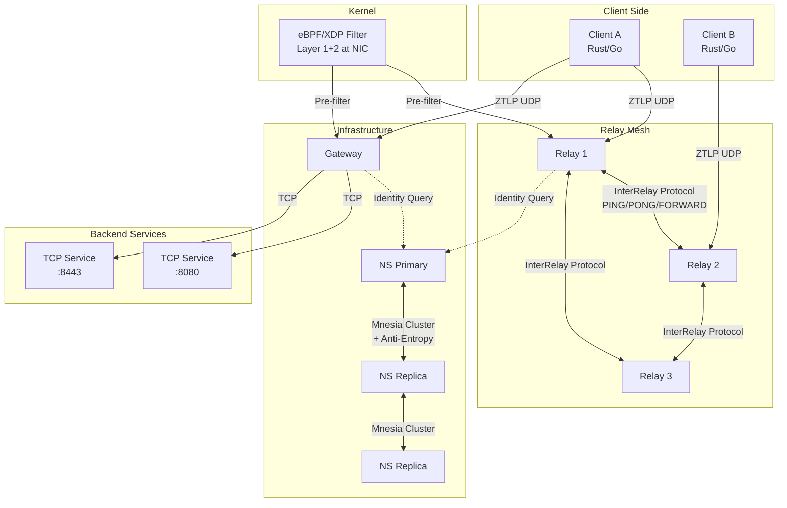
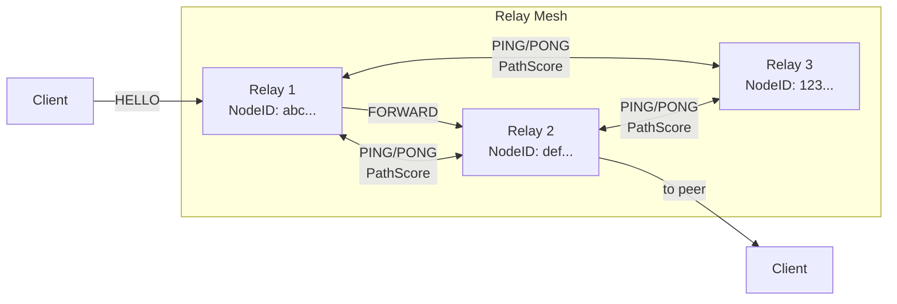
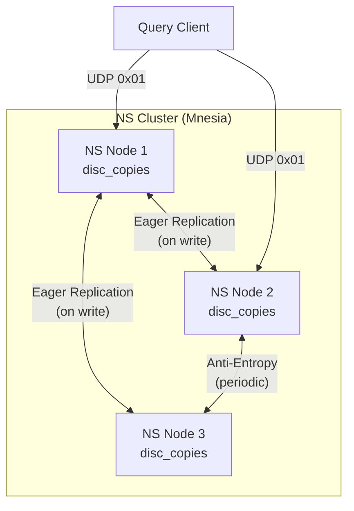

# ZTLP Architecture Guide

A deep dive into the ZTLP protocol stack for contributors and implementors.

---

## Table of Contents

1. [Overview](#overview)
2. [Repository Structure](#repository-structure)
3. [Component Diagram](#component-diagram)
4. [Connection Lifecycle](#connection-lifecycle)
5. [Three-Layer Admission Pipeline](#three-layer-admission-pipeline)
6. [Noise_XX Handshake](#noise_xx-handshake)
7. [Packet Format](#packet-format)
8. [Session Management](#session-management)
9. [Relay Mesh](#relay-mesh)
10. [NS Federation](#ns-federation)
11. [Gateway Bridging](#gateway-bridging)
12. [eBPF/XDP Integration](#ebpfxdp-integration)
13. [Configuration System](#configuration-system)
14. [Observability](#observability)

---

## Overview

ZTLP (Zero Trust Layer Protocol) is an identity-first network overlay on existing IPv4/IPv6. The core premise: **if you cannot prove who you are, you do not exist on this network.**

The protocol achieves DDoS resilience through a three-layer admission pipeline that rejects invalid traffic in nanoseconds (Layer 1) or microseconds (Layer 2) before any expensive cryptographic work occurs at Layer 3.

Key design principles:
- **Identity before connectivity** — Every node has a 128-bit NodeID (not derived from public key)
- **Cost hierarchy** — Each admission layer is orders of magnitude cheaper than the next
- **Zero trust** — All traffic is encrypted and authenticated; no implicit trust based on network position
- **Minimal dependencies** — All Elixir services use zero external dependencies (pure OTP)

## Repository Structure

```
ztlp/
├── proto/           Rust client library & CLI (ztlp binary)
│   └── src/
│       ├── lib.rs            Module root
│       ├── packet.rs         Wire format encoding/decoding
│       ├── pipeline.rs       Three-layer admission
│       ├── handshake.rs      Noise_XX implementation (via snow crate)
│       ├── identity.rs       NodeID, X25519, Ed25519
│       ├── session.rs        Session state & anti-replay
│       ├── relay.rs          Relay client
│       ├── admission.rs      RAT (Relay Admission Token) handling
│       ├── transport.rs      Async UDP transport
│       └── bin/ztlp-cli.rs   Unified CLI (9 subcommands)
│
├── relay/           Elixir relay mesh server
│   └── lib/ztlp_relay/
│       ├── application.ex      OTP application & supervision tree
│       ├── udp_listener.ex     UDP socket & packet dispatch
│       ├── pipeline.ex         Three-layer admission (Elixir)
│       ├── session.ex          Per-session GenServer
│       ├── session_registry.ex ETS session table
│       ├── handshake.ex        Noise_XX responder (via :crypto)
│       ├── inter_relay.ex      Mesh wire protocol (9 message types)
│       ├── hash_ring.ex        Consistent hash (BLAKE2s, 128 vnodes)
│       ├── relay_registry.ex   ETS relay peer registry
│       ├── path_score.ex       PING/PONG probing & relay selection
│       ├── mesh_manager.ex     Mesh lifecycle GenServer
│       ├── admission_token.ex  RAT issue/verify (HMAC-BLAKE2s)
│       ├── transit.ex          Transit relay admission
│       ├── forwarding_table.ex Multi-hop route cache
│       ├── backpressure.ex     Soft/hard load shedding
│       ├── component_auth.ex   Ed25519 challenge-response
│       ├── metrics_server.ex   Prometheus /metrics endpoint
│       └── config.ex           YAML config loader
│
├── ns/              Elixir distributed namespace
│   └── lib/ztlp_ns/
│       ├── application.ex    OTP app (Mnesia → TrustAnchor → Store → Server)
│       ├── server.ex         UDP query server
│       ├── store.ex          Mnesia-backed record store
│       ├── record.ex         Record encoding/signing/verification
│       ├── crypto.ex         Ed25519, BLAKE2s primitives
│       ├── trust_anchor.ex   Root key management
│       ├── zone_authority.ex Zone delegation & signing
│       ├── cluster.ex        Mnesia cluster join/leave/status
│       ├── anti_entropy.ex   Merkle-tree sync & conflict resolution
│       ├── replication.ex    Eager write replication via RPC
│       ├── rate_limiter.ex   Per-IP token bucket
│       ├── component_auth.ex Ed25519 challenge-response
│       ├── metrics_server.ex Prometheus /metrics endpoint
│       └── config.ex         YAML config loader
│
├── gateway/         Elixir ZTLP ↔ TCP bridge
│   └── lib/ztlp_gateway/
│       ├── application.ex     OTP app
│       ├── handshake.ex       Noise_XX responder
│       ├── bridge.ex          Bidirectional ZTLP ↔ TCP forwarding
│       ├── policy_engine.ex   Zone-wildcard access policies
│       ├── ns_client.ex       NS identity resolution (with cache)
│       ├── circuit_breaker.ex Per-backend 3-state breaker
│       ├── component_auth.ex  Ed25519 challenge-response
│       ├── metrics_server.ex  Prometheus /metrics endpoint
│       └── config.ex          YAML config loader
│
├── ebpf/            XDP packet filter (C)
│   ├── ztlp_xdp.c   BPF program (dual-port: 23095 client + 23096 mesh)
│   ├── ztlp_xdp.h   Shared constants, maps, structs
│   ├── loader.c      Userspace loader & session/peer management
│   └── Makefile      Build with clang + libbpf
│
├── sdk/go/          Go client SDK
│
├── interop/         Cross-language integration tests (Rust ↔ Elixir)
│
├── tests/network/   Docker integration test suite (14 scenarios)
│   ├── docker-compose.test.yml
│   ├── run-all.sh
│   ├── scenarios/
│   └── lib/           (common.sh, assert.sh)
│
├── bench/           Performance benchmarks
├── docs/            Documentation site, ops runbook, key management guide
├── config/examples/ Example YAML configs
└── rel/             OTP release configuration
```

## Component Diagram



## Connection Lifecycle

A typical client connection through a relay:

```
Client                     Relay                      NS
  │                          │                         │
  │──── HELLO (Noise e) ────>│                         │
  │                          │── Query NodeID ────────>│
  │                          │<─ Found (pubkey) ──────│
  │<─── HELLO_ACK (e, ee, s, es) ──│                  │
  │                          │                         │
  │──── MSG 3 (se, s) ─────>│                         │
  │                          │                         │
  │  [Session established — symmetric keys derived]    │
  │                          │                         │
  │──── Data (encrypted) ──>│──── Forward to peer ──>  │
  │<─── Data (encrypted) ───│<─── From peer ─────────  │
  │                          │                         │
  │──── CLOSE ──────────────>│  [Session torn down]    │
```

1. **HELLO** — Client sends ephemeral X25519 key (Noise `e` token)
2. **Identity Resolution** — Relay queries NS for the target's public key
3. **HELLO_ACK** — Relay responds with its ephemeral key + encrypted static key
4. **Message 3** — Client completes mutual authentication
5. **Data Flow** — All subsequent packets use ChaCha20-Poly1305 with derived session keys
6. **CLOSE** — Graceful session teardown

## Three-Layer Admission Pipeline

The heart of ZTLP's DDoS resilience. Each layer is orders of magnitude cheaper than the next:

```
                Inbound UDP Packet
                       │
                       ▼
        ┌──────────────────────────┐
        │  Layer 1: Magic Check    │  ~19 ns (Rust) / ~80 ns (Elixir)
        │  magic == 0x5A37 ?       │  Cost: single 16-bit compare
        └───────────┬──────────────┘  Rejects: ~99.99% of non-ZTLP
                    │ pass
                    ▼
        ┌──────────────────────────┐
        │  Layer 2: SessionID      │  ~31 ns (Rust) / ~215 ns (Elixir)
        │  session in allowlist?   │  Cost: hash map lookup
        └───────────┬──────────────┘  Rejects: unknown sessions
                    │ pass
                    ▼
        ┌──────────────────────────┐
        │  Layer 3: Auth Tag       │  ~840 ns (Rust)
        │  HMAC/AEAD verify?       │  Cost: real cryptography
        └───────────┬──────────────┘  Rejects: forged packets
                    │ pass
                    ▼
             Process Packet
```

**Key insight**: Invalid packets never reach the crypto layer. Scanners and floods are rejected in nanoseconds at L1 (bad magic) or microseconds at L2 (unknown SessionID). Only packets from established sessions with known SessionIDs reach the expensive L3 AEAD verification.

**eBPF acceleration**: Layers 1 and 2 can run in the NIC driver via XDP (`ebpf/ztlp_xdp.c`), dropping bad packets before they even reach the kernel network stack.

### Implementation

| Component | File | Notes |
|-----------|------|-------|
| Rust | `proto/src/pipeline.rs` | Full 3-layer with counters |
| Relay | `relay/lib/ztlp_relay/pipeline.ex` | ETS session lookup |
| Gateway | `gateway/lib/ztlp_gateway/pipeline.ex` | + NS identity resolution |
| eBPF | `ebpf/ztlp_xdp.c` | L1+L2 at NIC driver level |

## Noise_XX Handshake

ZTLP uses the Noise_XX pattern (`Noise_XX_25519_ChaChaPoly_BLAKE2s`):

```
Initiator (Client)                    Responder (Relay/Gateway)
─────────────────                    ─────────────────────────

Keypair: (s_i, S_i)                  Keypair: (s_r, S_r)
Generate ephemeral: (e_i, E_i)

── Message 1: → e ──────────────────────────────────────────>
   [E_i in cleartext]
                                     Generate ephemeral: (e_r, E_r)
                                     Compute: ee = DH(e_r, E_i)
                                     Compute: es = DH(s_r, E_i)
<── Message 2: ← e, ee, s, es ─────────────────────────────
   [E_r + encrypted(S_r)]

   Compute: ee = DH(e_i, E_r)
   Compute: se = DH(s_i, E_r)
── Message 3: → s, se ─────────────────────────────────────>
   [encrypted(S_i)]

   [Both sides derive symmetric transport keys]
   [Session established — bidirectional encrypted data flow]
```

**Why XX?** Both parties' static keys are transmitted encrypted, providing mutual authentication with identity hiding. Neither side reveals their long-term identity to a passive observer.

### Implementation Details

- **Rust**: Uses the `snow` crate (`proto/src/handshake.rs`)
- **Elixir**: Pure OTP using `:crypto` module (`relay/lib/ztlp_relay/handshake.ex`, `gateway/lib/ztlp_gateway/handshake.ex`)
- **Prologue**: Both sides MixHash a protocol-specific prologue string
- **Nonce format**: 4 zero bytes + 8-byte little-endian counter (Noise spec)
- **Key derivation**: BLAKE2s HKDF for session keys post-handshake

### Gotcha: Elixir ↔ Rust Interop

The Noise spec requires exact byte-level agreement. A bug was found during interop testing where the gateway was missing `MixHash(prologue)` and empty-payload `MixHash` steps, causing key derivation divergence. See `interop/` tests for the fix.

## Packet Format

### Handshake/Control Header (95 bytes)

```
 0                   1                   2                   3
 0 1 2 3 4 5 6 7 8 9 0 1 2 3 4 5 6 7 8 9 0 1 2 3 4 5 6 7 8 9 0 1
+-+-+-+-+-+-+-+-+-+-+-+-+-+-+-+-+-+-+-+-+-+-+-+-+-+-+-+-+-+-+-+-+
|         Magic (0x5A37)        | Ver |       HdrLen (24)       |
+-+-+-+-+-+-+-+-+-+-+-+-+-+-+-+-+-+-+-+-+-+-+-+-+-+-+-+-+-+-+-+-+
|            Flags              |   MsgType     |  CryptoSuite  |
+-+-+-+-+-+-+-+-+-+-+-+-+-+-+-+-+-+-+-+-+-+-+-+-+-+-+-+-+-+-+-+-+
|          KeyID/TokenID        |                               |
+-+-+-+-+-+-+-+-+-+-+-+-+-+-+-+-+                               +
|                         SessionID (12 bytes)                  |
+                               +-+-+-+-+-+-+-+-+-+-+-+-+-+-+-+-+
|                               |                               |
+-+-+-+-+-+-+-+-+-+-+-+-+-+-+-+-+                               +
|                      PacketSequence (8 bytes)                 |
+                               +-+-+-+-+-+-+-+-+-+-+-+-+-+-+-+-+
|                               |                               |
+-+-+-+-+-+-+-+-+-+-+-+-+-+-+-+-+                               +
|                        Timestamp (8 bytes)                    |
+                               +-+-+-+-+-+-+-+-+-+-+-+-+-+-+-+-+
|                               |                               |
+-+-+-+-+-+-+-+-+-+-+-+-+-+-+-+-+                               +
|                       SrcNodeID (16 bytes)                    |
+                                                               +
|                                                               |
+                               +-+-+-+-+-+-+-+-+-+-+-+-+-+-+-+-+
|                               |                               |
+-+-+-+-+-+-+-+-+-+-+-+-+-+-+-+-+                               +
|                       DstSvcID (16 bytes)                     |
+                                                               +
|                                                               |
+                               +-+-+-+-+-+-+-+-+-+-+-+-+-+-+-+-+
|                               |          PolicyTag            |
+-+-+-+-+-+-+-+-+-+-+-+-+-+-+-+-+-+-+-+-+-+-+-+-+-+-+-+-+-+-+-+-+
|            ExtLen             |          PayloadLen           |
+-+-+-+-+-+-+-+-+-+-+-+-+-+-+-+-+-+-+-+-+-+-+-+-+-+-+-+-+-+-+-+-+
|                    HeaderAuthTag (16 bytes)                   |
+                                                               +
|                                                               |
+                                                               +
|                                                               |
+                                                               +
|                                                               |
+-+-+-+-+-+-+-+-+-+-+-+-+-+-+-+-+-+-+-+-+-+-+-+-+-+-+-+-+-+-+-+-+
```

### Compact Data Header (42 bytes, post-handshake)

```
 0                   1                   2                   3
 0 1 2 3 4 5 6 7 8 9 0 1 2 3 4 5 6 7 8 9 0 1 2 3 4 5 6 7 8 9 0 1
+-+-+-+-+-+-+-+-+-+-+-+-+-+-+-+-+-+-+-+-+-+-+-+-+-+-+-+-+-+-+-+-+
|         Magic (0x5A37)        | Ver |       HdrLen (11)       |
+-+-+-+-+-+-+-+-+-+-+-+-+-+-+-+-+-+-+-+-+-+-+-+-+-+-+-+-+-+-+-+-+
|            Flags              |                               |
+-+-+-+-+-+-+-+-+-+-+-+-+-+-+-+-+                               +
|                         SessionID (12 bytes)                  |
+                                                               +
|                                                               |
+                               +-+-+-+-+-+-+-+-+-+-+-+-+-+-+-+-+
|                               |                               |
+-+-+-+-+-+-+-+-+-+-+-+-+-+-+-+-+                               +
|                      PacketSequence (8 bytes)                 |
+                               +-+-+-+-+-+-+-+-+-+-+-+-+-+-+-+-+
|                               |                               |
+-+-+-+-+-+-+-+-+-+-+-+-+-+-+-+-+                               +
|                    HeaderAuthTag (16 bytes)                   |
+                                                               +
|                                                               |
+                                                               +
|                                                               |
+-+-+-+-+-+-+-+-+-+-+-+-+-+-+-+-+-+-+-+-+-+-+-+-+-+-+-+-+-+-+-+-+
```

**Packet discrimination**: Use HdrLen field (lower 12 bits of the Ver|HdrLen word):
- `HdrLen == 24` → Handshake header (95 bytes)
- `HdrLen == 11` → Compact data header (42 bytes)

Do **not** use overall packet length for discrimination — this is fragile and breaks with extensions.

## Session Management

After the Noise_XX handshake completes:

1. **Key derivation** — BLAKE2s HKDF from Noise handshake hash → send key + recv key
2. **SessionID assignment** — 12 random bytes, registered in the session table
3. **Anti-replay** — 64-bit sliding window bitmap tracks seen sequence numbers
4. **Rekey** — Periodic rekeying via Noise rekey mechanism (MsgType::Rekey)
5. **Timeout** — Sessions expire after configurable inactivity (default 5 minutes)

### Key files

| Component | Session registry | Per-session state |
|-----------|-----------------|-------------------|
| Relay | `session_registry.ex` (ETS) | `session.ex` (GenServer) |
| Gateway | `session_registry.ex` (ETS) | `bridge.ex` (per-connection) |
| Rust | `session.rs` (HashMap) | `SessionState` struct |

## Relay Mesh

Relays form a mesh for distributed session routing:



### Routing

- **Consistent hash ring** — BLAKE2s hash of SessionID, 128 virtual nodes per relay
- **O(log n) lookup** — Binary search on sorted ring
- **PathScore selection** — When multiple relays could handle a session, pick the one with best score: `RTT × (1 + loss×10) × (1 + load×2) × (1 + jitter/100)`

### Health Probing

- Sequence-numbered PING/PONG every 5 seconds
- 20-probe sliding window for loss detection
- Jitter = stddev of RTT
- Health states: healthy → degraded → unreachable (with hysteresis)

### Inter-Relay Wire Protocol

| Byte | Type | Description |
|------|------|-------------|
| 0x01 | JOIN | Announce presence to mesh |
| 0x02 | SYNC | Exchange session info |
| 0x03 | PING | Health probe |
| 0x04 | PONG | Probe response |
| 0x05 | FORWARD | Route packet via mesh |
| 0x06 | SESSION | Session migration |
| 0x07 | LEAVE | Graceful departure |
| 0x08 | DRAIN | Start draining sessions |
| 0x09 | DRAIN_CANCEL | Cancel drain |

### Multi-hop Forwarding

- Max 4 hops (TTL byte in FORWARD header)
- Loop detection via traversed path (list of NodeIDs)
- Route cache in ETS with TTL (`forwarding_table.ex`)
- RoutePlanner picks ingress → transit → service paths

### Admission Tokens (RATs)

93-byte tokens for session admission at transit relays:
- HMAC-BLAKE2s MAC over (NodeID + timestamp + flags)
- Key rotation support with configurable rotation interval
- Issued by ingress relay, verified by transit relays

### Key files

| File | Purpose |
|------|---------|
| `relay/lib/ztlp_relay/mesh_manager.ex` | Lifecycle, join/leave |
| `relay/lib/ztlp_relay/hash_ring.ex` | Consistent hash routing |
| `relay/lib/ztlp_relay/path_score.ex` | Health probing & selection |
| `relay/lib/ztlp_relay/inter_relay.ex` | Wire protocol encode/decode |
| `relay/lib/ztlp_relay/transit.ex` | Transit relay processing |
| `relay/lib/ztlp_relay/admission_token.ex` | RAT issue/verify |
| `relay/lib/ztlp_relay/forwarding_table.ex` | Route cache |

## NS Federation

ZTLP-NS is a distributed trust namespace. Records are Ed25519-signed name→value mappings organized into hierarchical zones.

### Cluster Architecture



### Write Path

1. Client registers a record via RPC or registration message (0x02)
2. `Store.insert/1` writes to local Mnesia
3. `Replication.replicate/1` pushes to all cluster peers via `:rpc.call/4`
4. Remote peers call `Store.insert(record, replicated: true)` — the `replicated: true` flag prevents re-replication (loop prevention)

### Anti-Entropy

Periodic reconciliation (default every 30 seconds):

1. Compute Merkle root hash of local records (BLAKE2s)
2. Compare with each peer's root hash
3. If divergent: exchange full record sets
4. Merge using conflict resolution rules:
   - **Revocation always wins** — propagate unconditionally
   - **Higher serial wins** — for same name+type
   - **Signature must verify** — reject invalid
   - **TTL check** — skip expired records

### Storage

- **Mnesia `disc_copies`** in production (survives restarts)
- **Mnesia `ram_copies`** in tests (faster, no cleanup)
- Tables: `:ztlp_ns_records`, `:ztlp_ns_revoked`
- **Gotcha**: `disc_copies` requires a distributed Erlang node (not `:nonode@nohost`)

### Key files

| File | Purpose |
|------|---------|
| `ns/lib/ztlp_ns/cluster.ex` | Join/leave/status/ensure_replicated |
| `ns/lib/ztlp_ns/anti_entropy.ex` | Merkle sync & conflict resolution |
| `ns/lib/ztlp_ns/replication.ex` | Eager write replication |
| `ns/lib/ztlp_ns/store.ex` | Mnesia CRUD operations |
| `ns/lib/ztlp_ns/record.ex` | Record encoding/signing |
| `ns/lib/ztlp_ns/zone_authority.ex` | Zone delegation |
| `ns/lib/ztlp_ns/trust_anchor.ex` | Root key management |

## Gateway Bridging

The gateway bridges ZTLP (UDP) traffic to standard TCP services:

```
Client ──ZTLP UDP──▶ Gateway ──TCP──▶ Backend Service
                       │
                       ├── Noise_XX handshake (responder)
                       ├── Policy engine (zone wildcards)
                       ├── NS identity resolution (cached)
                       ├── Circuit breaker (per-backend)
                       └── Bidirectional forwarding
```

### Policy Engine

Policies are YAML-configured zone-wildcard rules:
```yaml
policies:
  - zone: "*.corp.example.ztlp"
    action: allow
    backends: ["web:8080", "api:8443"]
  - zone: "*"
    action: deny
```

### Circuit Breaker

Per-backend 3-state circuit breaker:
- **Closed** — normal operation, track failure rate
- **Open** — all requests fail fast (configurable timeout before retry)
- **Half-open** — allow one probe request; success → closed, failure → open

### Key files

| File | Purpose |
|------|---------|
| `gateway/lib/ztlp_gateway/bridge.ex` | Bidirectional forwarding |
| `gateway/lib/ztlp_gateway/policy_engine.ex` | Access control |
| `gateway/lib/ztlp_gateway/ns_client.ex` | Identity resolution + cache |
| `gateway/lib/ztlp_gateway/circuit_breaker.ex` | Per-backend health |
| `gateway/lib/ztlp_gateway/handshake.ex` | Noise_XX responder |

## eBPF/XDP Integration

The XDP filter runs in the NIC driver — before packets even reach the kernel network stack:

```
NIC Hardware
    │
    ▼
┌──────────────────────────────────────┐
│  XDP Program (ztlp_xdp.c)           │
│                                      │
│  Port 23095 (client):                │
│    L1: magic == 0x5A37? → DROP       │
│    L2: SessionID in map? → DROP      │
│    HELLO: rate limit check → DROP    │
│                                      │
│  Port 23096 (mesh):                  │
│    Peer NodeID in allowlist? → DROP  │
│    FORWARD: TTL == 0? → DROP        │
│    FORWARD: inner magic check        │
│                                      │
│  Everything else → XDP_PASS          │
└──────────────┬───────────────────────┘
               │ XDP_PASS
               ▼
         Kernel Network Stack
               │
               ▼
         Userspace (Relay/Gateway)
               │
               ▼
         Layer 3: AEAD verification
```

### BPF Maps

| Map | Type | Key | Value | Purpose |
|-----|------|-----|-------|---------|
| `session_map` | Hash | 12-byte SessionID | u8 flag | L2 allowlist |
| `hello_rate_map` | Hash | u32 src_ip | token bucket | HELLO rate limit |
| `stats_map` | PerCPU Array | u32 index | u64 counter | Drop/pass stats |
| `mesh_peer_map` | Hash | 16-byte NodeID | u8 flag | Mesh peer allowlist |
| `rat_bypass_map` | Array | 0 | u8 flag | RAT bypass toggle |

### Key constraint

eBPF programs must pass the BPF verifier — every pointer access needs a bounds check against `data_end`, no unbounded loops, no calling userspace functions.

## Configuration System

All services use YAML config files with environment variable overrides:

```
Priority: ENV var > YAML file > compiled default
```

### Config paths

| Service | Default path | Env override |
|---------|-------------|--------------|
| Relay | `/etc/ztlp/relay.yaml` | `ZTLP_RELAY_CONFIG` |
| NS | `/etc/ztlp/ns.yaml` | `ZTLP_NS_CONFIG` |
| Gateway | `/etc/ztlp/gateway.yaml` | `ZTLP_GATEWAY_CONFIG` |

### Runtime configuration

OTP releases use `runtime.exs` for boot-time env var configuration. See `rel/` for release configs.

## Observability

### Prometheus Metrics

Each service exposes `/metrics` (Prometheus text format) and `/health` on configurable ports:

| Service | Default port | Env override |
|---------|-------------|--------------|
| Relay | 9101 | `ZTLP_RELAY_METRICS_PORT` |
| Gateway | 9102 | `ZTLP_GATEWAY_METRICS_PORT` |
| NS | 9103 | `ZTLP_NS_METRICS_PORT` |

### Structured Logging

All services support structured log output:
- `ZTLP_LOG_FORMAT=json` — JSON lines (for log aggregators)
- `ZTLP_LOG_FORMAT=structured` — key=value pairs
- `ZTLP_LOG_FORMAT=console` — human-readable (default)

### Grafana Dashboard

Pre-built dashboard at `ops/grafana/ztlp-dashboard.json` with panels for pipeline stats, session counts, mesh health, backpressure, circuit breaker, anti-entropy, and BEAM VM metrics.

---

*Last updated: 2026-03-11 — ZTLP v0.4.1*
