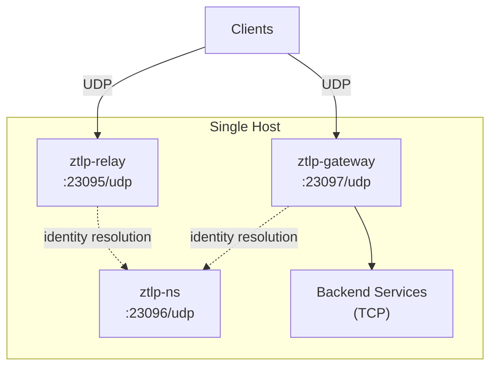
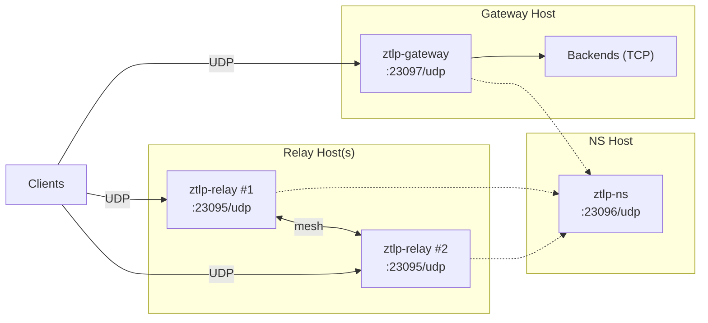
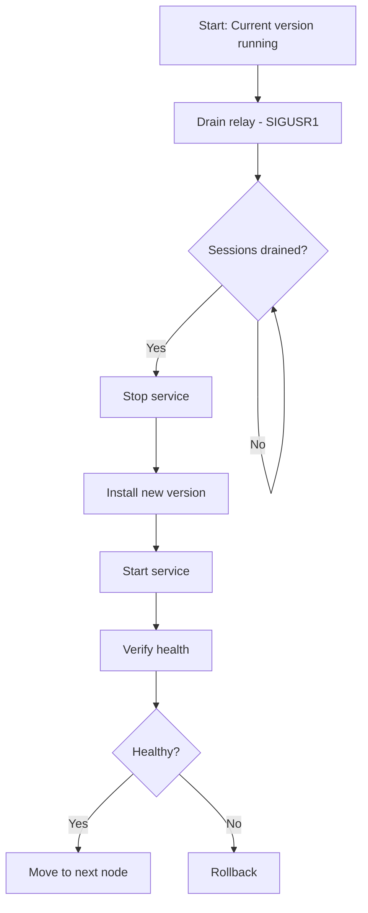
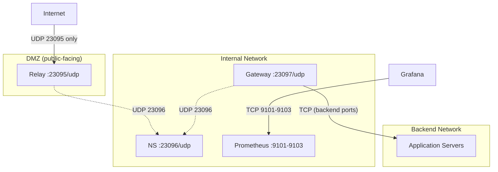

# ZTLP Operations Runbook

Comprehensive operations guide for deploying, configuring, monitoring, and maintaining ZTLP (Zero Trust Layer Protocol) services in production.

**Audience:** DevOps engineers who know Linux but are new to ZTLP.

**Components:**

| Service | Description | Default Port | Metrics Port |
|---------|-------------|-------------|--------------|
| **ztlp-ns** | Namespace server (identity resolution, Mnesia-backed) | 23096/udp | 9103 |
| **ztlp-relay** | Encrypted packet relay (forwards by SessionID) | 23095/udp | 9101 |
| **ztlp-gateway** | TCP bridge (ZTLP ↔ legacy backend services) | 23097/udp | 9102 |
| **ztlp** (CLI) | Command-line tool for keygen, connect, inspect, etc. | — | — |

> **See also:** [GETTING-STARTED.md](../GETTING-STARTED.md) · [DOCKER.md](../DOCKER.md) · [ARCHITECTURE.md](../ARCHITECTURE.md) · [CLI.md](../CLI.md) · [THREAT-MODEL.md](../THREAT-MODEL.md)

---

## Table of Contents

1. [Deployment](#1-deployment)
2. [Configuration](#2-configuration)
3. [Day-to-Day Operations](#3-day-to-day-operations)
4. [Upgrades and Rollbacks](#4-upgrades-and-rollbacks)
5. [Key and Secret Management](#5-key-and-secret-management)
6. [Troubleshooting](#6-troubleshooting)
7. [Backup and Recovery](#7-backup-and-recovery)
8. [Security Hardening](#8-security-hardening)

---

## 1. Deployment

### Deployment Topologies

#### Single-Node Deployment

All three services on one machine. Suitable for development, small deployments, or edge sites.



#### Multi-Node Deployment

Dedicated hosts per service. Recommended for production.



### Debian Package Installation

The ZTLP project produces four `.deb` packages plus a meta-package. See `ops/packaging/build-deb.sh` for the builder.

| Package | Installs |
|---------|----------|
| `ztlp-ns` | Namespace server + systemd unit + logrotate config |
| `ztlp-relay` | Relay + systemd unit + logrotate config |
| `ztlp-gateway` | Gateway + systemd unit + logrotate config |
| `ztlp-cli` | `ztlp` CLI binary at `/usr/bin/ztlp` |
| `ztlp` | Meta-package — installs all of the above |

**Install a single component:**

```bash
sudo dpkg -i ztlp-ns_0.1.0_amd64.deb
```

**Install everything:**

```bash
sudo dpkg -i ztlp_0.1.0_all.deb
# If deps are missing:
sudo apt-get install -f
```

**What the packages do on install (postinst):**

1. Create `ztlp` system user and group
2. Create data directories (`/var/lib/ztlp/<component>/`) with `0750` permissions
3. Create log directory (`/var/log/ztlp/`) with `0750` permissions
4. Create config directory (`/etc/ztlp/`) with `0755` permissions
5. Generate Erlang cookie at `/var/lib/ztlp/<component>/.cookie` (random, `0400`)
6. Copy example config to `/etc/ztlp/<component>.yaml` if not already present
7. Reload systemd

After installation:

```bash
# Edit configuration
sudo vim /etc/ztlp/ns.yaml
sudo vim /etc/ztlp/relay.yaml
sudo vim /etc/ztlp/gateway.yaml

# Enable and start
sudo systemctl enable --now ztlp-ns
sudo systemctl enable --now ztlp-relay
sudo systemctl enable --now ztlp-gateway
```

### Docker Compose Deployment

See [DOCKER.md](../DOCKER.md) for full reference.

```bash
git clone https://github.com/priceflex/ztlp.git
cd ztlp

# Start all services (foreground)
docker compose up --build

# Start in background
docker compose up -d --build

# Follow logs
docker compose logs -f

# Stop
docker compose down
```

The `docker-compose.yml` starts four containers:

| Container | Image Build | Ports |
|-----------|-------------|-------|
| `ztlp-ns` | `./ns` | 23096/udp |
| `ztlp-relay` | `./relay` | 23095/udp |
| `ztlp-gateway` | `./gateway` | 23097/udp |
| `ztlp-echo-backend` | `alpine/socat` | 8080/tcp |

Override environment at runtime:

```bash
ZTLP_RELAY_PORT=9000 docker compose up relay
```

### Manual Release Deployment

If you're building from source without packages:

```bash
# --- NS ---
cd ns
MIX_ENV=prod mix release --overwrite
# Release at: _build/prod/rel/ztlp_ns/

# --- Relay ---
cd relay
MIX_ENV=prod mix release --overwrite
# Release at: _build/prod/rel/ztlp_relay/

# --- Gateway ---
cd gateway
MIX_ENV=prod mix release --overwrite
# Release at: _build/prod/rel/ztlp_gateway/

# --- CLI ---
cd proto
cargo build --release
# Binary at: target/release/ztlp
```

Deploy releases to `/usr/lib/ztlp/<component>/`, then install the systemd unit files:

```bash
sudo cp ops/systemd/ztlp-*.service /lib/systemd/system/
sudo systemctl daemon-reload
```

### First-Time Setup Checklist

Use this checklist for a fresh deployment:

- [ ] **1. Create system user**
  ```bash
  sudo addgroup --system ztlp
  sudo adduser --system --ingroup ztlp --home /var/lib/ztlp --no-create-home --disabled-login ztlp
  ```

- [ ] **2. Create directories**
  ```bash
  sudo install -d -o ztlp -g ztlp -m 0750 /var/lib/ztlp/ns /var/lib/ztlp/ns/mnesia
  sudo install -d -o ztlp -g ztlp -m 0750 /var/lib/ztlp/relay
  sudo install -d -o ztlp -g ztlp -m 0750 /var/lib/ztlp/gateway
  sudo install -d -o ztlp -g ztlp -m 0750 /var/log/ztlp
  sudo install -d -o root -g root -m 0755 /etc/ztlp
  ```

- [ ] **3. Generate Erlang cookies** (one per service, for BEAM distribution security)
  ```bash
  for svc in ns relay gateway; do
    head -c 32 /dev/urandom | base64 | tr -d '\n' > /var/lib/ztlp/$svc/.cookie
    chown ztlp:ztlp /var/lib/ztlp/$svc/.cookie
    chmod 0400 /var/lib/ztlp/$svc/.cookie
  done
  ```

- [ ] **4. Generate ZTLP identity keys** (for nodes connecting to the network)
  ```bash
  ztlp keygen --output ~/.ztlp/identity.json
  # Creates: private.key, public.key, node.id
  ```

- [ ] **5. Install config files**
  ```bash
  sudo cp config/examples/ns.yaml /etc/ztlp/ns.yaml
  sudo cp config/examples/relay.yaml /etc/ztlp/relay.yaml
  sudo cp config/examples/gateway.yaml /etc/ztlp/gateway.yaml
  sudo chmod 0640 /etc/ztlp/*.yaml
  sudo chown root:ztlp /etc/ztlp/*.yaml
  ```

- [ ] **6. Edit configuration** (see [Configuration](#2-configuration) below)

- [ ] **7. Install systemd units**
  ```bash
  sudo cp ops/systemd/ztlp-*.service /lib/systemd/system/
  sudo systemctl daemon-reload
  ```

- [ ] **8. Start NS first** (relay and gateway depend on it)
  ```bash
  sudo systemctl enable --now ztlp-ns
  sudo systemctl status ztlp-ns
  ```

- [ ] **9. Start relay and gateway**
  ```bash
  sudo systemctl enable --now ztlp-relay
  sudo systemctl enable --now ztlp-gateway
  ```

- [ ] **10. Verify health**
  ```bash
  curl -s http://localhost:9103/health   # NS
  curl -s http://localhost:9101/health   # Relay
  curl -s http://localhost:9102/health   # Gateway
  ```

- [ ] **11. Register node with NS** (if using name resolution)
  ```bash
  ztlp ns register \
    --name myserver.corp.ztlp \
    --zone corp.ztlp \
    --key ~/.ztlp/identity.json \
    --address 10.0.0.1:23095
  ```

### Required Ports and Firewall Rules

| Port | Protocol | Service | Direction | Purpose |
|------|----------|---------|-----------|---------|
| 23095 | UDP | Relay | Inbound | Client connections |
| 23096 | UDP | NS / Relay mesh | Inbound | NS queries + inter-relay mesh |
| 23097 | UDP | Gateway | Inbound | Client connections |
| 9101 | TCP | Relay | Internal | Prometheus metrics |
| 9102 | TCP | Gateway | Internal | Prometheus metrics |
| 9103 | TCP | NS | Internal | Prometheus metrics |

**Minimal firewall rules (UFW example):**

```bash
# Public-facing (from clients)
sudo ufw allow 23095/udp comment "ZTLP Relay"
sudo ufw allow 23097/udp comment "ZTLP Gateway"

# Internal only (between ZTLP services)
sudo ufw allow from 10.0.0.0/24 to any port 23096 proto udp comment "ZTLP NS"

# Metrics (monitoring network only)
sudo ufw allow from 10.0.0.0/24 to any port 9101:9103 proto tcp comment "ZTLP metrics"
```

**iptables equivalent:**

```bash
# ZTLP services
iptables -A INPUT -p udp --dport 23095 -j ACCEPT
iptables -A INPUT -p udp --dport 23097 -j ACCEPT
iptables -A INPUT -p udp --dport 23096 -s 10.0.0.0/24 -j ACCEPT

# Metrics (internal only)
iptables -A INPUT -p tcp --dport 9101:9103 -s 10.0.0.0/24 -j ACCEPT
```

> ⚠️ **Never expose metrics ports (9101–9103) to the public internet.** They contain operational data about your infrastructure.

---

## 2. Configuration

### Config File Locations

| Service | Config File | Env File | Data Dir |
|---------|------------|----------|----------|
| NS | `/etc/ztlp/ns.yaml` | `/etc/ztlp/ns.env` | `/var/lib/ztlp/ns/` |
| Relay | `/etc/ztlp/relay.yaml` | `/etc/ztlp/relay.env` | `/var/lib/ztlp/relay/` |
| Gateway | `/etc/ztlp/gateway.yaml` | `/etc/ztlp/gateway.env` | `/var/lib/ztlp/gateway/` |

**Precedence (highest wins):** Environment variable → YAML config file → Application default

The config file path is set via the systemd environment:

```
ZTLP_RELAY_CONFIG=/etc/ztlp/relay.yaml
ZTLP_GATEWAY_CONFIG=/etc/ztlp/gateway.yaml
ZTLP_NS_CONFIG=/etc/ztlp/ns.yaml
```

### Duration Format

Anywhere a duration is expected, these formats work:

| Format | Example | Value |
|--------|---------|-------|
| Milliseconds | `100ms` | 100 ms |
| Seconds | `300s` | 5 minutes |
| Minutes | `5m` | 5 minutes |
| Hours | `1h` | 1 hour |
| Plain integer | `300000` | 300,000 ms |

### Relay Configuration Reference

**Config file:** `/etc/ztlp/relay.yaml` — Full example at `config/examples/relay.yaml`

```yaml
# UDP listen port (default: 23095)
# Env: ZTLP_RELAY_PORT
port: 23095

# Session inactivity timeout (default: 300s)
# Env: ZTLP_RELAY_SESSION_TIMEOUT_MS
session_timeout: 300s

# Maximum concurrent sessions (default: 10000)
# Env: ZTLP_RELAY_MAX_SESSIONS
max_sessions: 10000

# ─── Mesh Mode ───────────────────────────────
mesh:
  enabled: false                    # Env: ZTLP_RELAY_MESH
  port: 23096                       # Env: ZTLP_RELAY_MESH_PORT
  bootstrap: []                     # Env: ZTLP_RELAY_MESH_BOOTSTRAP (comma-separated)
  # node_id: "0123456789abcdef..."  # Env: ZTLP_RELAY_NODE_ID (32 hex chars)
  role: all                         # Env: ZTLP_RELAY_ROLE (ingress|transit|service|all)
  vnodes: 128                       # Env: ZTLP_RELAY_VNODES
  ping_interval: 15s                # Env: ZTLP_RELAY_PING_INTERVAL_MS
  relay_timeout: 300s               # Env: ZTLP_RELAY_TIMEOUT_MS

# ─── Admission ───────────────────────────────
admission:
  # rat_secret: "..."               # Env: ZTLP_RELAY_RAT_SECRET (64 hex chars = 32 bytes)
  # rat_secret_previous: "..."      # Env: ZTLP_RELAY_RAT_SECRET_PREVIOUS
  rat_ttl: 300s                     # Env: ZTLP_RELAY_RAT_TTL_SECONDS
  rate_limit:
    per_ip: 10                      # Max HELLO/IP/minute
    per_node: 5                     # Max HELLO/NodeID/minute
  sac_load_threshold: 0.7           # SAC trigger threshold (0.0–1.0)

# ─── NS Discovery ────────────────────────────
ns_discovery:
  # server: "127.0.0.1:23096"       # Env: ZTLP_RELAY_NS_SERVER
  zone: "relay.ztlp"                # Env: ZTLP_RELAY_NS_DISCOVERY_ZONE
  refresh_interval: 60s             # Env: ZTLP_RELAY_NS_REFRESH_INTERVAL_MS
  region: "default"                 # Env: ZTLP_RELAY_REGION
```

### Gateway Configuration Reference

**Config file:** `/etc/ztlp/gateway.yaml` — Full example at `config/examples/gateway.yaml`

```yaml
# UDP listen port (default: 23097)
# Env: ZTLP_GATEWAY_PORT
port: 23097

# Session inactivity timeout (default: 300s)
# Env: ZTLP_GATEWAY_SESSION_TIMEOUT_MS
session_timeout: 300s

# Maximum concurrent sessions (default: 10000)
# Env: ZTLP_GATEWAY_MAX_SESSIONS
max_sessions: 10000

# ─── NS Integration ──────────────────────────
ns:
  host: "127.0.0.1"
  port: 23096
  query_timeout: 2s

# ─── Backend Services ────────────────────────
backends:
  - name: "web"
    host: "127.0.0.1"
    port: 8080
  - name: "api"
    host: "10.0.0.5"
    port: 3000

# ─── Access Policies ─────────────────────────
policies:
  - zone: "*.corp.ztlp"
    action: allow
    backends:
      - "web"
  - zone: "*.public.ztlp"
    action: allow
    backends:
      - "api"
  - zone: "*"
    action: deny
```

### NS Configuration Reference

**Config file:** `/etc/ztlp/ns.yaml` — Full example at `config/examples/ns.yaml`

```yaml
# UDP listen port (default: 23096)
# Env: ZTLP_NS_PORT
port: 23096

# Maximum records in the store (default: 100000)
# Env: ZTLP_NS_MAX_RECORDS
max_records: 100000

# Storage mode: disc (persistent) or ram (volatile, for testing)
# Env: ZTLP_NS_STORAGE_MODE
storage_mode: disc

# Mnesia data directory (default: OTP default)
# Env: ZTLP_NS_MNESIA_DIR
# mnesia_dir: "/var/lib/ztlp/ns/mnesia"

# Bootstrap discovery URLs
bootstrap_urls:
  - "https://bootstrap.ztlp.org/.well-known/ztlp-relays.json"
```

The systemd service sets `ZTLP_NS_MNESIA_DIR=/var/lib/ztlp/ns/mnesia` by default.

### Environment Variable Reference

| Variable | Service | Default | Description |
|----------|---------|---------|-------------|
| `ZTLP_RELAY_PORT` | Relay | `23095` | UDP listen port |
| `ZTLP_RELAY_MAX_SESSIONS` | Relay | `10000` | Max concurrent sessions |
| `ZTLP_RELAY_SESSION_TIMEOUT_MS` | Relay | `300000` | Session inactivity timeout (ms) |
| `ZTLP_RELAY_MESH` | Relay | `false` | Enable mesh mode |
| `ZTLP_RELAY_MESH_PORT` | Relay | `23096` | Inter-relay mesh port |
| `ZTLP_RELAY_MESH_BOOTSTRAP` | Relay | — | Comma-separated mesh peer addresses |
| `ZTLP_RELAY_NODE_ID` | Relay | auto | 32-char hex node ID (stable across restarts) |
| `ZTLP_RELAY_ROLE` | Relay | `all` | Mesh role: ingress, transit, service, all |
| `ZTLP_RELAY_VNODES` | Relay | `128` | Virtual nodes in hash ring |
| `ZTLP_RELAY_PING_INTERVAL_MS` | Relay | `15000` | PathScore ping sweep interval |
| `ZTLP_RELAY_TIMEOUT_MS` | Relay | `300000` | Peer removal timeout |
| `ZTLP_RELAY_RAT_SECRET` | Relay | auto | RAT signing secret (64 hex chars) |
| `ZTLP_RELAY_RAT_SECRET_PREVIOUS` | Relay | — | Previous RAT secret for rotation |
| `ZTLP_RELAY_RAT_TTL_SECONDS` | Relay | `300` | RAT time-to-live |
| `ZTLP_RELAY_NS_SERVER` | Relay | — | NS server address (host:port) |
| `ZTLP_RELAY_NS_DISCOVERY_ZONE` | Relay | `relay.ztlp` | NS zone for relay discovery |
| `ZTLP_RELAY_NS_REFRESH_INTERVAL_MS` | Relay | `60000` | NS relay list refresh interval |
| `ZTLP_RELAY_REGION` | Relay | `default` | Relay region label |
| `ZTLP_GATEWAY_PORT` | Gateway | `23097` | UDP listen port |
| `ZTLP_GATEWAY_MAX_SESSIONS` | Gateway | `10000` | Max concurrent sessions |
| `ZTLP_GATEWAY_SESSION_TIMEOUT_MS` | Gateway | `300000` | Session inactivity timeout (ms) |
| `ZTLP_GATEWAY_NS_HOST` | Gateway | `127.0.0.1` | NS server hostname |
| `ZTLP_GATEWAY_NS_PORT` | Gateway | `23096` | NS server port |
| `ZTLP_NS_PORT` | NS | `23096` | UDP listen port |
| `ZTLP_NS_MAX_RECORDS` | NS | `100000` | Max records in store |
| `ZTLP_NS_STORAGE_MODE` | NS | `disc` | Storage mode: disc or ram |
| `ZTLP_NS_MNESIA_DIR` | NS | OTP default | Mnesia data directory |
| `ZTLP_LOG_FORMAT` | All | `console` | Log format: `console` or `kv` (key=value structured) |
| `ZTLP_RELAY_CONFIG` | Relay | — | Path to YAML config file |
| `ZTLP_GATEWAY_CONFIG` | Gateway | — | Path to YAML config file |
| `ZTLP_NS_CONFIG` | NS | — | Path to YAML config file |
| `RELEASE_NODE` | All | — | Erlang node name |
| `RELEASE_DISTRIBUTION` | All | `sname` | Erlang distribution type |
| `RELEASE_COOKIE_FILE` | All | — | Path to Erlang cookie file |

### Common Configuration Patterns

#### Single Relay (Standalone)

```yaml
# /etc/ztlp/relay.yaml
port: 23095
max_sessions: 10000
session_timeout: 300s
mesh:
  enabled: false
```

#### Relay Mesh (2+ Relays)

```yaml
# /etc/ztlp/relay.yaml — on relay-1 (10.0.0.2)
port: 23095
max_sessions: 10000
mesh:
  enabled: true
  port: 23096
  node_id: "aabbccdd11223344aabbccdd11223344"
  bootstrap:
    - "10.0.0.3:23096"
  role: all
  vnodes: 128
  ping_interval: 15s
```

```yaml
# /etc/ztlp/relay.yaml — on relay-2 (10.0.0.3)
port: 23095
max_sessions: 10000
mesh:
  enabled: true
  port: 23096
  node_id: "eeff0011aabbccdd5566778899001122"
  bootstrap:
    - "10.0.0.2:23096"
  role: all
  vnodes: 128
  ping_interval: 15s
```

> 💡 **Tip:** Set `node_id` explicitly for stable mesh identity across restarts. Without it, a new random ID is generated each time.

#### Gateway with Multiple Backends

```yaml
# /etc/ztlp/gateway.yaml
port: 23097
ns:
  host: "10.0.0.1"
  port: 23096
backends:
  - name: "web"
    host: "10.0.1.10"
    port: 8080
  - name: "api"
    host: "10.0.1.20"
    port: 3000
  - name: "db"
    host: "10.0.1.30"
    port: 5432
policies:
  - zone: "*.web.corp.ztlp"
    action: allow
    backends: ["web"]
  - zone: "*.api.corp.ztlp"
    action: allow
    backends: ["api"]
  - zone: "*.dba.corp.ztlp"
    action: allow
    backends: ["db"]
  - zone: "*"
    action: deny
```

---

## 3. Day-to-Day Operations

### Starting and Stopping Services

**Start order:** NS first, then relay and gateway (they depend on NS for identity resolution).

```bash
# Start all (NS starts first due to systemd ordering)
sudo systemctl start ztlp-ns ztlp-relay ztlp-gateway

# Stop all (reverse order)
sudo systemctl stop ztlp-gateway ztlp-relay ztlp-ns

# Restart a single service
sudo systemctl restart ztlp-relay

# Enable at boot
sudo systemctl enable ztlp-ns ztlp-relay ztlp-gateway

# Check status
sudo systemctl status ztlp-ns ztlp-relay ztlp-gateway
```

The systemd units define dependency ordering:
- `ztlp-ns.service` has `Before=ztlp-relay.service ztlp-gateway.service`
- `ztlp-relay.service` has `After=ztlp-ns.service`
- `ztlp-gateway.service` has `After=ztlp-ns.service`

### Checking Service Health

Each service exposes HTTP health and readiness endpoints on its metrics port:

```bash
# Health check (is the process alive?)
curl -s http://localhost:9101/health   # Relay
curl -s http://localhost:9102/health   # Gateway
curl -s http://localhost:9103/health   # NS

# Readiness check (is the service ready to accept traffic?)
curl -s http://localhost:9101/ready    # Relay
curl -s http://localhost:9102/ready    # Gateway
curl -s http://localhost:9103/ready    # NS
```

**From the CLI:**

```bash
# Authenticated ZTLP ping (checks full protocol stack)
ztlp ping 127.0.0.1:23095 --count 4

# Service status query
ztlp status --target 127.0.0.1:23095
```

**For load balancer health checks:** Use `/health` — it's a simple liveness probe. Use `/ready` for traffic routing — it confirms the service is fully initialized and accepting connections.

### Log Locations and Format

| Service | Log File | Logrotate Config |
|---------|----------|-----------------|
| Relay | `/var/log/ztlp/relay.log` | `ops/logrotate/ztlp-relay` |
| Gateway | `/var/log/ztlp/gateway.log` | `ops/logrotate/ztlp-gateway` |
| NS | `/var/log/ztlp/ns.log` | `ops/logrotate/ztlp-ns` |

Logrotate runs daily, keeps 14 days, compresses after first rotation.

**Log format** is controlled by `ZTLP_LOG_FORMAT`:

- `console` (default): Human-readable colored output
- `kv`: Structured key=value format for log aggregation

Set in the env file:

```bash
# /etc/ztlp/relay.env
ZTLP_LOG_FORMAT=kv
```

**Via journald** (when running under systemd):

```bash
# Follow relay logs
journalctl -u ztlp-relay -f

# Last 100 lines from NS
journalctl -u ztlp-ns -n 100

# All ZTLP services since today
journalctl -u 'ztlp-*' --since today

# Errors only
journalctl -u ztlp-gateway -p err
```

### Viewing Active Sessions and Stats

**Relay stats via remote shell:**

```bash
# Attach to running relay (uses Erlang distribution)
/usr/lib/ztlp/relay/bin/ztlp_relay remote

# In the Erlang shell:
ZtlpRelay.Stats.get_stats()
# => %{layer1_drops: 0, layer2_drops: 5, layer3_drops: 0, passed: 1234, forwarded: 1200}

ZtlpRelay.SessionRegistry.count()
# => 42
```

**Prometheus metrics (curl):**

```bash
curl -s http://localhost:9101/metrics | grep ztlp_relay_active_sessions
# ztlp_relay_active_sessions 42

curl -s http://localhost:9101/metrics | grep ztlp_relay_packets_total
# ztlp_relay_packets_total{result="passed"} 12345
# ztlp_relay_packets_total{result="dropped_l1"} 89
# ztlp_relay_packets_total{result="dropped_l2"} 12
# ztlp_relay_packets_total{result="dropped_l3"} 3
```

### Monitoring with Prometheus + Grafana

**Prometheus config** — Add to your `prometheus.yml` (or use `ops/prometheus/prometheus.yml`):

```yaml
scrape_configs:
  - job_name: 'ztlp-relay'
    static_configs:
      - targets: ['localhost:9101']
        labels:
          component: relay

  - job_name: 'ztlp-gateway'
    static_configs:
      - targets: ['localhost:9102']
        labels:
          component: gateway

  - job_name: 'ztlp-ns'
    static_configs:
      - targets: ['localhost:9103']
        labels:
          component: ns
```

**Grafana dashboard:** Import `ops/grafana/ztlp-dashboard.json` into Grafana. It includes panels for:

- Active sessions (relay + gateway)
- Packets/sec throughput
- Bytes in/out
- Pipeline pass/drop rate (stacked, per layer)
- Drop breakdown (pie chart)
- Handshake success/failure rate
- Mesh peer count (total + healthy)
- Forwarded packets/sec
- Gateway bytes in/out
- Policy denials/sec
- Backend errors/sec
- NS record count and uptime
- BEAM memory (total, processes, ETS)
- BEAM process count

### Key Metrics and Alerting

| Metric | Description | Alert Threshold |
|--------|-------------|----------------|
| `ztlp_relay_active_sessions` | Current sessions on relay | > 80% of `max_sessions` |
| `ztlp_gateway_active_sessions` | Current sessions on gateway | > 80% of `max_sessions` |
| `ztlp_relay_packets_total{result="dropped_l1"}` | Layer 1 drops (bad magic) | Sustained high rate = scanner probing |
| `ztlp_relay_packets_total{result="dropped_l2"}` | Layer 2 drops (unknown session) | Sustained increase = possible attack |
| `ztlp_relay_packets_total{result="dropped_l3"}` | Layer 3 drops (auth failure) | Any sustained rate = forged packets |
| `ztlp_gateway_handshakes_total{result="fail"}` | Failed handshakes | > 10% of total handshakes |
| `ztlp_gateway_policy_denials_total` | Policy denials | Depends on policy; sudden spikes = concern |
| `ztlp_gateway_backend_errors_total` | Backend connection errors | Any sustained rate = backend down |
| `ztlp_relay_mesh_peers` | Total mesh peers | Dropping below expected count |
| `ztlp_relay_mesh_healthy_peers` | Healthy mesh peers | Less than `mesh_peers` = mesh degradation |
| `ztlp_ns_records_total` | NS record count | Approaching `max_records` |
| `ztlp_relay_uptime_seconds` | Relay uptime | Resets indicate crashes |
| `ztlp_ns_uptime_seconds` | NS uptime | Resets indicate crashes |
| `beam_memory_bytes{kind="total"}` | Total BEAM VM memory | > 80% of available RAM |
| `beam_process_count` | Erlang process count | Unusual spikes = leak |

**Example Prometheus alert rules:**

```yaml
groups:
  - name: ztlp
    rules:
      - alert: ZtlpRelaySessionsHigh
        expr: ztlp_relay_active_sessions > 8000
        for: 5m
        labels:
          severity: warning
        annotations:
          summary: "Relay approaching session limit ({{ $value }}/10000)"

      - alert: ZtlpGatewayBackendErrors
        expr: rate(ztlp_gateway_backend_errors_total[5m]) > 0
        for: 2m
        labels:
          severity: critical
        annotations:
          summary: "Gateway backend errors detected"

      - alert: ZtlpRelayRestarted
        expr: ztlp_relay_uptime_seconds < 300
        for: 0m
        labels:
          severity: warning
        annotations:
          summary: "Relay restarted (uptime {{ $value }}s)"

      - alert: ZtlpMeshDegraded
        expr: ztlp_relay_mesh_healthy_peers < ztlp_relay_mesh_peers
        for: 5m
        labels:
          severity: warning
        annotations:
          summary: "Unhealthy mesh peers detected"
```

---

## 4. Upgrades and Rollbacks

### Rolling Upgrade Procedure



**Step-by-step:**

```bash
# 1. Drain the relay (graceful — stops accepting new sessions, waits for existing to finish)
sudo systemctl reload ztlp-relay   # sends SIGUSR1

# 2. Wait for sessions to drain (check active count)
watch -n 5 'curl -s http://localhost:9101/metrics | grep active_sessions'
# Wait until ztlp_relay_active_sessions reaches 0 (or acceptable level)

# 3. Stop the service
sudo systemctl stop ztlp-relay

# 4. Install the upgrade (see method-specific sections below)

# 5. Start the service
sudo systemctl start ztlp-relay

# 6. Verify health
curl -s http://localhost:9101/health
curl -s http://localhost:9101/ready
ztlp ping 127.0.0.1:23095
```

> ⚠️ **Important:** In a relay mesh, upgrade one relay at a time. Wait for each to become healthy before moving to the next.

### Graceful Drain (SIGUSR1)

The relay responds to `SIGUSR1` by entering drain mode:

```bash
# Via systemctl (recommended)
sudo systemctl reload ztlp-relay

# Or directly
kill -USR1 $(pidof beam.smp)   # Be careful if running multiple BEAM services
```

In drain mode:
- Existing sessions continue normally until they complete or time out
- New HELLO handshake requests are rejected
- The relay announces `RELAY_DRAIN` to mesh peers so traffic is rerouted

### Debian Package Upgrade

```bash
# Download new package
# dpkg -i handles stopping the old service (via prerm)
sudo dpkg -i ztlp-relay_0.2.0_amd64.deb

# The postinst will daemon-reload but won't start the service if it was stopped
sudo systemctl start ztlp-relay
```

For a zero-downtime upgrade in a mesh:

```bash
# Relay 1: drain → upgrade → start
sudo systemctl reload ztlp-relay
sleep 30  # wait for drain
sudo dpkg -i ztlp-relay_0.2.0_amd64.deb
sudo systemctl start ztlp-relay
curl -s http://localhost:9101/health  # verify

# Relay 2: repeat
# ...
```

### Docker Container Upgrade

```bash
# Pull/rebuild new images
docker compose build

# Rolling restart (one service at a time)
docker compose up -d --no-deps --build ns
docker compose up -d --no-deps --build relay
docker compose up -d --no-deps --build gateway
```

### Cargo Binary Upgrade (CLI)

```bash
cd proto
git pull
cargo build --release
sudo cp target/release/ztlp /usr/bin/ztlp
ztlp --version
```

### Rollback Procedure

**Debian package:**

```bash
# Stop the service
sudo systemctl stop ztlp-relay

# Install previous version
sudo dpkg -i ztlp-relay_0.1.0_amd64.deb

# Start
sudo systemctl start ztlp-relay
```

**Manual release:**

```bash
# Stop
sudo systemctl stop ztlp-relay

# Restore previous release directory
sudo mv /usr/lib/ztlp/relay /usr/lib/ztlp/relay.broken
sudo mv /usr/lib/ztlp/relay.backup /usr/lib/ztlp/relay

# Start
sudo systemctl start ztlp-relay
```

> 💡 **Tip:** Always back up the current release before upgrading:
> ```bash
> sudo cp -a /usr/lib/ztlp/relay /usr/lib/ztlp/relay.backup
> ```

### Mnesia Schema Migration Considerations

> ⚠️ **WARNING:** Mnesia schema changes can be destructive. Always back up before upgrading NS.

```bash
# Back up Mnesia data before NS upgrade
sudo systemctl stop ztlp-ns
sudo cp -a /var/lib/ztlp/ns/mnesia /var/lib/ztlp/ns/mnesia.backup.$(date +%Y%m%d)
sudo systemctl start ztlp-ns
```

If a new version changes the Mnesia schema:
1. Stop NS
2. Back up `/var/lib/ztlp/ns/mnesia/`
3. Install new version
4. If the release includes a migration script, run it
5. Start NS
6. Verify records are intact: `curl -s http://localhost:9103/metrics | grep ns_records`

If the upgrade fails and Mnesia won't start:
1. Stop NS
2. Restore the backup: `sudo cp -a /var/lib/ztlp/ns/mnesia.backup.YYYYMMDD /var/lib/ztlp/ns/mnesia`
3. Reinstall the old version
4. Start NS

---

## 5. Key and Secret Management

### Overview of Secrets

| Secret | Location | Owner | Permissions | Purpose |
|--------|----------|-------|-------------|---------|
| Erlang cookie (NS) | `/var/lib/ztlp/ns/.cookie` | `ztlp:ztlp` | `0400` | BEAM distribution auth |
| Erlang cookie (Relay) | `/var/lib/ztlp/relay/.cookie` | `ztlp:ztlp` | `0400` | BEAM distribution auth |
| Erlang cookie (Gateway) | `/var/lib/ztlp/gateway/.cookie` | `ztlp:ztlp` | `0400` | BEAM distribution auth |
| RAT secret | env file or YAML | `root:ztlp` | `0640` | Relay admission token signing |
| RAT secret (previous) | env file or YAML | `root:ztlp` | `0640` | Key rotation (grace period) |
| Identity keys | `~/.ztlp/identity.json` | user | `0600` | Node identity (Ed25519 + X25519) |
| Env files | `/etc/ztlp/*.env` | `root:ztlp` | `0640` | Service-specific env overrides |

### Identity Key Generation

```bash
# Generate a new identity (JSON format)
ztlp keygen --output ~/.ztlp/identity.json

# Generated files:
# ~/.ztlp/private.key    — Ed25519 private key
# ~/.ztlp/public.key     — Ed25519 public key
# ~/.ztlp/node.id        — Derived 128-bit NodeID

# Hex format (compact)
ztlp keygen --format hex --output ~/.ztlp/identity.hex

# Secure the private key
chmod 0600 ~/.ztlp/identity.json ~/.ztlp/private.key
```

The identity includes:
- **X25519 key pair** — used for Noise_XX handshakes (session key agreement)
- **Ed25519 key pair** — used for signing NS records and proving identity
- **NodeID** — 128-bit identifier derived from the public key

### RAT Secret Rotation

RAT (Relay Admission Token) secrets authenticate HELLO handshake requests. ZTLP supports dual secrets for zero-downtime rotation.

**Step-by-step rotation:**

```bash
# 1. Generate new secret
NEW_SECRET=$(openssl rand -hex 32)
echo "New RAT secret: $NEW_SECRET"

# 2. Move current secret to "previous" slot
# Edit /etc/ztlp/relay.env (or relay.yaml):
```

```bash
# /etc/ztlp/relay.env — BEFORE rotation
ZTLP_RELAY_RAT_SECRET=aabbccdd...old_secret...
```

```bash
# /etc/ztlp/relay.env — AFTER rotation
ZTLP_RELAY_RAT_SECRET=eeff0011...new_secret...
ZTLP_RELAY_RAT_SECRET_PREVIOUS=aabbccdd...old_secret...
```

```bash
# 3. Restart relay to pick up new secrets
sudo systemctl restart ztlp-relay

# 4. Wait for RAT TTL to expire (default: 300s / 5 minutes)
#    During this window, both old and new tokens are accepted.

# 5. After TTL expires, remove the previous secret (optional cleanup)
# Edit /etc/ztlp/relay.env:
# Remove ZTLP_RELAY_RAT_SECRET_PREVIOUS line
```

> ⚠️ **In a relay mesh:** Rotate all relays before the RAT TTL expires. Clients with old tokens need at least one relay accepting the old secret.

### Erlang Cookie Management

The Erlang cookie secures BEAM distribution (inter-node communication). Each ZTLP service gets its own cookie by default.

```bash
# View current cookie (don't share this!)
sudo cat /var/lib/ztlp/relay/.cookie

# Regenerate a cookie
sudo systemctl stop ztlp-relay
sudo head -c 32 /dev/urandom | base64 | tr -d '\n' > /var/lib/ztlp/relay/.cookie
sudo chown ztlp:ztlp /var/lib/ztlp/relay/.cookie
sudo chmod 0400 /var/lib/ztlp/relay/.cookie
sudo systemctl start ztlp-relay
```

> 💡 **Note:** If you need BEAM clustering between services (e.g., relay nodes in a distributed Erlang cluster), they must share the same cookie. For single-node deployments, separate cookies are fine.

### Ed25519 Identity Key Backup

```bash
# Back up identity keys (these are your node's permanent identity)
cp -a ~/.ztlp/identity.json ~/ztlp-identity-backup-$(date +%Y%m%d).json
cp -a ~/.ztlp/private.key ~/ztlp-private-backup-$(date +%Y%m%d).key
cp -a ~/.ztlp/public.key ~/ztlp-public-backup-$(date +%Y%m%d).key

# Store backups securely (encrypted, off-site)
gpg --symmetric --cipher-algo AES256 ~/ztlp-identity-backup-*.json
# Move encrypted file to secure storage
```

> ⚠️ **If you lose your private key, you lose your identity.** There is no recovery — you must generate a new identity and re-register with NS. All existing sessions and trust relationships tied to the old NodeID are broken.

### Key Rotation Workflow (Complete)

```bash
# === Full key rotation for a relay node ===

# 1. Generate new RAT secret
NEW_RAT=$(openssl rand -hex 32)

# 2. Update env file with dual secrets
sudo tee /etc/ztlp/relay.env << EOF
ZTLP_RELAY_RAT_SECRET=${NEW_RAT}
ZTLP_RELAY_RAT_SECRET_PREVIOUS=$(grep ZTLP_RELAY_RAT_SECRET /etc/ztlp/relay.env | head -1 | cut -d= -f2)
ZTLP_LOG_FORMAT=kv
EOF
sudo chmod 0640 /etc/ztlp/relay.env
sudo chown root:ztlp /etc/ztlp/relay.env

# 3. Restart to apply
sudo systemctl restart ztlp-relay

# 4. Verify health
curl -s http://localhost:9101/health

# 5. After RAT TTL (5 min), clean up previous secret
# Remove ZTLP_RELAY_RAT_SECRET_PREVIOUS from the env file
```

---

## 6. Troubleshooting

### Service Won't Start

**Check the journal first:**

```bash
journalctl -u ztlp-relay -n 50 --no-pager
```

**Common causes:**

| Symptom | Cause | Fix |
|---------|-------|-----|
| `Address already in use` | Port conflict | `sudo ss -ulnp \| grep 23095` — find and stop the conflicting process |
| `Permission denied` on cookie | Wrong file ownership | `sudo chown ztlp:ztlp /var/lib/ztlp/relay/.cookie && sudo chmod 0400 /var/lib/ztlp/relay/.cookie` |
| `enoent` config file | Missing YAML config | `sudo cp config/examples/relay.yaml /etc/ztlp/relay.yaml` |
| `Start request repeated too quickly` | Crash loop (systemd rate limit) | Check the actual error in logs; `sudo systemctl reset-failed ztlp-relay` to clear counter |
| `:crypto` module error | Missing erlang-crypto | `sudo apt install erlang-crypto` |
| Mnesia schema error | Corrupted or mismatched schema | See [Mnesia Issues](#mnesia-issues) below |
| `badarg` in config parsing | Invalid YAML syntax | `python3 -c "import yaml; yaml.safe_load(open('/etc/ztlp/relay.yaml'))"` to validate |

### Sessions Not Connecting

**Checklist:**

1. **Is the service running?**
   ```bash
   sudo systemctl status ztlp-relay
   ```

2. **Is the port reachable?**
   ```bash
   # From the client machine:
   nc -zuv <relay-ip> 23095
   # Note: nc may not work for ZTLP's custom protocol, but it tests UDP reachability
   ```

3. **Is the firewall open?**
   ```bash
   sudo iptables -L -n | grep 23095
   sudo ufw status | grep 23095
   ```

4. **Are packets reaching the service?**
   ```bash
   sudo tcpdump -i any udp port 23095 -c 10
   ```

5. **What does the pipeline say?**
   ```bash
   curl -s http://localhost:9101/metrics | grep dropped
   ```
   - L1 drops (magic byte) = packets aren't ZTLP
   - L2 drops (session ID) = unknown session (client handshake may have failed)
   - L3 drops (auth tag) = tampered or forged packets

6. **Is the client using the right identity key?**
   ```bash
   ztlp connect <relay>:23095 --key ~/.ztlp/identity.json -vv
   ```

### High Pipeline Drop Rates

**Layer 1 drops (magic byte):**
- **Normal:** Some L1 drops are expected if non-ZTLP traffic hits the port (DNS probes, port scans)
- **Concerning:** Sustained high rate from many IPs = active scanning/DDoS
- **Action:** Check source IPs with `tcpdump`, consider firewall rate limiting

**Layer 2 drops (session ID):**
- **Normal:** Some L2 drops happen when sessions expire but the client still sends
- **Concerning:** High rate with low active sessions = something is submitting packets with invalid SessionIDs
- **Action:** Check logs for session timeout patterns; may need to increase `session_timeout`

**Layer 3 drops (auth tag):**
- **Normal:** Should be extremely rare (< 0.01% of traffic)
- **Concerning:** Any sustained L3 drops = someone is forging packets with valid magic + session IDs
- **Action:** Investigate immediately — this suggests an active attacker with knowledge of your session IDs

### Relay Mesh Peers Not Discovering Each Other

```bash
# Check mesh status
curl -s http://localhost:9101/metrics | grep mesh

# Verify bootstrap addresses are correct
grep bootstrap /etc/ztlp/relay.yaml

# Check UDP connectivity between relays
# From relay-1 to relay-2's mesh port:
nc -zuv 10.0.0.3 23096

# Check firewall rules on mesh port
sudo iptables -L -n | grep 23096

# Verify both relays have mesh enabled
grep -A2 'mesh:' /etc/ztlp/relay.yaml
```

**Common causes:**
- Mesh not enabled (`mesh.enabled: false`)
- Wrong bootstrap addresses
- Firewall blocking mesh port (23096/udp)
- Different Erlang cookies (if using distributed Erlang for mesh)

### NS Queries Failing

```bash
# Test NS health
curl -s http://localhost:9103/health

# Query NS directly
ztlp ns lookup test.example.ztlp --ns-server 127.0.0.1:23096

# Check NS record count
curl -s http://localhost:9103/metrics | grep ns_records

# Verify NS port is listening
sudo ss -ulnp | grep 23096

# Check NS logs
journalctl -u ztlp-ns -n 50
```

### Gateway Not Proxying to Backends

```bash
# Check gateway health
curl -s http://localhost:9102/health

# Check backend errors
curl -s http://localhost:9102/metrics | grep backend_errors

# Check policy denials
curl -s http://localhost:9102/metrics | grep policy_denials

# Verify backend is reachable from gateway host
nc -zv 127.0.0.1 8080

# Check gateway config for correct backend definition
grep -A5 'backends:' /etc/ztlp/gateway.yaml

# Check policy allows the zone you're connecting from
grep -A5 'policies:' /etc/ztlp/gateway.yaml
```

**Common causes:**
- Backend service is down
- Backend host/port wrong in config
- Policy denying the connection (check zone patterns)
- NS not resolving the client's identity

### Mnesia Issues

**"disc_copies on non-distributed node" error:**

This happens when Mnesia tries to create disc_copies tables but the Erlang node isn't configured for distribution.

```bash
# Verify RELEASE_NODE and RELEASE_DISTRIBUTION are set
grep RELEASE /lib/systemd/system/ztlp-ns.service
# Should show:
#   Environment=RELEASE_NODE=ztlp_ns@127.0.0.1
#   Environment=RELEASE_DISTRIBUTION=sname
```

**Schema mismatch after upgrade:**

```bash
# Stop NS
sudo systemctl stop ztlp-ns

# Option 1: Delete schema and let it recreate (LOSES DATA)
sudo rm -rf /var/lib/ztlp/ns/mnesia/schema.DAT

# Option 2: Restore from backup
sudo rm -rf /var/lib/ztlp/ns/mnesia
sudo cp -a /var/lib/ztlp/ns/mnesia.backup.YYYYMMDD /var/lib/ztlp/ns/mnesia

# Start NS
sudo systemctl start ztlp-ns
```

> ⚠️ **Deleting `schema.DAT` destroys all Mnesia data.** Always try restoring from backup first.

**Mnesia taking too long to start:**

```bash
# Check if Mnesia is waiting for other nodes (distributed setup)
journalctl -u ztlp-ns -f | grep -i mnesia

# Force standalone start by ensuring sname distribution
# In /etc/ztlp/ns.env:
RELEASE_DISTRIBUTION=sname
```

### Log Analysis Patterns

```bash
# Find errors across all services
journalctl -u 'ztlp-*' -p err --since "1 hour ago"

# Find handshake failures
journalctl -u ztlp-gateway | grep -i "handshake.*fail"

# Find session timeouts
journalctl -u ztlp-relay | grep -i "timeout"

# Find pipeline drops
journalctl -u ztlp-relay | grep -i "drop"

# Find crash reports
journalctl -u 'ztlp-*' | grep -E "CRASH|crash_report|** \(exit\)"

# Find OOM kills
journalctl -k | grep -i "oom.*ztlp"

# Find NS record operations
journalctl -u ztlp-ns | grep -iE "register|lookup|revoke"

# Find backend connection errors
journalctl -u ztlp-gateway | grep -i "backend.*error\|connect.*refused"
```

---

## 7. Backup and Recovery

### What to Back Up

| Item | Location | Frequency | Why |
|------|----------|-----------|-----|
| Mnesia data (NS) | `/var/lib/ztlp/ns/mnesia/` | Daily | All NS records and identity bindings |
| Config files | `/etc/ztlp/*.yaml`, `/etc/ztlp/*.env` | On change | Service configuration |
| Identity keys | `~/.ztlp/identity.json`, `~/.ztlp/private.key` | Once (then store securely) | Node identity — irreplaceable |
| Erlang cookies | `/var/lib/ztlp/*/. cookie` | On change | BEAM distribution auth |
| Systemd overrides | `/etc/systemd/system/ztlp-*.service.d/` | On change | Custom service settings |

### Backup Script

```bash
#!/bin/bash
# /usr/local/bin/ztlp-backup.sh
set -euo pipefail

BACKUP_DIR="/var/backups/ztlp/$(date +%Y%m%d-%H%M%S)"
mkdir -p "$BACKUP_DIR"

# NS Mnesia data (stop NS for consistent backup)
echo "Backing up NS data..."
sudo systemctl stop ztlp-ns
cp -a /var/lib/ztlp/ns/mnesia "$BACKUP_DIR/mnesia"
sudo systemctl start ztlp-ns

# Config files
echo "Backing up configs..."
cp -a /etc/ztlp "$BACKUP_DIR/config"

# Erlang cookies
echo "Backing up cookies..."
mkdir -p "$BACKUP_DIR/cookies"
for svc in ns relay gateway; do
  if [ -f "/var/lib/ztlp/$svc/.cookie" ]; then
    cp /var/lib/ztlp/$svc/.cookie "$BACKUP_DIR/cookies/$svc.cookie"
  fi
done

# Compress
tar czf "$BACKUP_DIR.tar.gz" -C "$(dirname $BACKUP_DIR)" "$(basename $BACKUP_DIR)"
rm -rf "$BACKUP_DIR"

echo "Backup complete: $BACKUP_DIR.tar.gz"

# Retention: keep 30 days
find /var/backups/ztlp/ -name "*.tar.gz" -mtime +30 -delete
```

Make it a cron job:

```bash
sudo chmod +x /usr/local/bin/ztlp-backup.sh
echo "0 2 * * * root /usr/local/bin/ztlp-backup.sh" | sudo tee /etc/cron.d/ztlp-backup
```

### NS Data Recovery from Backup

```bash
# Stop NS
sudo systemctl stop ztlp-ns

# Extract backup
tar xzf /var/backups/ztlp/20260301-020000.tar.gz -C /tmp

# Replace Mnesia data
sudo rm -rf /var/lib/ztlp/ns/mnesia
sudo cp -a /tmp/20260301-020000/mnesia /var/lib/ztlp/ns/mnesia
sudo chown -R ztlp:ztlp /var/lib/ztlp/ns/mnesia

# Start NS
sudo systemctl start ztlp-ns

# Verify records loaded
curl -s http://localhost:9103/metrics | grep ns_records
```

### Rebuilding a Relay

Relays are **stateless** — they hold only transient session routing tables in ETS. To rebuild:

```bash
# Install package (or copy release)
sudo dpkg -i ztlp-relay_0.1.0_amd64.deb

# Restore config
sudo cp /path/to/backup/relay.yaml /etc/ztlp/relay.yaml
sudo cp /path/to/backup/relay.env /etc/ztlp/relay.env

# Start — sessions will re-establish as clients reconnect
sudo systemctl enable --now ztlp-relay
```

In a mesh, other relays will detect the new node via bootstrap and start routing traffic to it.

### Gateway State Considerations

The gateway holds active session mappings and TCP backend connections. On restart:

- All active sessions are terminated
- Clients must re-handshake
- Backend TCP connections are closed

For minimal disruption, drain before restarting (same as relay drain procedure).

### Disaster Recovery Checklist

- [ ] **Priority 1: Restore NS** — All identity resolution depends on it
  ```bash
  # Install ztlp-ns package
  # Restore Mnesia from backup
  # Restore config from backup
  # Start ztlp-ns, verify records
  ```

- [ ] **Priority 2: Restore relay(s)** — Client connectivity
  ```bash
  # Install ztlp-relay package
  # Restore config (especially mesh settings, RAT secret)
  # Start ztlp-relay (sessions re-establish automatically)
  ```

- [ ] **Priority 3: Restore gateway** — Backend access
  ```bash
  # Install ztlp-gateway package
  # Restore config (backends, policies)
  # Start ztlp-gateway
  ```

- [ ] **Priority 4: Verify identity keys** — Ensure node identities are intact
  ```bash
  ztlp keygen  # Only if keys are lost — generates NEW identity
  ztlp ns register ...  # Re-register if using new keys
  ```

---

## 8. Security Hardening

### Systemd Hardening (Already Applied)

All three ZTLP systemd service files include comprehensive hardening. Here's what's in place:

| Directive | Value | Effect |
|-----------|-------|--------|
| `User/Group` | `ztlp` | Non-root execution |
| `ProtectSystem` | `strict` | Filesystem is read-only except `ReadWritePaths` |
| `ProtectHome` | `yes` | Cannot access `/home`, `/root`, `/run/user` |
| `PrivateTmp` | `yes` | Isolated `/tmp` and `/var/tmp` |
| `NoNewPrivileges` | `yes` | Cannot gain new privileges via setuid/execve |
| `ReadWritePaths` | `/var/lib/ztlp/<svc> /var/log/ztlp` | Only writeable paths |
| `CapabilityBoundingSet` | `CAP_NET_BIND_SERVICE` | Can only bind to privileged ports |
| `AmbientCapabilities` | `CAP_NET_BIND_SERVICE` | Inherited capability for port binding |
| `ProtectKernelModules` | `yes` | Cannot load kernel modules |
| `ProtectKernelTunables` | `yes` | Cannot modify `/proc/sys` |
| `ProtectControlGroups` | `yes` | Cannot modify cgroups |
| `RestrictSUIDSGID` | `yes` | Cannot create setuid/setgid files |
| `RestrictRealtime` | `yes` | Cannot acquire realtime scheduling |
| `RestrictNamespaces` | `yes` | Cannot create new namespaces |
| `LockPersonality` | `yes` | Cannot change execution domain |
| `SystemCallArchitectures` | `native` | Only native architecture syscalls |
| `LimitNOFILE` | `65536` | File descriptor limit |
| `LimitNPROC` | `4096` | Process limit (relay/gateway) |
| `WatchdogSec` | `60` | Watchdog — service must check in every 60s or get restarted |
| `Restart` | `on-failure` | Automatic restart on crash |
| `StartLimitBurst` | `5` in `300s` | Crash loop protection |

**To verify hardening is active:**

```bash
systemd-analyze security ztlp-relay
systemd-analyze security ztlp-gateway
systemd-analyze security ztlp-ns
```

### File Permissions

```bash
# Config files: root-owned, ztlp group can read (contains secrets in env files)
sudo chown root:ztlp /etc/ztlp/*.yaml /etc/ztlp/*.env
sudo chmod 0640 /etc/ztlp/*.yaml /etc/ztlp/*.env

# Data directories: ztlp-owned
sudo chown -R ztlp:ztlp /var/lib/ztlp/
sudo chmod 0750 /var/lib/ztlp/ns /var/lib/ztlp/relay /var/lib/ztlp/gateway

# Erlang cookies: ztlp-owned, no group/other access
sudo chmod 0400 /var/lib/ztlp/ns/.cookie
sudo chmod 0400 /var/lib/ztlp/relay/.cookie
sudo chmod 0400 /var/lib/ztlp/gateway/.cookie

# Log directory
sudo chown ztlp:ztlp /var/log/ztlp
sudo chmod 0750 /var/log/ztlp

# Release binaries: root-owned, world-executable
sudo chown -R root:root /usr/lib/ztlp/
sudo chmod -R 0755 /usr/lib/ztlp/
```

### Network Segmentation Recommendations



**Recommendations:**

1. **Relay in DMZ** — Only service that needs public internet exposure. Only UDP 23095 inbound.
2. **NS in internal network** — No public access needed. Only relay and gateway query it.
3. **Gateway in internal network** — Accepts ZTLP from relay/clients, proxies to backends.
4. **Metrics on management VLAN** — Prometheus endpoints should never be publicly accessible.
5. **Backend on isolated network** — Only the gateway can reach backend services.

### Log Security

**Sensitive data in logs:**

- ZTLP logs **do not** include plaintext payload data (zero-trust: relay can't decrypt)
- Logs **do** include: SessionIDs, source IP addresses, NodeIDs, timestamps
- Logs **may** include: handshake failure reasons, policy evaluation results

**Recommendations:**

```bash
# Restrict log file access
sudo chmod 0640 /var/log/ztlp/*.log
sudo chown ztlp:ztlp /var/log/ztlp/*.log

# If shipping logs to a SIEM, ensure the transport is encrypted
# (e.g., Filebeat with TLS to Elasticsearch)

# Logrotate already handles retention (14 days, compressed)
# Adjust in /etc/logrotate.d/ztlp-* if needed
```

### Monitoring for Anomalies

Set up alerts for these suspicious patterns:

| Pattern | Metric/Log | What It Means |
|---------|-----------|---------------|
| Spike in L1 drops | `ztlp_relay_packets_total{result="dropped_l1"}` | Port scanning or random UDP noise |
| Spike in L3 drops | `ztlp_relay_packets_total{result="dropped_l3"}` | Active packet forgery attempt |
| Unexpected policy denials | `ztlp_gateway_policy_denials_total` | Unauthorized access attempts |
| Rapid session churn | `ztlp_relay_active_sessions` oscillating | Possible connection flooding |
| Handshake failure spike | `ztlp_gateway_handshakes_total{result="fail"}` | Credential stuffing or protocol fuzzing |
| NS record changes | NS logs for register/revoke | Potential unauthorized record modification |
| BEAM process spike | `beam_process_count` | Possible resource exhaustion attack |
| Memory growth | `beam_memory_bytes{kind="total"}` | Memory leak or state accumulation |

**Automated response ideas:**

```bash
# Firewall IPs with excessive L1 drops (fail2ban-style)
# Monitor for cookie file changes (inotifywait)
inotifywait -m /var/lib/ztlp/ -e modify -e create -r

# Alert on unexpected service restarts
# (already covered by uptime metric alerts above)
```

---

## Appendix: Quick Reference Card

### Service Management

```bash
sudo systemctl start ztlp-ns ztlp-relay ztlp-gateway   # Start all
sudo systemctl stop ztlp-gateway ztlp-relay ztlp-ns     # Stop all
sudo systemctl status ztlp-relay                         # Check one
sudo systemctl reload ztlp-relay                         # Drain (SIGUSR1)
journalctl -u ztlp-relay -f                              # Follow logs
```

### Health Checks

```bash
curl -s http://localhost:9101/health    # Relay alive?
curl -s http://localhost:9101/ready     # Relay ready?
curl -s http://localhost:9102/health    # Gateway alive?
curl -s http://localhost:9103/health    # NS alive?
ztlp ping 127.0.0.1:23095              # Protocol-level check
```

### Metrics

```bash
curl -s http://localhost:9101/metrics | grep active_sessions
curl -s http://localhost:9101/metrics | grep dropped
curl -s http://localhost:9102/metrics | grep backend_errors
curl -s http://localhost:9103/metrics | grep ns_records
```

### Key File Locations

```
/etc/ztlp/                    # Config files (YAML + env)
/var/lib/ztlp/                # Data + cookies
/var/log/ztlp/                # Logs
/usr/lib/ztlp/                # Release binaries
/lib/systemd/system/ztlp-*    # Systemd units
/etc/logrotate.d/ztlp-*       # Logrotate configs
```

### Default Ports

```
23095/udp  — Relay (client connections)
23096/udp  — NS (queries) + Relay mesh (inter-relay)
23097/udp  — Gateway (client connections)
9101/tcp   — Relay Prometheus metrics
9102/tcp   — Gateway Prometheus metrics
9103/tcp   — NS Prometheus metrics
```
