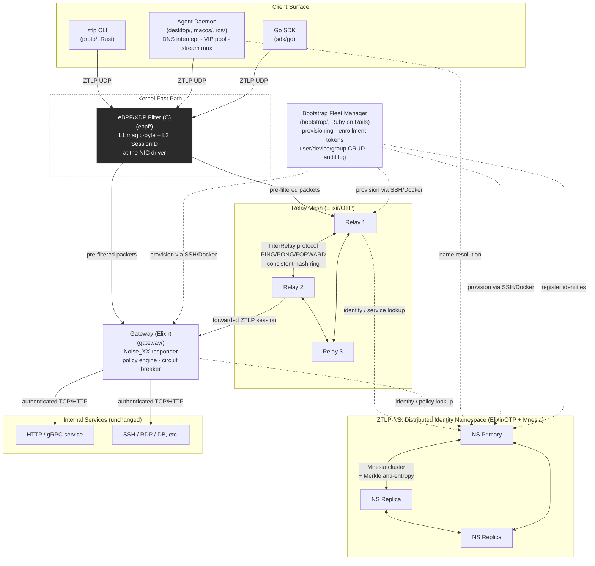

# System Overview

All ZTLP components and their primary communication paths. Solid arrows are ZTLP
protocol traffic (UDP, post-identity); dashed arrows are auxiliary control-plane
traffic (identity queries, provisioning, metrics).



## Component summary

- **Client Agent** (Rust) — makes ZTLP transparent to applications: intercepts DNS
  for ZTLP-mapped names, hands out local loopback VIPs, multiplexes up to 256
  streams per tunnel, auto-reconnects. Ships as a CLI, a desktop app (Tauri), and
  native macOS/iOS clients; a Go SDK exists for embedding in other Go programs.
- **eBPF/XDP Filter** (C) — Layer 1 (magic byte) and optionally Layer 2 (SessionID
  allowlist) run in the NIC driver, before packets reach the kernel network stack
  or userspace at all. Optional accelerator; the same logic exists in userspace
  (Rust/Elixir) for hosts without XDP support.
- **Relay Mesh** (Elixir/OTP) — does admission control (handshake, identity,
  policy) for new sessions and O(1) SessionID-based forwarding for established
  ones. Relays gossip over an InterRelay protocol and form a consistent-hash ring
  with PathScore-based path selection.
- **ZTLP-NS** (Elixir/OTP, Mnesia) — the distributed, Ed25519-signed identity
  namespace: NodeID↔pubkey bindings, service/relay advertisements, policy and
  revocation records, DEVICE/USER/GROUP records. Federates across nodes with
  eager replication + Merkle-tree anti-entropy.
- **Gateway** (Elixir) — terminates ZTLP sessions at the edge and bridges to
  conventional backend protocols (HTTP, gRPC, raw TCP) without requiring any
  change to the backend service itself. Enforces policy, runs a circuit breaker
  per backend.
- **Bootstrap** (Ruby on Rails) — the fleet-management control plane: provisions
  relay/NS/gateway containers over SSH+Docker, manages users/devices/groups,
  issues enrollment tokens (with QR codes), and provides audit logging and
  connectivity monitoring.
- **Internal Services** — existing, unmodified applications sitting behind the
  gateway. They never see ZTLP traffic directly and have no open public port.

## Example: one packet's path across every component

A single trace, source-derived and formatted like a debugger backtrace
(`#0` = innermost frame), for a client's first authenticated data packet
reaching an internal service through the gateway. Each per-component hop is
traced in more depth in [02-admission-pipeline.md](02-admission-pipeline.md)
and [03-connection-lifecycle.md](03-connection-lifecycle.md); this is the
30,000-foot version linking them together. Line numbers are accurate as of
this writing and will drift as the code changes.

```
#0  gateway/lib/ztlp_gateway/session.ex:1619       start_backend_for(backend_map, self())
#1  gateway/lib/ztlp_gateway/session.ex:1618       PolicyEngine.authorize?(identity, resolved_name)
#2  gateway/lib/ztlp_gateway/session.ex:1611       Identity.resolve_or_hex(remote_static)     from Noise static key
#3  gateway/lib/ztlp_gateway/session.ex:1606       Handshake.split(hs, state.session_id)      derive transport keys
#4  gateway/lib/ztlp_gateway/session.ex:1583       handle_handshake_msg3/3                    processes Noise msg3
#5  gateway/lib/ztlp_gateway/handshake.ex:347       Handshake.handle_msg1/2                    (earlier, msg1)
#6  gateway/lib/ztlp_gateway/pipeline.ex:65         Pipeline.admit/1                            L1 magic + L2 SessionID
#7  gateway/lib/ztlp_gateway/listener.ex:108        Listener.handle_info/2                      gateway's UDP receive loop
#8  ebpf/ztlp_xdp.c:177                             ztlp_xdp_prog()                             in-kernel L1+L2 pre-filter
```

Reading it top-down instead (outermost first, matching the arrows in the
diagram above): the eBPF/XDP filter pre-screens the packet at the NIC driver
(`#8`); the gateway's UDP listener picks it up and runs it through the
userspace admission pipeline (`#7`→`#6`); the Noise_XX handshake plays out
across HELLO/CHALLENGE/AUTH (`#5`, then `#4` for the final message) and yields
transport keys plus the client's identity from its Noise static key (`#3`→`#2`,
no separate ZTLP-NS round trip needed here — the pubkey came in the handshake
itself); policy is evaluated against that identity for the requested service
(`#1`); and only once that passes does the gateway actually open a connection
to the real internal service (`#0`, via `Backend.start_link/1`). Frames `#0`
and `#1` sit on the *same line* in the source (`session.ex:1618`–`1619`) — the
backend connection is opened only inside the `if PolicyEngine.authorize?(...)`
branch, so an unauthorized identity never causes a backend socket to open at
all. A relay-mediated path looks the same up through admission but diverges
after L1/L2 — see the relay-specific trace in
[02-admission-pipeline.md](02-admission-pipeline.md), since the relay never
holds session keys and cannot itself decrypt payload or open a backend
connection.
