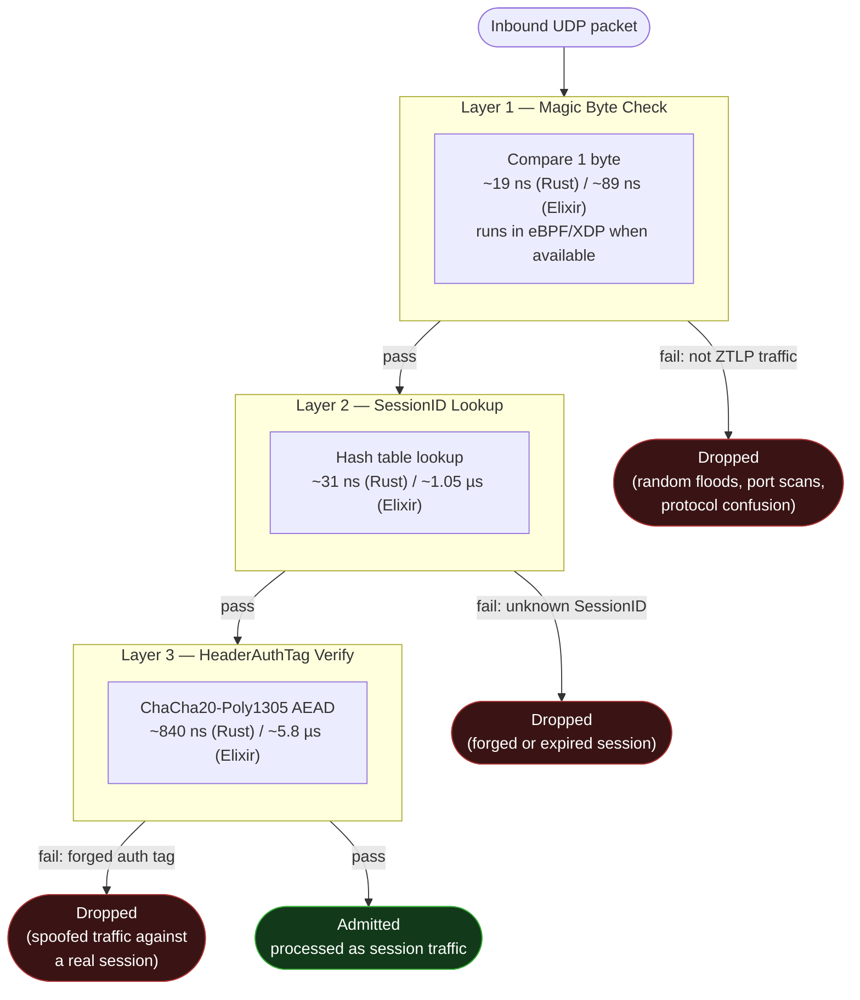

# Three-Layer Admission Pipeline

ZTLP's core DDoS-resistance property: every layer is orders of magnitude cheaper
than the one after it, so the vast majority of attack/scan traffic is dropped
before any meaningful CPU is spent on it.



## Why this matters

| Layer | Rejects | Rust cost | Elixir cost |
|---|---|---|---|
| L1: Magic | non-ZTLP traffic | 19 ns | 89 ns |
| L2: SessionID | unknown/forged sessions | 31 ns | 1.05 µs |
| L3: HeaderAuthTag | spoofed traffic on a real session | 840 ns | 5.8 µs |

Only a packet with a correct magic byte **and** a live 96-bit SessionID reaches
the cryptographic layer — brute-forcing that combination against a sparse
session table is a 2⁻⁹⁶ guess. A single CPU core can reject ~54M garbage
packets/sec at L1 while simultaneously processing ~1.1M legitimate packets/sec
through the full pipeline. This asymmetry — cheap rejection, expensive admission
— is the structural reason ZTLP resists volumetric DDoS: attackers pay
bandwidth, defenders pay nanoseconds.

Implementation lives in `proto/src/pipeline.rs` (Rust), `relay/lib/ztlp_relay/pipeline.ex`
and `gateway/lib/ztlp_gateway/pipeline.ex` (Elixir), and `ebpf/ztlp_xdp.c` (L1+L2
in-kernel).

## Example call stacks (source-derived)

These are call chains read directly out of the code, formatted like a debugger
backtrace (`#0` = innermost frame). They're here so you can jump straight to the
implementation of each hop in the diagram above. Line numbers are accurate as of
this writing and will drift as the code changes — treat them as a starting point,
not a promise.

**In-kernel L1+L2, before userspace ever sees the packet:**
```
#0  ebpf/ztlp_xdp.c:240   magic != ZTLP_MAGIC check           -> XDP_DROP (L1)
#1  ebpf/ztlp_xdp.c:245   "LAYER 2: SessionID lookup" block    -> BPF hash map read
#2  ebpf/ztlp_xdp.c:177   ztlp_xdp_prog()                      entry point (SEC("xdp"))
```

**Rust client — Layer 1 reject on the fast path:**
```
#0  proto/src/pipeline.rs:138    Pipeline::layer1_magic_check()   fails: bad magic
#1  proto/src/pipeline.rs:302    Pipeline::process()              tries L1 first
#2  proto/src/transport.rs:306   Transport::recv_data()           awaits pipeline.process(&data)
#3  proto/src/agent/proxy.rs:398 agent event loop                 result = node.recv_data() => { ... }
```

**Elixir relay — packet dispatch (note: relay skips L3):**
```
#0  relay/lib/ztlp_relay/pipeline.ex:65    Pipeline.layer1_magic/1
#1  relay/lib/ztlp_relay/pipeline.ex:80    Pipeline.layer2_session/1
#2  relay/lib/ztlp_relay/pipeline.ex:31    Pipeline.process/2               session_key passed as nil
#3  relay/lib/ztlp_relay/udp_listener.ex:1099  handle_packet/3 (private)    Pipeline.process(data, nil)
#4  relay/lib/ztlp_relay/udp_listener.ex:122   handle_info/2 ({:udp, ...})  GenServer message handler
```
The relay *always* calls `Pipeline.process/2` with `session_key: nil`, which
short-circuits Layer 3 (see `relay/lib/ztlp_relay/pipeline.ex:109`,
`layer3_auth(_data, nil), do: :ok`). This isn't a bug — it's the zero-trust
property in action: the relay only ever sees ciphertext and forwards by
SessionID, it never holds the keys needed to verify or decrypt payload
contents.

**Elixir gateway — L1/L2 in `Pipeline`, L3 deferred to `Session`:**
```
#0  gateway/lib/ztlp_gateway/pipeline.ex:82   layer1_magic(<<0x5A, 0x37, _::binary>>)
#1  gateway/lib/ztlp_gateway/pipeline.ex:96   layer2_session/1
#2  gateway/lib/ztlp_gateway/pipeline.ex:65   admit/1
#3  gateway/lib/ztlp_gateway/listener.ex:109  Pipeline.admit(data)
#4  gateway/lib/ztlp_gateway/listener.ex:108  handle_info/2 ({:udp, ...})
```
Gateway's `admit/1` docstring is explicit about this split: *"Layer 3 is NOT
checked here — it's the Session's responsibility since only the Session holds
the encryption keys."* The AEAD tag itself is computed/verified against the
primitive in `gateway/lib/ztlp_gateway/packet.ex:422` (`compute_data_auth_tag/2`),
called from the per-session process once a session actually exists — the
gateway, like the relay, never does Layer 3 work on packets it can't yet
attribute to a session.
