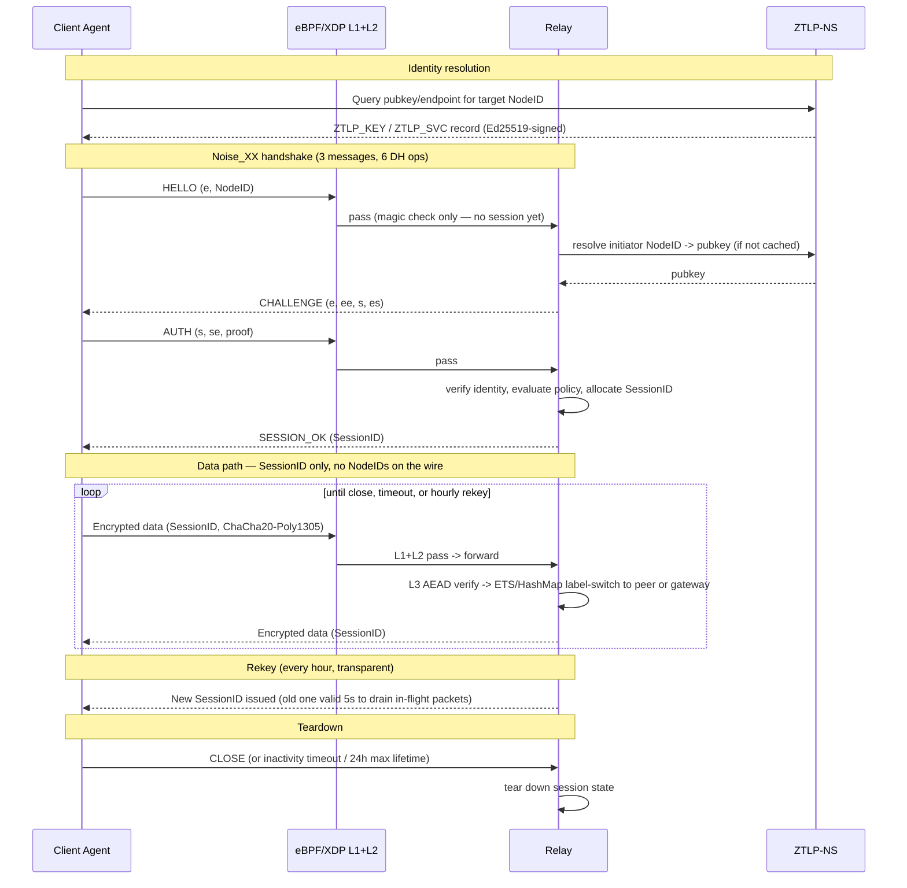

# Connection Lifecycle

End-to-end sequence for a client reaching a service through a relay: identity
resolution, the Noise_XX handshake, data flow, rekeying, and teardown.



## Key properties encoded in this flow

- **Identity before connectivity** — the handshake itself is gated by L1/L2 of
  the admission pipeline; nothing reaches handshake logic without a valid magic
  byte, and post-handshake data additionally needs a live SessionID.
- **No PKI dependency** — the relay/gateway resolves the initiator's public key
  from ZTLP-NS, not from a certificate authority.
- **Forward secrecy** — ephemeral X25519 keys are generated per-session and
  discarded after key derivation (BLAKE2s-based HKDF).
- **Identity-free data path** — after `SESSION_OK`, only the 96-bit SessionID is
  visible on the wire. Passive observers cannot correlate traffic to identities.
- **Session limits** — 24h max lifetime, mandatory hourly rekey, 5-minute
  inactivity timeout for interactive sessions (all configurable).

## Example call stacks (source-derived)

Read directly out of the code and formatted like a debugger backtrace (`#0` =
innermost frame), so you can jump from a step in the sequence diagram straight
to its implementation. Line numbers are accurate as of this writing and will
drift as the code changes.

**Client sends HELLO (initiator side of Noise_XX):**
```
#0  proto/src/handshake.rs:203       HandshakeContext::new_initiator()
#1  proto/src/handshake.rs:248       HandshakeContext::write_message()   -> msg1
#2  proto/src/agent/proxy.rs:531     agent connect flow                  ctx = new_initiator(&identity)
#3  proto/src/agent/proxy.rs:546     agent connect flow                  msg1 = ctx.write_message(&[])
```

**Gateway admits the HELLO and spins up a session:**
```
#0  gateway/lib/ztlp_gateway/handshake.ex:347  Handshake.handle_msg1/2
#1  gateway/lib/ztlp_gateway/handshake.ex:377  Handshake.create_msg2/2         builds CHALLENGE
#2  gateway/lib/ztlp_gateway/listener.ex:138   start_new_session/3
#3  gateway/lib/ztlp_gateway/listener.ex:110   Listener.handle_info/2          {:ok, :new_session} branch
```
`start_new_session/3` also does session deduplication first — if a session
already exists for this client `{ip, port}`, it's torn down
(`SessionRegistry.unregister/2` + `DynamicSupervisor.terminate_child/2`) before
the new one is created, so a reconnecting client can't accumulate zombie
sessions.

**Relay resolves an identity against ZTLP-NS:**
```
#0  ns/lib/ztlp_ns/server.ex:171          process_query/2 (ZTLP_KEY lookup, type byte 0x01)
#1  ns/lib/ztlp_ns/server.ex:102          handle_info/2 ({:udp, ...})           NS's own UDP receive loop
#2  relay/lib/ztlp_relay/ns_client.ex:115 do_query/4                            sends the query
#3  relay/lib/ztlp_relay/ns_client.ex:66  handle_call({:lookup_relay, name})    relay-side entry point
```

**Post-handshake data forwarding through a relay (SessionID label-switch):**
```
#0  relay/lib/ztlp_relay/session.ex:153        Session GenServer, handle_cast(:forward, state)
#1  relay/lib/ztlp_relay/session.ex:72         Session.forward/1
#2  relay/lib/ztlp_relay/udp_listener.ex:1375  handle_admitted_packet/4 (data-packet clause)
#3  relay/lib/ztlp_relay/udp_listener.ex:1099  handle_packet/3                 Pipeline.process passed
#4  relay/lib/ztlp_relay/udp_listener.ex:122   handle_info/2 ({:udp, ...})
```
This is the same admission pipeline traced in
[02-admission-pipeline.md](02-admission-pipeline.md) — `handle_admitted_packet/4`
is what runs after Layers 1+2 pass.

**Rekey bookkeeping (gateway side):**
```
#0  gateway/lib/ztlp_gateway/session.ex:256  Session.derive_new_key/2
#1  gateway/lib/ztlp_gateway/session.ex:265  Session.should_rekey?/1
```
Worth noting: the code's default (`@default_rekey_interval_ms` at
`gateway/lib/ztlp_gateway/session.ex:224`) is `86_400_000` ms — 24 hours, not
the "mandatory hourly rekey" described in the whitepaper. If you're relying on
the rekey cadence for a security property, read this file rather than the
whitepaper — it's the one place the two disagree in what we've checked so far.

**Session close:**
```
#0  relay/lib/ztlp_relay/session.ex:174  Session GenServer, handle_cast(:close, state)
#1  relay/lib/ztlp_relay/session.ex:100  Session.close/1
```
