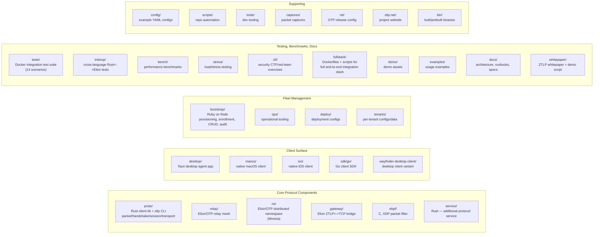

# Repository Map

Which top-level directory implements which piece of the architecture from
[01-system-overview.md](01-system-overview.md).

## Notes

- **`proto/`** is the reference Rust implementation the other native clients
  (macOS/iOS/desktop) and the eBPF loader interoperate with; it also ships the
  `ztlp` CLI used throughout the whitepaper's demo script.
- **`relay/`, `ns/`, `gateway/`** are all Elixir/OTP applications sharing the
  BEAM's per-session fault isolation and supervision-tree model — deliberately
  built with zero external dependencies (pure OTP).
- **`ebpf/`** is optional infrastructure: on systems without XDP support, L1/L2
  filtering falls back to the userspace implementations in `proto/` and `relay/`.
- **`fullstack/`** and `tests/network/` are the two main ways to exercise the
  whole system locally — see the docker-compose files at the repo root
  (`docker-compose.yml` + `mesh`/`federation` overlays, and
  `docker-compose-full-stack(.prebuilt).yml`) for how these directories get
  wired together into runnable stacks.
- **`bootstrap/`** is the only non-protocol, non-Rust/Elixir component (Ruby on
  Rails) — it's the human-facing fleet management surface, not part of the data
  path.

## Entry points, if you want to start reading code

For each component, the file:line where an inbound UDP packet (or, for
Bootstrap, an inbound provisioning request) first gets handled. These are the
outermost frames of the call-stack traces in
[01-system-overview.md](01-system-overview.md),
[02-admission-pipeline.md](02-admission-pipeline.md), and
[03-connection-lifecycle.md](03-connection-lifecycle.md) — start here and
follow the traces inward. Accurate as of this writing; will drift as the code
changes.

| Component | Entry point |
|---|---|
| eBPF/XDP filter | `ebpf/ztlp_xdp.c:177` — `ztlp_xdp_prog()` |
| Relay | `relay/lib/ztlp_relay/udp_listener.ex:122` — `handle_info/2` |
| Gateway | `gateway/lib/ztlp_gateway/listener.ex:108` — `handle_info/2` |
| ZTLP-NS | `ns/lib/ztlp_ns/server.ex:102` — `handle_info/2` |
| Rust client (agent) | `proto/src/agent/proxy.rs:398` — event loop `result = node.recv_data() => { ... }` |
| Rust client (pipeline core) | `proto/src/pipeline.rs:302` — `Pipeline::process()` |
| Bootstrap (SSH provisioning) | `bootstrap/app/services/ssh_provisioner.rb:58` — `provision!(component)` |
