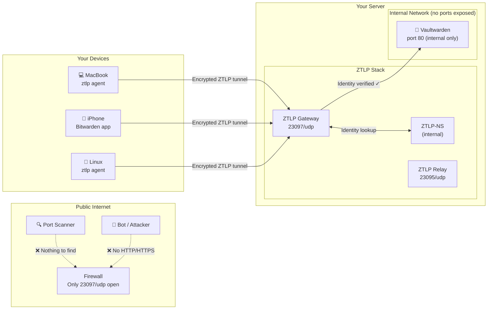
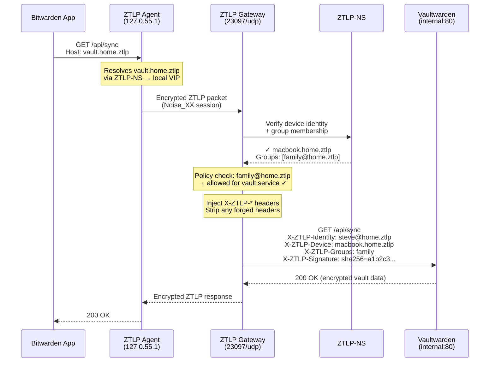
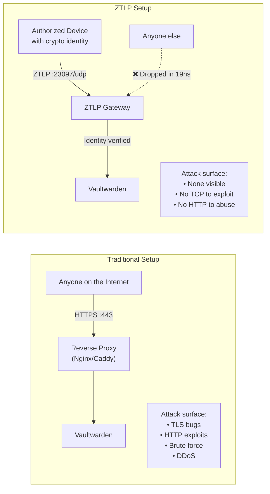

# Zero-Trust Password Manager: Vaultwarden + ZTLP

**Run a self-hosted password manager with zero exposed ports.**

This example deploys [Vaultwarden](https://github.com/dani-garcia/vaultwarden) (a self-hosted Bitwarden-compatible server) behind ZTLP — making your password vault invisible to the public internet. No HTTP ports, no HTTPS ports, no ports to scan. The only way in is through an authenticated ZTLP tunnel with cryptographic device identity.

---

## What You're Building



Your Bitwarden apps connect to `vault.home.ztlp` through the local ZTLP agent. The agent encrypts traffic and sends it through a ZTLP tunnel to the gateway. The gateway verifies the device's cryptographic identity, checks group policy, and only then forwards the request to Vaultwarden on the internal Docker network. Vaultwarden has **zero exposed ports** — it's invisible to the outside world.

### What's Different from a VPN?

| Feature | VPN (WireGuard / Tailscale) | ZTLP |
|---------|----------------------------|------|
| **Attack surface** | VPN port is exposed and scannable | Only ZTLP UDP port — service is invisible |
| **Access control** | IP/subnet based | Cryptographic identity + group policy |
| **Device compromise** | Revoke VPN config (maybe regenerate keys) | Revoke device identity instantly — cascade blocks all sessions |
| **DDoS resistance** | VPN server is a target — must process every packet | Three-layer pipeline drops invalid packets in nanoseconds |
| **Always-on** | Must toggle VPN on/off | Agent runs as a system service, transparent |
| **Audit trail** | IP-based logs | Cryptographic identity in every header — signed with HMAC |
| **Service isolation** | VPN gives network access (lateral movement risk) | Per-service authorization — each service has its own policy |

With a VPN, once you're connected you have network-level access. With ZTLP, each service (Vaultwarden, SSH, whatever) has its own access policy — compromising one device doesn't give access to services it's not authorized for.

---

## Prerequisites

- **Docker** and **Docker Compose** (v2) — [install Docker](https://docs.docker.com/get-docker/)
- The **`ztlp` CLI binary** — build from `proto/` or download from [releases](https://github.com/priceflex/ztlp/releases)
- **~5 minutes** of your time
- A server or machine to run the stack (a Raspberry Pi, VPS, NAS — anything with Docker)

```bash
# Build the ztlp CLI from source (if you don't have it)
cd proto && cargo build --release --bin ztlp
sudo cp target/release/ztlp /usr/local/bin/
```

---

## Quick Start

### Step 1: Clone the Repo

```bash
git clone https://github.com/priceflex/ztlp.git
cd ztlp/examples/vaultwarden
```

### Step 2: Configure Secrets

```bash
cp .env.example .env
```

Generate and fill in the secrets:

```bash
# Generate enrollment secret (64 hex chars)
echo "ZTLP_ENROLLMENT_SECRET=$(openssl rand -hex 32)" >> .env

# Generate header HMAC secret
echo "ZTLP_HEADER_HMAC_SECRET=$(openssl rand -hex 32)" >> .env

# Generate Vaultwarden admin token
echo "VAULTWARDEN_ADMIN_TOKEN=$(openssl rand -base64 48)" >> .env
```

Or edit `.env` manually — it's well-commented.

### Step 3: Start the Stack

```bash
docker compose up -d
```

Wait for all services to be healthy:

```bash
docker compose ps
```

```
NAME             STATUS                  PORTS
vaultwarden      Up (healthy)            (no ports)
ztlp-ns          Up (healthy)            (no ports)
ztlp-gateway     Up (healthy)            0.0.0.0:23097->23097/udp
ztlp-relay       Up (healthy)            0.0.0.0:23095->23095/udp
```

Notice: Vaultwarden has **no ports** exposed. The only externally accessible port is 23097/udp (the ZTLP gateway).

### Step 4: Initialize the Zone

On the server (or any machine with the `ztlp` CLI and access to the NS):

```bash
# Initialize the home.ztlp zone
ztlp admin init-zone \
  --zone home.ztlp \
  --ns-server 127.0.0.1:23096

# Create a group for family/team members
ztlp admin create-group family@home.ztlp \
  --ns-server 127.0.0.1:23096

# Create a user
ztlp admin create-user steve@home.ztlp \
  --role admin \
  --ns-server 127.0.0.1:23096

# Add user to the family group
ztlp admin group add family@home.ztlp steve@home.ztlp \
  --ns-server 127.0.0.1:23096
```

### Step 5: Generate Enrollment Tokens

Create a single-use enrollment token for each device:

```bash
ztlp admin enroll \
  --zone home.ztlp \
  --ns-server 127.0.0.1:23096 \
  --relay YOUR_SERVER_IP:23095 \
  --expires 24h \
  --max-uses 1
```

This outputs a token like:

```
ztlp://enroll/AQtvZmZpY2UudGVjaHJvY2tzdGFycy56dGxw...
```

For mobile devices, generate a QR code:

```bash
ztlp admin enroll \
  --zone home.ztlp \
  --ns-server 127.0.0.1:23096 \
  --relay YOUR_SERVER_IP:23095 \
  --expires 24h \
  --max-uses 1 \
  --qr
```

### Step 6: Enroll a Device

On each client device, enroll with the token:

```bash
ztlp setup \
  --token "ztlp://enroll/AQtvZmZpY2UudGVjaHJvY2tzdGFycy56dGxw..." \
  --name macbook.home.ztlp \
  --type device \
  --owner steve@home.ztlp
```

This generates a device identity, registers it with the NS, and saves the network configuration. The device is now enrolled and can connect through the ZTLP gateway.

---

## Configure Your Devices

Once enrolled, set up the ZTLP agent on each device so traffic to `vault.home.ztlp` is routed through the tunnel.

### macOS

```bash
# Start the ZTLP agent
ztlp agent start

# The agent binds a local VIP (127.0.55.1) and runs a DNS resolver.
# Configure your Mac to use ZTLP DNS for the .ztlp domain:

# Option A: Use the ztlp dns helper (recommended)
sudo ztlp dns install

# Option B: Manual — create a resolver file
sudo mkdir -p /etc/resolver
echo "nameserver 127.0.0.1
port 5354" | sudo tee /etc/resolver/ztlp
```

Then configure Bitwarden:

1. Open the Bitwarden app (or any Bitwarden-compatible client)
2. Go to **Settings** → **Self-hosted environment**
3. Set Server URL to: `https://vault.home.ztlp`
4. Save and log in

The Bitwarden app resolves `vault.home.ztlp` via the ZTLP DNS resolver, which returns the local VIP address. Traffic flows through the ZTLP agent, through the encrypted tunnel, to the gateway, and finally to Vaultwarden — all transparently.

### Linux

```bash
# Start the agent as a systemd service
sudo ztlp agent install    # Creates and enables the systemd unit
sudo systemctl start ztlp-agent

# Verify it's running
ztlp status
```

For DNS, configure systemd-resolved:

```bash
# Create a drop-in for .ztlp resolution
sudo mkdir -p /etc/systemd/resolved.conf.d
cat << 'EOF' | sudo tee /etc/systemd/resolved.conf.d/ztlp.conf
[Resolve]
DNS=127.0.0.1:5354
Domains=~ztlp
EOF

sudo systemctl restart systemd-resolved
```

Then configure Bitwarden (desktop app or browser extension):
- Server URL: `https://vault.home.ztlp`

### Windows (Planned)

Windows support is on the roadmap. The agent will run as a Windows service with a system tray icon. For now, Windows users can run the CLI manually:

```powershell
# Start the agent in the foreground
ztlp agent start
```

DNS configuration on Windows will use the NRPT (Name Resolution Policy Table) to route `.ztlp` queries to the local resolver.

### iOS / iPadOS

1. The ZTLP iOS app handles enrollment and agent connectivity
2. Scan the QR enrollment token from Step 5
3. The app configures a local VPN profile that routes `.ztlp` traffic through the ZTLP tunnel
4. Open the Bitwarden iOS app → **Settings** → **Self-hosted**
5. Server URL: `https://vault.home.ztlp`

Your passwords sync through the encrypted ZTLP tunnel. No ports exposed on your server, no VPN to toggle — just works.

---

## How It Works

Here's the full request flow when the Bitwarden app on your MacBook syncs passwords:



### The Identity Headers

Every request that reaches Vaultwarden carries cryptographically-signed identity headers injected by the gateway:

| Header | Description | Example |
|--------|-------------|---------|
| `X-ZTLP-Identity` | User identity (FQDN) | `steve@home.ztlp` |
| `X-ZTLP-Node-ID` | 128-bit device NodeID | `a1b2c3d4e5f60718...` |
| `X-ZTLP-Device` | Device name | `macbook.home.ztlp` |
| `X-ZTLP-Zone` | Zone membership | `home.ztlp` |
| `X-ZTLP-Groups` | Comma-separated groups | `family` |
| `X-ZTLP-Verified` | Identity verification status | `true` |
| `X-ZTLP-Assurance` | Key assurance level | `hardware` / `device-bound` / `software` |
| `X-ZTLP-Key-Source` | Where the private key lives | `secure-enclave` / `file` |
| `X-ZTLP-Timestamp` | Unix timestamp of injection | `1711062600` |
| `X-ZTLP-Signature` | HMAC-SHA256 of all headers | `sha256=a1b2c3d4...` |

The gateway **strips** any existing `X-ZTLP-*` headers from the client request before injecting its own. The `X-ZTLP-Signature` is computed using the `ZTLP_HEADER_HMAC_SECRET` shared between the gateway and backend — so Vaultwarden (or a reverse proxy in front of it) can verify headers weren't tampered with.

### Policy Enforcement

The gateway evaluates access using the `policy.toml` file:

```toml
default = "deny"

[[services]]
name = "vault"
allow = [
  "family@home.ztlp",
  "team@home.ztlp",
]
```

When a connection arrives:
1. Gateway extracts the device's NodeID from the ZTLP session
2. Queries NS for the device record, owner user, and group memberships
3. Checks if any of the device's groups match the `allow` list for the `vault` service
4. If no match → connection rejected (the device never reaches Vaultwarden)
5. If match → connection allowed, headers injected, traffic forwarded

This is **default-deny**. If you remove someone from the `family@home.ztlp` group, they immediately lose access to the vault. No VPN reconfiguration, no firewall changes — just remove them from the group.

---

## Security Model

### Why This is Better Than Port-Forwarding Vaultwarden

Most self-hosted Vaultwarden guides tell you to expose ports 80/443 to the internet with a reverse proxy (Nginx, Caddy, Traefik). That works, but it creates attack surface:



| Threat | Traditional (port-forwarded) | ZTLP |
|--------|------------------------------|------|
| **Port scanning** | Ports 80/443 visible to the world | No ports to discover — service is invisible |
| **TLS vulnerabilities** | Must keep TLS stack patched | No TLS facing the internet — tunnel is Noise_XX |
| **Credential stuffing** | Login page is public | Can't even reach the login page without device identity |
| **Zero-day HTTP exploits** | Any HTTP request reaches your server | Invalid packets dropped at Layer 1 before any HTTP parsing |
| **DDoS** | Server must handle flood traffic | Three-layer pipeline: magic byte (19ns) → session lookup → AEAD verify |
| **Compromised device** | Revoke password, hope they don't know it | Revoke device identity → instant, cryptographic lockout |

### Zero Attack Surface

With ZTLP, Vaultwarden has literally zero attack surface from the internet:

- **No TCP ports open** — nothing for nmap to find
- **No HTTP/HTTPS** — no web vulnerabilities to exploit
- **No DNS records** — `vault.home.ztlp` doesn't exist in public DNS
- The ZTLP gateway accepts only authenticated ZTLP packets over UDP — everything else is dropped before any state is allocated

### Cryptographic Device Identity

Each device has an Ed25519 key pair. The private key can live in:

- **Apple Secure Enclave** (macOS, iOS) — hardware-backed, non-extractable
- **YubiKey** — hardware token, PIN-protected
- **TPM 2.0** (Linux, Windows) — hardware-backed
- **Android StrongBox** — hardware-backed
- **File** (software) — still unique per device, but extractable

Unlike passwords or VPN configs, hardware-backed keys **cannot be cloned**. Even if an attacker gets root on your device, they can't extract the private key from the Secure Enclave.

### Per-Device Revocation

If a device is lost or compromised:

```bash
# Instantly revoke a device
ztlp admin revoke macbook.home.ztlp \
  --ns-server YOUR_NS_SERVER_IP:23096

# Revoke a user (cascades to ALL their devices)
ztlp admin revoke steve@home.ztlp \
  --ns-server YOUR_NS_SERVER_IP:23096
```

Revocation is immediate. The NS propagates it, and the gateway rejects the next packet from that device. No VPN keys to rotate, no configs to regenerate.

### Signed Identity Headers

The `X-ZTLP-Signature` header contains an HMAC-SHA256 over all identity headers, signed with the `ZTLP_HEADER_HMAC_SECRET`. This means:

1. The gateway is the only entity that can produce valid headers
2. A malicious backend or sidecar can't forge identity headers
3. Audit logs with signed headers are tamper-evident

---

## Day 2 Operations

### Adding New Devices

```bash
# Generate an enrollment token
ztlp admin enroll \
  --zone home.ztlp \
  --ns-server YOUR_NS_SERVER_IP:23096 \
  --relay YOUR_SERVER_IP:23095 \
  --expires 24h \
  --max-uses 1

# On the new device:
ztlp setup \
  --token "ztlp://enroll/..." \
  --name iphone.home.ztlp \
  --type device \
  --owner steve@home.ztlp

# Add to the family group (if not already a member via the owner)
ztlp admin group add family@home.ztlp steve@home.ztlp \
  --ns-server YOUR_NS_SERVER_IP:23096
```

### Removing Devices

```bash
# Revoke a specific device
ztlp admin revoke old-phone.home.ztlp \
  --ns-server YOUR_NS_SERVER_IP:23096

# Remove a user from a group (keeps identity, removes access)
ztlp admin group remove family@home.ztlp former-roommate@home.ztlp \
  --ns-server YOUR_NS_SERVER_IP:23096
```

### Rotating Secrets

```bash
# Rotate the enrollment secret
openssl rand -hex 32
# Update ZTLP_ENROLLMENT_SECRET in .env
docker compose up -d ns    # Restart NS with new secret

# Rotate the HMAC secret
openssl rand -hex 32
# Update ZTLP_HEADER_HMAC_SECRET in .env
docker compose up -d gateway   # Restart gateway with new secret

# Rotate the Vaultwarden admin token
openssl rand -base64 48
# Update VAULTWARDEN_ADMIN_TOKEN in .env
docker compose up -d vaultwarden
```

### Backups

Vaultwarden stores its data (encrypted vault, attachments, keys) in the `vaultwarden-data` Docker volume.

```bash
# Back up Vaultwarden data
docker compose stop vaultwarden
docker run --rm \
  -v vaultwarden_vaultwarden-data:/data:ro \
  -v $(pwd)/backups:/backup \
  alpine tar czf /backup/vaultwarden-$(date +%Y%m%d).tar.gz -C /data .
docker compose start vaultwarden

# Back up NS data (identity records)
docker compose stop ns
docker run --rm \
  -v vaultwarden_ns-data:/data:ro \
  -v $(pwd)/backups:/backup \
  alpine tar czf /backup/ztlp-ns-$(date +%Y%m%d).tar.gz -C /data .
docker compose start ns
```

Set up a cron job for automated backups:

```bash
# Add to crontab — daily at 3 AM
0 3 * * * cd /path/to/ztlp/examples/vaultwarden && ./backup.sh
```

### Monitoring

The gateway and NS export Prometheus metrics:

| Component | Metrics Port | Endpoint |
|-----------|-------------|----------|
| Gateway | 9102 | `http://gateway:9102/metrics` |
| NS | 9103 | `http://ns:9103/metrics` |
| Relay | 9101 | `http://relay:9101/metrics` |

These are on the internal network by default. To expose them for a Prometheus scraper, add port mappings to the gateway and NS services in `docker-compose.yml`, or run Prometheus on the same Docker network.

Key metrics to watch:

- `ztlp_gateway_sessions_active` — current connected devices
- `ztlp_gateway_auth_failures_total` — rejected authentication attempts
- `ztlp_gateway_policy_denials_total` — rejected policy checks
- `ztlp_ns_records_total` — registered identities
- `ztlp_relay_sessions_active` — relay sessions (NAT traversal)

---

## Troubleshooting

### "Connection refused" when Bitwarden syncs

**Symptom:** Bitwarden app shows "Unable to connect" or "Connection refused" to `vault.home.ztlp`.

**Checks:**
1. Is the ZTLP agent running?
   ```bash
   ztlp status
   ```
2. Can the agent reach the gateway?
   ```bash
   ztlp ping gateway.home.ztlp
   ```
3. Is the gateway healthy?
   ```bash
   docker compose ps gateway
   docker compose logs gateway --tail 50
   ```
4. Is DNS resolving correctly?
   ```bash
   dig vault.home.ztlp @127.0.0.1 -p 5354
   ```

### "Policy denied" in gateway logs

**Symptom:** Gateway logs show `policy_denied` for your device.

**Fix:** Ensure your user is in the `family@home.ztlp` (or `team@home.ztlp`) group:

```bash
# Check group membership
ztlp admin list-group family@home.ztlp \
  --ns-server YOUR_NS_SERVER_IP:23096

# Add the user if missing
ztlp admin group add family@home.ztlp youruser@home.ztlp \
  --ns-server YOUR_NS_SERVER_IP:23096
```

### Enrollment token expired or rejected

**Symptom:** `ztlp setup --token ...` fails with "token expired" or "enrollment rejected".

**Fix:** Generate a fresh token:

```bash
ztlp admin enroll \
  --zone home.ztlp \
  --ns-server YOUR_NS_SERVER_IP:23096 \
  --relay YOUR_SERVER_IP:23095 \
  --expires 24h \
  --max-uses 1
```

Tokens are single-use by default. If you already used it, you need a new one.

### Vaultwarden not starting

**Symptom:** `docker compose ps` shows Vaultwarden as unhealthy or restarting.

**Fix:** Check the logs:

```bash
docker compose logs vaultwarden --tail 100
```

Common issues:
- Missing `ADMIN_TOKEN` — set it in `.env` or remove it to disable the admin panel
- Volume permissions — the Vaultwarden container runs as UID 1000 by default
- Invalid `DOMAIN` — must be a valid URL (e.g., `https://vault.home.ztlp`)

### Can't reach the admin panel

The Vaultwarden admin panel is at `https://vault.home.ztlp/admin`. It's only accessible through the ZTLP tunnel (like everything else). Make sure:

1. Your ZTLP agent is running and enrolled
2. `VAULTWARDEN_ADMIN_TOKEN` is set in `.env`
3. You're accessing it via `vault.home.ztlp` (not `localhost`)

### NAT traversal issues

If your devices are behind carrier-grade NAT or restrictive firewalls:

1. Make sure the relay is running:
   ```bash
   docker compose ps relay
   ```
2. Verify the relay address was included in the enrollment token (the `--relay` flag)
3. Check relay logs:
   ```bash
   docker compose logs relay --tail 50
   ```

---

## File Structure

```
examples/vaultwarden/
├── docker-compose.yml   # The complete stack
├── .env.example         # Environment variable template
├── policy.toml          # Gateway access policy
└── README.md            # This file
```

---

## What's Next?

- **[Getting Started with ZTLP](../../GETTING-STARTED.md)** — The 5-minute ZTLP demo
- **[Deployment Guide](../../DEPLOYMENT.md)** — Full production deployment for MSPs
- **[CLI Reference](../../CLI.md)** — Every `ztlp` subcommand documented
- **[Architecture](../../ARCHITECTURE.md)** — How the three-layer pipeline and relay mesh work
- **[TLS Termination & Identity Headers](../../TLS-TERMINATION.md)** — Deep dive on the identity header system
- **[GitHub Repository](https://github.com/priceflex/ztlp)** — Source code, issues, and discussions
